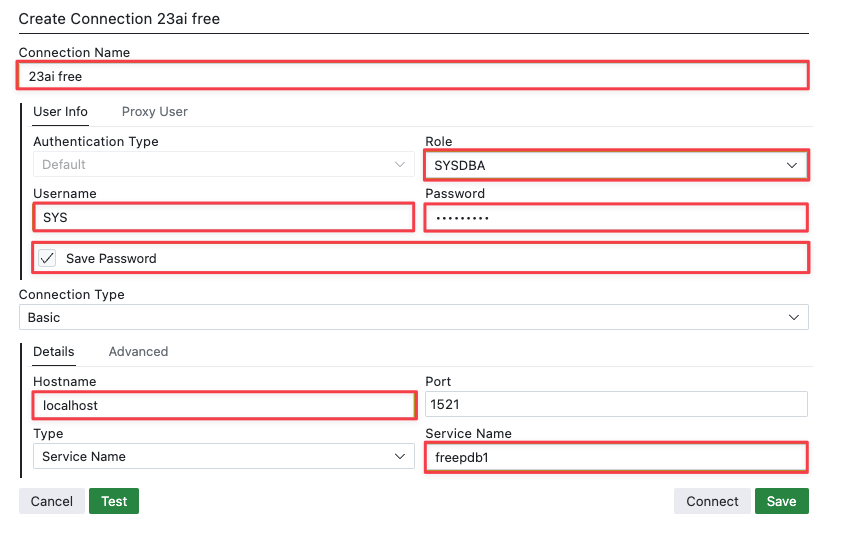

# Fast start! Build your first Oracle Database 23ai free container!

## Introduction

Now, that we have all tools installed and configured, it is time to set up our Data Engineering Home Lab using a Oracle Database 23ai free Container
In this lab, you will install you very first 23ai free in a container using the container image available on the [Oracle Container Registry](https://container-registry.oracle.com/).
We will keep it super-simple in the lab to get you acquainted with the commands and tools.

> **Note:** The instructions use podman. In case you are using Docker, you can replace podman with the docker command.

Estimated Time: 15 minutes

### Objectives

- Deploy Oracle Database 23ai in a container.
- Ensure the container is running and accessible

## Prerequisites:

- Open a terminal window and verify `podman` is available

To verify podman is working, type:

```bash
$ <copy>
podman -v
</copy>
```

> **Note:** In case you are using Docker the command is: `docker -v`


## Task 1: Let's set up a 23ai free container in 5 minutes*!

\* dependent on network connection & available resources... :-)

1. Open a terminal and run the following command. Don't worry about the parameters for now. For now, only pay attention to the the flag **-e ORACLE_PWD**. The value is our password for the sys and system user: 

    ```bash
    $ <copy>
    podman run --name 23ai -e ORACLE_PWD=Hello23ai -p 1521:1521 container-registry.oracle.com/database/free:latest
    </copy>
    ```

  This command will start downloading the container image from the Oracle Container Registry and it will also create a running container with 23ai free inside.
  Dependent on your network connection the download of the image may take some time. The actual build will take a few minutes too.
  Once the container is up and running, you will see a message in terminal windows DATABASE IS READY TO USE!

    

  > Note: Do not close the terminal window as it will close the container. We will later see how to start a container in the background


## Task 2: Connect to database using VS Code and the Oracle SQL Developer extension

You’ve successfully deployed your first 23ai free container, and that wasn’t difficult at all! 

The next steps are similarly straightforward, but as a data engineer, you'll also want to connect to the database. 
There are several options available. 
Let’s begin with Visual Studio Code and the Oracle SQL Developer extension.


1. Open VS Code and select the **Oracle SQL Developer** icon in the sidebar:

    


2. Create a **New Connection**

    

3. Fill in the connection details.

    - **Connection Name** 23ai free
    - **Username**: SYS
    - **Role**: SYSDBA
    - **Password**: Hello23ai
    - **Save Password**: enable
    - **Hostname**: localhost
    - **Port**: 1521
    - **Type**: Service Name
    - **Service Name**: freepdb1

    

4. Click **Test** to verify the connection to the database can be made

    


5. Connect to the database. Click your newly created connection. 

    

    You will see a small green plug once the database is connected.

6. Run your first query! Click on the Open SQL Worksheet icon (or right-click on your connection and select Open SQL Worksheet)

    


7. Enter the following query in the SQL worksheet and hit the green play button on top of the worksheet or hit ctrl/cmd+enter:
   
   `SELECT * FROM V$VERSION;`

    


## Task 3: Create a new user and connect to the database

1. Let's create a new database user using VS Code. Execute the following SQL queries:

    ```sql
    <copy>
    -- A new user name is ora23ai and the password is ora23ai
    create user ora23ai identified by ora23ai;

    -- We grant the role 'db_developer_role' to the user. This is a new role available in 23ai which equips our user with the important privileges, for example, it will allow our user to connect to the database and execute queries 
    grant db_developer_role to ora23ai

    --Tablespace is needed to logically organize and manage the physical storage of data, ensuring efficient data allocation and retrieval. For now, we grant unlimited tablespace
    grant unlimited tablespace to ora23ai
    </copy>
    ```

    

2. Now we create a new connection. An easy way to do that is by cloning our existing connection and updating settings. Right-click on the existing connection and select **Clone**.

    

3. Update the settings, test the connection, and save the connection:

    

    Change the settings to the following:

    **Connection Name**: 23ai free_ora23ai
    **Role**: Default
    **Username**: ora23ai
    **Password**: ora23ai

4. Connect as the new user and open a new SQL worksheet:

    


## Task 4: Create a new table and insert some test data

1. Run the following queries which will create a new table 'CUSTOMER' with some demo data:

    ```sql
    <copy>
    CREATE TABLE customer (
    id NUMBER GENERATED BY DEFAULT AS IDENTITY PRIMARY KEY,
    firstname VARCHAR2(100),
    lastname VARCHAR2(100),
    date_of_birth DATE,
    address VARCHAR2(255),
    role VARCHAR2(50),
    active CHAR(1)
    );


    INSERT INTO customer (firstname, lastname, date_of_birth, address, role, active) VALUES
    ('John', 'Doe', TO_DATE('1985-03-15', 'YYYY-MM-DD'), '123 Elm Street, Springfield', 'Manager', 'Y'),
    ('Jane', 'Smith', TO_DATE('1990-07-22', 'YYYY-MM-DD'), '456 Oak Avenue, Metropolis', 'Engineer', 'Y'),
    ('Alice', 'Johnson', TO_DATE('1978-12-05', 'YYYY-MM-DD'), '789 Pine Road, Gotham', 'Analyst', 'N'),
    ('Bob', 'Brown', TO_DATE('1995-10-10', 'YYYY-MM-DD'), '101 Maple Lane, Star City', 'Developer', 'Y'),
    ('Charlie', 'Davis', TO_DATE('2000-04-01', 'YYYY-MM-DD'), '202 Birch Blvd, Central City', 'Intern', 'Y'),
    ('Emily', 'Wilson', TO_DATE('1982-09-19', 'YYYY-MM-DD'), '303 Cedar Way, Coast City', 'Consultant', 'N'),
    ('Frank', 'Moore', TO_DATE('1975-11-11', 'YYYY-MM-DD'), '404 Redwood Court, Smallville', 'Administrator', 'Y'),
    ('Grace', 'Taylor', TO_DATE('1988-05-25', 'YYYY-MM-DD'), '505 Spruce Terrace, Riverdale', 'Designer', 'Y'),
    ('Henry', 'Anderson', TO_DATE('1993-08-08', 'YYYY-MM-DD'), '606 Aspen Street, Hill Valley', 'Architect', 'N'),
    ('Ivy', 'Martin', TO_DATE('1980-01-30', 'YYYY-MM-DD'), '707 Walnut Drive, Sunnydale', 'HR Specialist', 'Y');

    </copy>
    ```

    


2. Finally: Query the table:

    ```
    <copy>
    SELECT * FROM customer;
    </copy>
    ```

    


## Summary
You successfully installed 23ai free in a container and you successfully connected to the database using VS Code.
You created a new database user, created a new table and even inserted some demo data.


## Clean up

Before we proceed to the next lab, let's clean up a few things:

1. Change back to the terminal and hit ctrl+c. This will gracefully stop your container

2. After the container is stopped, run the following command to remove the container from your system:

```bash
$ <copy>
podman rm 23ai
</copy>
```

> **Note:** This command will only remove the container (in other words the database server). It will not remove the image to build the container.


Upwards & onwards to the next lab.

## Acknowledgements
* **Author** - Kevin Lazarz, Database Product Management
* **Last Updated By/Date** - Kevin Lazarz, December 2024
