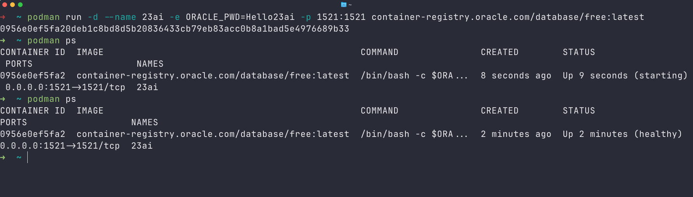
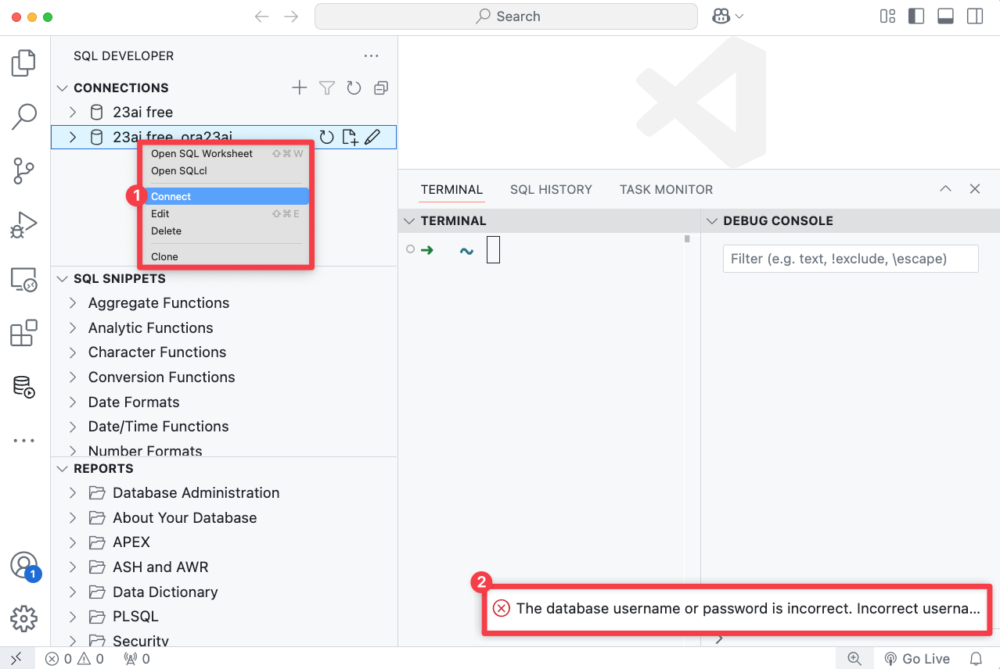
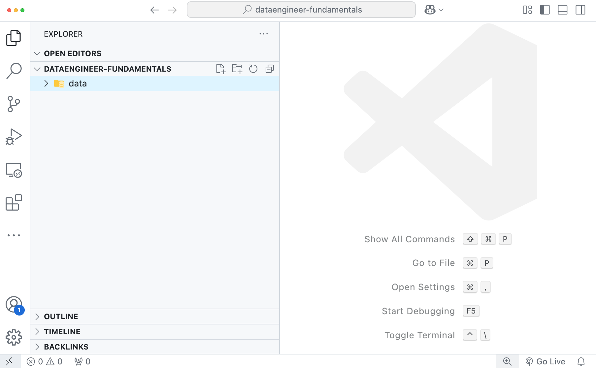
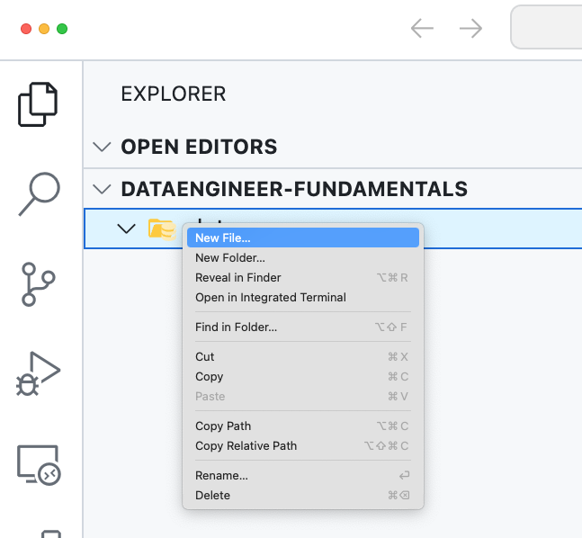
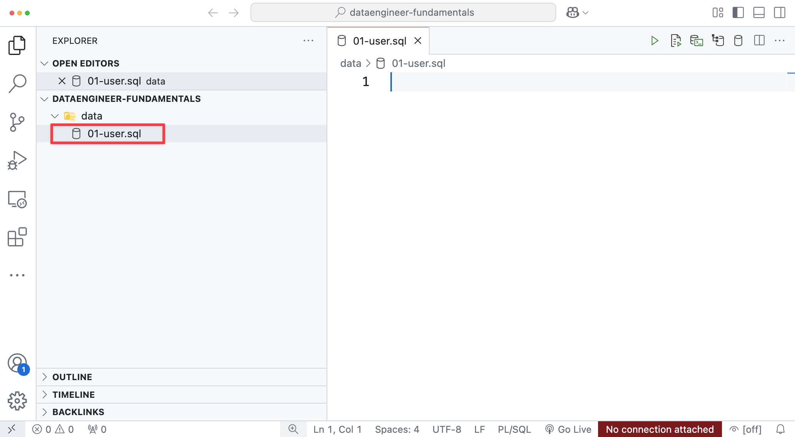
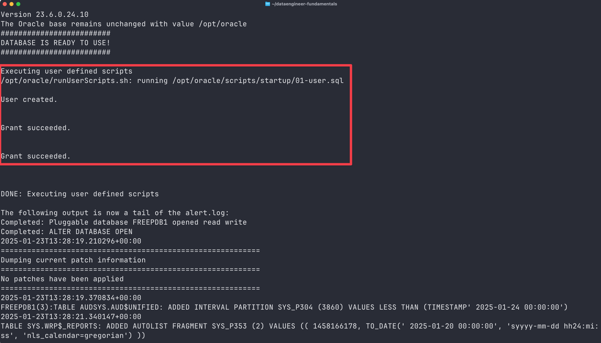

# Configure a custom 23ai test environment!

## Introduction

In the previous lab, you explored the container lifecycle and learned how to start and stop existing containers. Additionally, you connected to the database, created new users and tables, and populated them with data. While this knowledge is valuable, imagine the convenience of launching a new Oracle Database 23ai container that already includes all your users and data.

We aim to create a container with a pre-configured setup, allowing you to easily return to a consistent environment without the need to recreate users and database objects from scratch. In this lab, we will guide you through using the Oracle Database 23ai free container image and demonstrate how to create your custom development container.

Estimated Time: 15 minutes

### Objectives

- Learn more details about the Oracle Database 23ai container image
- Create a custom development container

## Prerequisites

- There are now containers running and any stopped containers a removed from the system

Verify by running this command

```bash
$ <copy>podman rm 23ai</copy>
```

There should be no container with ID or name "23ai" on the system.


> **Note:** In case you are using Docker the command is: `docker -v`


## Task 1: Create a new 23ai container and start it as a background process

We created new 23ai containers already a couple of times now, so you should be familiar with the command previously used:

`podman run --name 23ai -e ORACLE_PWD=Hello23ai -p 1521:1521 container-registry.oracle.com/database/free:latest`

To enhance our functionality, we will introduce a new option (**-d**) that allows us to start the container in the background as a daemon process.


1. Start a new 23ai container using the following command (note the additional option **-d**):

    ```bash
    $ <copy>
    podman run -d --name 23ai -e ORACLE_PWD=Hello23ai -p 1521:1521 container-registry.oracle.com/database/free:latest
    </copy>
    ```

2. Verify the container status by running:

    ```bash
    $ <copy>podman ps</copy>
    ```

    

## Task 2: Try to connect to the database using VS Code

1. In lab 5, we created a new connection in VS Code for the newly created user ```ora23ai```. Let's try to connect to the database again:

    >You will encounter an error message because a new container has been created, resulting in a **completely new database**. It's important to note that by removing the container with the command *`podman rm 23ai`*, all changes made to the database earlier have been lost.

    

2. Stop & remove the container

    For now, let's remove the container again:

    ```bash
    $ <copy>podman stop 23ai</copy>
    ```

    ```bash
    $ <copy>podman rm 23ai</copy>
    ```


## Task 3: Create a project folder

From here own onwards, we will be working with files and directories. We recommend creating a project folder.

1. Open a terminal and create a new project folder with subdirectories

    On MacOS/Linux, type:

    ```bash
    $ <copy>mkdir -p dataengineer-fundamentals/data</copy>
    ```
    On Windows, type:

    ```bash
    $ <copy>mkdir -p dataengineer-fundamentals\data</copy>
    ```

    The structure is the following:

    - **dataengineer-fundamentals**: Project folder
    - **data**: Folder that holds additional data, such as scripts, etc.

## Task 4: Change to the project directory and open VS Code

1. From the terminal, change to the newly created project folder and open VS Code

    ```bash
    $ <copy>
    code dataengineer-fundamentals
    </copy>
    ```

    Your VS Code opens at the root directory of your new project. In the side bar, you see also the subdirectory `data`.

    

## Task 5: Create a initialization SQL script

1. Right-click on the data directory and create a new file

    

2. Name the file `01-user.sql`

    

3. Copy & paste the following into the file and save it:

    ```sql
    $ <copy>
    --privileged user
    CONN system/Hello23ai@freepdb1;

    --create a new user
    create user ora23ai identified by ora23ai;

    --grant the new role db_developer_role 
    grant db_developer_role to ora23ai;

    --and unlimited tablespace
    grant unlimited tablespace to ora23ai;
    </copy>
    ```

## Task 6: Create a new 23ai Container

Now, we create a new container but this time we are introducing a new option to the command.

- **The -v option** in the `podman run` command is used to mount a volume from the host system into the container. It allows you to share files or directories between the host and the container, enabling persistent storage or sharing specific files/data.

- When using the -v option, you have to specify at least two components:
`podman run -v [host-path]:[container-path] ...`

- The host path is referring to a location on your laptop, while the container path refers to a location within the container.

The Oracle Database 23ai container image can be configured (among other options) to run scripts on startup. We will utilize this feature to have our SQL script run, every time we create a new container.
Set the container path to `/opt/oracle/scripts/startup` to execute scripts mapped from the host path during startup.

We need to include the mapping -v ./data:/opt/oracle/scripts/startup in our `podman run` command. 

1. Run the updated `podman run` command to create a new 23ai container 

    >Note: Ensure to run the command within your project folder that contains the directory data with the script 01-user.sql.

    ```bash
    $ <copy>
    podman run -d --name 23ai -v ./data:/opt/oracle/scripts/startup -e ORACLE_PWD=Hello23ai -p 1521:1521 container-registry.oracle.com/database/free:latest
    </copy>
    ```

2. You can verify that the scrip executed on startup. Run the following command to see the logs created during container creation:

    ```bash
    $ <copy>
    podman logs 23ai
    </copy>
    ```

    *(you may have to scroll back to see the entry)*

    


## Conclusion
You successfully installed 23ai free in a container and you successfully connected to the database using VS Code and ran your first query. Congratulations!

Upwards & onwards to the next lab.

## Acknowledgements
* **Author** - Kevin Lazarz, Database Product Management
* **Last Updated By/Date** - Kevin Lazarz, December 2024
