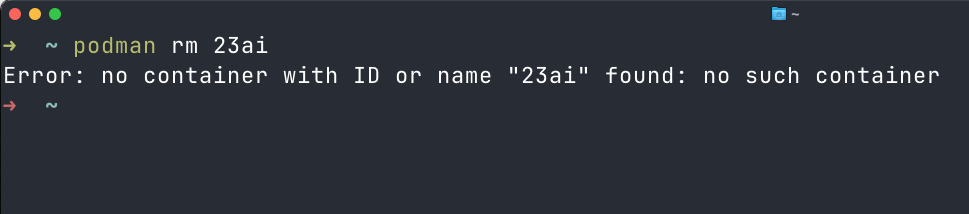
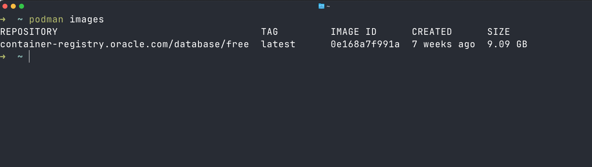
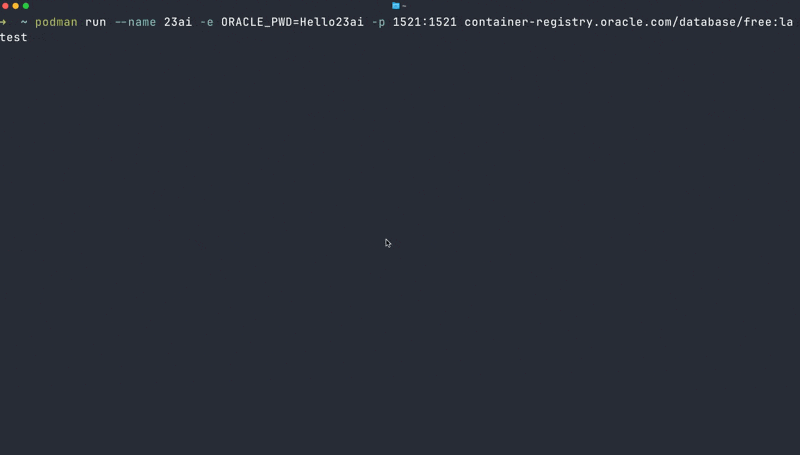
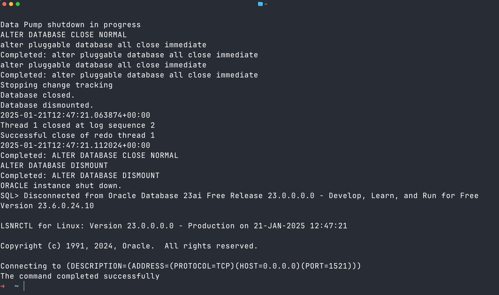
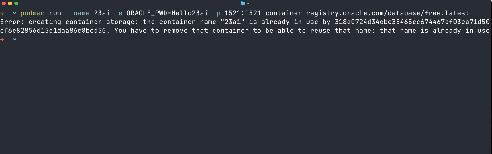
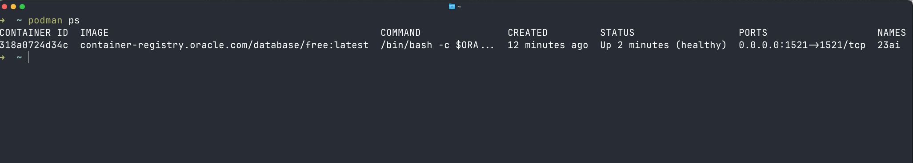
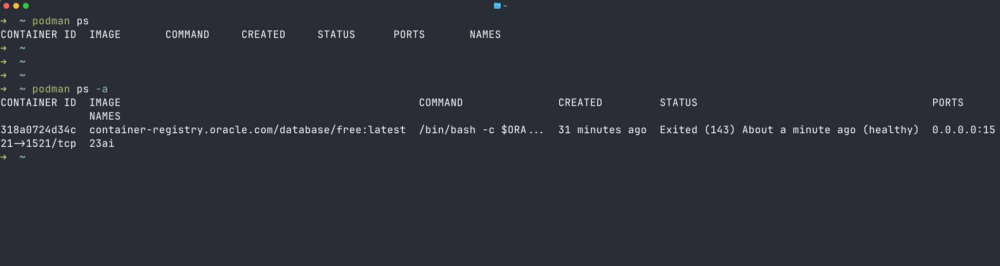

# Container Lifecycle & Fundamentals

## Introduction

Before we start building out our Data Engineering Test Lab, let's have a closer look at some of the container options we have used so far and what other options may be useful.

It is important to understand the concept of a container and it's lifecycle.

In general, containers can be in one of the following states:
- created (when starting a container)
- running
- paused
- stopped/exited

In the following section, we will learn more about the **running** and **stopped/exited** state.

> **Note:** The instructions use Podman. In case you are using Docker, you can replace Podman with the Docker command.

Estimated Time: 15 minutes

### Objectives

- Explore the container life cycle

## Prerequisites

- Successfully completed task 3 of the previous lab
- There are now containers running and any stopped containers a removed from the system

Verify by running this command

```bash
$ <copy>podman rm 23ai</copy>
```

There should be no container with ID or name "23ai" on the system.




## Task 1: Check the 23ai container image
In the previous lab, we used the `podman run` command to create a new container using a container image.
Podman uses a locally stored image and tries to create a new container from it.
In case the image is not available, Podman will download the image from the provided source (in our case `container-registry.oracle.com/database/free:latest`).

We can check the (locally) available container images by running the following command:

```bash
$ <copy>
podman images
</copy>
```



We can see that there is currently one image available with the following information:

| REPOSITORY                                  | TAG    | IMAGE ID     | CREATED     | SIZE    |
| ------------------------------------------- | ------ | ------------ | ----------- | ------- |
| container-registry.oracle.com/database/free | latest | 0e168a7f991a | 7 weeks ago | 9.09 GB |

Each image can be identified by it's image ID. This is important, for example, when you want to remove an image.


## Task 2: Create a new 23ai container using the existing container image

1. Run the following command to create new 23ai free container. As a source, we are using the locally stored image.

    > **Note:** Did you realize how fast the creation was? You can access a new 23ai free database in under **10 seconds**!

    ```bash
    $ <copy>
    podman run --name 23ai -e ORACLE_PWD=Hello23ai -p 1521:1521 container-registry.oracle.com/database/free:latest
    </copy>
    ```

    Here is a realtime recording:

    


2. Now stop the container by pressing `ctrl+c`

    The output in the terminal confirm the graceful shutdown of the database instance

    

## Task 3: Start a stopped container and check the status

1. Try to start a new container using the same command as in step 1

    ```bash
    $ <copy>
    podman run --name 23ai -e ORACLE_PWD=Hello23ai -p 1521:1521 container-registry.oracle.com/database/free:latest
    </copy>
    ```

    Youl will see an error message:

    

    As it says, there is already a container with the name **23ai**.

2. Restart the existing container by running the following command:

    podman start &lt;container name&gt;

    ```bash
    $ <copy>
    podman start 23ai
    </copy>
    ```

    > Note that this time the container is started as a background process

3. Check the status of a container

    Let's introduce a new command: podman ps. With this command we can check the status of all currently **running** containers.

     ```bash
    $ <copy>
    podman ps
    </copy>
    ```

    

4. Stop the container.

    As we have seen the container is now running as a background process. We can stop a container, i.e., shutting down the database server, by running the following command:

    ```bash
    $ <copy>
    podman stop 23ai
    </copy>
    ```

5. Check the status of the container by running:

    ```bash
    $ <copy>
    podman ps
    </copy>
    ```

    You will notice that there is apparenlty no container found.

    Try running the following command by adding the flag `-a`:

      ```bash
    $ <copy>
    podman ps -a
    </copy>
    ```
    

    You can now see all containers, including those that are stopped/exited.


## Task 4: Remove the container

1. Lastly, let's remove the container completely from the system by running the command:

    ```bash
    $ <copy>
    podman rm 23ai
    </copy>
    ```

    We have removed/deleted the container and it is not possible to start it again. It is also not possible find it when running the command:

    ```bash
    $ <copy>
    podman ps -a
    </copy>
    ```

## Summary & overview of Podman commands used so far

In the previous section, we learned how to use various commands in conjunction with our database container. Here’s a summary of the most important commands we can utilize once we have create a container using `podman run` command:

| Podman command                    | Notes                                                                     |
| --------------------------------- | ------------------------------------------------------------------------- |
| `podman start <container name>`   | Starts a stopped container                                                |
| `podman stop <container name>`    | Stops a running container                                                 |
| `podman ps`                       | Show all currently running container                                      |
| `podman ps -a`                    | Shows all container including stopped container                           |
| `podman rm <container name>`      | Removes/deletes container. This only works when the container is stopped. |
| `podman pause <container name>`   | Pauses a container                                                        |
| `podman restart <container name>` | Restarts a running/stopped container                                      |


## Clean up

Before we proceed to the next lab, let's clean up a few things:

1. After the container is stopped, run the following command to remove the container from your system:

```bash
$ <copy>
podman rm 23ai
</copy>
```

> **Note:** This command will only remove the container (in other words the database server). It will not remove the image to build the container.


## Acknowledgements
* **Author** - Kevin Lazarz, Database Product Management
* **Last Updated By/Date** - Kevin Lazarz, December 2024
