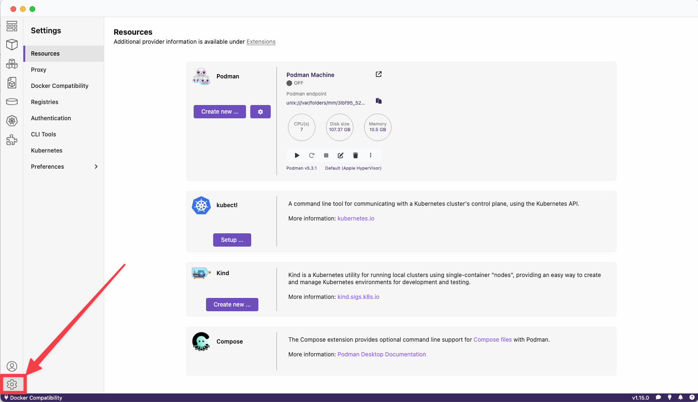
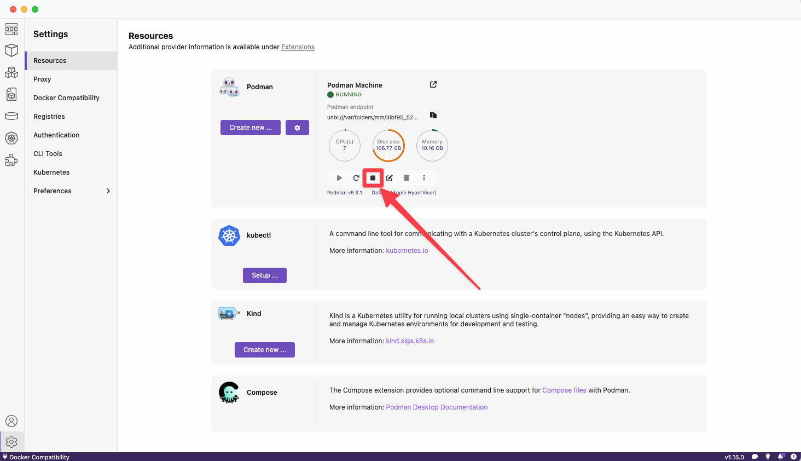
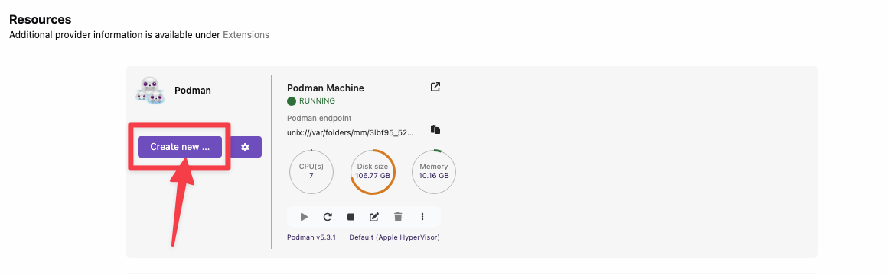
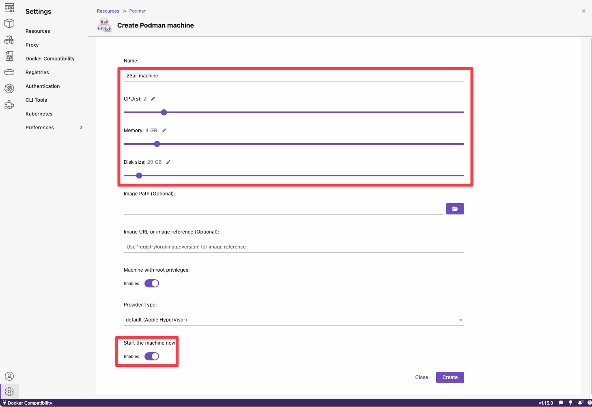
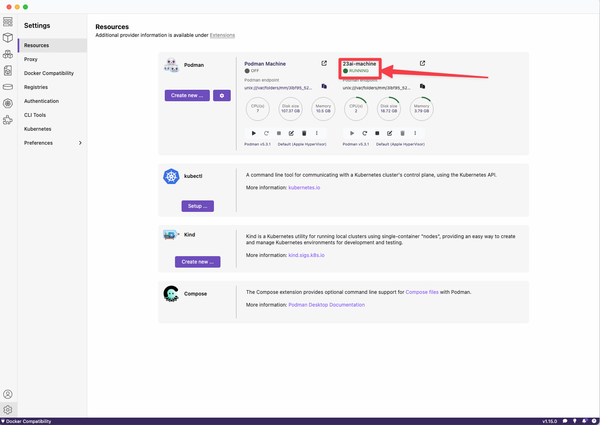

# Create a Podman machine

## Introduction

Creating a Podman machine on Windows or macOS is essential because Podman requires a Linux-based environment to run containers.

Unlike Linux systems, Windows and macOS do not natively support the container runtime required by Podman.
The Podman machine acts as a lightweight virtual machine, providing the necessary Linux kernel and runtime environment to manage and execute containers seamlessly.
This ensures compatibility with containerized workloads, enabling you to run, test, and develop containerized applications effectively on non-Linux operating systems.

>**Note:** We are only providing instructions using Podman Desktop in this workshop. You can create a Podman machine also using the command line. If you are using Docker/Docker Desktop you need to create Docker Desktop VM or Docker virtual machine. The concept is the same, however the steps may slightly differ. Please refer to the official Docker documentation for more details.

Estimated Time: 10 minutes

### Objectives

Create a Podman machine

## Task 1: Open Podman Desktop

1. Launch Podman Desktop from your applications/start menu.

2. If it's your first time running Podman Desktop, you may be prompted to initialize a Podman machine.

## Task 2: Navigate to the Podman Machine configuration and ensure no Podman machine is running

1. In the Podman Desktop interface, click **Settings** in the sidebar.

    

2. In case you have already a Podman Machine running, stop it. We will create a new one.

    

## Task 3: Create a new Podman Machine

1. Click on **Create New...** to start configuring a new Podman Machine

    

2. Provide an name and configure CPU, Memory, and Disk Size according to resources available on your computer. We recommend to use at least:

    - 2 CPUs
    - 4GB RAM
    - 20 GB Disk Size

    

    You can also enable the option **Start the machine now**.

3. Click **Create** to confirm the configuration. It will take a few moments to create the new Podman Machine. You should see the machine running in the resource overview screen.

    

## Task 4 (optional): Experiment

1. Feel free to configure a Podman Machine that suits your requirements of performance. 

## Congratulations!
Let's continue with the next lab.

## Acknowledgements
* **Author** - Kevin Lazarz, Database Product Management
* **Last Updated By/Date** - Kevin Lazarz, December 2024
