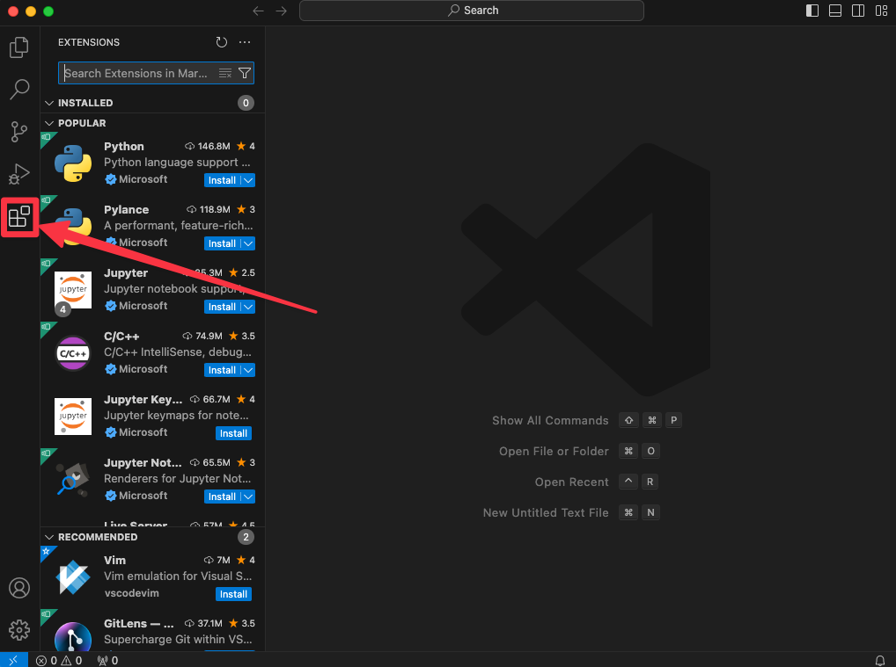
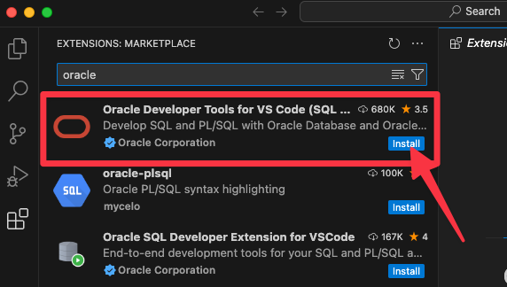

# Install Podman Desktop

## Introduction

While this next step is a rather simple and straight-forward one, we dedicated a whole lab for it
Oracle SQL Developer Extension for VS Code—The de facto query, development, and administration tool for Oracle Database professionals is now available as an extension in the world's most popular IDE.

It's main features are:
- Free
- Includes Oracle SQLcl, our modern command-line interface
- Self-contained with no installation prerequisites
- More than 20 application commands available from Command Palette
- In-place application updates will be released quarterly, using a YY.Q numbering scheme, e.g. 23.4, 24.1, 24.2
- Oracle Database customers with valid support and maintenance contracts can open Services Requests for SQL Developer for VS Code via My Oracle Support

Learn more [Oracle SQL Developer Extension for VS Code](https://www.oracle.com/database/sqldeveloper/vscode/)

Estimated Time: 5 minutes

### Objectives

- Add Oracle SQL Developer Extension for VS Code

## Task 1: Add Oracle SQL Developer Extension for VS Code

1. Open Visual Studio Code.

2. Go to the Extensions Marketplace by clicking the **square icon** on the left sidebar or pressing `Ctrl/Cmd + Shift + X`.

    

3. Search for "Oracle SQL Developer Extension for VS Code" and click Install.

    

>**Note:** Please do not install the deprecated extension "Oracle Developer Tools for VS Code"

## Conclusion: 
Congratulation! Now let's start playing with containers and 23ai free!

## Acknowledgements
* **Author** - Kevin Lazarz, Database Product Management
* **Last Updated By/Date** - Kevin Lazarz, December 2024
