# Evaluating Performance

## Introduction

We are confident that adjusting certain parameters can improve the quality and accuracy of the chatbot’s responses. However, can we be sure that a specific configuration remains reliable when scaled to hundreds or even thousands of different questions?

In this lab, you will explore the *Testbed* feature. The Testbed allows you to evaluate your chatbot at scale by generating a Q&A test dataset and automatically running it against your current configuration.

**Note**: The example shown in this lab relies on gpt-4o-mini. Feel free to use your local LLMs (e.g. llama3.1) if you choose to or can't use OpenAI LLMs.

Estimated Time: 15 minutes

### Objectives

In this lab, you will:

* Explore the *Testbed* tab
* Generate a Q&A Test dataset
* Perform an evaluation on the Q&A Testset

### Prerequisites

* All previous labs successfully completed

## Task 1: Navigate to the Testbed tab

Access the *Testbed* from the left-hand menu:

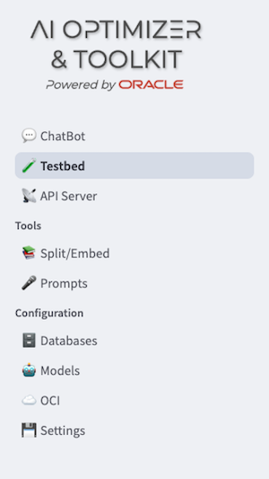

As a first step, you can either upload an existing Q&A test set—either from a local file or from a saved collection in the database—or generate a new one from a local PDF file.

## Task 2: Generate a Q&A Test dataset

The AI Optimizer allows you to generate as many questions and answers as you need, based on a single document from your knowledge base. To enable test dataset generation, simply select the corresponding radio button:

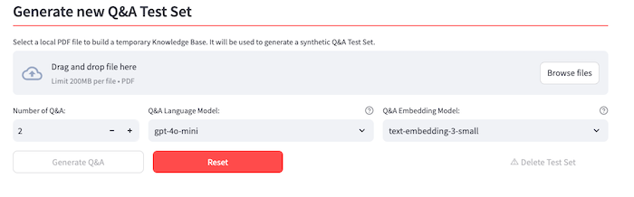

1. Upload a document

    Upload the same document that was used to create the vector store. You can easily download it from [this link](https://docs.oracle.com/en/database/oracle/oracle-database/23/vecse/ai-vector-search-users-guide.pdf).

2. Increase the number of questions to be generated to 10 or more

    Keep in mind that the process can take a significant amount of time, especially if you are using a local LLM without sufficient hardware resources. If you choose to use a remote OpenAI model instead, the generation time will be less affected by the number of Q&A pairs to create.

3. Leave the default option for:
    * Q&A Language Model: **gpt-4o-mini**
    * Q&A Embedding Model: **text-embedding-3-small**

4. Click on **Generate Q&A** button and wait until the process is over:

    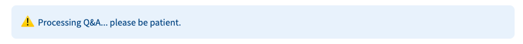

5. Browse the questions and answers generated:

    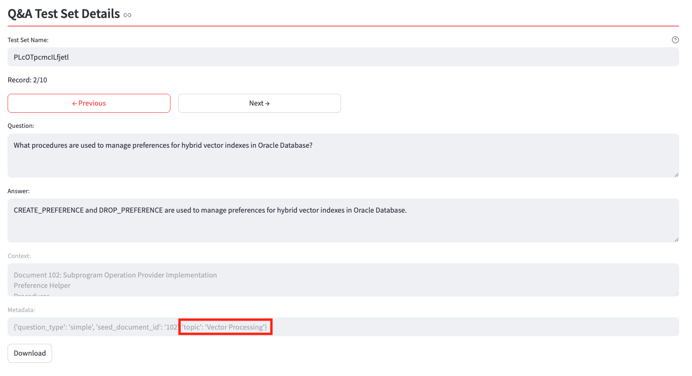

    Note that the **Question** and **Answer** fields are editable, allowing you to modify the proposed Q&A pairs based on the **Context** (which is randomly extracted and not editable) and the **Metadata** generated by the Testbed engine.

    In the *Metadata* field you'll find a **topic** tag that classifies each Q&A pair. The topic list is generated automatically by analyzing the document content and is assigned to each Q&A pair. It will be used in the final report to break down the **Overall Correctness Score** and highlight areas where the chatbot lacks precision.

    You can also export the generated Q&A dataset using the **Download** button. This allows you to edit and review it—e.g., in Visual Studio Code.

    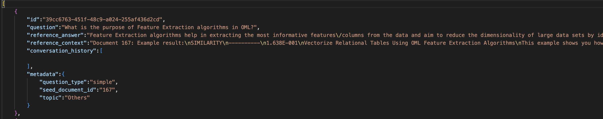

6. Update the **Test Set Name**

    Replace the automatically generated default name to make it easier to identify the test dataset later, especially when running repeated tests with different chatbot configurations. For example, change it from:

    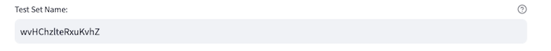

    to something more descriptive, like:

      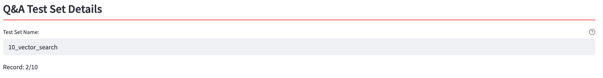

## Task 3: Evaluate the Q&A Testset

Now you are ready to perform an evaluation on the Q&As you generated in the previous step.

1. In the left-hand menu:

    * Under **Language Model Parameters**, select **gpt-4o-mini** from the **Chat model** dropdown list.

    * Ensure **Enable RAG?** is selected (if it wasn't already)

    * In the **Select Alias** dropdown list, choose the **TEST2** value.

    * Leave all other parameters unchanged

2. With **gpt-4o-mini** selected as the evaluation model, click the **Start Evaluation** button and wait a few seconds. All questions from your dataset will be submitted to the chatbot using the configuration defined in the left pane:

    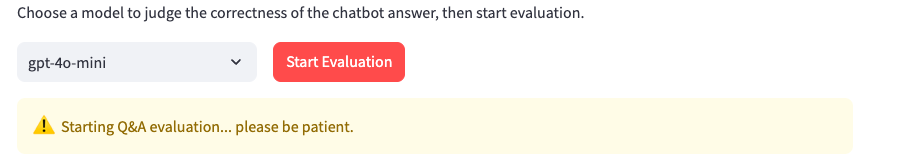

3. Let's examine the result report, starting with the first section:

    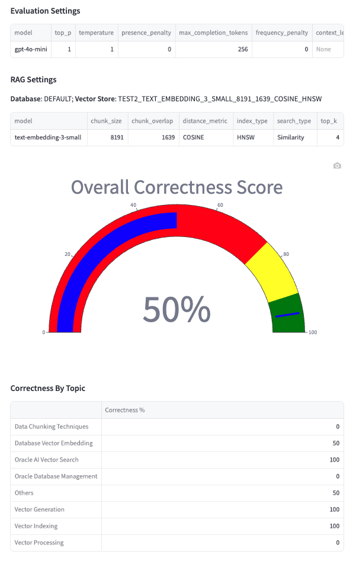

    This section displays:

      * The chatbot's **Evaluation Settings**, as configured in the left-hand pane before launching the massive test.

      * The **RAG Settings** including the database and vector store used, the name of the embedding **model** used, and all associated parameters (e.g., **chunk size**, **top-k**).

      * The **Overall Correctness Score**, representing the percentage of questions for which the LLM judged the chatbot's response as correct compared to the reference answer

      * The **Correctness By Topic**, which breaks down the results based on the automatically generated topics assigned to each Q&A pair in the dataset.

    The second section of the report contains details on each question submitted, with a focus on the **Failures** collection and the **Full Report** list. To view all fields, scroll horizontally. In the image below, the second frame has been scrolled to the right:

      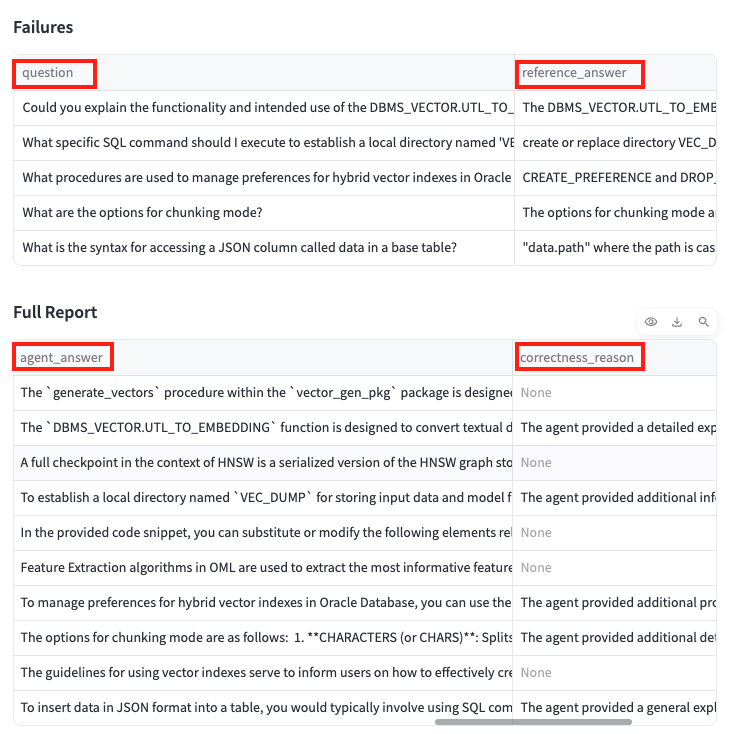

    The main fields displayed are:

      * **question**: the submitted question
      * **reference_answer**: the expected answer used as a benchmark
      * **reference_context**: the source document section used to generate the Q&A pair
      * **agent_answer**: the response provided by the chatbot based on the current configuration and vector store
      * **correctness_reason**: an explanation (if any) of why the response was considered incorrect. If correct, this field will display **None**.

      You can download the results in different formats:

      * Click the **Download Report** button to generate an HTML summary of the *Overall Correctness Score* and *Correctness by Topic*

      * To export the **Full Report** and the **Failures** list, download them as .csv files using the download icons shown in the interface:

        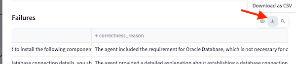

## Task 4 (optional): Try a different Q&A Testset

Now let's perform a test using an external saved test dataset, which you can download [here](https://raw.githubusercontent.com/markxnelson/developer/refs/heads/main/ai-optimizer/getting_started-30_testset.json). This file contains 30 pre-generated questions.

If you wish to remove any Q&A pairs that you consider irrelevant or unhelpful, you can edit the file, save it, and then reload it as a local file—following the steps shown in the screenshot below:

  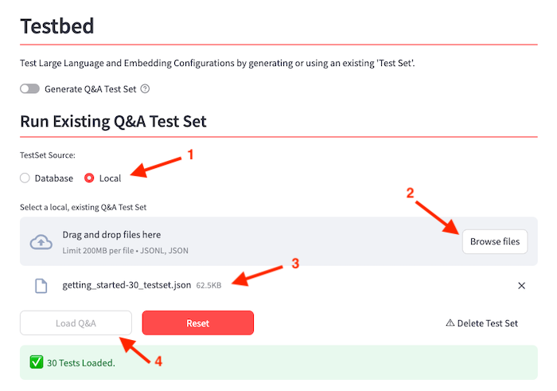

Next, let’s update the Chat Model parameters by setting the **Temperature** to **0** in the left-hand pane under the **Language Model Parameters** section.
Why? Q&A datasets are typically generated with a low level of creativity to minimize randomness and focus on expressing core concepts clearly—avoiding unnecessary "frills" in the answers.
Now, repeat the test to see whether there are improvements in the **Overall Correctness Score**.

* To compare with previous results, open the dropdown under **Previous Evaluations for...** and click on the **View** button to display the associated report.

  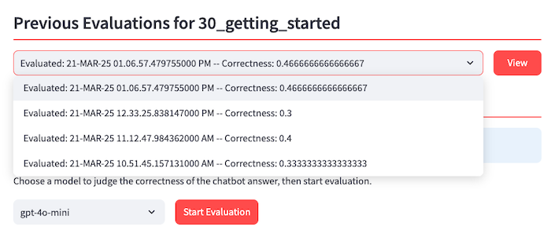

* You can repeat the tests as many times as needed, changing the **Vector Store**, **Search Type**, and **Top K** parameters to apply the same tuning strategies you've used previously with individual questions—now extended to a full test using curated and reproducible data.

## Acknowledgements

* **Author** - Lorenzo De Marchis, Developer Evangelist, May 2025
* **Contributors** - Mark Nelson, John Lathouwers, Corrado De Bari, Jorge Ortiz Fuentes, Andy Tael
* **Last Updated By** - Lorenzo De Marchis, May 2025
