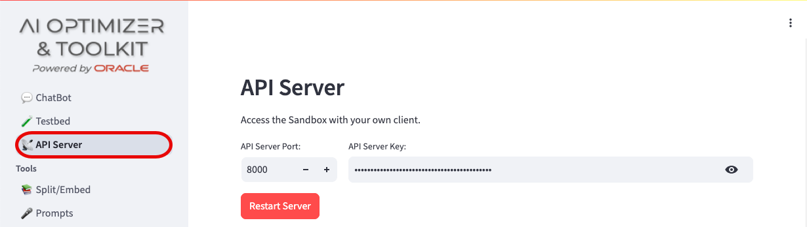
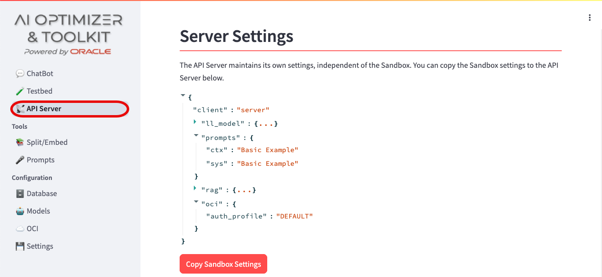
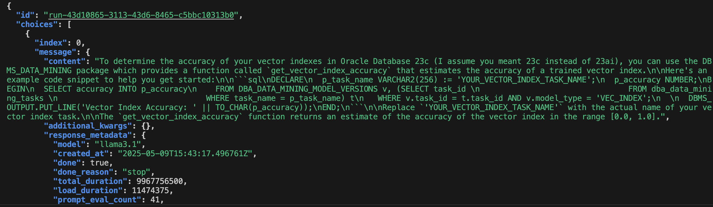

# (Optional) Using the API Server

## Introduction

In this lab, you will test the functionality of the API Server. The AI Optimizer uses an API Server to make its features accessible to external clients. You can run the API Server either as part of the AI Optimizer GUI client or as a standalone process.

Estimated Time: 10 minutes

### Objectives

In this lab, you will:

* Start the AI Optimizer as an API Server
* Review the configuration parameters
* Make an API call to the server

### Prerequisites

This lab assumes you have:

* All previous labs successfully completed

## Task 1: Start the API Server

Navigate to the *API Server* tab from the left-hand pane:



You’ll see a `Restart Server` button (in red). This is because the API Server starts automatically with the AI Optimizer. Follow the steps below to edit the server configuration and restart it:

* Change the API Server Port to 8001
* Update the API Server Key (e.g., abcd, or any value you prefer)
* Click the Restart Server button to apply the new parameters

## Task 2: Inspect Server Configuration

When the API Server starts, it creates a default `server` client with minimal settings. This client is used when calling the API Server externally, outside of the AI Optimizer GUI.

To copy your current GUI client settings to the server client for external use, click the Copy AI Optimizer Settings button.



You can inspect the configuration of the `server` client by expanding the `{...}` brackets.

## Task 3: Perform an API call to the server

Now that the API Server is running, you can perform API calls against it.

* Open a terminal window in your preferred IDE

* Copy and run the following curl command in the terminal:

    ```bash
    <copy>
    #Bearer Key to be set accordingly to task 1.
    curl -X POST "http://localhost:8001/v1/chat/completions" \
     -H "Content-Type: application/json" \
     -H "Authorization: Bearer abcd" \ 
     -H "client: server" \
     -d '{
       "model": "llama3.1",
       "messages": [
         {
           "role": "user",
           "content": "In Oracle Database 23ai, how do I determine the accuracy of my vector indexes?"
         }
       ]
     }' | jq .
     </copy>
    ```

    Here, you're essentially repeating the same type of request as in *Lab 3*. You’ve passed the API Server Key you configured in Task 1 along with the question content as parameters. You should receive a response similar to the screenshot below:

    

   As you can see, the API Server responded with a generic answer—this is expected because RAG was not enabled. You can enable RAG just like you did in the previous labs, and the API Server will provide more context-aware responses.

## Learn More

* Enable RAG from the Chatbot tab, then repeat Task 3. Observe how the API Server's response changes with RAG enabled.

* To explore the Oracle AI Optimizer and Toolkit API documentation, visit:

    ```bash
    <copy>
    http://localhost:8001/v1/docs#
    </copy>
    ```

    > **Note**: The port number in the URL (in this case 8001) must match the API Server Port you configured in Task 1 of this lab.

## Acknowledgements

* **Author** - Lorenzo De Marchis, Developer Evangelist, May 2025
* **Contributors** - Mark Nelson, John Lathouwers, Corrado De Bari, Jorge Ortiz Fuentes, Andy Tael
* **Last Updated By** - Lorenzo De Marchis, May 2025
