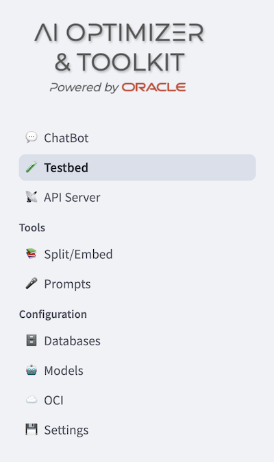

# Evaluating Performance

We are confident that changing some parameters the quality and accuracy of the answers improve. But are we sure that on a large scale deployment a specific setup can be reliable on hundreds or thousands of different questions?

In this lab you will discover the *Testbed* feature. The Testbed helps you to test your chatbot massively, by generating a Q&A test dataset and automatically try against your current configuration. 

## Task 1: Navigate to the Testbed tab

  Access the *Testbed* from the left side menu:

  

  As a first step, you can either upload a pre-existing Q&A test set (either from a local file or from a stored collection inside the database) or generate a new one from a local PDF file.

## Task 2: Generate a Q&A Test dataset

The Optimizer allows to generate as many questions and answer you desire, based on a single document, that it's part of the knowledge base you have stored as vector store with their own embeddings. You can enable test dataset generation by selecting the corresponding radio button:

1. Upload a document 
    
    Upload the same document that was used to create the vector store. You can easily download it from [this link](https://docs.oracle.com/en/database/oracle/oracle-database/23/tdpjd/get-started-java-development.pdf).

2. Increase the number of questions to be generated to 10 or more 
    
    Keep in mind that the process it's quite long, especially if you are willing to use a local LLM without enough hardware capacity. In case you choose to use an OpenAI remote model, the process will be affected less by the number of Q&As to be generated.

3. Leave the default option for:
    * Q&A Language Model: **gpt-4o-mini**
    * Q&A Embedding Model: **text-embedding-3-small**

4. Click on **Generate Q&A** button and wait until the process is over:

    

5. Browse the questions and answers generated:

    

    Note that the **Question** and the **Answer** fields are editable, allowing you to modify the proposed Q&A pairs based on the **Context** (which is randomly extracted and not editable) as well as the **Metadata** set by the Testbed engine. In the *Metadata* field you'll find a **topic** tag that classifies each Q&A pair. 
    
    The topic list is generated automatically by analyzing the text and is assigned to each Q&A. It will be used in the final report to break down the **Overall Correctness Score** and identify areas where the chatbot lacks precision.

    The **Download** button allows you to export and edit the generated Q&A dataset. You can open it in VS Code to review its content.

    

6. Update the **Test Set Name** 
    
    Replace the automatically generated default name to make it easier to identify the test dataset later when running repeated tests on different chatbot configurations. For example, change it from:

    

    change it in :

      

## Task 3: Evaluate the Q&A Testset

Now you are ready to perform an evaluation on the Q&As you generated in the previous step.

1. On the left pane menu:

    * Under **Language Model Parameters**, select **gpt-4o-mini** from the **Chat model** dropdown list.

    * **Enable RAG?**, if, for any reason, it wasn't already selected

    * In the **Select Alias** dropdown list, choose the **TEST2** value.

    * Leave the default parameters on the left pane unchanged.

2. Leaving the default model for evaluation, **gpt-4o-mini**, click the **Start Evaluation** button and wait a few seconds. All questions will be submitted to the chatbot using the configuration defined in the left pane:

    

3. Let's examine the result report, starting with the first section:

    

    It shows:

      * The chatbot's **Evaluation Settings**, as configured in the left-side playground before starting the massive test.

      * The **RAG Settings** for the Database and the associated Vector Store, including the name of the embedding **model** used and all the parameters set (from **chunk size** to **top k**).

      * The **Overall Correctness Score**, which represents the percentage of questions for which the LLM judged the chatbot’s answer as correct compared to the reference answer.

      * The **Correctness By Topic**: each question in the test dataset is tagged with a topic. The list of topics is generated automatically during the creation of the synthetic Q&A dataset.

    The second section of the report provides details about each individual question submitted, focusing on the **Failures** collectio and the **Full Report** list. To display all the fields, scroll horizontally from right to left. In the following image, the second frame has been scrolled:

      

    The main fields displayed are:

      * **question**: the question submitted
      * **reference_asnwer**: the answer considered correct, to which the agent’s answer is compared.
      * **reference_context**: the document section extracted and used to create the Q&A pair.
      * **agent_answer**: the answer provided by the chatbot based on the current configuration and vector store.
      * **correctness_reason**: an explanation, if any, of why the answer was judged incorrect. If the answer was considered correct, the value will be **None**.

      * You can get a copy of the results as an HTML page reporting the *Overall Correctness Score* and *Correctness By Topic* only, cliccking on the **Download Report** button. Click it to view how is the report. 
 
      * You can also download the **Full Report** and **Failures** list as a *.csv* file selecting each frame as shown in the following snapshot:

        

## Task 4 (optional): Try a different Q&A Testset 

Now let's perform a test using an external saved test dataset, which you can download [here](https://raw.githubusercontent.com/oracle-samples/ai-optimizer/refs/heads/cdb/docs/hol/artifacts/getting_started-30_testset.json). It contains 30 pre-generated questions.

If you want to remove any Q&A pairs that you consider not meaningful, you can edit the file, save it, and reload it as a local file, following the steps shown in this snapshot:

  

Let's change the Chat model parameters by setting the Model **Temperature** to **0** in the left pane, under th **Language Model Parameters** section. 
Why? Q&As are usually generated with a low level of creativity to reduce randomness and focus on expressing the core concepts clearly, avoiding unnecessary "frills". 
Now, repeat the test to check if there are any improvements in the Overall Correctness Score. **Overall Correctness Score**. 

* To compare with previous results, click on the dropdown list under **Previous Evaluations for...** and click on the **View** button to display the overall report.

  

* Repeat the tests as many times as you like, changing the **Vector Store**, **Search Type** and **Top K** parameters to perform the same kind of tuning you previously applied with just a few interactive questions — now executed on a massive test with curated and comparable assets.