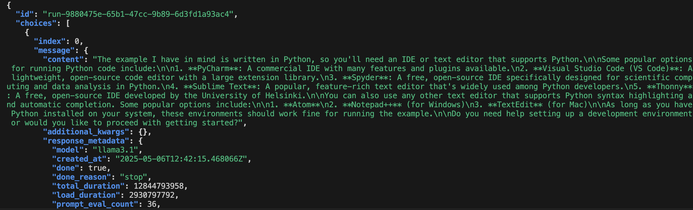

# (Optional) Using the API Server

## Introduction

In this lab, you will test the API Server functionality. The AI Optimizer is powered by an API Server to allow for any client to access its features. The API Server can be run as part of the provided AI Optimizer GUI client or as a separate, independent process.

Estimated Time: -- minutes

### Objectives

In this lab, you will:
* Start the AI Optimizer as an API Server
* Inspect the configuration parameters
* Perform an API call to the server

### Prerequisites

This lab assumes you have:
* All previous labs successfully completed

## Task 1: Start the API Server {#task-1}

Navigate to the *API Server* tab from the left side pane:


You will see a `Restart Server` button (the one in red). This is because an API server starts automatically with the AI Optimizer. Now, just perform these steps to edit your API Server and restart it:

* Modify the API Server Port to be 8001
* Edit the API Server Key (you can use something like `abcd` or whatever you like)
* Click on the *Restart Server* button to restart the API Server with these new parameters you just set

## Task 2: Inspect Server Configuration {#task-2}

During the startup of the API Server, a `server` client is created and populated with minimal settings.  The `server` client is the default when calling the API Server outside of the AI Optimizer GUI client.  To copy your AI Optimizer GUI client settings to the `server` client for use with external application clients, click the "Copy AI Optimizer Settings".  


You can review how the `server` client is configured by expanding the `{...}` brackets.

## Task 3: Perform an API call to the server {#task-3}

Now that the API server is up and running, you are able to perform API calls against it. 

* Open a terminal window in your chosen IDE

* Copy and execute this `curl` command inside your terminal window:

    ```bash
    curl -X POST "http://localhost:8001/v1/chat/completions" \
     -H "Content-Type: application/json" \
     -H "Authorization: Bearer abcd" \
     -H "client: server" \
     -d '{
       "model": "llama3.1",
       "messages": [
         {
           "role": "user",
           "content": "Can I use any kind of development environment to run the example?"
         }
       ]
     }' | jq .
    ```

    Here, we are basically asking the same question we have been asking in *Lab 3*. We have passed the the API Server Key we set in [Task 1](#task-1-start-the-api-server-task-1) and the question content as parameters. You should get a response that is structured like the screenshot below:

    

    You can see how the API Server answered to the question with a generic answer, since RAG was not enabled. But you can enable RAG as we did in the previous labs and the API server will be enhanced as well!

## Learn More

* Enable Rag from the *Chatbot* tab and perform [Task 3](#task-3) again. See how the answer given by the API Server changes accordingly!

* You can visit the Oracle AI Optimizer and Toolkit api documentaion by visiting this link:

    ```
    http://localhost:8001/v1/docs#
    ```

    *The localhost port (in this case 8001) in the url must correspond to the API Server Port you choose in Task 1 of this lab*