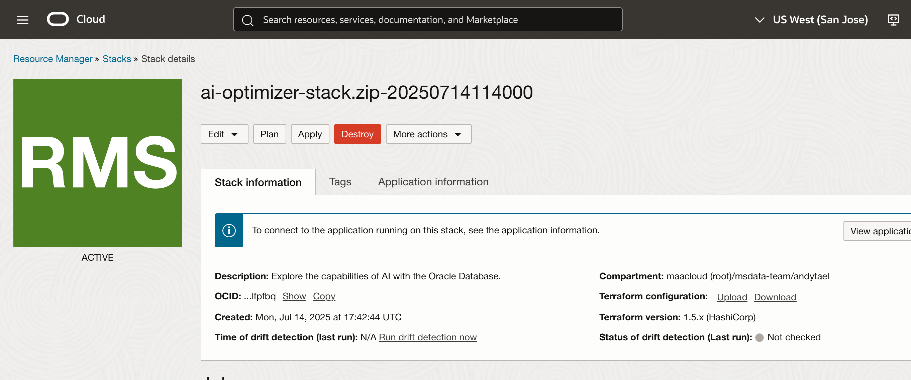

# Cleanup the Oracle AI Optimizer and Toolkit installation

## Introduction

In the lab you cleanup the deployed Oracle AI Optimizer and Toolkit environment by using Oracle Cloud OCI Resource Manager.

Estimated Time: 10 minutes

### Objectives

* Navigate to the OCI Developer Services
* Destroy the environment

### Prerequisites

Ypu have successfully deployed an Oracle AI Optimizer and Toolkit environment by using Oracle CLoud OCI Resource Manager.

## Task 1: Start the Oracle Resource Manager Destroy job

To destroy the AI Optimizer infrastructure, in OCI navigate to `Developer Services -> Stacks`. Choose the Compartment the AI Optimizer was deployed into and select the stack Name. Click on the **Destroy** button.

## Acknowledgements

* **Author** - Andy Tael, July 2025
* **Last Updated By** - Andy Tael, July 2025
