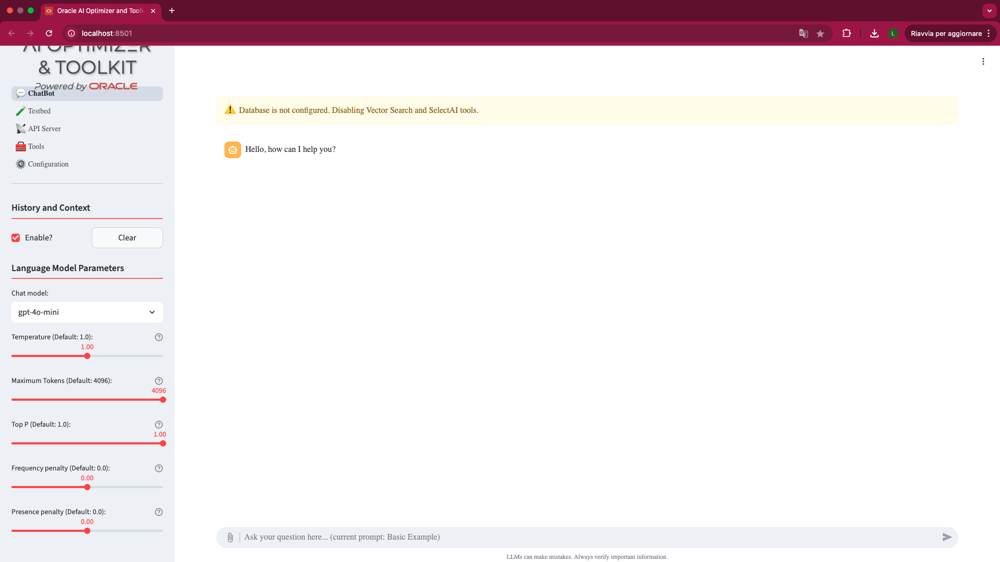

# Deploy the Oracle AI Optimizer and Toolkit

## Introduction

In the lab you will deploy the Oracle AI Optimizer and Toolkit by using infrastructure as code and OCI Resource Manager.

Estimated Time: 20 minutes

### Objectives

* Go to the GitHub page where Oracle AI Optimizer and Toolkit is maintained
* Click on the **Deploy to Cloud button**
* Review the predefined settings
* Get the necessary URLs for the Oracle AI Optimizer and Toolkit

### Prerequisites

This lab assumes you have:

* Completed the *Get Started* Lab
* Access and quota to a GPU shape (the recommended deployment, it will work with a regular CP but, **extremely** slow)

## Task 1: Start the Oracle Resource Manager job

1. Go to the [Oracle AI Optimizer and Toolkit GitHub](https://github.com/oracle-samples/ai-optimizer).

1. Click on the **Deploy to Oracle Cloud** Button. This will take you to the **Create Stack** page in Oracle Cloud.

## Task 2: Enter the values for the deployment

1. Review and accept the terms but checking the box and make sure you deploy Oracle AI Optimizer and Toolkit in the correct compartment. Click the **Next** Button.

  

1. Leave the Application name empty, this will autogenerate an application name.

1. Choose **VM** as the infrastructure to deploy to. There is an option to deploy to Kubernetes but that is not covered in this Livelab.

1. Oracle recommends that you deploy to an GPU shape to get decent performance. When deploying to a GPU, as port of the deployment, make available one local Large Language Model and one Embedding Model for use out-of-the-box. Make sure that you have the ability to deploy a GPU Shape.

  LLMs and Embedding Models are designed to use GPUs. This Livelab can work on machines with just CPUs; albeit **extremely** slow! **Note:** A GPU shape has a higher cost.
  
  If deploying VM on a CPU, you will need to [configure a model](https://oracle-samples.github.io/ai-optimizer/client/configuration/model_config/index.html) for functionality.

  

1. In the Load balancer option Oracle recommends that you add the CIDR block to restrict access for your environment to the **Access Control for Application GUI** and the **Access Control for Application API Server** fields. If not **EVERYONE** can access the environment.

1. In the Database Options section, option Oracle recommends that you add the CIDR block to restrict access for your environment to the **Access Control for Autonomous Database**.

  

1. Click the **Next** Button And review the values.

1. Click Create. This will create an OCI Resource Manager **Apply** job.

  

1. Wait ~5-10 minutes until the **Apply** job is completed. Once the job has **Succeeded**, the AI Optimizer has been deployed!

1. The **Application Information** tab will provide the URL’s to access the AI Optimizer GUI and API Server. In the “All-in-One” deployment on the VM, the API Server will only become accessible after visiting the GUI at least once.

  

1. When accessing the Web GUI using URL provided it should look like this:

  

> **NOTE**: Although the infrastructure is deployed, the AI Optimizer may still be initializing, which can result in a 502 Bad Gateway error when accessing the URLs. Please allow up to 10 minutes for the configuration to complete.

You may now **proceed to the next lab**.

## Acknowledgements

* **Author** - Andy Tael, July 2025
* **Last Updated By** - Andy Tael, July 2025
