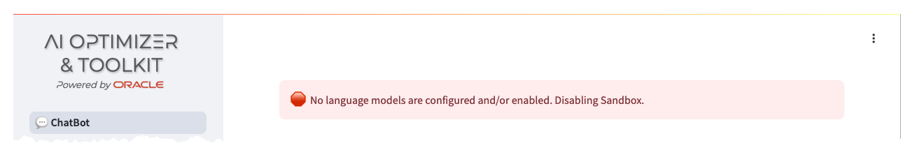
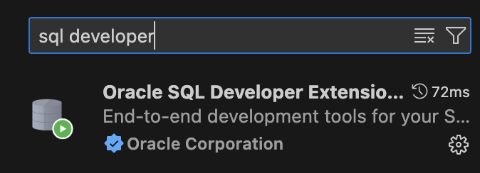

# Get started - Installation and Setup

## Introduction

The **AI Optimizer** is available to install in your own environment, which may be a developer’s desktop, on-premises data center environment, or a cloud provider. It can be run either on bare-metal, within a container, or in a Kubernetes Cluster.

This walkthrough will guide you through a basic installation of the **Oracle AI Optimizer and Toolkit** (the **AI Optimizer**). It will allow you to experiment with GenAI, using Retrieval-Augmented Generation (RAG) with Oracle Database 23ai at the core.

You will run four container images to establish the “Infrastructure”:

* On-Premises LLM - **llama3.1**
* On-Premises Embedding Model - **mxbai-embed-large**
* Vector Storage - **Oracle Database 23ai Free**
* The AI Optimizer

> **NOTE**: The walkthrough will reference podman commands. If applicable to your environment, podman can be substituted with docker. If you are using docker, make the walkthrough easier by aliasing the podman command:

````bash
<copy>
alias podman=docker
</copy>
````

Estimated Time: 60 minutes

### Objectives

* Perform a full on-premise installation of the **Oracle AI Optimizer and Toolkit**

### Prerequisites

This lab assumes you have:

* An Integrated Development Editor (like **Visual Studio Code**)
* Python 3.11
* Container Runtime e.g. docker/podman (for running in a Container)
* Internet Access (docker.io and container-registry.oracle.com)
* **100G** of free disk space.
* **12G** of usable memory.
* Sufficient GPU/CPU resources to run the LLM, embedding model, and database

## Task 1:  LLM - llama3.1

To enable the _ChatBot_ functionality, access to a **LLM** is required. This workshop will use [Ollama](https://ollama.com/) to run the _llama3.1_ **LLM**.

1. Start the *Ollama* container:

   The Container Runtime is native:

   ```bash
   <copy>
      podman run -d --gpus=all -v ollama:$HOME/.ollama -p 11434:11434 --name ollama docker.io/ollama/ollama
   </copy>
   ```

   If you don't have access to a GPU, you will have to omit the '--gpus=all' parameter:

   ```bash
   <copy>
   podman run -d -v ollama:$HOME/.ollama -p 11434:11434 --name ollama docker.io/ollama/ollama
   </copy>
   ```

   > **Note:**
   AI Runners like Ollama, LM Studio, etc. will not utilize Apple Silicon's "Metal" GPU when running in a container. This may change as the landscape evolves. You can install and run Ollama natively outside a container and it will take advantage of the "Metal" GPU.  Later in the Workshop, when configuring the models, the API URL for the Ollama model will be your hosts IP address.

2. Pull the **LLM** into the container:

   ```bash
   <copy>
   podman exec -it ollama ollama pull llama3.1
   </copy>
   ```

3. Test the **LLM**:

   ```bash
   <copy>
   curl http://127.0.0.1:11434/api/generate -d '{
   "model": "llama3.1",
   "prompt": "Why is the sky blue?",
   "stream": false
   }'
   </copy>
   ```

   Unfortunately, if the above `curl` does not respond within 5-10 minutes, the rest of the workshop will be unbearable.
   If this is the case, please consider using different hardware.

## Task 2: Embedding - mxbai-embed-large

To enable the **RAG** functionality, access to an embedding model is required. In this workshop you will use [Ollama](https://ollama.com/) to run the _mxbai-embed-large_ embedding model.

1. Pull the embedding model into the container:

   ```bash
   <copy>
   podman exec -it ollama ollama pull mxbai-embed-large
   </copy>
   ```

## Task 3: The AI Optimizer

The **AI Optimizer** provides an easy to use front-end for experimenting with **LLM** parameters and **RAG**.

1. Download and Unzip the latest version of the **AI Optimizer**:

   ```bash
   <copy>
   curl -L -o ai-optimizer.tar.gz https://github.com/oracle-samples/ai-optimizer/archive/refs/heads/main.tar.gz
   mkdir ai-optimizer
   tar zxf ai-optimizer.tar.gz --strip-components=1 -C ai-optimizer
   </copy>
   ```

2. Create and activate a Python Virtual Environment:

   ```bash
   <copy>
   cd ai-optimizer/src
   python3.11 -m venv .venv --copies
   source .venv/bin/activate
   pip3.11 install --upgrade pip wheel setuptools
   </copy>
   ```

3. Install the Python modules:
   
   ```bash
   <copy>
   pip3.11 install -e ".[all]"
   source .venv/bin/activate
   </copy>
   ```
4. Start the AI Optimizer:

   ```bash
   <copy>
   streamlit run launch_client.py --server.port 8501
   </copy>
   ```

   If you are running on a remote host, you may need to allow access to the `8501` port.

   For example, in Oracle Linux 8/9 with `firewalld`:

   ```bash
   <copy>
   firewall-cmd --zone=public --add-port=8501/tcp
   </copy>
   ```

## Task 4: Vector Storage - Oracle Database 23ai Free

AI Vector Search in Oracle Database 23ai provides the ability to store and query  by similarity text and multimedia data. The AI Optimizer uses these capabilities to provide more accurate and relevant **LLM** responses via Retrieval-Augmented Generation (**RAG**). [Oracle Database 23ai Free](https://www.oracle.com/uk/database/free/get-started/) provides an ideal, no-cost vector store for this workshop.

To start Oracle Database 23ai Free:

1. Start the container:

      ```bash
      <copy>
      podman run -d --name ai-optimizer-db -p 1521:1521 container-registry.oracle.com/database/free:latest
      </copy>
      ```

2. Alter the `vector_memory_size` parameter and create a [new database user](../client/configuration/db_config#database-user):

      ```bash
      <copy>
      podman exec -it ai-optimizer-db sqlplus '/ as sysdba'
      </copy>
      ```

      ```sql
      alter system set vector_memory_size=512M scope=spfile;

      alter session set container=FREEPDB1;

      CREATE USER "WALKTHROUGH" IDENTIFIED BY OrA_41_OpTIMIZER
         DEFAULT TABLESPACE "USERS"
         TEMPORARY TABLESPACE "TEMP";
      GRANT "DB_DEVELOPER_ROLE" TO "WALKTHROUGH";
      ALTER USER "WALKTHROUGH" DEFAULT ROLE ALL;
      ALTER USER "WALKTHROUGH" QUOTA UNLIMITED ON USERS;
      EXIT;
      ```

3. Bounce the database for the `vector_memory_size` to take effect:

      ```bash
      <copy>
      podman container restart ai-optimizer-db
      </copy>
      ```
      
Now you are all set! With the "Infrastructure" in-place, you are ready to configure the AI Optimizer. 

In a web browser, navigate to `http://localhost:8501` .



Notice that there are no language models configured to use. We will deal with the configuration in the next Lab.

> **NOTE**: In the next steps of this lab, you will need to check the items inside your database 23ai. This lab uses the VS Code **SQL Developer** plugin, but feel free to use the tool you prefer:



You may now **proceed to the next lab**.

## Acknowledgements

* **Author** - Lorenzo De Marchis, Developer Evangelist, May 2025
* **Contributors** - Mark Nelson, John Lathouwers, Corrado De Bari, Jorge Ortiz Fuentes
* **Last Updated By** - Lorenzo De Marchis, June 2025