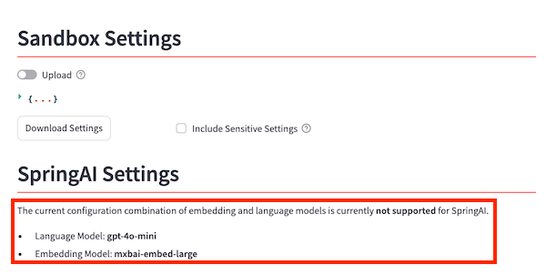
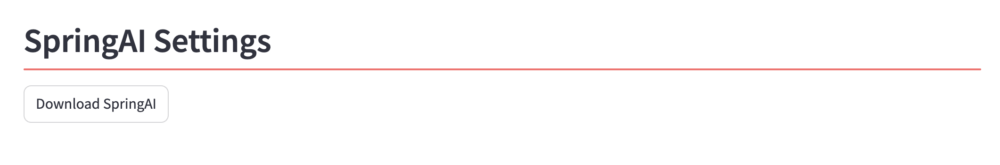
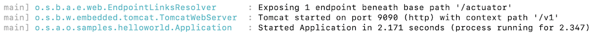

# (Optional) Generating Microservice Code

## Introduction

The AI Optimizer allows you to export the configured chatbot as a ready-to-run microservice built using Java, Spring Boot and the Spring AI framework. This microservice runs independently from the AI Optimizer, relying solely on the created vector store table and the selected LLM servers.

In the current release, only fully self-contained Ollama configurations (embedding + chat model) or OpenAI-based configurations are supported.

Estimated Time: 10 minutes

### Objectives

In this lab, you will:

* Export a RAG configuration as a *SpringAI* microservice
* Start the Springboot microservice
* Test the RAG-based microservice

### Prerequisites

To run the microservice exported you need:

* JDK 21.x
* Apache Maven 3.8.x
* curl command

## Task 1: Export the SpringAI Microservice (Ollama version)

1. navigate to the *Chat* tab, select **llama3.1** as the **Chat model** and choose **TEST1** as the vector store alias:

  

  This configuration will use the Ollama LLM server provider for both the embedding model and the chat model.

1. navigate to the *Settings* tab from the left side menu. Here, you should find the *Download SpringAI* button available.

  If you see a message like this:

  

  don't worry — simply select **llama3.1** as the Chat model, and the button will appear.

1. Click the `Download SpringAI` button to export the Ollama-based microservice:

  

## Task 2: Start the SpringAI microservice

If you have completed *Task 1* from this lab, you should have downloaded a *spring_ai.zip* file. Follow these steps to start it:

* Unzip the file in a subdirectory

* Open a terminal window, navigate to the subdirectory, and set executable permissions on `start.sh` using the command: `chmod 755 ./start.sh`.

* Now start the microservice with:

    ```bash
    <copy>
    ./start.sh
    </copy>
    ```

  If the Spring Boot application starts successfully, you should see something like this in your terminal logs

  

Now you are all set for testing the microservice!

## Task 3: Test the Microservice

The microservice you just started exposes a web service that accepts HTTP GET requests at:

* `http://localhost:9090/v1/chat/completions` — to use RAG via the OpenAI-compatible REST API.
* `http://localhost:9090/v1/service/llm` — to chat directly with the underlying LLM.
* `http://localhost:9090/v1/service/search/`— to search for documents similar to the message provided.

To test it, run a curl command like this in a new terminal:

  ```bash
  <copy>
  curl -N http://localhost:9090/v1/chat/completions \
  -H "Content-Type: application/json" \
  -H "Authorization: Bearer your_api_key" \
  -d '{
    "model": "server",
    "messages": [{"role": "user", "content": "In Oracle Database 23ai, how do I determine the accuracy of my vector indexes?"}],
    "stream": false
  }'
  </copy>
  ```

The response using RAG with the TEST1 vector store will look like this:

  ``` json
  {"id":"chatcmpl-iHfRbDEYySEuGLESa8faQKZbcpVQ","object":"chat.completion","created":"1746805121","model":"llama3.1",
  
  "choices":[{"message":{"role":"assistant","content":"According to the documentation, you can determine the accuracy of your vector indexes using the following methods:\n\n1. Use the `DBMS_VECTOR.INDEX_ACCURACY_QUERY` function to verify the accuracy of a vector index for a given query vector, top-K, and target accuracy.\n2. Use the `DBMS_VECTOR.INDEX_ACCURACY_REPORT` function to capture from your past workloads, accuracy values achieved by approximate searches using a particular vector index for a certain period of time.\n\nAdditionally, you can use the `GET_INDEX_STATUS` procedure to get information about the current status of a vector index, such as its stage and percentage completion."},
  
  "index":0,"finish_reason":null}]}
  ```

You can see how the microservice retrieves relevant context from the vector store, producing an answer similar to the one previously obtained using the RAG functionality within the AI Optimizer.

You can also send a curl request without leveraging RAG:

```bash
<copy>
curl --get --data-urlencode 'message=In Oracle Database 23ai, how do I determine the accuracy of my vector indexes?' localhost:9090/v1/service/llm 
</copy>
```

and it will produce an ungrounded answer like this:

```json
{"completion":"There is no such thing as \"Oracle Database 23ai\". The current version of Oracle Database is Oracle Database 21c and Oracle Database 22c.\n\nHowever, if you're using a recent version of Oracle Database (18c or later), you can use the `DBMS_VECTOR_INDEX_STATS` package to gather statistics about your vector indexes. This package provides functions to retrieve information about the accuracy of the vector index, such as:\n\n* `GET_BUCKETS_ACCURACY`: Returns the number of buckets that have an accuracy greater than or equal to a specified threshold.\n* `GET_INVERTED_LIST_ACCURACY`: Returns the accuracy of the inverted list for each bucket.\n\nTo use these functions, you'll need to create a vector index on your table and gather statistics about it using the following steps:\n\n1. Create a vector index on your table:\n```sql\nCREATE INDEX my_vector_index ON my_table (my_column) VECTORIZED;\n```\n2. Gather statistics about the vector index:\n```sql\nBEGIN\n  DBMS_VECTOR_INDEX_STATS.GATHER_TABLE_STATS('MY_SCHEMA', 'MY_TABLE');\nEND;\n```\n3. Use the `DBMS_VECTOR_INDEX_STATS` package to retrieve information about the accuracy of the vector index:\n```sql\nSELECT GET_BUCKETS_ACCURACY(my_vector_index, 0.5) FROM DUAL; \n-- Returns the number of buckets with an accuracy greater than or equal to 0.5\n```\nPlease note that this is a simplified example and you may need to adjust the syntax depending on your specific use case.\n\nAlso, keep in mind that vector indexes are a feature introduced in Oracle Database 18c, so if you're using an earlier version of Oracle, you won't have access to these features."}
```

You can see that the answer is very generic compared to the RAG-enhanced one.

## Task 4 (Optional): Execute the OpenAI variant

> **NOTE**: You can perform this task only if you have access to [OpenAI APIs](https://platform.openai.com/settings/organization/api-keys).

Proceed as in the previous step, selecting **TEST2** as the vector store alias and **gpt-4o-mini** as the **Chat model**. In the terminal where you run the Spring Boot microservice, make sure that your **OPENAI API KEY** is correctly set as environment variable.

You may now **proceed to the next lab**.

## Acknowledgements

* **Author** - Lorenzo De Marchis, Developer Evangelist, May 2025
* **Contributors** - Mark Nelson, John Lathouwers, Corrado De Bari, Jorge Ortiz Fuentes, Andy Tael
* **Last Updated By** - Andy Tael, July 2025
