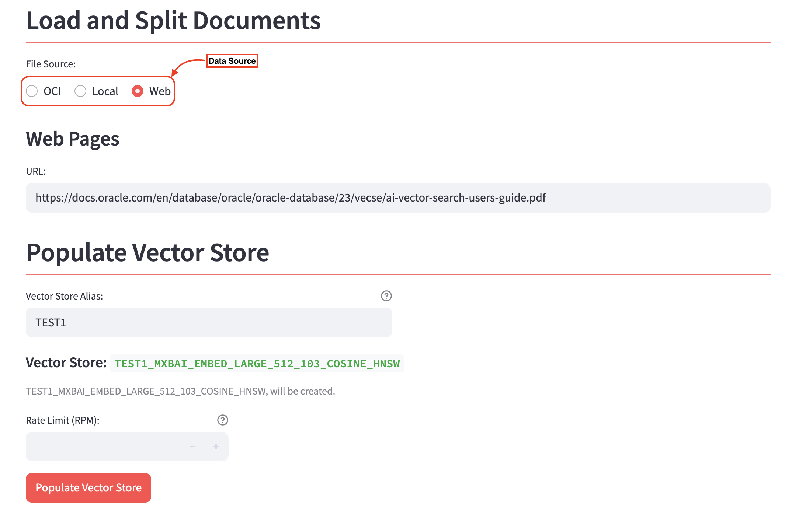
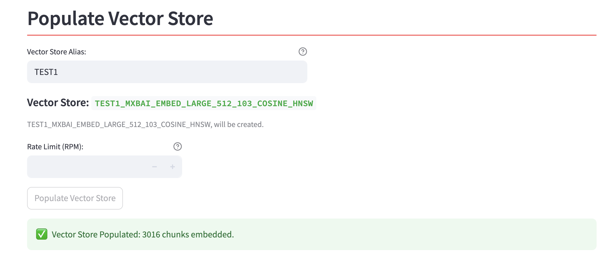
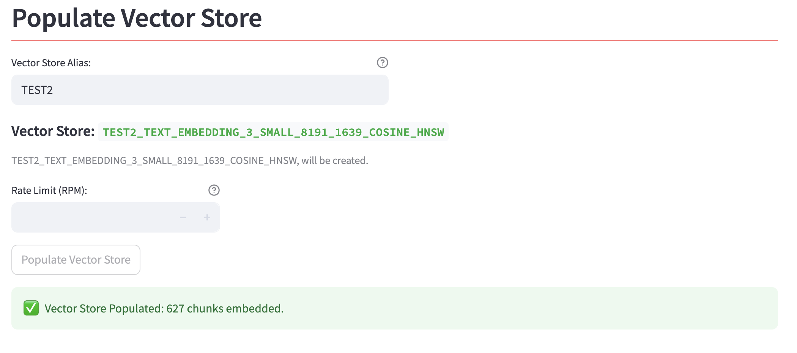
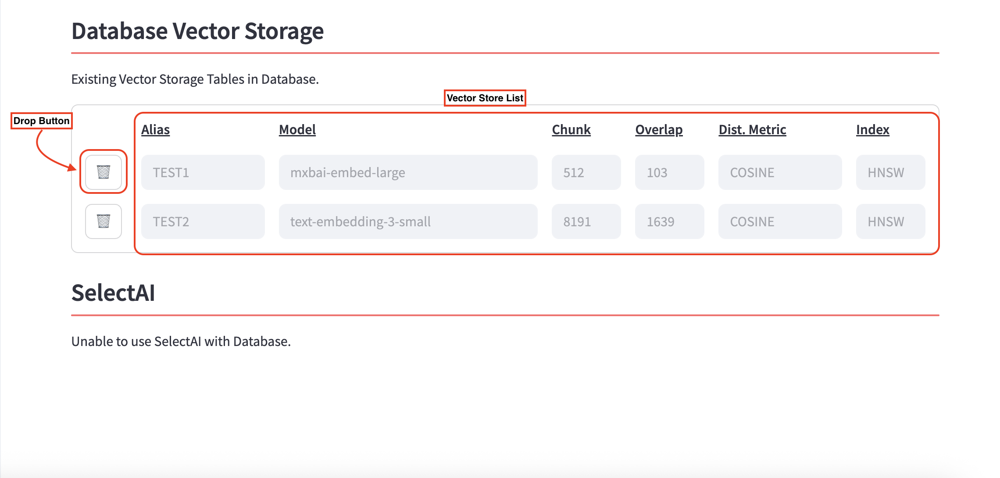

# Prepare the Vector Store

## Introduction

In this lab, we will perform a first vector store ingestion to test that it works. We will split & embed one document and store its vector embeddings inside the Oracle 23ai Database set up earlier. We will then be able to inspect the content of the tables that will be created.

Estimated Lab Time: 15 minutes

### Objectives

In this lab, you will:

* Split/Embed Documents and create a vector store
* Inspect the Vector Database content

### Prerequisites

This lab assumes you have:

* All previous labs successfully completed

## Task 1: Split/Embed Documents

In the *Split/Embed* tab, the framework allows you to upload various types of documents and transform their content into vector embeddings in a format that is interpretable by LLMs.

1. Navigate to the *Split/Embed* tab

  

1. Choose the embedding model and its parameters

  Here, you can choose from the embedding models you selected during the configuration phase we had in Lab 1 using a drop-down menu.
  For this example, choose **mxbai-embed-large**.

  The **chunk size** defines the length of each segment into which the document will be split, while the **chunk overlap** represents the percentage of overlap between consecutive chunks relative to the chunk size.

  Additionally, you can select different distance metrics and index types to experiment with various vector representations of the same document, allowing you to identify the configuration that best meets your needs.

1. Select your document source

  Once the embedding model has been selected, scroll down to the *Load and Split Documents* section to upload the document you wish to store in your **Oracle Database 23ai**.

  

  You can choose from three different file sources:

    * **OCI**: Navigate through your tenancy to select documents from the Object Storage. Ensure that your OCI credentials are properly configured in advance.
    * **Local**: Upload a document directly from your local environment.
    * **Web**: Import a document from a publicly accessible web URL.

  In this example, we will embed a document from the web, available at [this link](https://docs.oracle.com/en/database/oracle/oracle-database/23/vecse/ai-vector-search-users-guide.pdf). We will give the alias ***TEST1*** to this vector store.

1. Populate the Vector Store.

  After selecting your document source, you can click on the **Populate Vector Store** button and start the embedding process.

  Once the process is complete, a green confirmation prompt will appear, indicating the number of chunks that have been generated and successfully stored in the database.

  

  This means that 3016 vectors representations of the information from the input document have been created and stored.

## Task 2: Inspect the Vector DB

Now that you've embedded your document, you can query the content of the Vector Store. In the Cloud tenancy that has been created, open the hamburger menu on the upper left side and navigate to *Oracle Database*:


1. Click on *Autonomous Database* and you will get prompted with the Autonomous Database that you are using within the Optimizer. Click on it and you will get redirected to the Admin page of the Autonomous Database.

  

1. Click on the *Database Action* dropdown menu and press the *SQL* button. A new window will be opened and you be redirected to the SQL playground. Run this query:

    ```sql
    select * from ADMIN.TEST1_MXBAI_EMBED_LARGE_512_103_COSINE_HNSW;
    ```

  And you will then retrieve the rows from the newly created table.

  

What you see in the image above are chunks of text from the input document, which have been transformed into vector format and stored in the Oracle database. Essentially, you’ve replicated the knowledge contained in the document within your database!

## (Optional) Task 3: Create a different Vector Store

> **NOTE**: You can perform this task only if you have access to [OpenAI APIs](https://platform.openai.com/settings/organization/api-keys).

By following the sames steps from Task 1, you can create another vector store using the same document but with a different embedding model, **text-embedding-3-small** from the OpenAI models. Give the alias ***TEST2*** to this vector store.

In this case, you will get a smaller number of chunks, since the model supports a chunk size of 8191 instead of the 512 given by *mxbai-embed-large*:



## Learn More

* (optional) See the list of vector stores:

  You can navigate to the *Database* tab in the navigation menu to see the list of all the vector stores that have been created. If needed, you can easily delete them with a single click.

  

You may now **proceed to the next lab**.

## Acknowledgements

* **Author** - Lorenzo De Marchis, Developer Evangelist, May 2025
* **Contributors** - Mark Nelson, John Lathouwers, Corrado De Bari, Jorge Ortiz Fuentes, Andy Tael
* **Last Updated By** - Andy Tael, July 2025
