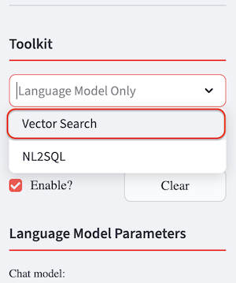
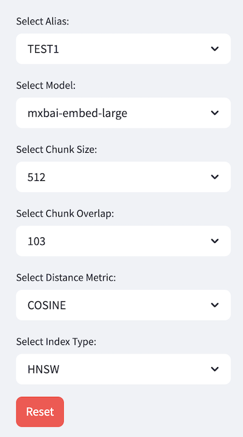
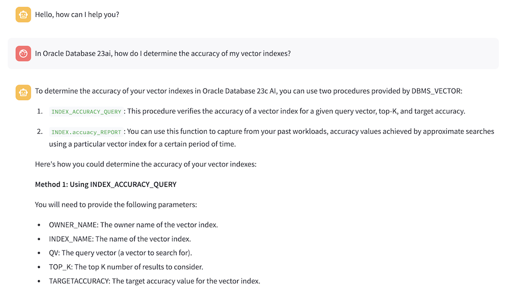
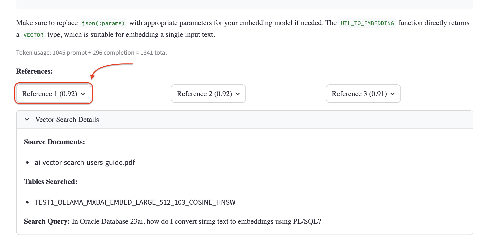
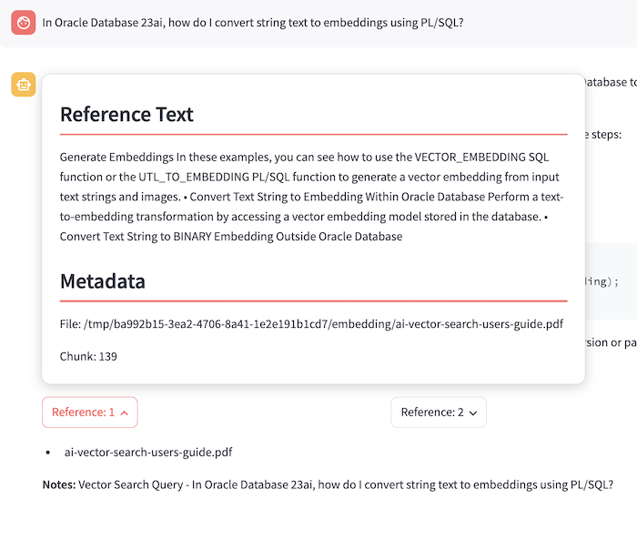

# Using Retrieval Augmented Generation

## Introduction

Now that you’ve created the vector stores, you can begin testing the knowledge base built in *Lab 2*. In this Lab, you will test the knowledge stored in the `TEST1` vector store, which serves as an example of an augmented LLM based on publicly available sources.

> **NOTE**: The answers received by any LLM are based on probabilistic models. Therefore, the answer received in your own testing might differ from the ones shown in this documentation.

Estimated Time: 5 minutes

### Objectives

In this lab, you will:

* Enable the RAG functionality in the *Chat* window
* Ask questions and receive answers enhanced by relevant context stored in the vector database
* Compare results across different configurations

### Prerequisites

This lab assumes you have:

* All previous labs successfully completed

## Task 1: Enable RAG

To enable the *RAG* functionality, follow these steps:

1. Navigate to the *ChatBot* tab from the left-side menu

1. Select the **Vector Search** option from the **Toolkit** section and then select **llama3.1** as the chat model.

  

1. In the **Select Alias** dropdown, choose the `TEST1` vector store table. The remaining fields in the **Vector Store** will be automatically populated, as each one represents a search parameter used to configure the selected vector store.

  

  In this case, selecting the alias is sufficient to retrieve the correct store. However, you also get visibility into the parameters that were used to create the chunks and their corresponding embedding vectors.

## Task 2: Ask questions with RAG enabled

Now that RAG is enabled, we can test it by asking the same questions submitted in *Lab 1*. Previously, the LLM provided generic answers, as the content was either not part of its training data or not sufficiently addressed in the questions.

For this guided experiment, perform the following:

1. Ask the ChatBot:

```text
<copy>
In Oracle Database 23ai, how do I determine the accuracy of my vector indexes?
</copy>
```



```text
<copy>
In Oracle Database 23ai, how do I convert string text to embeddings using PL/SQL?
</copy>
```



You can see how the answers differ from the ones we received earlier. The responses should be different and include references to DBMS_VECTOR and links to the embedded documentation where this information can be found.

You can also click on one of the *Reference* buttons, to see where the information was retrieved from in the file:



## (Optional) Task 3: Repeat Task 2 using OpenAI models

> **NOTE**: You can perform this task only if you have access to [OpenAI APIs](https://platform.openai.com/settings/organization/api-keys).

As an additional learning exercise, you can repeat the tests performed in Task 2 of this lab using OpenAI LLMs and vector stores:

* Select `TEST2` as the vector store to run the questions against
* Choose **gpt-4o-mini** from the **Chat model** dropdown menu to have the same LLM provider.

afterwards, compare the results to what you got while using *llama3.1*!

## Learn More

You can learn more about RAG by playing with more parameters and prompt techniques:

* Play with the *Temperature* parameter to discover how much the answers provided get enriched.
* Follow up a question with another one asking for “more” to see that the chat history is taken into account when generating a new response.

You may now **proceed to the next lab**.

## Acknowledgements

* **Author** - Lorenzo De Marchis, Developer Evangelist, May 2025
* **Contributors** - Mark Nelson, John Lathouwers, Corrado De Bari, Jorge Ortiz Fuentes, Andy Tael
* **Last Updated By** - Andy Tael, July 2025
