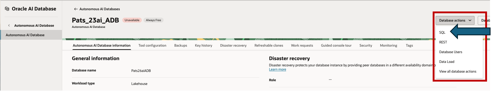
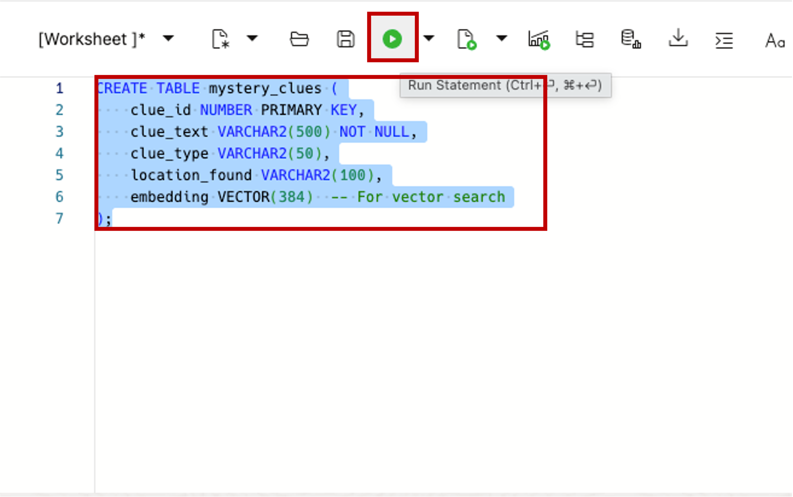
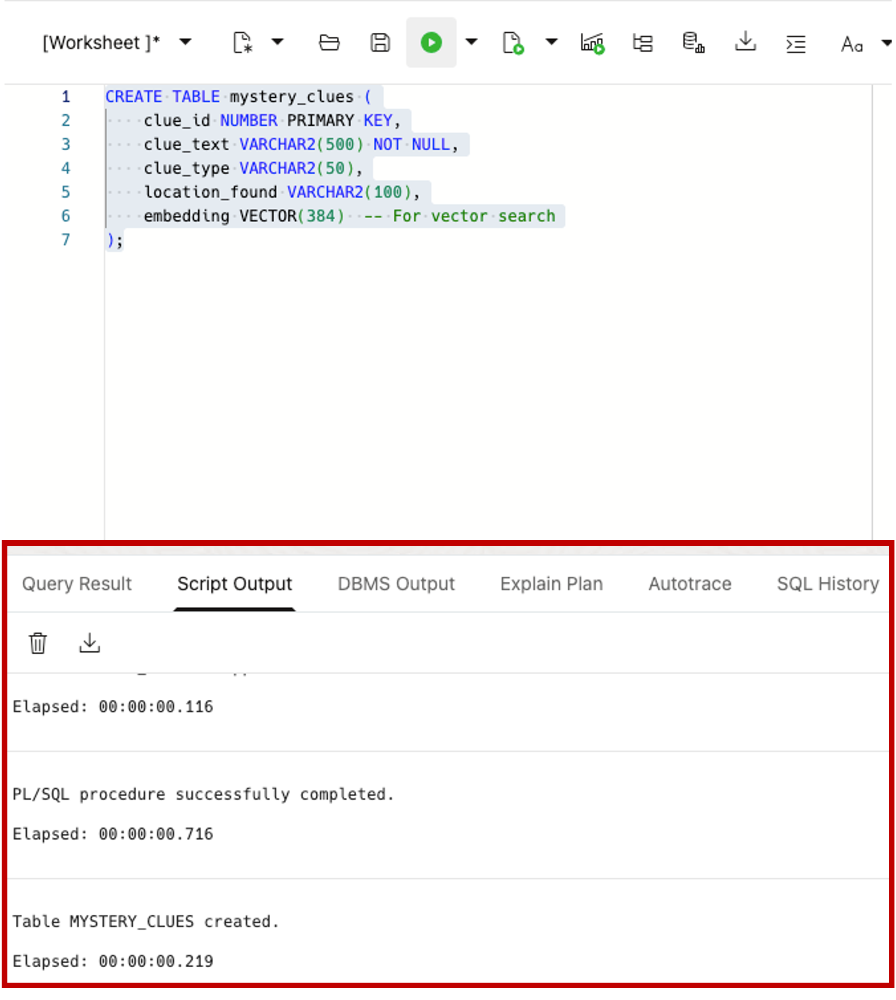
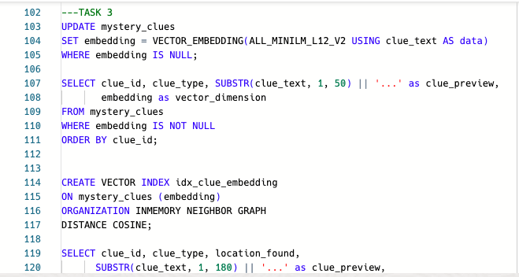

# Setting Up the Database and Clue Table

## Introduction

In this lab, you'll create a simple database and table to store our mystery clues. This gives us a place to keep all the evidence organized.

Estimated Lab Time: 15 minutes

### About Autonomous AI Database
Oracle Autonomous AI Database which includes powerful AI features like AI Vector Search which can find meaningful connections between pieces of information, even when they use different words.

### Objectives

In this lab, you will:
* Create an Autonomous AI Database
* Create a table
* Insert into the table
* Query the table

## Task 1: Create Your Database

1. Go to Oracle Cloud Console and navigate to **Autonomous Database**
2. Click **Create Autonomous Database**
3. Use these settings:
   - **Display name**: `PumpkinMysteryDB`
   - **Database name**: `pumpkin`
   - **Workload type**: Transaction Processing
   - **Deployment**: Shared Infrastructure
   - **Always Free**: Check if you want free tier
4. Set a strong password for the ADMIN user
5. Click **Create** and wait for it to finish (5-10 minutes)


## Task 2: Create the Clues Table

For all of the tasks in this lab you will be entering SQL code into SQL Developer Web and running those SQL statement. 

Open the SQL Developer Web tool from your Autonomous AI Database's Database Actions dropdown:



You will be copying the supplied code from the lab and pasting it into the SQL worksheet:


To run the SQL, highlight only the pasted code and click the green "Run statement" button:


The output will be visible down below:


Pro Tip: you can keep a running list of SQL you have entered. Just remember to highlight the statement you want to run before clicking the green "Run statement" button:


<span style="color: red;">**Note:** if you ever find yourself wanting to start over, here are commands to run to reset the database back to the instructions before you create your mystery_clues table. Do not run these now, but only when you want to start over:</span>

```sql
<copy>
DELETE FROM mystery_clues;
DROP INDEX idx_clue_embedding;
DROP TABLE mystery_clues CASCADE CONSTRAINTS PURGE;
EXEC DBMS_VECTOR.DROP_ONNX_MODEL(model_name => 'ALL_MINILM_L12_V2');
</copy>
```

OK - lets create a simple table to store our mystery clues:

```sql
<copy>
CREATE TABLE mystery_clues (
    clue_id NUMBER PRIMARY KEY,
    clue_text VARCHAR2(500) NOT NULL,
    clue_type VARCHAR2(50),
    location_found VARCHAR2(100),
    embedding VECTOR(384)  -- For AI Vector Search
);
</copy>
```

This table stores:
- `clue_id`: A number to identify each clue
- `clue_text`: The actual clue description
- `clue_type`: What kind of clue it is
- `location_found`: Where the clue was discovered
- `embedding`: Special column for AI search (we'll fill this later)

## Task 3: Add the Mystery Clues

Let's add 10 simple clues about the museum theft:

```sql
<copy>
INSERT INTO mystery_clues (clue_id, clue_type, location_found, clue_text)
VALUES (1, 'Witness Report', 'Main Gallery', 
        'Strange glowing lights formed intricate patterns in the air above the gallery, creating an eerie atmosphere');

INSERT INTO mystery_clues (clue_id, clue_type, location_found, clue_text)
VALUES (2, 'Physical Evidence', 'Study Room', 
        'German chemistry textbooks left open to pages about phosphorescent compounds and luminescent substances');

INSERT INTO mystery_clues (clue_id, clue_type, location_found, clue_text)
VALUES (3, 'Witness Report', 'Museum Corridor', 
        'Someone was heard discussing "family legacy" and "rightful inheritance" near the vault');

INSERT INTO mystery_clues (clue_id, clue_type, location_found, clue_text)
VALUES (4, 'Physical Evidence', 'Street Outside', 
        'Luminescent paint residue was found on the cobblestones outside the museum');

INSERT INTO mystery_clues (clue_id, clue_type, location_found, clue_text)
VALUES (5, 'Technical Evidence', 'Security Panel', 
        'The vault alarm system was disabled using a timing device with unusual symbols etched into its casing');

INSERT INTO mystery_clues (clue_id, clue_type, location_found, clue_text)
VALUES (6, 'Witness Report', 'Near Museum', 
        'Strange glowing patterns resembling chemical formulas were seen dancing in the fog outside');

INSERT INTO mystery_clues (clue_id, clue_type, location_found, clue_text)
VALUES (7, 'Witness Report', 'Near Vault', 
        'A foreign accent was heard whispering about hydrogen secrets near the vault entrance');

INSERT INTO mystery_clues (clue_id, clue_type, location_found, clue_text)
VALUES (8, 'Physical Evidence', 'Near Museum', 
        'Professional stage equipment found abandoned near the scene, including portable lighting rigs and theatrical props');

INSERT INTO mystery_clues (clue_id, clue_type, location_found, clue_text)
VALUES (9, 'Physical Evidence', 'Vault Entrance', 
        'Test tubes with glowing residue found near the vault entrance, suggesting chemistry expertise');

INSERT INTO mystery_clues (clue_id, clue_type, location_found, clue_text)
VALUES (10, 'Physical Evidence', 'Vault Entrance', 
        'Footprints in the dust that suddenly vanish at the vault door, suggesting theatrical trickery');

COMMIT;

</copy>
```

## Task 4: Check Your Data

Verify the clues were added correctly:

```sql
<copy>
SELECT clue_id, clue_text, clue_type
FROM mystery_clues
ORDER BY clue_id;
</copy>
```

You should see all 10 clues listed.

## Acknowledgements
* **Author** - <Name> Pat Shepherd, Senior Principal Database Product Manager
* **Last Updated By/Date** - <Name, Month Year> Pat Shepherd, October 2025
