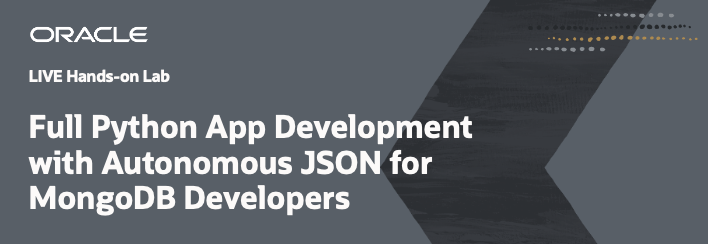

# MongoDB Developers Full Python App Development with Autonomous JSON

## Introduction

This workshop has four parts:

- Infrastructure Configuration
- Python SODA micro-service with Autonomous Database for JSON
- Python micro-service with Oracle Autonomous and MongoDB
- Python micro-service with the new MongoAPI capability

**Estimated Workshop Time: 120 minutes.**

## Objectives

In this lab, you will:

* Create development environment on Oracle Cloud Infrastructure
* Deploy a document store with one collection on Oracle Autonomous Database for JSON
* Develop a simple Python web service to manage JSON documents via REST calls
* Use APEX to visualize document store in a very fast way
* Use multi-cloud support to your Python web service to support MongoDB
* Compare and understand the differences between Oracle SODA with MongoDB API and Oracle MongoAPI capability
* Use MongoAPI capability for micro-service Python application

## Prerequisites

* An Oracle Free Tier, Always Free, Paid or LiveLabs Cloud Account - You can check Getting Started section for more information.
* MongoDB Cloud account (or Google account)
* Deploy Atlas document store on MongoDB Cloud before the workshop

Here is a video to help with the Oracle Trial Sign Up Process:

We are providing a basic reference to create a Mongo DB account, we are not pretending to be MongoDB experts or provide MongoDB best practices. We are using MongoDB account as user for the workshop purpose not experts level on the matter. If you need support on this process, contact your MongoDB support contact.

Here you have a [Prerequisites document](https://objectstorage.eu-frankfurt-1.oraclecloud.com/p/8mPUcFqASM0awq5qKFU9mD6occf83Z5vxeOrWC38CEU2nC-15wusaIY6aCehDVW6/n/fruktknlrefu/b/workshop-ajson-mongodb/o/MongoDB%20Developers%20Full%20Python%20App%20Development%20with%20Autonomous%20JSON%20-%20Prerequisites.pdf) where you can find support to crete the Oracle Cloud account and MongoDB account.

*At this point, you are ready to start learning! Please proceed.*

## Acknowledgements
* **Author** - Valentin Leonard Tabacaru, Database Product Management and Priscila Iruela, Technology Product Strategy Director
* **Contributors** - Victor Martin Alvarez, Technology Product Strategy Director
* **Last Updated By/Date** - Priscila Iruela, June 2022

## Need Help?
Please submit feedback or ask for help using our [LiveLabs Support Forum](https://community.oracle.com/tech/developers/categories/livelabsdiscussions). Please click the **Log In** button and login using your Oracle Account. Click the **Ask A Question** button to the left to start a *New Discussion* or *Ask a Question*.  Please include your workshop name and lab name.  You can also include screenshots and attach files.  Engage directly with the author of the workshop.

If you do not have an Oracle Account, click [here](https://profile.oracle.com/myprofile/account/create-account.jspx) to create one.