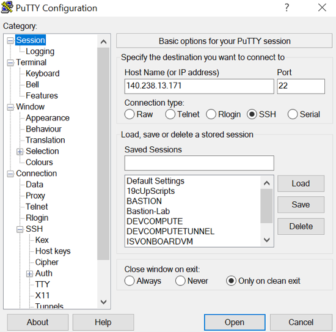
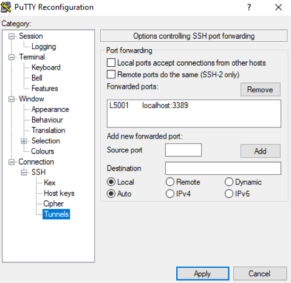

# SODA for Python Workshop Environment Preparation

## Introduction

SODA for Python is a Python API that implements Simple Oracle Document Access (SODA). It is part of the Oracle Python driver, cx_Oracle — no additional installation is needed.

You can use SODA for Python to perform create, read (retrieve), update, and delete (CRUD) operations on documents of any kind, and you can use it to query JSON documents.

SODA is a set of NoSQL-style APIs that let you create and store collections of documents (in particular JSON) in Oracle Database, retrieve them, and query them, without needing to know Structured Query Language (SQL) or how the documents are stored in the database.

Estimated Lab Time: 60 minutes

### Objectives
In this lab, you will:
* Verify cloud network configuration
* Create compute resources on Oracle Cloud
* Prepare cloud infrastructure for development
* Provision Oracle Autonomous JSON Database
* Create MongoDB document store on MongoDB Cloud

Watch the video below to see how to prepare your development environment for Python and SODA.

[](youtube:AdnmMDB8NF8)

### Prerequisites
* SSH Keys for Putty or OpenSSH (`id_rsa.ppk` or `id_rsa`, and `id_rsa.pub`)
    * SSH Keys can be obtained when the compute node is created (OpenSSH)


## Task 1: Verify Virtual Cloud Network (VCN)

1. Login to Oracle cloud console using the Workshop Details received:

    - Login URL 	
    - Tenancy name
    - Region
    - User name
    - Initial password
    - Compartment 

2. Click on main menu ≡, then Networking > **Virtual Cloud Networks**. Select the Region and Compartment assigned in Workshop Details. 

3. Click the name of the Virtual Cloud Network (VCN).

4. Under Subnets, click the name of the public subnet.

5. Under Security Lists, click the name of the existing security list. 

6. Review the Ingress Rules and Egress Rules defined in this security list.


## Task 2: Provision Compute Node for development

1. Click on main menu ≡, then Compute > **Instances**. Click **Create Instance**.

    - Name: ClientVM
    - Image or operating system: Change Image > Image source: Platform Images > **Oracle Autonomous Linux**, OS version: **7.9** (type 'linux' in the search box)
    - Shape: Change Shape > Intel: VM.Standard2.1
    - Virtual cloud network: existing VCN (default)
    - Subnet: Public Subnet (default)
    - Assign a public IP address (default)
    - Generate a key pair for me, and download both private and public keys. Or click Add SSH keys: Choose SSH key files > `id_rsa.pub`

2. Click **Create**. Wait for Compute Instance to finish provisioning, and have status Available. On the Instance Details page, copy Public IP Address in your notes.

3. Connect to the Compute node using SSH. In OpenSSH, local port forwarding is configured using the -L option. Use this option to forward any connection to port 3389 on the local machine to port 3389 on your Compute node. (Mac/Linux only)

    ````
    <copy>
    ssh -C -i id_rsa -L 3389:localhost:3389 opc@[ClientVM Public IP Address]
    </copy>
    ````

4. Connect to the Compute node using SSH Connection From a Windows Client. Connect to Compute Public IP Address port 22. (Windows only)

    

5. Use the `id_rsa.ppk` private key. (Windows only)

    

6. Create a SSH tunnel from Source port 5001 to Destination localhost:3389. Click **Add**. (Windows only)

    

7. Go back to Session, give it a name, and save it. When asked if you trust this host, click **Yes**. (Windows only)

    


## Task 3: Configure Compute Node for development

For some of the labs we need graphical user interface, and this can be achieved using a Remote Desktop connection.

1. Use the substitute user command to start a session as **root** user.

    ````
    <copy>
    sudo su -
    </copy>
    ````

2. Create a new script that will install and configure all the components required for the Remote Desktop connection.

    ````
    <copy>
    vi xRDP_config.sh
    </copy>
    ````

3. Press **i** to insert text, and paste the following lines:

    ````
    <copy>
    #!/bin/bash
    
    yum -y install oracle-release-el7
    yum-config-manager --enable ol7_developer_EPEL
    
    yum -y install oracle-instantclient19.13-basic.x86_64 oracle-instantclient19.13-devel.x86_64 oracle-instantclient19.13-jdbc.x86_64 oracle-instantclient19.13-odbc.x86_64 oracle-instantclient19.13-sqlplus.x86_64 oracle-instantclient19.13-tools.x86_64
    
    adduser oracle
    groupadd oinstall
    usermod -g oinstall -G oracle oracle

    yum -y groupinstall "Server with GUI"

    yum -y install xrdp tigervnc-server terminus-fonts terminus-fonts-console cabextract

    wget --no-check-certificate https://downloads.sourceforge.net/project/mscorefonts2/rpms/msttcore-fonts-installer-2.6-1.noarch.rpm
    yum -y localinstall msttcore-fonts-installer-2.6-1.noarch.rpm

    yum -y update sqldeveloper.noarch

    sed -i 's/max_bpp=24/max_bpp=128\nuse_compression=yes/g' /etc/xrdp/xrdp.ini

    systemctl enable xrdp

    firewall-cmd --permanent --add-port=3389/tcp
    firewall-cmd --permanent --add-port=5000/tcp
    firewall-cmd --reload

    chcon --type=bin_t /usr/sbin/xrdp
    chcon --type=bin_t /usr/sbin/xrdp-sesman

    systemctl start xrdp

    echo -e "DBlearnPTS#21_\nDBlearnPTS#21_" | passwd oracle

    printf "\nORACLE_HOME=/usr/lib/oracle/19.13/client64\nLD_LIBRARY_PATH=/usr/lib/oracle/19.13/client64/lib\nPATH=\$PATH:/usr/lib/oracle/19.13/client64/bin\nexport ORACLE_HOME LD_LIBRARY_PATH PATH\n" >> /etc/profile
    </copy>
    ````

4. Press **Esc**, type **:wq** and hit **Enter** to save the file and close. Make this script executable.

    ````
    <copy>
    chmod u+x xRDP_config.sh 
    </copy>
    ````

5. Run the script and check that all goes well.

    ````
    <copy>
    ./xRDP_config.sh
    </copy>
    ````

6. Close session as **root** user.

    ````
    <copy>
    exit
    </copy>
    ````

7. Use Microsoft Remote Desktop to open a connection to **localhost**. (Mac/Linux only)

8. If you are using Putty on Windows, connect to **localhost:5001**. (Windows only)

    

9. When asked about username and password, use **oracle** and **DBlearnPTS#21_**.

10. After setting your language and keyboard layout, open a Terminal window using **Right-Click** and **Open Terminal**. 

11. Check if your keyboard works. If you need to select another keyboard layout, click the **On-Off** button in the upper right corner, and **Settings** button. You will find the options under Region & Language.

## Task 4: Provision Oracle Autonomous JSON Database (AJD)

1. Click on main menu ≡, then Oracle Database > **Autonomous JSON Database**. **Create Autonomous Database**.

    - Select a compartment: [Your Compartment]
    - Display name: WS-AJD
    - Database name: WSAJD
    - Choose a workload type: JSON
    - Choose a deployment type: Shared Infrastructure
    - Choose database version: 19c
    - OCPU count: 1
    - Storage (TB): 1
    - Auto scaling: enabled

2. Under Create administrator credentials:

    - Password: DBlearnPTS#21_

3. Under Choose network access:

    - Access Type: Allow secure access from everywhere

4. Click **Create Autonomous Database**. Wait for Lifecycle State to become Available.

5. On Tools tab, under Oracle Application Express, click **Open APEX**. On Administration Services login page, use password for ADMIN.

    - Password: DBlearnPTS#21_

6. Click **Sing In to Administration**. Click **Create Workspace**. Use these values:

    - Database User: DEMO
    - Password: DBlearnPTS#21_
    - Workspace Name: DEMO

7. Click AD on upper right corner, **Sign out**. Click **Return to Sign In Page**.

    - Workspace: demo
    - Username: demo
    - Pasword: DBlearnPTS#21_

8. Click **Sign In**. Oracle APEX uses low-code development to let you build data-driven apps quickly without having to learn complex web technologies. This also gives you access to Oracle REST Data Services, that allows developers to readily expose and/or consume RESTful Web Services by defining REST end points.

9. On Oracle Cloud Infrastructure Console, on Tools tab, under Database Actions, click **Open Database Actions**.

10. Use ADMIN user credentials to login.

    - Username: admin
    - Password: DBlearnPTS#21_

11. Click Development > SQL, and run the following code:

    ````
    <copy>
    BEGIN 
       ords_admin.enable_schema (
          p_enabled => TRUE,
          p_schema => 'DEMO',
          p_url_mapping_type => 'BASE_PATH',
          p_url_mapping_pattern => 'demo',
          p_auto_rest_auth => NULL
       ) ;
      commit ;
    END ; 
    /
    </copy>
    ````

    >**Note** : For all code you run in SQL Developer Web, make sure you receive a success message:

    ````
    PL/SQL procedure successfully completed.
    ````

12. Grant **SODA_APP** to DEMO user. This role provides privileges to use the SODA APIs, in particular, to create, drop, and list document collections.

    ````
    <copy>
    GRANT SODA_APP TO demo;
    </copy>
    ````

13. Click **ADMIN** upper right corner, and **Sign Out**. 

14. Click **Sign In**. Login using DEMO user credentials.

    - Username: demo
    - Password: DBlearnPTS#21_


## Task 5: Deploy Atlas document store on MongoDB Cloud

One of the objectives of this workshop is to show the integration of Oracle Autonomous JSON Database with existing document stores like MongoDB. This is why you need an existing MongoDB database, and if you don't have one, you can provision it quickly on MondoDB Cloud.

1. Access MongoDB Cloud at [https://cloud.mongodb.com](https://cloud.mongodb.com), and create an account. You can login using your Google account.

2. Click Build a Database. Select the Free option, choose a Cloud Provider and Region. Create the new Cluster using the default settings.

3. Once your Cluster is up and running, on the overview page, click Connect.

4. Click Add a Different IP Address, and use the Public IP address of your ClientVM Compute Node. To add more or change this IP address, go to Security > Network Access on the left side menu.

5. Create a Database User: mongoUser/DBlearnPTS#21_. To add more or change this user, click Security > Database Access on the left side menu.

6. Save the username and the password in your notes.

7. Click Connect Your Application: Python 3.6 or later. You will receive a connection string like this:

    ````
    mongodb+srv://mongoUser:[password]@[cluster_name].[domain].mongodb.net/[dbname]?retryWrites=true&w=majority
    ````

8. Save this string in your notes. Replace `[password]`, `[cluster_name]`, `[dbname]` and the 5 characters `[domain]` (e.g. dsbwl) with your values.

9. Click the cluster name **Cluster0**. Under Collections, use Load a Sample Dataset wizard to generate some JSON documents for different use cases in your MongoDB database. Navigate these sample datasets and familiarize yourself with JSON documents, if this is your first experience.

10. Click Create Database, and name it SimpleDatabase, and the collection SimpleCollection. This will be used for our Python application development in the next lab.

11. On the Collections left-side menu, select SimpleDatabase > SimpleCollection. This collection is now empty.


## Acknowledgements
* **Author** - Valentin Leonard Tabacaru, PTS
* **Contributors** -  Kay Malcolm, Database Product Management
* **Last Updated By/Date** -  Valentin Leonard Tabacaru, February 2022

## Need Help?
Please submit feedback or ask for help using our [LiveLabs Support Forum](https://community.oracle.com/tech/developers/categories/livelabsdiscussions). Please click the **Log In** button and login using your Oracle Account. Click the **Ask A Question** button to the left to start a *New Discussion* or *Ask a Question*.  Please include your workshop name and lab name.  You can also include screenshots and attach files.  Engage directly with the author of the workshop.

If you do not have an Oracle Account, click [here](https://profile.oracle.com/myprofile/account/create-account.jspx) to create one.
