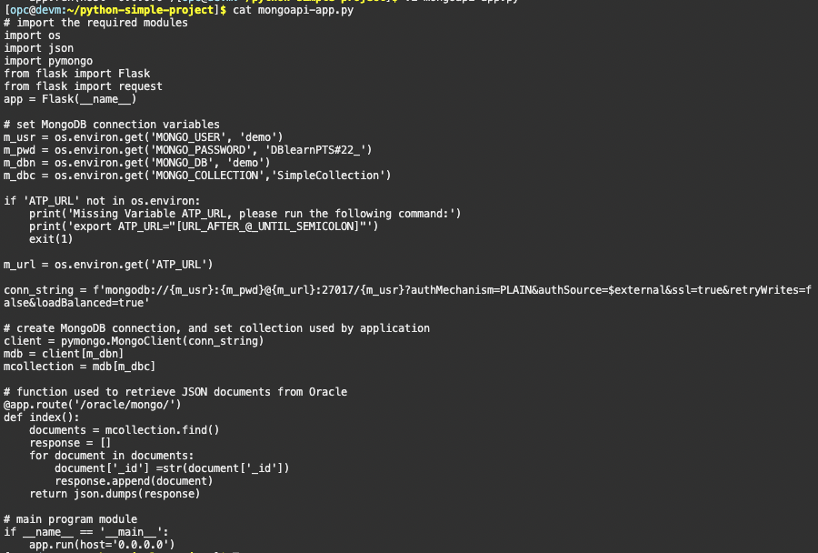
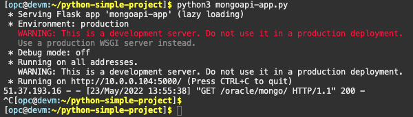

# Python micro-service with the new MongoAPI capability

## Introduction

Oracle Database API for MongoDB lets applications interact with collections of JSON documents in Oracle Database using MongoDB commands.

With the new API, developers can continue to use MongoDB's open-source tools and drivers connected to an Oracle Autonomous JSON Database while gaining access to Oracle’s multi-model capabilities and the benefits of a self-driving database. Customers can now run MongoDB workloads on Oracle Cloud Infrastructure (OCI).

Oracle Database understands Mongo-speak. That's the purpose of Oracle Database API for MongoDB.

You have one or more applications that interact with a MongoDB NoSQL database. You're used to using MongoDB commands, particularly for the business logic of your applications (query by example — QBE) but also for data definition (creating collections and indexes), data manipulation (CRUD operations), and some database administration (status information). You expect and depend on the flexibility of a JSON document store: no fixed data schemas, easy to use document-centric APIs.

On the other hand, you're looking to future-proof your applications and make them more robust. You want advanced security; fully ACID transactions (atomicity, consistency, isolation, durability); standardized, straightforward JOINs with all sorts of data; and state-of-the-art analytics, machine-learning, and reporting capabilities — all that and more, out of the box.

Oracle Database API for MongoDB, or Mongo API for short, provides all of that. It translates the MongoDB wire protocol into SQL statements that are executed by Oracle Database. This means you can continue to use the drivers, frameworks, and tools you're used to, to develop your JSON document-store applications.


To learn more about this capability go to he following content:
 - [Oracle Database API for MongoDB](https://docs.oracle.com/en/database/oracle/mongodb-api/mgapi/overview-oracle-database-api-mongodb.html#GUID-1CF44843-6294-45F0-8065-B9E8034D6CB1)
 - [Oracle Database API for MongoDB Blog from Roger Ford, Principal Product Manager] (https://blogs.oracle.com/database/post/mongodb-api)


**Estimated Lab Time: 20 minutes**.

### Objectives

In this lab, you will:

* Use MongoAPI capability for micro-service Python applicacion

### Prerequisites

* Lab 1, 2  and 3 from this content completed
* MongoDB Cloud account (or Google account)
* Deploy Atlas document store on MongoDB Cloud before the workshop (run Lab 3 Task 1)


## Task 1: Develop dual document store micro-service using MongoAPI capability

1. Access to **cloud shell** again. If you are not connected to **opc@devm**, **run** again the **ssh connections** using the **Public IP.** Replace <Public_IP> with your own one, removing < and > too. We copied the Public IP when we provisioned the compute instance few tasks back. Execute the following commands:

    ````
    <copy>
    ssh -i <private-key-file-name>.key opc@<Public_IP>
    </copy>
    ````

    

2. We will **export** the **paths** and **Access** to python-simple-project folder using the following commands:

    ````
    <copy>
    export TNS_ADMIN=/home/opc/Wallet_AJDEV
    export LD_LIBRARY_PATH=/usr/lib/oracle/21/client64/lib
    export PATH=$PATH:/usr/lib/oracle/21/client64/bin/
    cd python-simple-project
    . bin/activate
    </copy>
    ````

    

    > Note: We have run these commands before, if you are not desconnected from cloud shell, you don't have to run them again.

3. Lets have a look at **mongoapi-app.py**. In this file, we have the Python application code. Run the following command to see the code:

    ````
    <copy>
    cat mongoapi-app.py
    </copy>
    ````

    

3. For the Oracle Autonomous JSON database connection: We are using **demo** user and the **password** that we have recommended during the workshop **DBlearnPTS#22_**. The name of the Oracle Databases is **demo** too. And the Oracle schema **SimpleCollection**. We will **run** the following export commands:

    ````
    <copy>
    export MONGO_USER="demo"
    export MONGO_PASSWORD="DBlearnPTS#22_"
    export MONGO_CLUSTER="Cluster0"
    export MONGO_DB="demo"
    export MONGO_COLLECTION="SimpleCollection"
    </copy>
    ````

    > Note: If you have change the following variables to a different value, please run this commands providing the variable that you have changed. **Remember, we are using the Oracle connections under the MongoDB variables for nor editing the parameters. If you prefer, you can eddit them.  Following this method, it is cleaner for the application point of view.**
    >

    The only variable that we need to define, if you haven't changed any variable from the recomended, is **ATP_URL**. A new URL that our AJD has created after adding our IPs in Task 1 of this Lab.


4. On the Oracle Cloud Infrastructure Console, click **Database Actions** next to the big green box. Allow pop-ups from cloud.oracle.com.

    

    If you need to **Sign in** again remember doing it as admin:
    - User: **admin**
    ```
    <copy>admin</copy>
    ```
    - Password: **DBlearnPTS#22_**
    ```
    <copy>DBlearnPTS#22_</copy>
    ```

5. Under the **Related Services** section, click on **Oracle Database API for MongoDB**.

    

6. **Copy** the string: **For newer MongoDB clients and drivers use port 27017 with this connection string**.

    

    It should be something like this:

    ````
    mongodb://[user:password@]<ATP_URL_including_tenancy_id.oraclecloudapp.com>:27017[user]authMechanism=PLAIN&authSource=$external&ssl=true&retryWrites=false&loadBalanced=true
    ````

    We need to copy the URL string after your _`[user:password@]`_ and until _`:27017`_, including _`oraclecloudapps.com`_. It should be something like: _`AAA8EFD9AA64AA4-AJDEV.adb.eu-frankfurt-1.oraclecloudapps.com`_


7. We will **export** the URL using the following command:

    ````
    <copy>
    export ATP_URL="URL_FROM_ABOVE" 
    </copy>
    ````

     

8. **After checking if all variables are correct**. **Run** mongoapi-app application using the following command:

    ````
    <copy>
    python3 mongoapi-app.py
    </copy>
    ````

    

9. Use the **web browser** on your laptop to navigate to your micro-service to list JSON documents inserted into Oracle Autonomous Database using MongoAPI capability.

    http://[DEVM public-ip address]:5000/oracle/mongo/

     
    
    > This micro-service has 1 URL. We already had used previosly the Oracle one and the Mongo one. In this case we are using a new one /oracle/mongo. Here you have the others URLS too:
    >
        - http://[DEVM public-ip address]:5000/oracle/ -> for Oracle Autonomous Database
        - http://[DEVM public-ip address]:5000/mongo/ -> for MongoDB
        - http://[DEVM public-ip address]:5000/oracle/mongo/ -> for Oracle Autonomous Database using MongoAPI

10. Go to **cloud shell terminal.** We will **stop mongoapi-app.py**. for doing this, **press Control + C**.

    


## Task 2: Create a new MongoCollection through Database Actions


1. On Oracle Cloud Infrastructure Console, click **Database Actions** next to the big green box. Allow pop-ups from cloud.oracle.com. 

    

2. **Sign out** as **ADMIN**.

    

3. **Sign in** as **DEMO** user.
    
    

    - Username: **demo**
    ```
    <copy>demo</copy>
    ```
    - Password: **DBlearnPTS#22_**
    ```
    <copy>DBlearnPTS#22_</copy>
    ```

    

    You should be connected now as **DEMO** user, check it on the right top corner side of the page.

    

4. Click **Development** > **JSON**.

    

5. We are going to create a New Collection to insert data using MongoDB Compatible functionality. **Click on New Collection button** on the left side of the screen.

    

6. Type the name of the new Collection: **MongoCollection**
    ```
    <copy>MongoCollection</copy>
    ```
    
    

7. You can see the basic fields of a JSON document. **Click MongoDB Compatible** and pay attention of the new `_id` field that has been created on the JSON document. And click **Create**.

    

    > Note: Collections created from SODA do not work with MongoDB API because they don't have this `_id` field created by default, you need to select the **Compatible MongoAPI** check.

8. Now your new **MongoCollection** has been created.
    
    


## Task 3: Insert Data in the new MongoCollection using insert-mongoapi-app.py

1. Access to **cloud shell** again. If you are not connected to **opc@devm**, **run** again the **ssh connections** using the **Public IP.** Replace <Public_IP> with your own one, removing < and > too. We copied the Public IP when we provisioned the compute instance few tasks back. Execute the following commands:

    ````
    <copy>
    ssh -i <private-key-file-name>.key opc@<Public_IP>
    </copy>
    ````
    

2. We will **export** the **paths** and **Access** to python-simple-project folder using the following commands:

    ````
    <copy>
    export TNS_ADMIN=/home/opc/Wallet_AJDEV
    export LD_LIBRARY_PATH=/usr/lib/oracle/21/client64/lib
    export PATH=$PATH:/usr/lib/oracle/21/client64/bin/
    cd python-simple-project
    . bin/activate
    </copy>
    ````

    

    > Note: We have run these commands before, if you are not desconnected from cloud shell, you don't have to run them again.

3. Lets have a look at **insert-mongoapi-app.py**. In this file, we have the Python application code. Run the following command to see the code:

    ````
    <copy>
    cat insert-mongoapi-app.py
    </copy>
    ````
    
    

4. For the Oracle Autonomous JSON database connection: We are using **demo** user and the **password** that we have recommended during the workshop **DBlearnPTS#22_**. The name of the Oracle Databases is **demo** too. And the Oracle schema **MongoCollection**. We will **run** the following export commands:

    ````
    <copy>
    export MONGO_USER="demo"
    export MONGO_PASSWORD="DBlearnPTS#22_"
    export MONGO_CLUSTER="Cluster0"
    export MONGO_DB="demo"
    export MONGO_COLLECTION="MongoCollection"
    export ATP_URL="URL_FROM_ABOVE" 
    </copy>
    ````

    > Note: If you have change the following variables to a different value, please run this commands providing the variable that you have changed. **Remember, we are using the Oracle connections under the MongoDB variables for nor editing the parameters. If you prefer, you can eddit them.  Following this method, it is cleaner for the application point of view.**
    >

    > Note: Remember that we have exported **ATP_URL** on Task number 2 of this lab, so we don't need to export it again.


5. **After checking if all variables are correct**. **Run** mongoapi-app application using the following command:

    ````
    <copy>
    nohup python3 insert-mongoapi-app.py > insert-mongoapi-app.log 2>&1 & echo $! > insert-mongoapi-app.pid
    </copy>
    ````
    We are executing the insert-mongoapi-app.py with **nohup function** for keep using the terminal for the following steps.
    
    At the same time, with this command, we are **creating a insert-mongoapi-app.log** where you can check how the python app is behaving.
    
    Additionally we are **creating a file, insert-mongoapi-app.pid,** to be capable of killing the python app to keep creating the third application for today’s content.

    

6. Lets see what **insert-mongoapi-app.py is doing**, use the following command:

    ````
    <copy>
    cat insert-mongoapi-app.log
    </copy>
    ````

    

    If you followed the steps correctly, you should see this output in the cloud shell terminal. 

    **Your micro-service nsert-mongoapi-app.py is being executed** so we can start inserting the documents.

7. **Copy** the following commands to perform **POST request with CURL client**. Make sure you press **Enter** after each one. First and Second POST:

    ````
    <copy>
    curl --request POST \
            --url http://localhost:5000/oracle/mongo/ \
            --header 'content-type: application/json' \
            --data '{
        "company":"Company Nine",
        "address": {
            "street": "25 Severo Ochoa",
            "city": "Málaga",
            "country": "Spain"
        },
        "industry":"Technology",
        "employees":25550
    }'
    curl --request POST \
            --url http://localhost:5000/oracle/mongo/ \
            --header 'content-type: application/json' \
            --data '{
        "company":"Company Ten",
        "address": {
            "street": "3 Victor Emanouil",
            "city": "Alexandria",
            "country": "Egypt"
        },
        "industry":"Banking",
        "employees":150000
    }'
    </copy>
    ````

    

8. Use the **web browser** on your laptop to navigate to your micro-service to list JSON documents inserted into Oracle Autonomous Database using MongoAPI capability.

    http://[DEVM public-ip address]:5000/oracle/mongo/

     
    
    > This micro-service has 1 URL. We already had used previosly the Oracle one and the Mongo one. In this case we are using a new one / oracle/mongo. Here you have the others URLS too:
    >
        - http://[DEVM public-ip address]:5000/oracle/mongo/ -> for Oracle Autonomous Database using MongoAPI


9. We can check that the **Two New Companies** (Nice and Ten) are being stored on our **Autonomous JSON Database**, on **MongoCollection** that we created in Task 3 of this Lab. Go to **Database Actions** again and click green **Play** button.

    

10. Go to **cloud shell terminal.** We will **stop insert-mongoapi-app.py** running the following command. 

    ````
    <copy>
    kill $(cat insert-mongoapi-app.pid)
    </copy>
    ````

    


*Congratulations! Well done!*


## Acknowledgements
* **Author** - Valentin Leonard Tabacaru, Database Product Management and Priscila Iruela, Technology Product Strategy Director
* **Contributors** - Victor Martin Alvarez, Technology Product Strategy Director
* **Last Updated By/Date** - Priscila Iruela, July 2022

## Need Help?
Please submit feedback or ask for help using our [LiveLabs Support Forum](https://community.oracle.com/tech/developers/categories/livelabsdiscussions). Please click the **Log In** button and login using your Oracle Account. Click the **Ask A Question** button to the left to start a *New Discussion* or *Ask a Question*.  Please include your workshop name and lab name.  You can also include screenshots and attach files.  Engage directly with the author of the workshop.

If you do not have an Oracle Account, click [here](https://profile.oracle.com/myprofile/account/create-account.jspx) to create one.