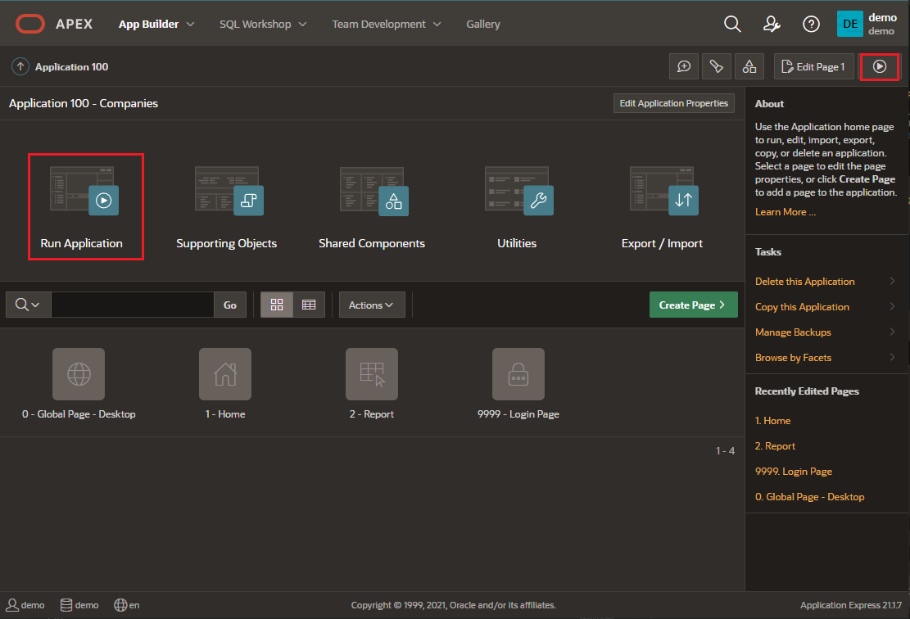

# Python micro-service with Oracle Autonomous and MongoDB

## Introduction

Oracle Autonomous JSON Database (AJD) is a new service in Autonomous Database family for JSON-centric development. Autonomous JSON Database is built for developers who are looking for an easy to use, cost-effective JSON database with native Document API support. Autonomous JSON Database provides all the core capabilities of a document store along with high performance, simple elasticity, full ACID support and complete SQL functionality.

Learn why customers choose Oracle Autonomous JSON Database over MongoDB Atlas. Autonomous JSON Database provides all the core capabilities of MongoDB along with high performance, simple elasticity, full ACID support and complete SQL functionality.

**Estimated Lab Time: 20 minutes**.

### Objectives

In this lab, you will:

* Use multi-cloud support to your Python web service to support MongoDB
* Compare Oracle SODA with MongoDB API

### Prerequisites

* Lab 1 and 2 from this content completed
* MongoDB Cloud account (or Google account)
* Deploy Atlas document store on MongoDB Cloud before the workshop (run Lab 3 Task 1)

We are providing a basic reference to create a Mongo DB account, we are not pretending to be MongoDB experts or provide MongoDB best practices. We are using MongoDB account as user for the workshop purpose not experts level on the matter. If you need support on this process, contact your MongoDB support contact.

Here you have a [Prerequisites document](https://objectstorage.eu-frankfurt-1.oraclecloud.com/p/8mPUcFqASM0awq5qKFU9mD6occf83Z5vxeOrWC38CEU2nC-15wusaIY6aCehDVW6/n/fruktknlrefu/b/workshop-ajson-mongodb/o/MongoDB%20Developers%20Full%20Python%20App%20Development%20with%20Autonomous%20JSON%20-%20Prerequisites.pdf) where you can find support to crete the Oracle Cloud account and MongoDB account.


## Task 1: Deploy Atlas document store on MongoDB Cloud

One of the objectives of this workshop is to show the integration of Oracle Autonomous JSON Database with existing document stores like MongoDB. This is why you need an existing MongoDB database, and if you don't have one, you can provision it quickly on MondoDB Cloud.

1. **Access MongoDB Cloud** at [https://cloud.mongodb.com](https://cloud.mongodb.com), and **Create an account.** You can login using your Google account.
    
    

2. Click **Build a Database**. Select the **Free option**, choose a Cloud Provider and Region. Create the **New Cluster** using the default settings. Name it **Cluster0**.

    - Cluster Name:
    ```
    <copy>Cluster0</copy>
    ```

    
    
    
    > Note: If you get a **Quick Start wizard**, please fill out the following information: Add Public IP address (Step 4 of this Task) and Add Database User (Step 5 of this Task). Otherwise go to the next step number 3.

    

3. Once your **Cluster** is up and running, on the **overview page**, click **Connect**.

    

4. Click **Add a Different IP Address**, and use the **Public IP address** of your **DEVM** Compute Node. To add more or change this IP address, go to Security > Network Access on the left side menu.

    

    

5. Create a Database User: 
    - Username: 
    ```
    <copy>mongoUser</copy>
    ```
    - Password: 
    ```
    <copy>DBlearnPTS#22_</copy>
    ```

    To add or edit users, **click Security > Database Access** on the left side menu.

    
    
    
    > Note: Save the **username** and the **password** in your notes.
    > We recomend you to use the password as later on, it will be use for running Python scripts. If you consider changing it, remember that later on, you will need to modify the Python scripts manually.

6. On the **Cluster Overview Page**, Click **Connect**.

    

    - **Connect Your Application**: Python 3.6 or later
        You will receive a connection string like this:

    ````
    mongodb+srv://mongoUser:[password]@[cluster_name].[sub_domain_name].mongodb.net/[dbname]?retryWrites=true&w=majority
    ````

    
    
    
    > Note: Save this string in your notes. Replace `[password]` (DBlearnPTS#22_), `[cluster_name]` (Cluster0), `[sub_domain_name]` and `[dbname]` (SimpleDatabase) with your values.

7. Click the cluster name **Cluster0**. Under **Collections**, use **Load a Sample Dataset wizard** to generate some JSON documents for different use cases in your MongoDB database. **Navigate** these sample datasets and familiarize yourself with JSON documents, if this is your first experience.

    
    
    

8. Click **Create Database**, and name it **SimpleDatabase**, and the collection **SimpleCollection**. This will be used for our Python application development in the next lab.

    - Database Name:
    ```
    <copy>SimpleDatabase</copy>
    ```
    - Collection Name:
    ```
    <copy>SimpleCollection</copy>
    ```

    
    

9. On the Collections left-side menu, select **SimpleDatabase** > **SimpleCollection**. This collection is now empty.

    


## Task 2: Develop dual document store micro-service

1. Access to **cloud shell** again. If you are not connected to **opc@devm**, **run** again the **ssh connections** using the **Public IP.** Replace <Public_IP> with your own one, removing < and > too. We copied the Public IP when we provisioned the compute instance few tasks back. Execute the following commands:

    ````
    <copy>
    ssh -i <private-key-file-name>.key opc@<Public_IP>
    </copy>
    ````

    

2. Lets have a look at **double-app.py**. In this file, we have the Python application code. Run the following command to see the code:

    ````
    <copy>
    cat double-app.py
    </copy>
    ````

    
    

3. **Verify** all connection **variables are correct**. 

    - For the Oracle Autonomous JSON database connection: We are using **demo** user and the **password** that we have recommended during the workshop **DBlearnPTS#22_**.

    - For the MongoDB database connection: We are using **mongoUser** **user** and the **password** that we have recommended during the workshop **DBlearnPTS#22_**. We have hard-corded the **MongoDB cluster name**, having the default value **Cluster0**. We need the **MongoDB database name**, we have recommended using **SimpleDatabase**. We need too the **MongoDB database collection name**, we have recommended using **SimpleCollection**. And finally, we need the **subdomain name**. It is a **5 characters string** that you can find under the MongoDB connection variables window. We requested to copy it on Task 1 of this lab. 
    
    It should be something like this:

    ````
    mongodb+srv://mongoUser:[password]@[cluster_name].[sub_domain_name].mongodb.net/[dbname]?retryWrites=true&w=majority
    ````

    For **importing** the **subdomain name,** please write this command:

    ````
    <copy>
    export MONGO_DOMAIN="<sub_domain_name>"    
    </copy>
    ````

    > Note: If you have change the following variables to a different value, please run this commands providing the variable that you have changed.
    >
    ````
    export AJSON_USER="demo"
    export AJSON_PASSWORD="DBlearnPTS#22_"
    export AJSON_SERVICE="ajdev_tp"
    export MONGO_USER="mongoUser"
    export MONGO_PASSWORD="DBlearnPTS#22_"
    export MONGO_CLUSTER="Cluster0"
    export MONGO_DB="SimpleDatabase"
    export MONGO_COLLECTION="SimpleCollection"
    ````

4. **After checking if all variables are correct**. **Run** double-app application using the following command:

    ````
    <copy>
    nohup python3 double-app.py > double-app.log 2>&1 & echo $! > double.pid
    </copy>
    ````

    We are executing the double-app.py with **nohup function** for keep using the terminal for the following steps.
    
    At the same time, with this command, we are **creating a double-app.log** where you can check how the python app is behaving.
    
    Additionally we are **creating a file, double.pid,** to be capable of killing the python app to keep creating the third application for today’s content.

    

5. Lets see what **double-app.py is doing**, use the following command:

    ````
    <copy>
    cat double-app.log
    </copy>
    ````

    

    If you followed the steps correctly, you should see this output in the cloud shell terminal. 

    **Your micro-service double-app.py is being executed** so we can start inserting the documents.

6. **Copy** the following commands to perform **POST request with CURL client**. Make sure you press Enter after each one. First and Second POST:

    ````
    <copy>
    curl --request POST \
            --url http://localhost:5000/mongo/ \
            --header 'content-type: application/json' \
            --data '{
        "company":"Company Five",
        "address": {
            "street": "6435 Avondale Dr",
            "city": "Nichols Hills",
            "country": "United States"
        },
        "industry":"Retail",
        "employees":5550
    }'
    curl --request POST \
            --url http://localhost:5000/mongo/ \
            --header 'content-type: application/json' \
            --data '{
        "company":"Company Six",
        "address": {
            "street": "15 1 Ave W",
            "city": "Lafleche",
            "country": "Canada"
        },
        "industry":"Health Sciences",
        "employees":123123
    }'
    </copy>
    ````

    

7. **Copy** the following commands to perform **POST request with CURL client**. Make sure you press Enter after each one. Third and Fourth POST:

    ````
    <copy>
    curl --request POST \
            --url http://localhost:5000/mongo/ \
            --header 'content-type: application/json' \
            --data '{
        "company":"Company Seven",
        "address": {
            "street": "Calle Martin Corchado 32",
            "city": "Ponce",
            "country": "Puerto Rico"
        },
        "industry":"Communications",
        "employees":112233
    }'
    curl --request POST \
            --url http://localhost:5000/mongo/ \
            --header 'content-type: application/json' \
            --data '{
        "company":"Company Eight",
        "address": {
            "street": "Asa Sul CLS 203 LOJA 06 - Asa Sul",
            "city": "Brasília",
            "country": "Brazil"
        },
        "industry":"Utilities",
        "employees":888
    }'
    </copy>
    ````

    


8. Use the **web browser** on your laptop to navigate to your micro-service to list JSON documents inserted into Oracle Autonomous Database.

    http://[DEVM public-ip address]:5000/mongo/

     
    
    > This micro-service has 2 URLs. We already had used the Oracle one on Lab 2, Task 1. Here you have the two URLS:
    >
        - http://[DEVM public-ip address]:5000/oracle/ -> for Oracle Autonomous Database
        - http://[DEVM public-ip address]:5000/mongo/ -> for MongoDB

9. We can check that the **Four Companies** (Five, Six, Seven and Eight) are being stored on **MongoDB** cloud, on **SimpleDatabase.SimpleCollection** that we created in Task 1 of this Lab.

    


## Task 3: Develop document store migration application

1. Access to **cloud shell** again. If you are not connected to **opc@devm**, **run** again the **ssh connections** using the **Public IP.** Replace <Public_IP> with your own one, removing < and > too. We copied the Public IP when we provisioned the compute instance few tasks back. Execute the following commands:

    ````
    <copy>
    ssh -i <private-key-file-name>.key opc@<Public_IP>
    </copy>
    ````

    

2. Lets have a look at **migrate-app.py**. In this file, we have the Python application code. Run the following command to see the code:

    ````
    <copy>
    cat migrate-app.py
    </copy>
    ````

    
    

3. **Verify** all connection **variables are correct**. 

    - For the Oracle Autonomous JSON database connection: We are using **demo** user and the **password** that we have recommended during the workshop **DBlearnPTS#22_**.

    - For the MongoDB database connection: We are using **mongoUser** **user** and the **password** that we have recommended during the workshop **DBlearnPTS#22_**. We have hard-corded the **MongoDB cluster name**, having the default value **Cluster0**. We need the **MongoDB database name**, we have recommended using **SimpleDatabase**. We need too the **MongoDB database collection name**, we have recommended using **SimpleCollection**. And finally, we need the **subdomain name**. It is a **5 characters string** that you can find under the MongoDB connection variables window. We requested to copy it on Task 1 of this lab. 
    
    It should be something like this:

    ````
    mongodb+srv://mongoUser:[password]@[cluster_name].[sub_domain_name].mongodb.net/[dbname]?retryWrites=true&w=majority
    ````

    For **importing** the **subdomain name,** please write this command:

    ````
    <copy>
    export MONGO_DOMAIN="<sub_domain_name>"    
    </copy>
    ````

    > Note: If you have change the following variables to a different value, please run this commands providing the variable that you have changed.
    >
    ````
    export AJSON_USER="demo"
    export AJSON_PASSWORD="DBlearnPTS#22_"
    export AJSON_SERVICE="ajdev_tp"
    export MONGO_USER="mongoUser"
    export MONGO_PASSWORD="DBlearnPTS#22_"
    export MONGO_CLUSTER="Cluster0"
    export MONGO_DB="SimpleDatabase"
    export MONGO_COLLECTION="SimpleCollection"
    ````

4. **After checking if all variables are correct**. **Run** migrate-app application using the following command:

    ````
    <copy>
    python3 migrate-app.py
    </copy>
    ````

    We are **executing the migrate-app.py**. It will print the content of the migrated documents from MongoDB database to Oracle Autonomous Database.

    
    

5. **Refresh** the web browser on your laptop to list all JSON documents inserted and migrated.

    http://[DEVM public-ip address]:5000/oracle/

    

6. Go to **cloud shell terminal.** We will **stop double-app.py** running the following command. 

    ````
    <copy>
    kill $(cat double.pid)
    </copy>
    ````

    


## Task 4: Final Results in Companies App built with APEX

1. Execute **Companies Application**. 

    

2. **Log In** to Companies using the following credentials:

    - Username:
    ```
    <copy>demo</copy>
    ```
    - Password:
    ```
    <copy>DBlearnPTS#22_</copy>
    ```

    

3. Click **Report**. 

    
    
    You can see the **Eight Companies**. Four (One, Two, Three and Four) were inserted directly to the Oracle Microservice and Four (Five, Six, Seven and Eight) were migrated from the MongoDB Microservice.
    
    
    
    
*Congratulations! Well done!*

## Acknowledgements
* **Author** - Valentin Leonard Tabacaru, Database Product Management and Priscila Iruela, Technology Product Strategy Director
* **Contributors** - Victor Martin Alvarez, Technology Product Strategy Director
* **Last Updated By/Date** - Priscila Iruela, June 2022

## Need Help?
Please submit feedback or ask for help using our [LiveLabs Support Forum](https://community.oracle.com/tech/developers/categories/livelabsdiscussions). Please click the **Log In** button and login using your Oracle Account. Click the **Ask A Question** button to the left to start a *New Discussion* or *Ask a Question*.  Please include your workshop name and lab name.  You can also include screenshots and attach files.  Engage directly with the author of the workshop.

If you do not have an Oracle Account, click [here](https://profile.oracle.com/myprofile/account/create-account.jspx) to create one.