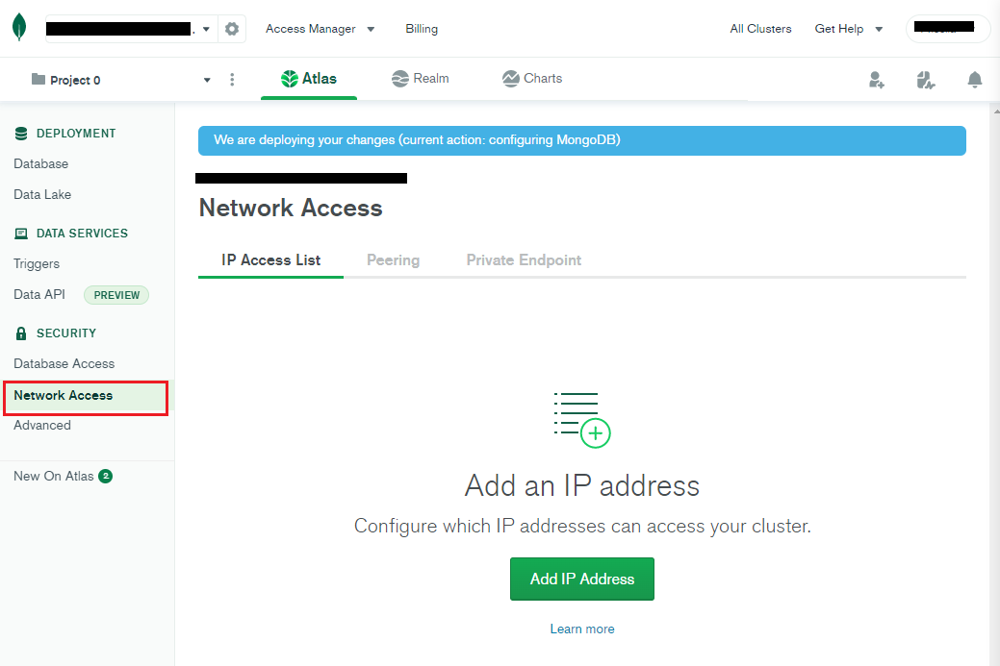
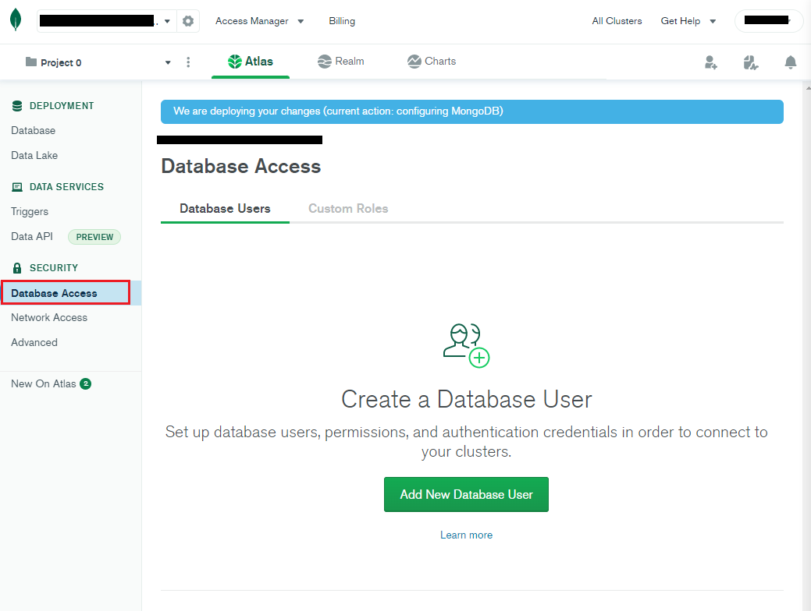
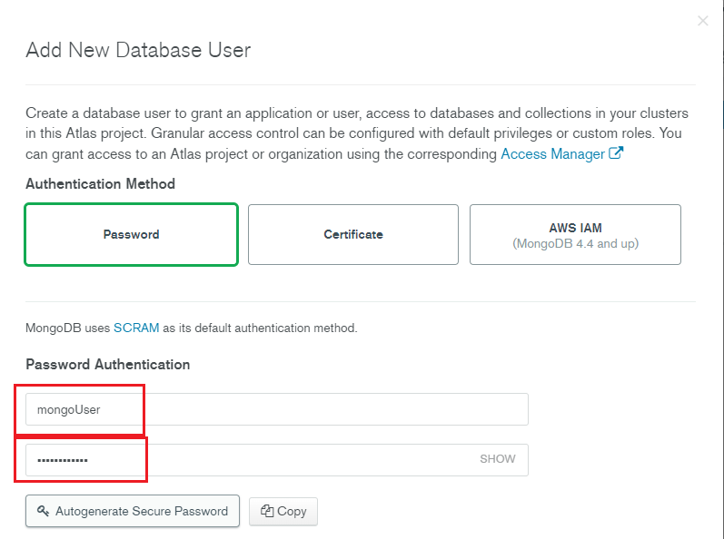
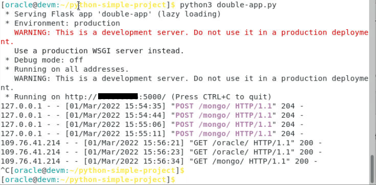
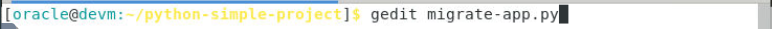

# Python micro-service with Oracle Autonomous and MongoDB

## Introduction

Oracle Autonomous JSON Database (AJD) is a new service in Autonomous Database family for JSON-centric development. Autonomous JSON Database is built for developers who are looking for an easy to use, cost-effective JSON database with native Document API support. Autonomous JSON Database provides all the core capabilities of a document store along with high performance, simple elasticity, full ACID support and complete SQL functionality.

Learn why customers choose Oracle Autonomous JSON Database over MongoDB Atlas. Autonomous JSON Database provides all the core capabilities of MongoDB along with high performance, simple elasticity, full ACID support and complete SQL functionality.

**Estimated Lab Time: 20 minutes**

### Objectives
In this lab, you will:
* Use multi-cloud support to your Python web service to support MongoDB
* Compare Oracle SODA with MongoDB API

### Prerequisites
* MongoDB Cloud account (or Google account)
* Deploy Atlas document store on MongoDB Cloud before the workshop (run Lab 2 Task 1)


## Task 1: Deploy Atlas document store on MongoDB Cloud

One of the objectives of this workshop is to show the integration of Oracle Autonomous JSON Database with existing document stores like MongoDB. This is why you need an existing MongoDB database, and if you don't have one, you can provision it quickly on MondoDB Cloud.

1. Access MongoDB Cloud at [https://cloud.mongodb.com](https://cloud.mongodb.com), and create an account. You can login using your Google account.
    
    

2. Click Build a Database. Select the Free option, choose a Cloud Provider and Region. Create the new Cluster using the default settings. Name it **Cluster0**.

    
    
    

3. Once your Cluster is up and running, on the **overview page**, click **Connect**.

    

4. Click **Add a Different IP Address**, and use the **Public IP address** of your DEVM Compute Node. To add more or change this IP address, go to Security > Network Access on the left side menu.

    

    

5. Create a Database User: **mongoUser/DBlearnPTS#22_**. To add or edit users, click Security > Database Access on the left side menu.

    

    
    
    > Note: Save the **username** and the **password** in your notes.

6. On the Cluster Overview Page, Click **Connect**.

    

    - **Connect Your Application**: Python 3.6 or later
        You will receive a connection string like this:

    ````
    <copy>
    mongodb+srv://mongoUser:[password]@[cluster_name].[sub_domain_name].mongodb.net/[dbname]?retryWrites=true&w=majority
    </copy>
    ````

    
    

    
    > Note: Save this string in your notes. Replace `[password]` (DBlearnPTS#22_), `[cluster_name]` (Cluster0), `[sub_domain_name]` and `[dbname]` (SimpleDatabase) with your values.

7. Click the cluster name **Cluster0**. Under **Collections**, use Load a Sample Dataset wizard to generate some JSON documents for different use cases in your MongoDB database. Navigate these sample datasets and familiarize yourself with JSON documents, if this is your first experience.

    
    
    


8. Click Create Database, and name it **SimpleDatabase**, and the collection **SimpleCollection**. This will be used for our Python application development in the next lab.

    
    

9. On the Collections left-side menu, select **SimpleDatabase** > **SimpleCollection**. This collection is now empty.

    

## Task 2: Develop dual document store micro-service

1. Create a new Python micro-service application to connect to both Oracle Autonomous document store and MongoDB, performing the same tasks. Use the **gEdit** text editor on Remote Desktop to create a file for the **double-app** micro-service code.

    ````
    <copy>    
    gedit double-app.py
    </copy>
    ````

    


2. Verify all connection variables are correct, MongoDB cluster name is hard-coded having the default value **cluster0**, and [sub_domain_name] is a 5 characters string (under set MongoDB connection variables). Click **Save**, and close the editor. This micro-service has 2 URLs: 

    - base-URL/**oracle**/ for Oracle Autonomous Database
    - base-URL/**mongo**/ for MongoDB
        
    ````
    <copy>
    # import the required modules
    import json
    import cx_Oracle
    import pymongo
    from flask import Flask
    from flask import request
    app = Flask(__name__)
    
    # set Oracle connection variables
    o_usr = 'demo'
    o_pwd = 'DBlearnPTS#22_'
    o_srv = 'ajdev_tp'
    
    # set MongoDB connection variables
    m_usr = 'mongoUser'
    m_pwd = 'DBlearnPTS#22_'
    m_dbn = 'SimpleDatabase'
    m_sdn = '[sub_domain_name]'
    
    # create Oracle connection, and set collection used by application
    conn_string = o_usr + '/' + o_pwd + '@' + o_srv
    connection = cx_Oracle.connect(conn_string)
    connection.autocommit = True
    soda = connection.getSodaDatabase()
    ocollection = soda.createCollection("SimpleCollection")
    
    # create MongoDB connection, and set collection used by application
    client = pymongo.MongoClient("mongodb+srv://" + m_usr + ":" + m_pwd + "@cluster0." + m_sdn + ".mongodb.net/" + m_dbn + "?retryWrites=true&w=majority")
    mdb = client[m_dbn]
    mcollection = mdb['SimpleCollection']
    
    # function used to insert JSON documents in Oracle
    @app.route("/oracle/", methods=['POST'])
    def insert_orcl_doc():
        req_data = request.get_json()
        ocollection.insertOne(req_data)
        return ('', 204)
    
    # function used to retrieve JSON documents from Oracle
    @app.route('/oracle/')
    def get_orcl_doc():
        documents = ocollection.find().getDocuments()
        response = []
        for document in documents:
            content = document.getContent()
            content['key'] = str(document.key)
            response.append(content)
        return json.dumps(response)
    
    # function used to insert JSON documents in MongoDB
    @app.route("/mongo/", methods=['POST'])
    def insert_mongo_doc():
        req_data = request.get_json()
        mcollection.insert_one(req_data).inserted_id
        return ('', 204)
    
    # function used to retrieve JSON documents from MongoDB
    @app.route('/mongo/')
    def get_mongo_doc():
        documents = mcollection.find()
        response = []
        for document in documents:
            document['_id'] = str(document['_id'])
            response.append(document)
        return json.dumps(response)
    
    # main program module
    if __name__ == '__main__':
        app.run(host= '0.0.0.0')
    </copy>
    ````

    

3. **Run** double-app application.
    
    ````
    <copy>
    python3 double-app.py
    </copy>
    ````
    

4. Use **Terminal second tab** to perform two POST request with CURL client.
    
    ````
    <copy>
    curl --request POST \
      --url http://localhost:5000/mongo/ \
      --header 'content-type: application/json' \
      --data '{
     "company":"Company Five",
     "address": {
         "street": "6435 Avondale Dr",
         "city": "Nichols Hills",
         "country": "United States"
     },
     "industry":"Retail",
     "employees":5550
    }'
    curl --request POST \
      --url http://localhost:5000/mongo/ \
      --header 'content-type: application/json' \
      --data '{
     "company":"Company Six",
     "address": {
         "street": "15 1 Ave W",
         "city": "Lafleche",
         "country": "Canada"
     },
     "industry":"Health Sciences",
     "employees":123123
    }'
    </copy>
    ````
    

5. Press **Enter** after each block you copy/paste.
    
    ````
    <copy>
    curl --request POST \
      --url http://localhost:5000/mongo/ \
      --header 'content-type: application/json' \
      --data '{
     "company":"Company Seven",
     "address": {
         "street": "Calle Martin Corchado 32",
         "city": "Ponce",
         "country": "Puerto Rico"
     },
     "industry":"Communications",
     "employees":112233
    }'
    curl --request POST \
      --url http://localhost:5000/mongo/ \
      --header 'content-type: application/json' \
      --data '{
     "company":"Company Eight",
     "address": {
         "street": "Asa Sul CLS 203 LOJA 06 - Asa Sul",
         "city": "Brasília",
         "country": "Brazil"
     },
     "industry":"Utilities",
     "employees":888
    }'
    </copy>
    ````
    

6. Use a new tab in the web browser on your laptop to navigate to the micro-service to list JSON documents inserted into MongoDB.

    http://[DEVM public-ip address]:5000/mongo/

    

7. Go to the first Terminal window where the micro-service is running and press CTRL+C to stop it.
            
    ````
    <copy>
    CTRL+C
    </copy>
    ````

    

8. We can check that the Four Companies (Five, Six, Seven and Eight) are being stored on MongoDB cloud, on SimpleDatabase.SimpleCollection that we created in Task 1 of this Lab.

    


## Task 3: Develop document store migration application

1. Create a new Python application to connect to MongoDB document store and migrate JSON documents to Oracle Autonomous Database. Use the **gEdit** text editor on Remote Desktop to create a file for the **migrate-app** Python code.
    
    ````
    <copy>
    gedit migrate-app.py
    </copy>
    ````
    

2. Verify all connection variables are correct, MongoDB cluster name is hard-coded having the default value **cluster0**, and [sub_domain_name] is a 5 characters string (under set MongoDB connection variables). Click **Save**, and close the editor.
    
    ````
    <copy>
    # import the required modules
    import json
    import cx_Oracle
    import pymongo
    
    # set Oracle connection variables
    o_usr = 'demo'
    o_pwd = 'DBlearnPTS#22_'
    o_srv = 'ajdev_tp'
    
    # set MongoDB connection variables
    m_usr = 'mongoUser'
    m_pwd = 'DBlearnPTS#22_'
    m_dbn = 'SimpleDatabase'
    m_sdn = '[sub_domain_name]'
    
    # create Oracle connection, and set collection used by application
    conn_string = o_usr + '/' + o_pwd + '@' + o_srv
    connection = cx_Oracle.connect(conn_string)
    connection.autocommit = True
    soda = connection.getSodaDatabase()
    ocollection = soda.createCollection("SimpleCollection")
    
    # create MongoDB connection, and set collection used by application
    client = pymongo.MongoClient("mongodb+srv://" + m_usr + ":" + m_pwd + "@cluster0." + m_sdn + ".mongodb.net/" + m_dbn + "?retryWrites=true&w=majority")
    mdb = client[m_dbn]
    mcollection = mdb['SimpleCollection']
    
    # main program module
    if __name__ == '__main__':
        # retrieve documents from MongoDB collection defined by 'mcollection'
        documents = mcollection.find()
        for document in documents:
            document['_id'] = str(document['_id'])
            # insert into Oracle collection defined by 'ocollection'
            doc = ocollection.insertOneAndGet(document)
            key = doc.key
            print('Migrated SODA document key: ', key)
            doc = ocollection.find().key(key).getOne() 
            content = doc.getContent()
            print('Migrated SODA document: ')
            print(content)
    </copy>
    ````

    

3. Run migrate-app application. It will print the content of the migrated documents from MongoDB to Oracle Autonomous Database.
    
    ````
    <copy>
    python3 migrate-app.py
    </copy>
    ````
    
    
    
4. Run double-app application to verify the JSON were migrated successfully.
    
    ````
    <copy>
    python3 double-app.py
    </copy>
    ````
    

5. Refresh the web browser on your laptop to list all JSON documents inserted and migrated.

    http://[DEVM public-ip address]:5000/oracle/

    

6. Go to the Terminal tab where the micro-service is running, and press CTRL+C to stop it.

    ````
    <copy>
    CTRL+C
    </copy>
    ````
    

## Task 4: Final Results in Companies App built with Apex
      
1. Execute **Companies Application**. 

    

2. **Log In** to Companies using the following credentials:

    - Username: demo
    - Password: DBlearnPTS#22_

    

3. Click **Report**. 

    
    
    You can see the Eight Companies. Four (One, Two, Three and Four) were inserted directly to the Oracle Microservice and Four (Five, Six, Seven and Eight) were migrated from the MongoDB Microservice.
    
    
    
    
*Congratulations! Well done!*

## Acknowledgements
* **Author** - Valentin Leonard Tabacaru, Database Product Management
* **Contributors** - Priscila Iruela, Technology Product Strategy Director
* **Last Updated By/Date** - Priscila Iruela, March 2022

## Need Help?
Please submit feedback or ask for help using our [LiveLabs Support Forum](https://community.oracle.com/tech/developers/categories/livelabsdiscussions). Please click the **Log In** button and login using your Oracle Account. Click the **Ask A Question** button to the left to start a *New Discussion* or *Ask a Question*.  Please include your workshop name and lab name.  You can also include screenshots and attach files.  Engage directly with the author of the workshop.

If you do not have an Oracle Account, click [here](https://profile.oracle.com/myprofile/account/create-account.jspx) to create one.