# Python SODA micro-service with Autonomous Database for JSON

## Introduction

SODA for Python is a Python API that implements Simple Oracle Document Access (SODA). It is part of the Oracle Python driver, cx_Oracle — no additional installation is needed.

You can use SODA for Python to perform create, read (retrieve), update, and delete (CRUD) operations on documents of any kind, and you can use it to query JSON documents.

SODA is a set of NoSQL-style APIs that let you create and store collections of documents (in particular JSON) in Oracle Database, retrieve them, and query them, without needing to know Structured Query Language (SQL) or how the documents are stored in the database.

**Estimated Lab Time: 1 hour 40 minutes**

### Objectives
In this lab, you will:
* Create development environment on Oracle Cloud Infrastructure
* Deploy a document store with one collection on Oracle Autonomous Database for JSON
* Develop a simple Python web service to manage JSON documents via REST calls

### Prerequisites
* An Oracle Free Tier, Always Free, or Paid Oracle Cloud Account


## Task 1: Create Virtual Cloud Network (VCN)

1. Login to Oracle cloud console: [cloud.oracle.com](https://cloud.oracle.com/)

    - Cloud Account Name: oci-tenant
    - **Next**
    
    

    - User Name: oci-username - email address provided
    - Password: oci-password
    - **Sign In**

        

2. Click on main menu ≡, then Networking > **Virtual Cloud Networks**. Select your Region and Compartment assigned by the instructor. 

    >**Note**: Use **Root** Compartment, oci-tenant(root), to create all resources for this workshop.

    

3. Select your Region and Compartment assigned by the instructor. Click **Start VCN Wizard**.
    
    

4. Select **Create VCN with Internet Connectivity**. Start **VCN Wizard**.

   

5. Provide the following information:

    - VCN Name: DEVCN
    - Compartment: Be sure you have selected the correct one for this workshop purpose. **Root** is the recommended one
    - Click **Next**

    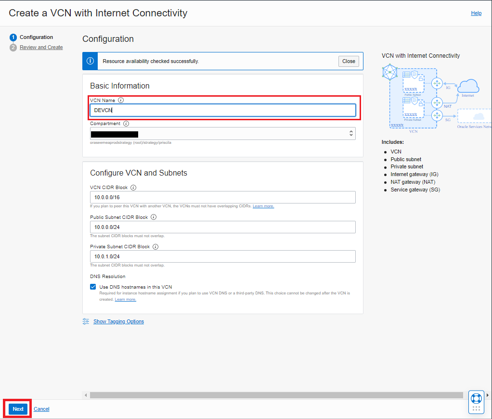

6. Review the information in the 'Review and Create Page' and Click **Create**.

    

7. The Resources have being created on the next page. Click **View Virtual Cloud Network** to access to the vcn.

    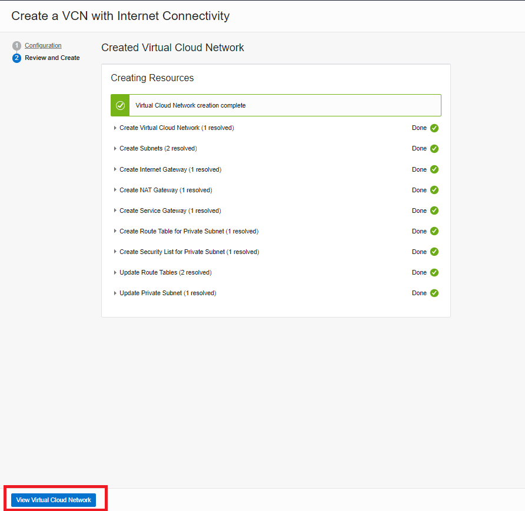
    

8. Click **Public Subnet-DEVCN**. 

    

9. Click **Default Security List for DEVCN**.
    
    

10. Click **Add Ingress Rules**.

    

11. Provide the following information:

    - CIDR Block: 0.0.0.0/0
    - Destination Port Range: 5000
    - Description: Python Flask
    - Click **+ Another Ingress Rule**

    

12. Provide the following information:

    - CIDR Block: 0.0.0.0/0
    - Destination Port Range: 6080
    - Description: noVNC
    - Click **+ Another Ingress Rule**

    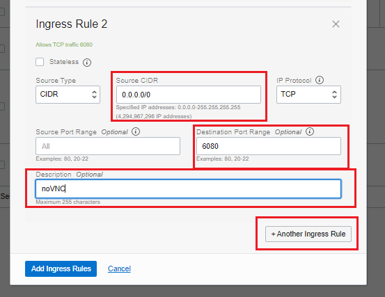

13. Provide the following information:

    - CIDR Block: 0.0.0.0/0
    - Destination Port Range: 80
    - Description: HTTP
    - Click **Add Ingress Rules**
    
    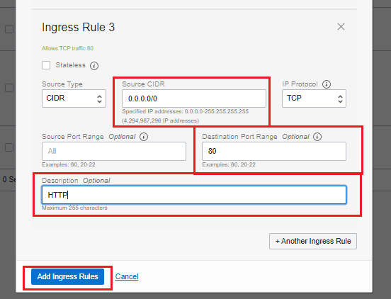

14. You can check on the **Detail Page** that the 3 Ingress Rules have beed added.
    
    

## Task 2: Provision Compute Node for development

1. Click on the following link to access to the customer image from [Oracle marketplace](https://bit.ly/3CxvsxA).

    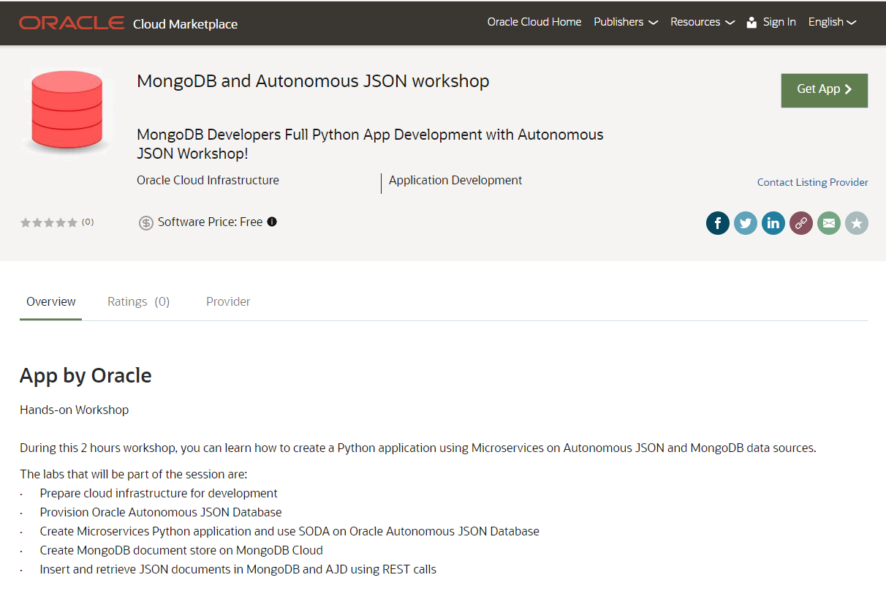

2. Click **Get App**.

    

3. Select **Commercial Market** and click **Sign in**.

    

4. In the next screen be dure that you have the correct information:

    - Version: 2.0 (3/4/2022) - default
    - Compartment: Be sure you have selected the correct one for this workshop purpose. **Root** is the recommended one
    - **Accept** the Oracle standard Terms and Restrictions
    - **Launch Instance**

    

5. Provide the following information:

    - Name: DEVM
    - Comparment: Be sure you have selected the correct one for this workshop purpose. **Root** is the recommended one
    - Image and shape: click **Edit/Collapse** and after **Change shape** if you don't have the following information:
        - Image: MongoDB and Autonomous JSON workshop
        - Shape: VM.Standard.E2.1.Micro - Always Free eligible
    
    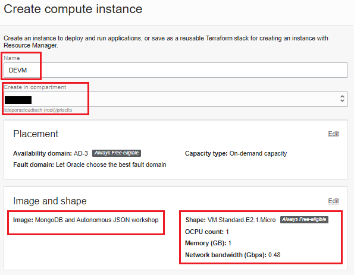

    - Networking: Be sure you have the following information. If not, click **Edit/Collapse** to edit the information

        - Virtual cloud network: DEVCN
        - Subnet: Public Subnet-DEVCN (regional)
    
    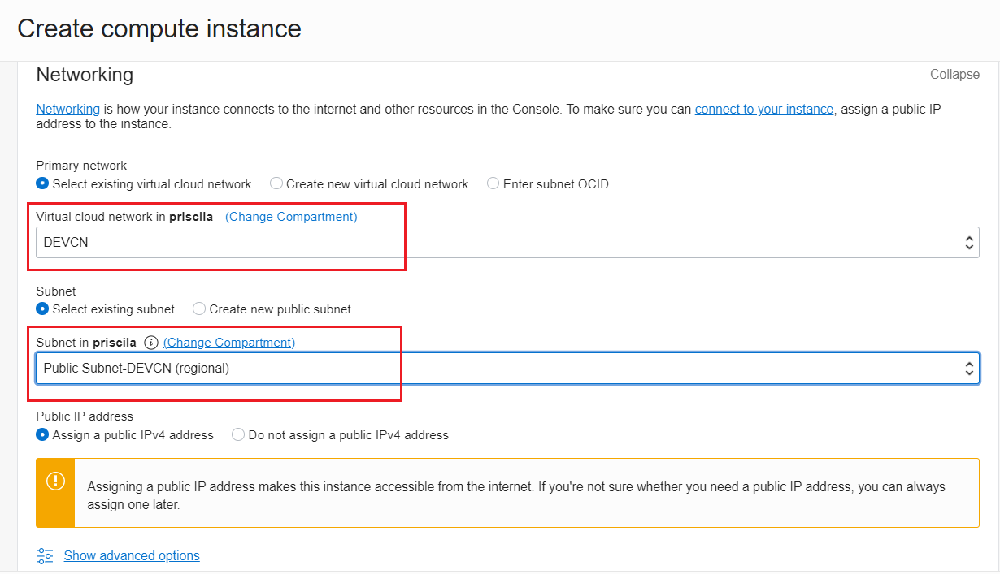

    - Download the private and public keys: **Save Private Key**, **Save Public Key**

    

    - Click **Create**

    
       
4. Wait for Compute Instance to finish provisioning, and have status Available (click browser Refresh button). 
On the Instance Details page, copy Public IP Address in your notes.

    
    

> Note: On the Instance Details page, copy **Public IP Address** in your notes.

5. Use your laptop web browser to open the URL returned by the script, replacing **[DEVM public-ip address]** with the actual values. (If the URL doesn't work, give it a couple of minutes to start the graphical user interface).

    http://[DEVM public-ip address]/livelabs/vnc.html?password=LiveLabs.Rocks_99&resize=scale&quality=9&autoconnect=true&reconnect=true

    

6. Check if your keyboard works. If you need to select another keyboard layout, click the **On-Off** button in the upper right corner, and **Settings** button. You will find the options under **Region & Language**.

    
    

7. Click Applications > Favorites > Firefox to launch the web browser on the DEVM Compute Node remote desktop.

    
    
8. Navigate to **cloud.oracle.com**, and **login** to Oracle cloud console using your Cloud Account Name, User Name, and Password.

    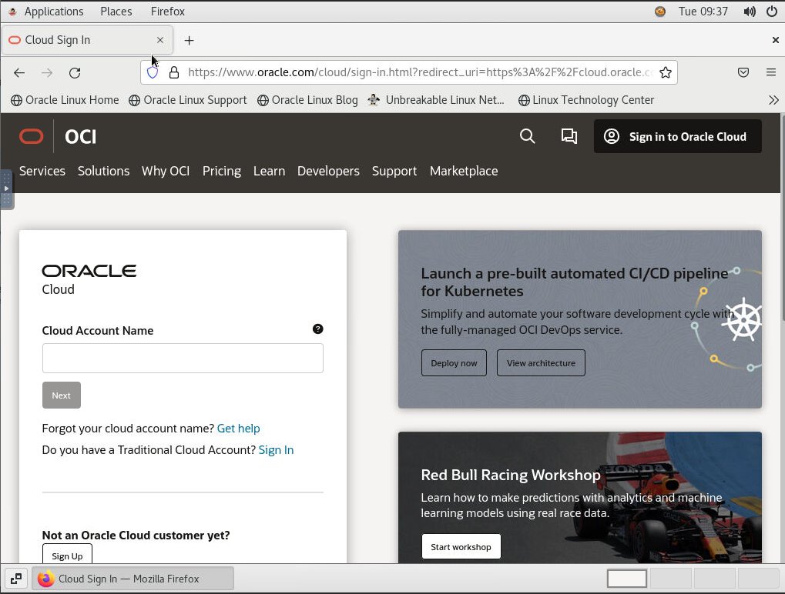


## Task 3: Provision Oracle Autonomous JSON Database (AJD)

1. Click on main menu ≡, then Oracle Database > **Autonomous JSON Database**. **Create Autonomous Database**.

    

2. Click **Create Autonomous Database**.

    

3. Provide the following information

    - Comparment: Be sure you have selected the correct one for this workshop purpose. *Root* is the recommended one
    - Display name: AJDEV
    - Database name: AJDEV
    - Choose a workload type: JSON
    - Choose a deployment type: Shared Infrastructure
    - Always Free: Show only Always Free configuration options
    - Choose database version: 19c
    - OCPU count: 1
    - Storage (TB): 1

    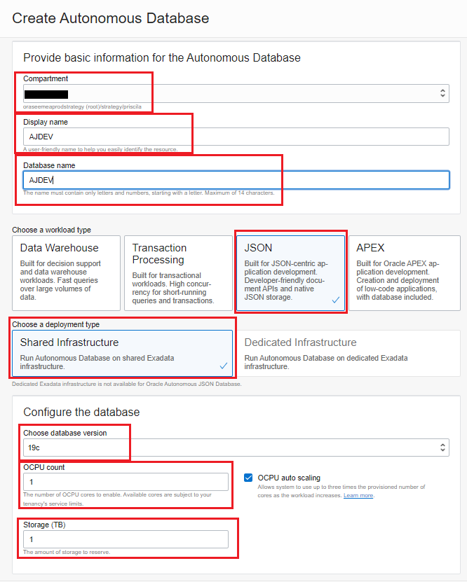

4. Under **Create administrator** credentials:

    - Password: DBlearnPTS#22_

    
    
5. Under **Choose network access**:

    - Access Type: Secure access from everywhere

    

6. Under **Choose a license type**:
    
    - License included
    
    

7. Click **Create Autonomous Database**.

    

8. Wait for Lifecycle State to become **Available** from Provisioning (click browser Refresh button).

    
    

8. Next to the big green box, click **DB Connection**.
    
    

9. Click **Download wallet**.

    

10. Type the following information:

    - Password: DBlearnPTS#22_
    - Confirm Password: Password: DBlearnPTS#22_
    - Click **Download**

    

11. Click **Save file** and **OK**.
    
    

12. Open another tab in **Firefox** on remote desktop, and navigate to **bit.ly/SODAjson**. Use this lab guide to copy and paste commands on the DEVM Compute Node remote desktop.

    

13. Click **Applications** > **System Tools** > **Terminal** on the DEVM Compute Node remote desktop. 

    

14. **Run** the following commands. Use **Shift+Ctrl+V** to paste the block in Terminal, and press **Enter** after it.

    ````
    <copy>
    unzip Downloads/Wallet_AJDEV.zip -d Wallet_AJDEV
    sed -i 's/?\/network\/admin/\${TNS_ADMIN}/g' Wallet_AJDEV/sqlnet.ora
    export TNS_ADMIN=/home/oracle/Wallet_AJDEV
    export LD_LIBRARY_PATH=/usr/lib/oracle/19.13/client64/lib
    export PATH=$PATH:/usr/lib/oracle/19.13/client64/bin/
    </copy>
    ````
    

## Task 4: Prepare Document Store

1. Use the web browser on the DEVM Compute Node remote desktop to access AJDEV instance under Oracle Database > **Autonomous JSON Database**.

    

2. On **Tools tab**, under **Oracle Application Express**, click **Open APEX**. 

    

3. On **Administration Services** login page, use password for ADMIN.

    - Password: DBlearnPTS#22_

    

4. Click **Create Workspace**.

    

5. Type the following information:

    - Database User: DEMO
    - Password: DBlearnPTS#22_
    - Workspace Name: DEMO

    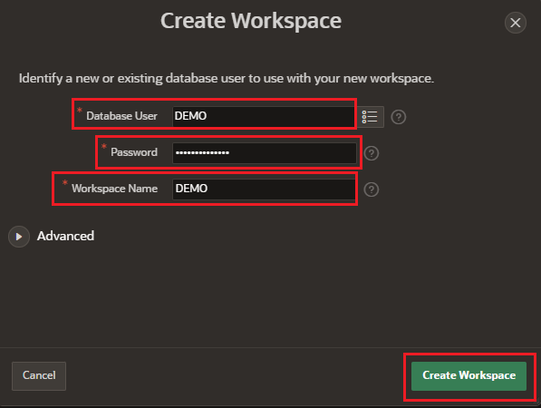
    
6. Click **DEMO** in the middle of the page to **Sign in** as DEMO user.
 
    
 
7. Click **Sign In** Page using the following information.

    - Workspace: demo
    - Username: demo
    - Pasword: DBlearnPTS#22_

    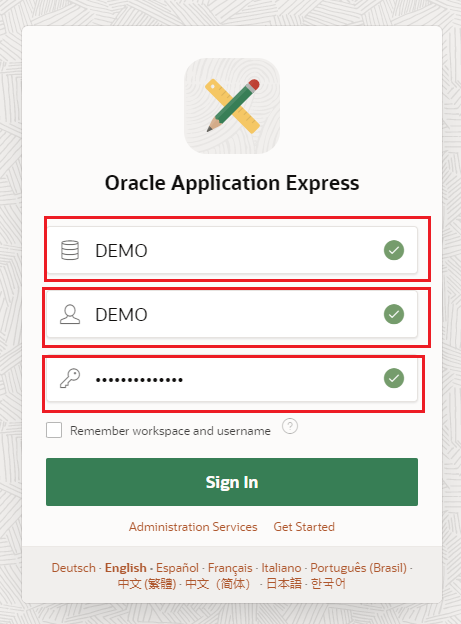

    **Oracle APEX** uses low-code development to let you build data-driven apps quickly without having to learn complex web technologies. This also gives you access to Oracle REST Data Services, that allows developers to readily expose and/or consume RESTful Web Services by defining REST end points.

8. On Oracle Cloud Infrastructure Console, click **Database Actions** next to the big green box. Allow pop-ups from cloud.oracle.com.

    

9. Click **Development** > **SQL** (first button).

    

10. Run the following code using **Run Script** button:

    ````
    <copy>
    BEGIN 
       ords_admin.enable_schema (
          p_enabled => TRUE,
          p_schema => 'DEMO',
          p_url_mapping_type => 'BASE_PATH',
          p_url_mapping_pattern => 'demo',
          p_auto_rest_auth => NULL
       ) ;
      commit ;
    END ; 
    /
    </copy>
    ````

    
    
    >**Note** : For all code you run in SQL Developer Web, make sure you receive a success message:

    ````
    PL/SQL procedure successfully completed.
    ````
    
        

11. Grant **SODA_APP** to DEMO user. This role provides privileges to use the SODA APIs, in particular, to create, drop, and list document collections. Use **Run Statement** button to execute this command.

    ````
    <copy>
    GRANT SODA_APP TO demo;
    </copy>
    ````

    

12. Click **ADMIN** upper right corner, and **Sign Out**. 

    

13. Click **Sign In**. Login using DEMO user credentials.

    - Username: demo
    - Password: DBlearnPTS#22_
    
    
    
14. Click **Development** > **JSON**, and follow the tips. This is the interface you will use to manage your JSON collections in this document store.

    


## Task 5: Develop micro-service with SODA for Python

Use SODA for Python on Oracle Autonomous JSON Database to develop a micro-service application that will allow you to insert and retrieve JSON documents using REST calls.

1. Use **Terminal** window on the DEVM Compute Node remote desktop. Create a new folder under `/home/oracle` as the location of the Python application. Create a Python virtual environment for development, and activate it. 
**Copy** the block of commands using Copy button, **paste** in Terminal window using **Shift+Ctrl+V**, and press **Enter** after it.

    ````
    <copy>
    mkdir python-simple-project
    cd python-simple-project
    pip3 install --user virtualenv
    virtualenv .
    . bin/activate
    </copy>
    ````
    
    
2. Use the **gEdit** text editor on Remote Desktop to create a file with the required libraries for the application.

    ````
    <copy>
    gedit requirements.pip
    </copy>
    ````

    

3. **Add** the following lines in requirements.pip, click **Save**, and **Close** the editor.

    ````
    <copy>
    Flask
    dnspython
    cx_Oracle
    pymongo
    </copy>
    ````
    
    

4. Use **pip** package installer for Python 3 to install the required libraries specified in the requirements.pip file.

    ````
    <copy>
    pip3 install -r requirements.pip
    </copy>
    ````

    

    You should see the installation of requirements.pip similar to the following:

    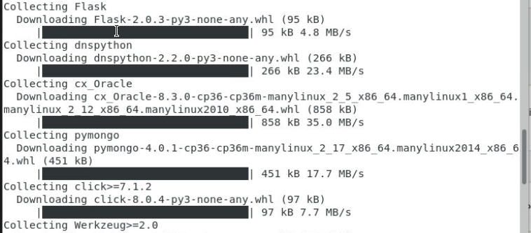

    

5. Use the **gEdit** text editor on Remote Desktop to create a file the Python application code.

    ````
    <copy>
    gedit simple-app.py
    </copy>
    ````
    

6. **Paste** the following code in simple-app.py file. Verify all connection variables are correct. Click **Save**, and **Close** the editor.

    ````
    <copy>
    # import required modules
    import json
    import cx_Oracle
    from flask import Flask
    from flask import request
    app = Flask(__name__)
    
    # set Oracle connection variables
    o_usr = "demo"
    o_pwd = "DBlearnPTS#22_"
    o_srv = "ajdev_tp"
    
    # create Oracle AJD connection, and set collection used by application
    conn_string = o_usr + '/' + o_pwd + '@' + o_srv
    connection = cx_Oracle.connect(conn_string)
    connection.autocommit = True
    soda = connection.getSodaDatabase()
    ocollection = soda.createCollection("SimpleCollection")
    
    # function used to insert JSON documents in Oracle
    @app.route("/oracle/", methods=['POST'])
    def insert_orcl_doc():
        req_data = request.get_json()
        ocollection.insertOne(req_data)
        return ('', 204)
    
    # function used to retrieve JSON documents from Oracle
    @app.route('/oracle/')
    def get_orcl_doc():
        documents = ocollection.find().getDocuments()
        response = []
        for document in documents:
            content = document.getContent()
            content['key'] = str(document.key)
            response.append(content)
        return json.dumps(response)
    
    # main program module
    if __name__ == '__main__':
        app.run(host= '0.0.0.0')
    </copy>
    ````
    

7. **Run** simple-app application. 

    ````
    <copy>
    python3 simple-app.py
    </copy>
    ````

    

    If you followed the steps correctly, you should see this output in the terminal. Leave this Terminal window like this in order to keep the micro-service running on port 5000.

        ````
        * Serving Flask app "simple-app" (lazy loading)
        * Environment: production
        WARNING: This is a development server. Do not use it in a production deployment.
        Use a production WSGI server instead.
        * Debug mode: off
        * Running on http://X.X.X.X:5000/ (Press CTRL+C to quit)
        ````
    
    

8. Use **Terminal** main menu to click **File** > **New Tab**, to open a new tab. 

    


9. Use the **new tab** to perform two POST request with CURL client.

    ````
    <copy>
    curl --request POST \
      --url http://localhost:5000/oracle/ \
      --header 'content-type: application/json' \
      --data '{
     "company":"Company One",
     "address": {
         "street": "22 Rue du Grenier Saint-Lazare",
         "city": "Paris",
         "country": "France"
     },
     "industry":"Financial Services",
     "employees":54234
    }'
    </copy>
    ````

    
        
10. Make sure you press **Enter** after each one.

    ````
    <copy>
    curl --request POST \
      --url http://localhost:5000/oracle/ \
      --header 'content-type: application/json' \
      --data '{
     "company":"Company Two",
     "address": {
         "street": "Calle Extramuros 74",
         "city": "Madrid",
         "country": "Spain"
     },
     "industry":"Retail",
     "employees":12345
    }'
    </copy>
    ````
    
    

11. Use the **web browser** on your laptop to navigate to your micro-service to list JSON documents inserted into Oracle Autonomous Database.

    http://[DEVM public-ip address]:5000/oracle/

    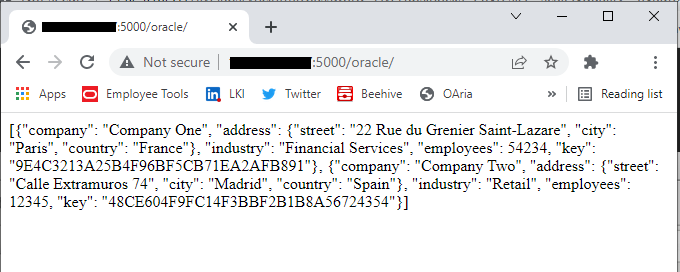
    
12. **Insert** two more documents into Oracle Autonomous Database using REST calls to the micro-service. Press **Enter** after this block.

    ````
    <copy>
    curl --request POST \
      --url http://localhost:5000/oracle/ \
      --header 'content-type: application/json' \
      --data '{
     "company":"Company Three",
     "address": {
         "street": "3A Evergreen St, Ballyphehane",
         "city": "Cork",
         "country": "Ireland"
     },
     "industry":"Manufacturing",
     "employees":98765
    }'
    curl --request POST \
      --url http://localhost:5000/oracle/ \
      --header 'content-type: application/json' \
      --data '{
     "company":"Company Four",
     "address": {
         "street": "aleje Mikołaja Kopernika 32",
         "city": "Piotrków Trybunalski",
         "country": "Poland"
     },
     "industry":"Manufacturing",
     "employees":44444
    }'
    </copy>
    ````
    
    

13. **Refresh** the **web browser** on your laptop to list all JSON documents inserted.

    http://[DEVM public-ip address]:5000/oracle/

    

14. **Go** to the first Terminal window where the micro-service is running on port 5000, and press CTRL+C to stop it.

    ````
    <copy>
    CTRL+C
    </copy>
    ````

    

    
## Task 6: The Advantage of Apex and SQL Knowledge

1. Use the **web browser** tab where Oracle Application Express (Apex) is opened, or open Apex from AJDEV using the browser on your laptop. If you need to **Sign In** again use the following credentials:

    - Database User: DEMO
    - Password: DBlearnPTS#22_
    - Workspace Name: DEMO

    Click **SQL Workshop** > **SQL Commands**. 

    
    

2. **Run** this SQL query:

    ````
    <copy>
    select TABLE_NAME from USER_TABLES;
    </copy>
    ````

    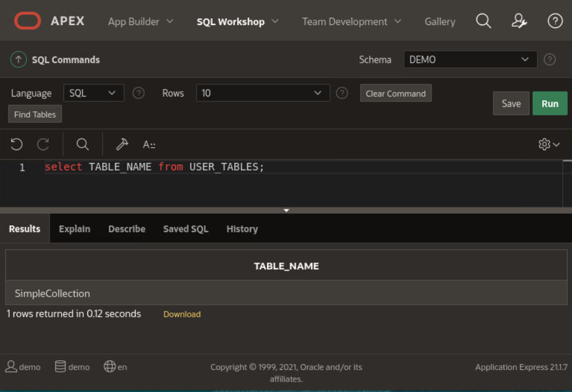

2. **Describe** the table that holds JSON documents data in the collection. The name of the column that stores JSON documents is JSON_DOCUMENT.

    ````
    <copy>
    desc "SimpleCollection"
    </copy>
    ````

    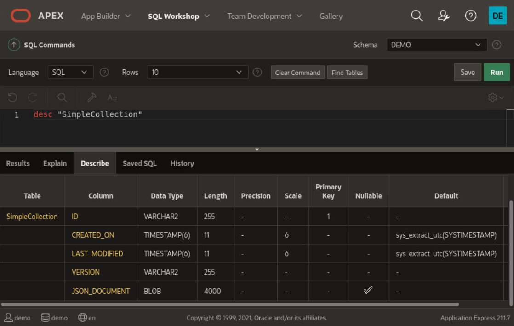

3. SQL dot-notation syntax is designed for easy queries to return JSON values from tables. **Run** a JSON dot-notation query.

    ````
    <copy>
    SELECT co.JSON_DOCUMENT.company, 
           co.JSON_DOCUMENT.address.country Country, 
           co.JSON_DOCUMENT.address.city City, 
           co.JSON_DOCUMENT.industry, 
           co.JSON_DOCUMENT.employees 
        FROM "SimpleCollection" co;
    </copy>
    ````

    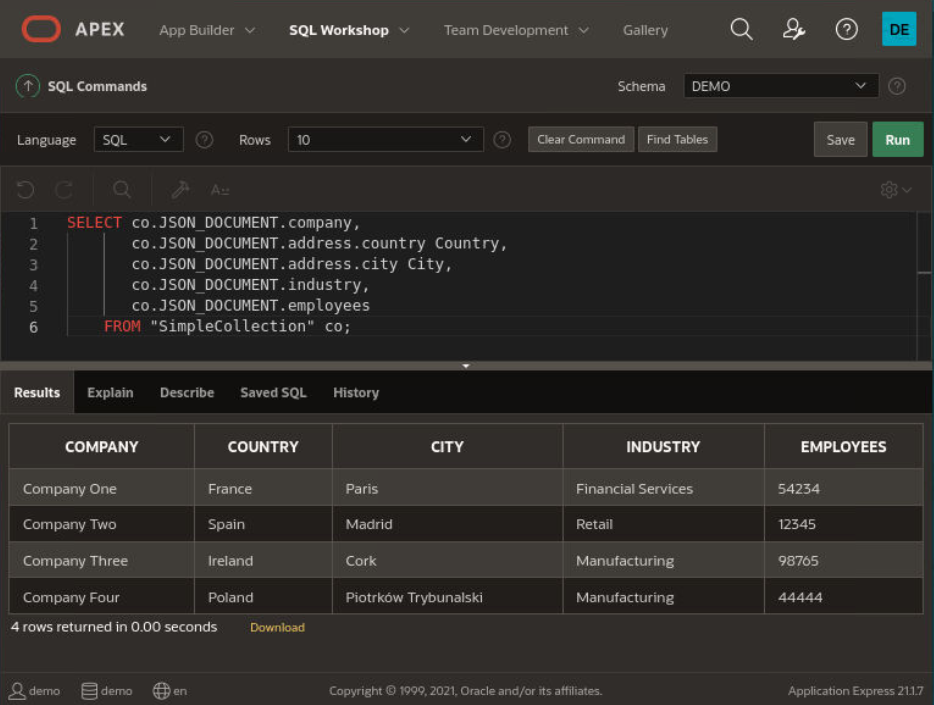

4. JSON data can be accessed via SQL from your applications. Click **App Builder** > **Create**. 
    
    

5. Click New **Application**.

    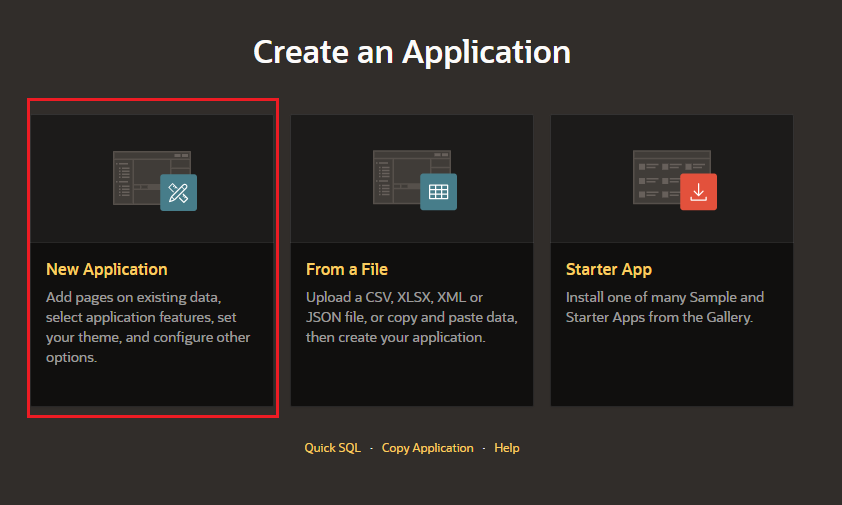

6. Provide the following information:

    - Name: Companies
    - Click Click **Add Page**
    
    

    -  Interactive Report.

    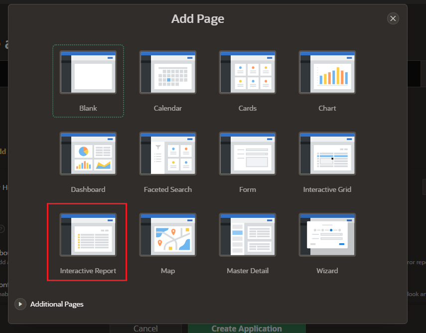

    - Page Name: Report
    - SQL Query:
    - Click **Add Page**
    ````
    <copy>
    SELECT co.JSON_DOCUMENT.company, 
           co.JSON_DOCUMENT.address.country Country, 
           co.JSON_DOCUMENT.address.city City, 
           co.JSON_DOCUMENT.industry, 
           co.JSON_DOCUMENT.employees 
        FROM "SimpleCollection" co;
    </copy>
    ````

    
    
    - Click Create Application
    
    

    The application will be create immediatly.

    
        
7. Click **Run Application**. 

    

8. **Log In** to Companies using the following credentials:

    - Username: demo
    - Password: DBlearnPTS#22_

    

9. Click **Report**. 

    
    
    You can see the Four Companies that we have inserted on the previous Task.
    
    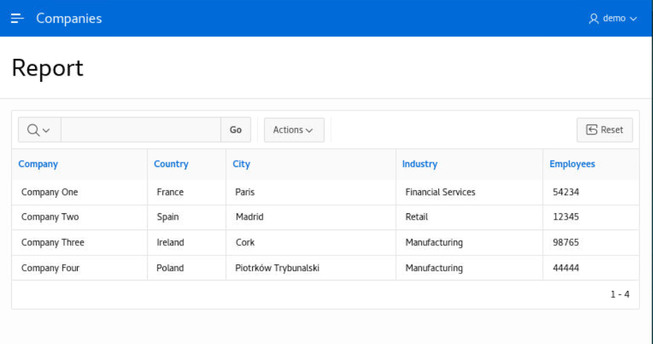
    
    With Oracle Autonomous Database as a document store, JSON data is valued in the same way as relational data.

*You can proceed to the next lab…*

## Acknowledgements
* **Author** - Valentin Leonard Tabacaru, Database Product Management
* **Contributors** - Priscila Iruela, Technology Product Strategy Director
* **Last Updated By/Date** - Priscila Iruela, March 2022

## Need Help?
Please submit feedback or ask for help using our [LiveLabs Support Forum](https://community.oracle.com/tech/developers/categories/livelabsdiscussions). Please click the **Log In** button and login using your Oracle Account. Click the **Ask A Question** button to the left to start a *New Discussion* or *Ask a Question*.  Please include your workshop name and lab name.  You can also include screenshots and attach files.  Engage directly with the author of the workshop.

If you do not have an Oracle Account, click [here](https://profile.oracle.com/myprofile/account/create-account.jspx) to create one.