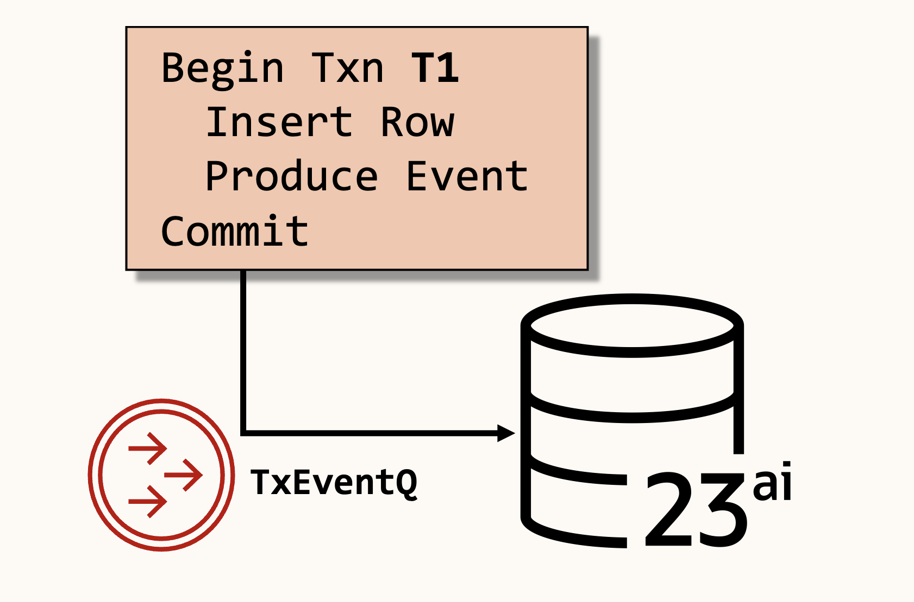

# Event Streaming with Transactional Event Queues (TxEventQ)

## Introduction

In this lab, we will add event streaming support to the customer service application, using "ticket created" events to trigger additional asynchronous processing.

Our event streaming implementation is enabled by Oracle Database Transactional Event Queues (TxEventQ), a high-throughput event streaming system built directly into the database.

The customer service application will use the [Oracle Kafka Java Client for Transactional Event Queues](https://github.com/oracle/okafka) (okafka) to asynchronously stream events with a developer-friendly, kafka-clients compatible API.

Estimated Lab Time: 15 minutes

### Objectives

In this lab, you will:

* Enable the `events` Spring Boot profile
* Test it asynchronous event processing.

### Prerequisites

This lab assumes you have:

* All previous labs successfully completed

## Task 1: Enable the `events` profile

Replace the `rest` profile with the `events` profile, enabling asynchronous event streaming:

```yaml
spring:
  profiles:
    active: events
```

The events profile turns on Spring beans using the [Oracle Kafka Java Client for Transactional Event Queues](https://github.com/oracle/okafka) (okafka) to asynchronously stream events.

With the events profile the following features are enabled:
- On app startup, a new topic `ticket_event` is created
- When tickets are created via POST, an event is published to the `ticket_event` topic
- A consumer subscribes to the `ticket_event` topic
  - When the event is consumed, it's printed to console.

In the next lab, we'll update the ticket event consumer to use GenAI processing with AI vector search.

# Task 2: Create a ticket and produce an event

Now, let's create a new support ticket and observe asynchronous event processing.

Restart the application with the events profile enabled and run the following cURL request:

```bash
curl -X POST -H 'Content-Type: application/json' \
  "http://localhost:8080/tickets" \
  -d '{
  "title": "Login fails with 500 error",
  "description": "Users occasionally receive a 500 Internal Server Error when trying to log in through the main portal. Started happening after the latest update."
}'
```

As the ticket is created, it is also published as a "ticket created" event to the `ticket_event`
 topic. 

When the ticket event is processed, you will see a message printed to the console reading:

```
Processing Ticket Event: <ticket data>
```

## Task 3: Understanding Transactional Messaging

Because events are published and consumed using database transactions, the customer service application (or any application) can easily combine database operations with event operations.

When we produce or consume an event, we begin a database transaction. During this transaction, we can insert, update, or otherwise run database queries atomically.



Transactional Messaging provides a simple implementation of the popular [Transactional Outbox Pattern](https://microservices.io/patterns/data/transactional-outbox.html) utilized in microservices architecture - ensuring and simplifying data consistency.

## Task 4: Using OSON as the Event Serialization Format

OSON is Oracle Database's optimized JSON storage format. The customer service application uses OSON as the serialization layer for Java objects transmitted to TxEventQ topics.

Not only is OSON an efficient JSON serialization format, it also enables the use of Oracle Database JSON features without requiring application changes. We'll see this in action in the JSON lab.

You may now proceed to the next lab.

## Learn More

* [Transactional Event Queues (TxEventQ)](https://www.oracle.com/database/advanced-queuing/)
* [Oracle Kafka Java Client for Transactional Event Queues](https://github.com/oracle/okafka)

## Acknowledgements

* **Author** - Mark Nelson, Developer Evangelist, August 2025
* **Contributors** - Mark Nelson, Anders Swanson
* **Last Updated By** - Mark Nelson, August 2025
