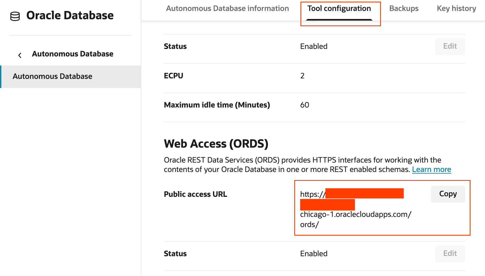

# Oracle REST Data Services (ORDS)

## Introduction

In this lab, we will use Oracle Rest Data Services (ORDS) to automatically create HTTP routes for the TICKET_DV JSON Relational Dualtiy View - exposing generated GET, PUT, POST, and DELETE HTTP methods using simple SQL commands.


Estimated Lab Time: 15 minutes

### Objectives

In this lab, you will:

* Enable the TESTUSER schema for ORDS
* Enable the TICKET_DV duality view for ORDS
* Experiment with ORDS REST APIs

### Prerequisites

This lab assumes you have:

* All previous labs successfully completed

## Task 1: Enable Schema for ORDS

First, enable the TESTUSER schema with ORDS. `support` is chosen as the base URL mapping pattern for the TESTUSER schema:


```sql
begin
   ords.enable_schema(
      p_enabled             => true,
      p_schema              => 'TESTUSER',
      p_url_mapping_type    => 'BASE_PATH',
      p_url_mapping_pattern => 'support',
      p_auto_rest_auth      => false
   );
commit;
end;
/
```

## Task 2: Enable Object for ORDS

Next, enable the TICKET_DV JSON Relational Duality view within the TESTUSER schema. The duality view is exposed for REST API access on the `ticket` HTTP route: 

```sql
begin
   ords.enable_object(
      p_enabled      => true,
      p_schema       => 'TESTUSER',
      p_object       => 'TICKET_DV',
      p_object_type  => 'VIEW',
      p_object_alias => 'ticket'
   );
commit;
end;
/
```

Now, the TICKET_DV JSON Relational Duality View is available on the `/support/ticket/` route!

## Task 3: Find your ORDS URL

To test things out, you’ll need your ORDS URL from the Tool Configuration -> Web Access (ORDS) section of the Autonomous Database UI. If you’re running ORDS elsewhere, you’ll need to use that HTTP/S endpoint.



Once you have your ORDS URL, set it in your shell environment, so it can be used with cURL.

```bash
export ORDS_URL='https://<my database>.adb.<region>.oraclecloudapps.com/ords'
```

## Task 4: Query the TICKET_DV object with ORDS

We can fetch all tickets with a simple GET, which returns an items array of all support tickets in the database:

```bash
curl -X GET $ORDS_URL/support/ticket/ -u "$DATABASE_USERNAME:$DATABASE_PASSWORD"
```

We can also GET tickets by ID, or use query parameters for pagination or filtering:

```bash
curl -X GET $ORDS_URL/support/ticket/1 -u "$DATABASE_USERNAME:$DATABASE_PASSWORD"
```

Using query parameters:

```bash
curl -X GET "$ORDS_URL/support/ticket/?title=xyz" -u "$DATABASE_USERNAME:$DATABASE_PASSWORD" 
```

HTTP methods for PUT, POST, and DELETE are also automatically implemented by ORDS, simplifying your deployment. For examples using PUT, POST, and DELETE, see the [ORDS Develoeper Guide]([Oracle REST Data Services](https://docs.oracle.com/en/database/oracle/oracle-rest-data-services/index.html))

You may now proceed to the next lab.

## Learn More

* [Oracle REST Data Services](https://docs.oracle.com/en/database/oracle/oracle-rest-data-services/index.html)

## Acknowledgements

* **Author** - Mark Nelson, Developer Evangelist, August 2025
* **Contributors** - Mark Nelson, Anders Swanson
* **Last Updated By** - Mark Nelson, August 2025
