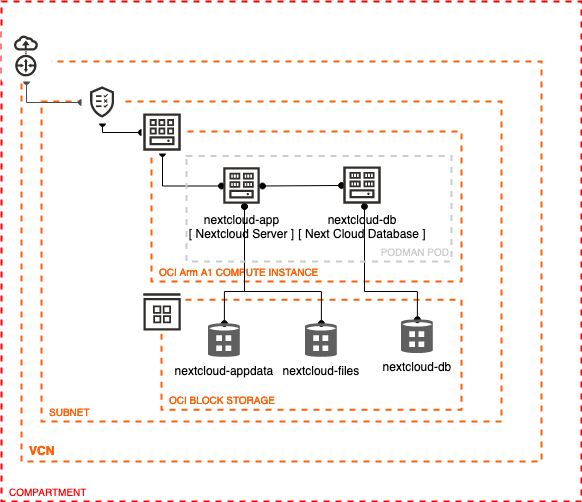

# Deploy Nextcloud on Ampere A1 in Oracle Cloud Infrastructure

Estimated time: 45 minutes
Note : This lab can be performed on a Free Trial, Always-Free Tier, or paid subscription accounts. 

## Introduction

In this tutorial, you will install Nextcloud, the popular open source collaboration platform on Oracle Cloud Infrastructure (OCI). You will use a single Ampere A1 compute instance for the Nextcloud server. You shall also run Nextcloud as a set of containers, using Podman. Podman is a container engine for managing and running containers using the Open Container Initiative standards. It offers full API compatibility with Docker and acts as a drop in replacement for the `docker` command. It however offers some benefits compared to Docker, which include a daemonless architecture, support for rootless containers and cgroupsv2 support.

Nextcloud offers docker container images which support the Arm architecture. Nextcloud also requires a database, for which we can use MySQL or MariaDB. For more scalable deployments, you can consider using the MySQL database service on OCI which makes it easy to scale, back up and manage your MySQL database. 

Data created inside a container is not persisted, and Nextcloud requires persistent storage to store the files we upload, and for internal state. To persist data, we can use volumes using the OCI Block Storage service. A volume is a storage device created and managed by Podman. Volumes are created directly using the `podman volume` command or during container creation.  

To enable the Nextcloud web based UI and the services, we need to make the necessary changes to the OCI Network security list to allow traffic.   

With these components, we have a basic topology for our deployment.

### Objectives

In this lab, you will:

* Create an OCI Arm A1 compute instance 
* Prepare the compute instance for deploying containerized applications
* Deploy Nextcloud as a set of containers.
* Connect the application and setup file sync.
* Clean up the deployments

### Prerequisites

1. An Oracle Free Tier(Trial), Paid or LiveLabs Cloud Account
1. [Familiarity with OCI console](https://docs.us-phoenix-1.oraclecloud.com/Content/GSG/Concepts/console.htm)
1. [Overview of Networking](https://docs.us-phoenix-1.oraclecloud.com/Content/Network/Concepts/overview.htm)
1. [Familiarity with Compartments](https://docs.us-phoenix-1.oraclecloud.com/Content/GSG/Concepts/concepts.htm)
1. Basic conceptual knowledge of containers and [Podman](https://podman.io/)

## Learn More

* [Cloud Native on OCI using MuShop sample](https://oracle-quickstart.github.io/oci-cloudnative/)
* [Reference Architecture: Deploy a microservices-based application in Kubernetes](https://docs.oracle.com/en/solutions/cloud-native-ecommerce/index.html#GUID-CB180453-1F32-4465-8F27-EA7300ECF771)
* [Overview of Functions](https://docs.cloud.oracle.com/en-us/iaas/Content/Functions/Concepts/functionsoverview.htm)

## Acknowledgements

* **Author** - Jeevan Joseph
* **Contributors** -  Orlando Gentil, Jeevan Joseph
* **Last Updated By/Date** - Jeevan Joseph, April 2021
