# A B2B Outbound Scenario

## Introduction

ACME Corp sends an 850 Purchase Order EDI document to Trading Partner Dell Inc. ACME Corp had configured OIC B2B message exchange agreement to send Purchase Order EDI document to External Trading Partner.

This integration takes the input as XML from a Rest Client. In a real world use case you would have the XML originating from a Source System like ERP Cloud or NetSuite. A Backend App Integration transforms XML into EDI X12 format using EDI Translate functionality and sends the EDI document to B2B Integration to send across to External Trading Partner (Dell Inc)


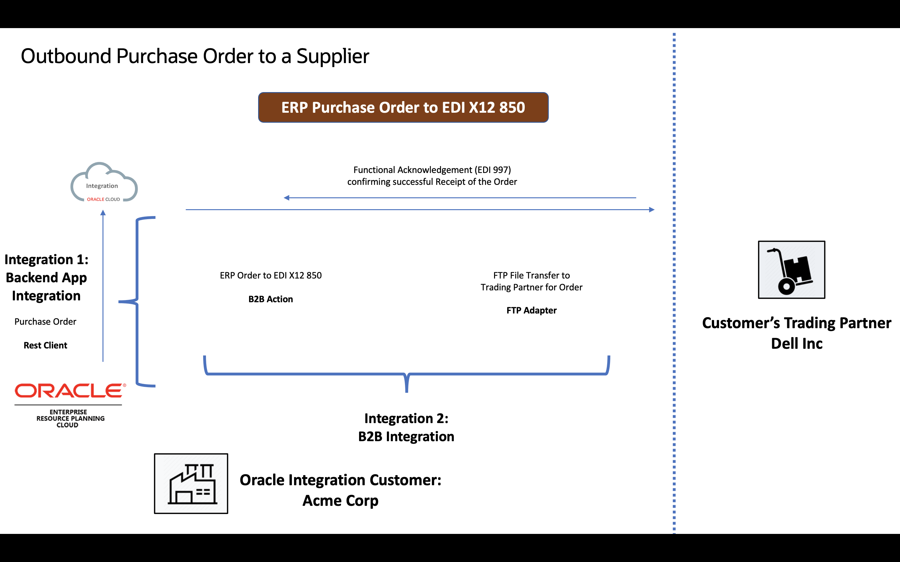

High level steps of the Integration:
| Step | Description |
| --- | --- |
| 1 | Your backend application has a requirement to send a business transaction to an external trading partner. It triggers your outbound backend integration by sending it as a notification message.|
| 2 |Your backend integration instance receives the notification that includes the application message in the backend application message format|
| 3 |Using a mapper, the backend application message is transformed into a B2B canonical XML format.|
| 4 |The canonical XML message is provided to a B2B action for outbound translation (the action named EDI-Generate above). A trading partner is specified as an input to the B2B action. The B2B action translates the canonical XML message to a native EDI format (X12 or EDIFACT) and persists it in the Oracle Integration persistence store. A unique ID is assigned to it.|
| 5 |Based on the target trading partner, the current document type, and the outbound agreements defined for the trading partner, an appropriate B2B integration for sending messages is triggered. The message ID is handed to it.|
| 6 |The B2B integration for sending messages instance starts and receives the message ID at its REST Adapter trigger endpoint.|
| 7 |The B2B integration for sending messages instance uses an adapter (AS2 or FTP) to pack the message and then transmit it to the external trading partner through the AS2 or FTP protocol.|


Estimated Time: 60 minutes

### Objectives

In this lab, you will create a basic integration flow to process the EDI document and send it to the Trading partner.
* Create an App Driven Integration flow to receive an XML document
* Configure EDI Translate Action to convert XML to EDI X12 format
* Define relevant mappings to send an Outbound Message
* Monitor Business Messages, Backend Integration and Trading partners.
* Verify Dynamic routing for multiple trading partners
* Verify success and failure paths


### Prerequisites
> **Note** : This Lab assumes you have completed all the previous labs. Importantly, [Lab5:B2B Schemas and Documents](../workshops/freetier/?lab=b2b-documents-schemas) & [Lab6: B2B Trading Partner Manager](../workshops/freetier/?lab=b2b-trading-partner-manager)

> **Note**: [Download Lab Artifacts](../workshops/freetier/?lab=setup#Task5:DownloadLabArtifacts) if, not done in previous sections

## Task 1: Create an Integration

Let's create a basic, outbound integration flow that receives an XML document through a REST request, converts it to EDI X12 format, and invokes corresponding trading partner.

Note: This integration flow uses REST for simplicity. You can substitute the REST Adapter trigger connection with any other adapter, such as the FTP Adapter, NetSuite Adapter, ERP Cloud Adapter, available in Oracle Integration


1. In the **Navigation pane**, click ***Integrations***

2. On the **Integrations page**, click ***Create***

3. Select **App Driven Orchestration** as the style to use. The **Create New Integration** dialog is displayed.

    enter the Name of the integration per the value given below and then click on ***Create***
    ```
    <copy>PO Backend</copy>
    ```

4. Change Layout to **Horizontal**

## Task 2: Configure the REST Adapter Trigger Connection
On the integration canvas, click the ***start node*** and select ***REST Interface*** as the trigger connection.
The Adapter Endpoint Configuration Wizard opens

1. On the **Basic Info** page, enter the following details
    - In the What do you want to call your endpoint? field, enter the below value.
    ```
    <copy>Receive-App-Msg</copy>
    ```
    - Enter the ***endpoint's relative resource URI*** per the value given below
    ```
    <copy>/outbound</copy>
    ```
    - Select ***POST*** as the action to perform on the endpoint.
    - Select to configure both **request** and **response** for this endpoint and click on ***Next***
    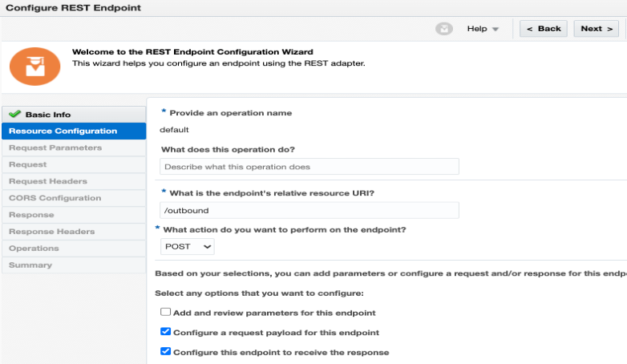

2. On the **Request** page:
    - Select ***XML Schema*** in the **Select the request payload** format field.
    - Click on ***Choose File*** and upload the file **AcmePurchaseOrder.xsd** from the lab artifacts folder **b2b-getting-started\b2b-outbound-x12-ftp** [Refer Download Lab Artifacts](../workshops/freetier/?lab=setup#Task5:DownloadLabArtifacts) and click on ***Next***
    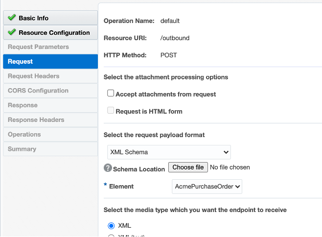
3. In the **Response** page:
    - Select ***XML Schema*** in the response payload format field
    - Click on ***Choose File*** and upload the file **PurchaseOrderResult.xsd** from the lab artifacts folder **b2b-getting-started\b2b-outbound-x12-ftp**
    - Click ***Next***, and on the Summary page, click ***Done*** to complete the REST Adapter configuration.
    - The integration flow is now represented as follows in the canvas and click on ***Save*** to save your integration flow
    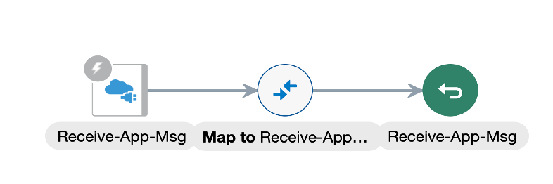

## Task 3: Configure the EDI Translate Action
Add an EDI translate action to the flow to translate XML document to an EDI document
1. On the right side of the canvas, click ***Actions***  , drag & drop ***B2B action*** on the designer after the first **Receive-App-Msg** element.
The **Configure B2B Action** wizard opens
    - On the **Basic Info** page, enter the **name** per the value given below for the action and select a mode as ***B2B Trading Partner mode***, and click **Next**

    ```
    <copy>EDI-Generate</copy>
    ```
    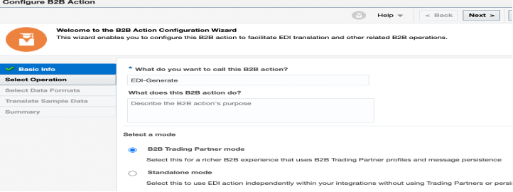
    - Select ***Operation*** as **Outbound**
   
    - Select ***Document Definition*** as **Purchase Order** (You must have created this as part of B2B activities) and click on ***Next***
   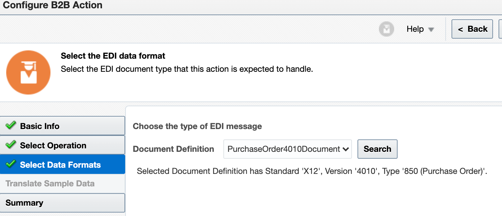
    - Review the ***Summary page***, click on ***Done*** to complete the configuration and click on ***Save*** to save your integration flow. Click on ***RESET*** if required for a better view of your integration flow.
   Note that the corresponding mapping element is automatically added to the integration flow
   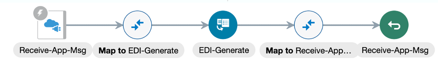
## Task 4: Configure Mapping Actions
Configure data mappings for the EDI-Generate action and Receive-App-Msg action in order to successfully parse the incoming XML message and translate it to EDI message.

1. Click the ***Map to EDI-Generate*** action and select ***Edit***
2. Click on ***Developer*** mode
   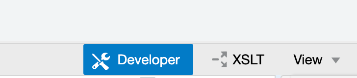
3. From Source, expand the ***root element***, expand ***AcmePurchaseOrder*** and From Target, expand the ***root element***, expand ***TranslateInput***, expand ***edi-xml-document***, expand ***transaction-data*** and **map** all the mandatory elements given below.

| Source | Target |
| --- | --- |
| “00” | BEG01 |
| “NE” | BEG02 |
| orderNumber | BEG03 |
| drag and drop format-DateTime function from the Components onto the BEG05 and create a string as given here: xp20:format-dateTime (/nssrcmpr:execute/tns:AcmePurchaseOrder/tns:orderDate, "[Y0001][M01][D01]" )| BEG05 |
|  count (/nssrcmpr:execute/tns:AcmePurchaseOrder/tns:lineItems )  | CTT01 |
| totalAmount | CTT02 |
| “2L” | CUR01 |
| currencyCode | CUR02 |
| currencyConversionRate | CUR03 |
| lineItems | Loop-PO1 |
| lineItems > SKU | PO101 |
| lineItems > Quantity | PO102 |
| lineItems > unitOfMeasure | PO103 |
| lineItems > price | PO104 |
| tradingPartnerId | Application Partner ID(This element is there under TranslateInput Node) |

Once you are done with the validation, test it and results should look like the screenshot given below.
   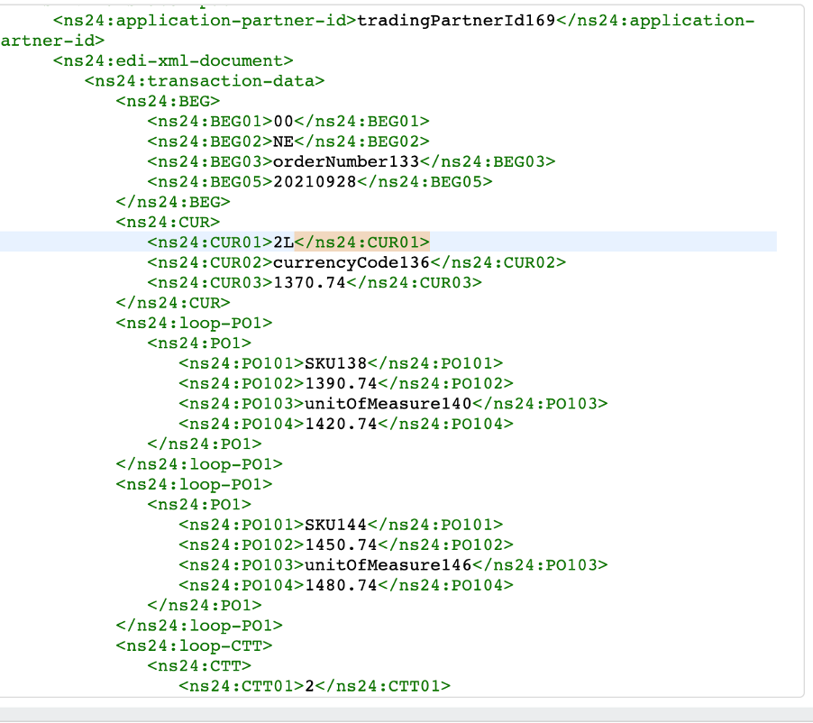

4. Click ***Validate*** and then Select ***Close***
5. Save your integration flow.
## Task 5: Switch action after EDI-Generate activity
1. Add a ***Switch*** action after the **EDI-Generate** activity
    - For the **If branch**, Enter the Expression Name as **Success or Warning** and enter the following expression under Expression section. (You may have to select Expression Mode to enter the value given below). If there is an error on namespaces then you can search for **translation-status** and select that element for mapping.

    ```
    <copy>$EDI-Generate/nsmpr6:executeResponse/nsmpr9:TranslateOutput/nsmpr9:translation-status ="Success"</copy>
    ```
    Note:Your namespace prefix may include different values than nsmpr9 and nsmpr6.
This expression indicates that if **TranslateOutput > translation-status** has a value of **Success**, then take this route. This is referred to as the success route
    - Click on ***Validate*** and Click on ***Close*** and Save your integration flow
    - In the success route: Add ***Integration*** Action. Enter name as **callTradingPartner** and select **DELL FTP Send Integration** (OR any other outbound B2B integration which you have created) and click on ***Next***. Click on ***Next***. Finally, Select ***Done*** and ***Save*** your integration flow
    - Edit **Map to callTradingPartner** > Select **Developer mode** and From Source, expand **EDI-Generate > executeResponse > TranslateOutput**
| Source | Target |
| --- | --- |
| B2B Message Reference | components.schemas.request-wrapper>messages>b2b-message-reference |
| Trading Partner Name | components.schemas.request-wrapper>trading-partner |
| connectivity-properties-code | Connectivity Properties>Localintegration>code |
| connectivity-properties-version | Connectivity Properties>Localintegration>version |

    - Click on ***Validate*** and Click on ***Close*** and ***Save*** your integration flow
    - In Otherwise route: Add ***Throw New Fault Action***. Enter name as **Error**. Click on ***Create*** and map the below elements

    $EDI-Generate/nsmpr7:executeResponse/nsmpr10:TranslateOutput/nsmpr10:validation-error to Code
    AND
    $EDI-Generate/nsmpr7:executeResponse/nsmpr10:TranslateOutput/nsmpr10:validation-error-report to Reason
    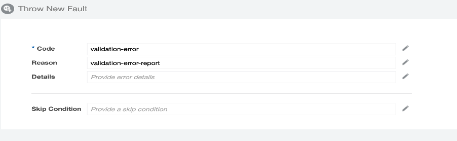
    - Validate and Close. Save your integration flow.
    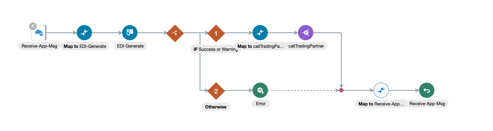

## Task 6: After Switch activity
1. Edit ***Map to Receive-App-Msg*** activity.
2. From Source, expand **EDI-Generate Response > executeResponse> TranslateOutput** and From Target, expand **Purchase Order Result** and map the following elements per the table given below.
| Source | Target |
| --- | --- |
| Translation Status | Translation Status |
| Validation Error Report | Validation Error Report |

3. After completing all the mappings, you can cross check by leveraging Test feature available on Mapper and Click on ***Validate***, Click on ***Close*** and finally Save your integration flow.

## Task 7: 	Add Tracking Identifiers for Integration Tracking

1. Click ***Actions*** Menu  in the top-right corner of canvas, and select ***Tracking***
2. In the resulting dialog, select **orderNumber** on the left and move it to the table on the right and click on ***Save***
3. Check for errors, ***Save*** the integration and click ***Close***
   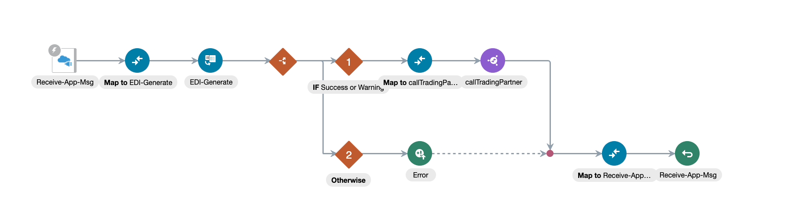


## Task 8:  Activate the Integration

Check for errors, ***save***, and ***activate*** the integration flow.
1.	On the Integrations page, click on the ***Activate*** button against your integration to activate it.
2.	Click ***Activate*** in the Activate Integration dialog and select ***Enable Tracing*** and ***Include Payload*** options


## Task 9: Test the integration

1. To execute your sample integration, send a request from a REST client tool, such as Postman OR you can use Oracle Integration console to test. Let us use Oracle Integration Test Console.

2. Open the file **DellIncPO.xml** (from the lab artifacts folder **b2b-getting-started\b2b-outbound-x12-ftp**) and copy the data and paste it in the body of the request console and click on ***Test***
  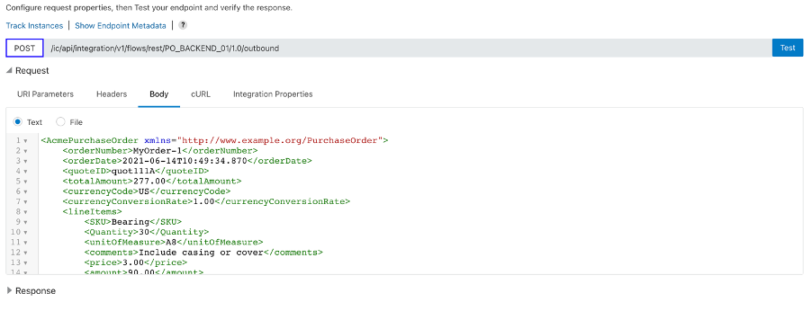
3. Go to **Monitoring >Integrations >Tracking** Cross check your backend integration and trading partner integration ran successfully.
4. If you have FTP Client installed on your machine, you can login using the FTP details provided to you and cross check your EDI file created under folder **/B2BWorkshop/B2BTPDELLOut**
5. In conclusion, you can use Oracle Integration to accept XML message and convert it into EDI format and send it to the trading partners dynamically.

This feature will very much useful when we have more than one trading partner. We just define the trading partner on the user interface, integrations will be created automatically and files will be processed with the existing Backend Integration.

## Task 10: Monitoring

1. Navigate to **Menu > Monitoring > B2B Tracking** page. You should see Business Messages under the Business Messages Tab for your specific Trading Partner.

Tip:  Select the Filter to search based on Trading Partner Name

2. Click on the ***View*** icon and inspect **Message Logs, Payload**

3. Navigate to **Menu > Monitoring > Integrations >Tracking** page. You should see the backend integration and trading partner related integrations.

## Task 11: Exercise(Optional)

In this exercise, you would be creating a new trading partner(US Gas and Electric) and pre-requisites required for integrating with this trading partner.
1. Create two folders **B2BTPUSGEIn** and **B2BTPUSGEOut** under B2BWorkshop folder in the File Server and provide permissions.

Follow the instructions from Step5 to Step9 given under [Setup the Environment](../workshops/freetier/?lab=setup#Task1:ConfigureFileServer)

2. Create a trading partner and corresponding agreements with the details given below. You can refer [Lab: B2B Trading Partner Manager-Task2 and Task3](../workshops/freetier/?lab=b2b-trading-partner-manager)

| Identifier Name | Identifier Value |
| --- | --- |
| Trading Partner Name | US Gas and Electric |
|Email|**Use your email id**|
|EDI Interchange ID Qualifier|SS|
|EDI Interchange ID|US Gas and Electric|
|EDI Group ID|02|
|EDI Group ID Qualifier|US Gas and Electric|
|Application Partner ID|US Gas and Electric|
|Input Directory|/B2BWorkshop/B2BTPUSGEIn|
|Output Directory|/B2BWorkshop/B2BTPUSGEOut|
|Output File Name|Order-%SEQ%.edi|
|Integration name prefix|USGE|
3. ***Deploy*** the **Transport and Agreements** if not deployed.
4. Copy&Paste the payload from **USGEPO.xml** (from the lab artifacts folder **b2b-getting-started\b2b-outbound-x12-ftp**)
5. Go back to Integrations and test using the new trading partner as you did for DellInc
[Refer previous task "Test the integration"](../workshops/freetier/?lab=b2b-outbound-x12-ftp#Task9:Testtheintegration)
6. Monitor the trading partner and backend integrations.

You may now **proceed to the next lab**.

## Learn More

* [Oracle B2B Documentation](https://docs.oracle.com/en/cloud/paas/integration-cloud/btob.html)
* [What's New](https://docs.oracle.com/en/cloud/paas/integration-cloud/whats-new/index.html)


## Acknowledgements
* **Author** - Subhani Italapuram, Technical Director, Oracle Integration Product Management
* **Contributors** -  Kishore Katta, Oracle Integration Product Management
