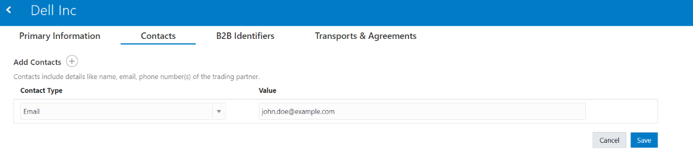
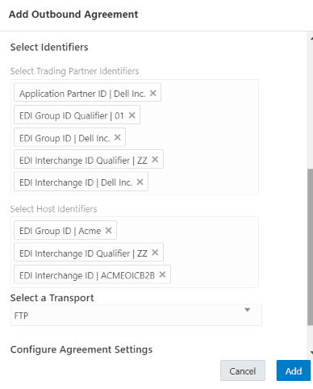

# B2B Trading Partner Manager

## Introduction

This lab walks you through the steps to work with Trading Partner Manager.

Estimated Time: 20 minutes

### Objectives

In this lab, you will learn:

* Configure the Host Profile.
* Create Trading Partners.
* Create Trading Partner Transports.
* Create Trading Partner Agreements.

### Prerequisites

This lab assumes you have:

* All previous labs successfully completed.
* Completed [B2B Concepts](../workshops/freetier/?lab=gettingStartedB2B) Lab which explains B2B concepts at a high level.

## Task 1: Configure the Host Profile

Configuring the Host Profile requires:

* Enter your Company Name.
* Add the required Identifiers.

For this lab you will add the following Identifiers.

### *Host Profile Identifiers*

| Identifier Type | Purpose |
| --- | --- |
| EDI Interchange ID           | Mandatory for all EDI data formats. This identifier is used as the Interchange Sender ID field of the interchange envelope (ISA segment for X12 and UNB segment for EDIFACT).For an outbound message, this value is inserted as the Interchange Sender ID. For an inbound message, this identifier (from the host profile) is not used. |
| EDI Interchange ID Qualifier | Mandatory for X12 and optional for EDIFACT.This identifier is used as the Interchange Sender ID Qualifier field of the interchange envelope of the EDI payload. It's a code to indicate the category of the value specified in the EDI Interchange ID (for example, DUNS number, IATA number, and so on).For an outbound message, this value is inserted as the Interchange Sender ID Qualifier. For an inbound message, the value (from the host profile) is not used. |
| EDI Group ID                 | Mandatory for X12 and optional for EDIFACT.For an outbound X12 message, this value is inserted in the GS segment as the Application Sender's Code.For an inbound message, the value from the host profile is not used. |
| EDI Group ID Qualifier       | Only used for EDIFACT. In that, it is also optional. It's a code to indicate the category of the value specified in the EDI Group ID (for example, DUNS number, IATA number, and so on). |

### *Create the Host Profile*

1. In the left navigation pane, click ***Host Profile***
2. In the **Host Company Name** field, enter ***Acme*** as your company name.  
The name is currently only for reference and not used elsewhere.
3. Select an Identifier or, if none are defined, click **Add Identifiers** ***+***. You add Identifiers to the Host Profile on behalf of your company.  
Note: This is typically a one-time activity that you perform before adding your first trading partner. Host Identifiers define your company when acting as the host interacting with other trading partners. They identify and validate the source of the document when sent by the host. Identifiers defined here are used in two places:  
    * Transports.
    * Outbound Agreements.
4. Create the following Identifiers:  
| Identifier Type              | Value      |
| ---                          | ---        |
| EDI Interchange ID           | ACMEOICB2B |
| EDI Interchange ID Qualifier | ZZ         |
| EDI Group ID                 | Acme       |
| EDI Group ID Qualifier       | 01         |

5. Click ***Save***.

Note: If you change the Host Identifier value used in a deployed Agreement, the changes only take effect after you explicitly redeploy the Agreement between the Host and the Trading Partner.

## Task 2: Create Trading Partners

You can create and manage Trading Partners. A Trading Partner is the external business entity with which your company interacts to send or receive business documents, such as orders and invoices, in electronic form.

Refer to [B2B Concepts](../workshops/freetier/?lab=gettingStartedB2B) lab for more information on Trading Partners.

1. In the left navigation pane, click ***Trading Partners***
2. Click ***Create***. Enter the Trading Partner **Name** as ***Dell Inc*** and an optional description. The **Identifier** field is automatically populated with a unique Trading Partner identifier. Click ***Create***.

### *Define Contacts*

You can add ways to contact the trading partner, such as their name, email, phone number, or short message service (SMS) number. You can select from the predefined Contact Types or enter your own custom Contact Type. Use this information to contact individuals offline, as needed. Contacts are currently provided only for reference and are not used in Oracle Integration B2B.

1. Click the ***Contacts*** tab. Select **Contact Type** as ***Email***. Enter your email id in the **Value** column and click ***Save***  

### *Define B2B Identifiers*

You collect identifying information from your external trading partner and enter it on their behalf in the B2B Identifiers section. This is very similar, in concept, to the identifiers specified under Host Profile Identifiers. In a message exchange, the Host Identifiers and Trading Partner Identifiers are used in the role of a sender or receiver, depending on the message direction.

Understand the Identifiers that we will use.

| Identifier Type              | Purpose |
| ---                          | --- |
| EDI Interchange ID           | Mandatory for all EDI data formats. This identifier is used as either the Interchange Sender or Receiver ID field of the interchange envelope. For an outbound message, this value is inserted as the Interchange Receiver ID. <ul><li>For an inbound message, this identifier is used as the Interchange Sender ID to identity a trading partner as a sender of a message</li><li>For an inbound message, this identifier is used as the Interchange Sender ID to identity a trading partner as a sender of a message.</li></ul> |
| EDI Interchange ID Qualifier | Mandatory for X12 and optional for EDIFACT. It is a code to indicate the category of the value specified in the EDI Interchange ID (for example, DUNS number, IATA number, and so on). For an outbound message, this value is inserted as the Interchange Receiver ID Qualifier.|
|EDI Group ID                 | This is mandatory for X12 and optional for EDIFACT. <ul><li>For an outbound X12 message, this value is inserted in the GS segment as the Application Receiver's Code</li><li>For an inbound message, this value is used only in case the EDI Interchange ID, on its own, is not enough to uniquely identify a trading partner</li></ul> |
| EDI Group ID Qualifier       | It is a code to indicate the category of the value specified in the EDI Group ID (for example, DUNS number, IATA number, and so on).Only used for an outbound message, to insert as EDI Group ID Qualifier, if specified|01|
|Application Partner ID|Optionally used as an alternate way to specify which trading partner to which to route an outbound message. |

1. Click the ***B2B Identifiers*** tab.
2. Select an Identifier or, if none are defined, click **Add Identifiers** ***+***.
3. Create the following Identifiers:  
| Identifier Type              | Value     |
| ---                          | ---       |
| EDI Interchange ID           | Dell Inc. |
| EDI Interchange ID Qualifier | ZZ        |
| EDI Group ID                 | Dell Inc. |
| EDI Group ID Qualifier       | 01        |
| Application Partner ID       | Dell Inc. |

4. Click ***Save***.  

### *Define Transports*

A Transport maps to a technical communication protocol. In most cases, you add one transport per trading partner to send or receive messages to and from the partner.

Each Transport is listed with its Name, Direction/Type, Status, and Last Updated time. The Direction is an indicator of whether it is configured to receive (down arrow), send (up arrow), or both. Status can be:

* Not deployed.
* Deploying.
* Deployed.
* Failed.

1. Click the ***Transports & Agreements*** tab. In the **Transports** section, click ***+*** to add a new Transport. Enter the details as per the below and click ***Add***.  
Note: The AS2 and FTP transport protocols are currently supported.  
| Field                         | Description                 |
|------------------------------|------------------------------|
| Name                         | FTP                          |
| Type                         | FTP                          |
| Trading Partner's Connection | Select the FTP Connection you previously created (File Server). Refer to [Creating Connection with File Server](../workshops/freetier/?lab=setup#Task4:CreatingConnectionwithFileServer) for more information.|
| Output Directory             | /B2BWorkshop/B2BTPDELLOut    |
| Output File Name             | Order-%SEQ%.edi              |
| Integration Name Prefix      | Dell                         |

### *B2B Integrations*

Two Integrations are created automatically when a Transport is created. These Integrations are the heart of the Transport for its runtime functioning. The two Integrations process the runtime messages that pass through the Transport.

* B2B Integration for receiving messages (Dell FTP Receive).
* B2B Integration for sending messages (Dell FTP Send).

Deploy the Transport Integrations.

1. Click the ***Action*** menu on the **FTP** Transport to view available actions. Select ***Deploy***, then ***Deploy*** again to confirm the deployment.  

2. Starting at the Oracle Integration **Home** page, select ***Integrations***, then ***Integrations*** again from the left Navigation pane and note the activated **Dell FTP Receive** and **Dell FTP Send** integrations.  

## Task 3: Create Agreements

This section describes creating and managing Agreements. You define one or more Agreements for a B2B Trading Partner with an intent to send or receive only certain types of business documents to or from that Trading Partner.

Refer to [B2B Concepts](../workshops/freetier/?lab=gettingStartedB2B) lab for more information on Agreements.

### *Define Outbound Agreement*

1. Starting at the Oracle Integration **Home** page, select ***B2B***, then ***Trading Partners***.
2. Select the ***Dell Inc*** Trading Partner you created, then click ***Transports & Agreements***.
3. In the **Outbound Agreements** section, click ***+*** to add a new Agreement. Enter the details as per the below and click ***Add***.  

  | Field                              | Value                       |
|------------------------------------|-----------------------------|
| Name                               | OutAgreement                |
| Select a Document                  | PurchaseOrder4010Document   |
| Select Trading Partner Identifiers | <ul><li>Application Partner ID</li><li>EDI Group ID Qualifier</li><li>EDI Group ID</li><li>EDI Interchange ID Qualifier</li><li>EDI Interchange ID</li></ul> |
| Select Host Identifiers            | <ul><li>EDI Interchange ID </li><li>EDI Interchange ID Qualifier</li><li>EDI Group ID Qualifier</li><li>EDI Group ID</li></ul> |
| Select a Transport                 | FTP                         |
| Configure Agreement Settings       | Check Enable Validations    |
| Configure Agreement Settings       | Uncheck Functional Ack Required |

  

4. Click the ***Action*** menu on the **OutAgreement** Outbound Agreement to view available actions. Select ***Deploy***, then ***Deploy*** again to confirm the deployment. Exit the Dell Inc Trading Partner page.

Note: Deploy Transport and Transport Agreements. You can deploy in any sequence and if you modify anything, you can just deploy the corresponding section. For example, if you modify Outbound Transport Agreement then you can deploy (or redeploy) only Outbound Transport Agreement.

You may now **proceed to the next lab**.

## Learn More

* [Oracle Integration B2B in Trading Partner Mode](https://docs.oracle.com/en/cloud/paas/integration-cloud/integration-b2b/b2b-oracle-integration-intrading-partner-mode.html)

## Acknowledgements

* **Author** - Kishore Katta, Technical Director, Oracle Integration Product Management
* **Contributors** -  Subhani Italapuram, Oracle Integration Product Management
* **Last Updated By/Date** - Oracle Integration team, December 2021
