# Create and auto-REST enable a table

## Introduction

In this lab you will create a new database developer user to use for the remainder of this workshop. You'll used this REST-enabled user to log into Database Actions as well as have the ability to REST-enable their own database objects. 

You'll build out your schema with database objects, and AutoREST-enable a table in your Autonomous Database. Finally, you'll test the endpoint using the cURL command line tool 

Estimated Lab Time: 20 minutes

### Objectives

- Create a new REST-enabled DB Developer user
- Create for the new user tables and various database objects 
- REST-enable a table for this new user

### Prerequisites
<if type="tenancy">
- The following lab requires an [Oracle Cloud account](https://www.oracle.com/cloud/free/). You may use your own cloud account, a cloud account obtained through a trial, or a training account whose details were given to you by an Oracle instructor.
</if>
- This lab uses the command line application cURL for testing APIs; some familiarity is suggested.
- This lab assumes you have completed all previous Labs.

## Task 1: Create a new REST-enabled database user

1. You should still be logged in as the ADMIN user, if not, sign back in as the ADMIN and select the Administration tab from the LaunchPad. Then select the Database Users menu option. 

    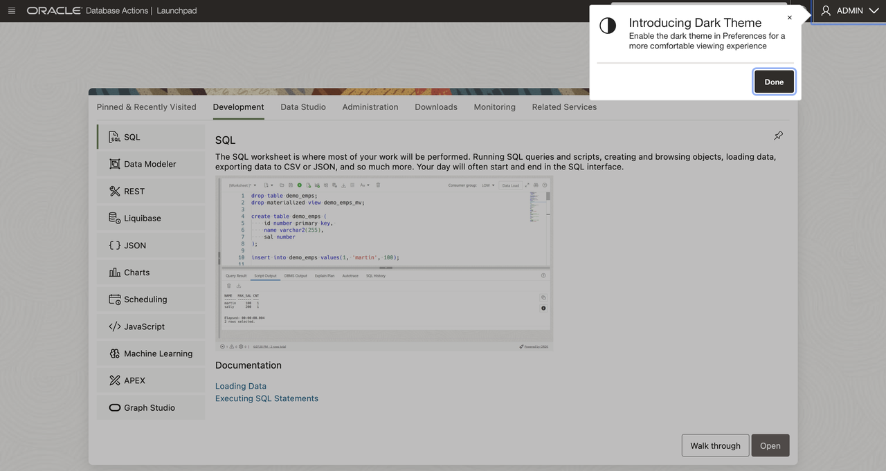

    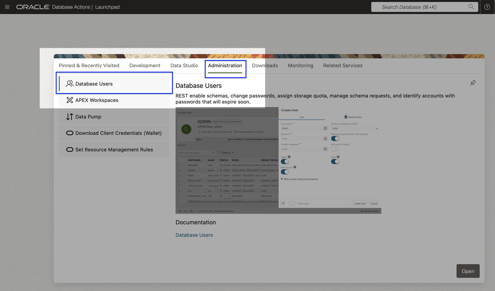

2. From the User Management dashboard, select the **Create User** button. 

    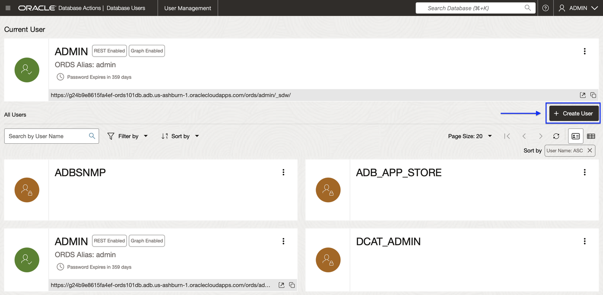

3. A Create User dialogue will appear. Choose a username and password that conforms to Oracle Autonomous AI database [password requirements](https://docs.oracle.com/en/cloud/paas/autonomous-database/serverless/adbsb/manage-users-create.html#GUID-72DFAF2A-C4C3-4FAC-A75B-846CC6EDBA3F).

    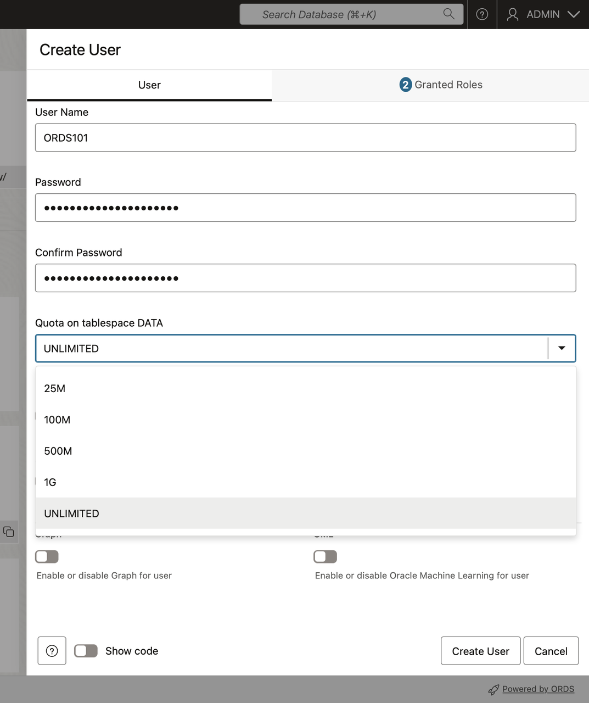

4. Use the Radio button to enable **REST, GraphQL, MongoDB API, and Web access**. Leave **REST Alias** unchanged. 

5. The user will automatically be granted the `CONNECT` and `RESOURCE` roles. Select the `DB_DEVELOPER_ROLE` and `DWROLE` roles as well; ensure the `Default` field has been "checked". 

Once complete, click the **Create User** button.

  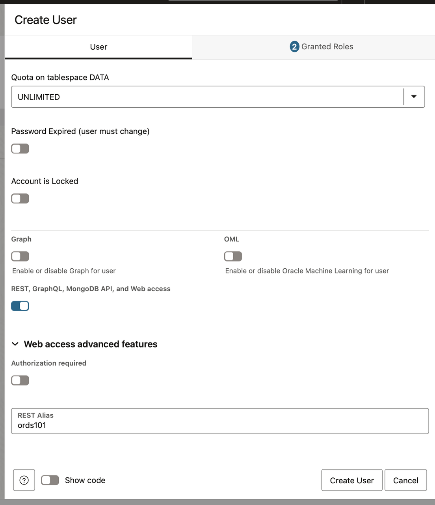

  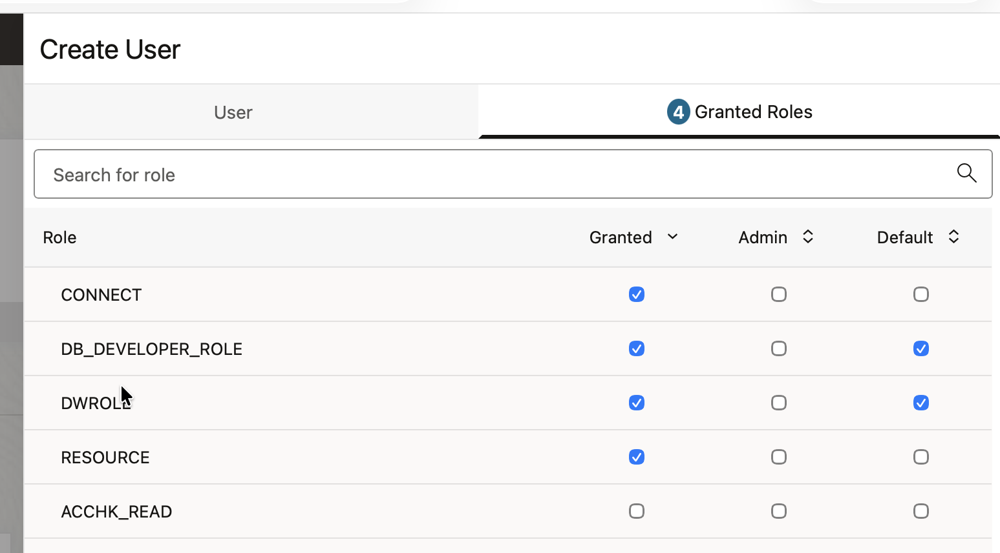

## Task 2: Sign-in as new user

1. From the User Management dashboard, you'll see a new card that includes the unique URL for the user. Click the Open in New Tab icon to open the URL in a new tab. 

    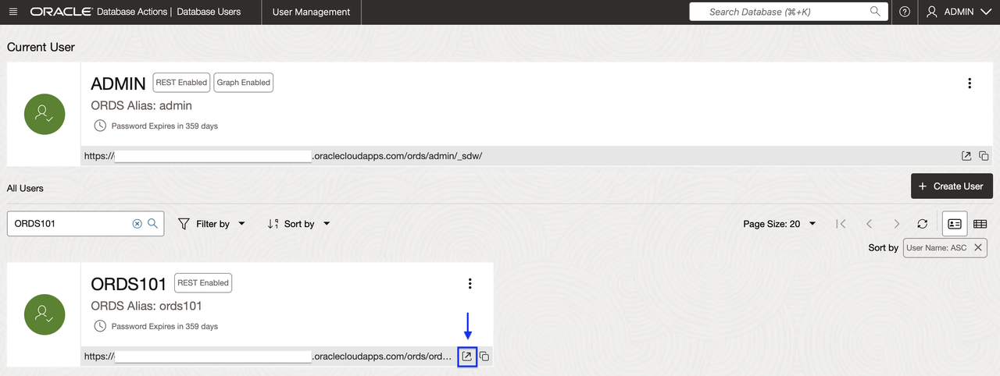

2. Sign-in with the user's credentials. 

    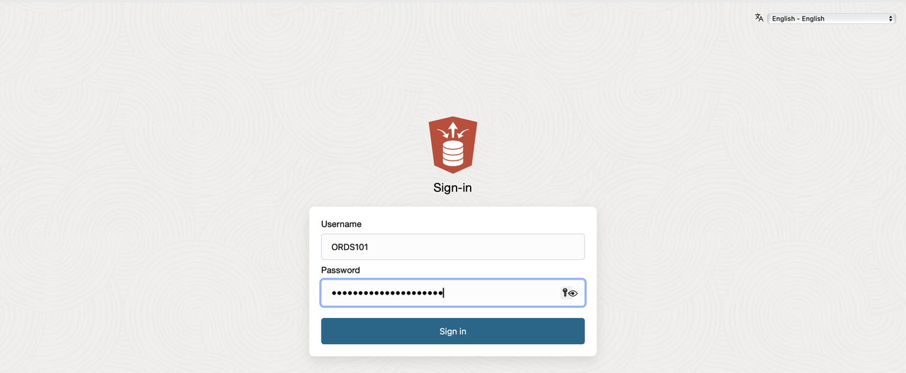

3. From the Database Actions LaunchPad, click the Development tab, followed by the SQL menu option. 

    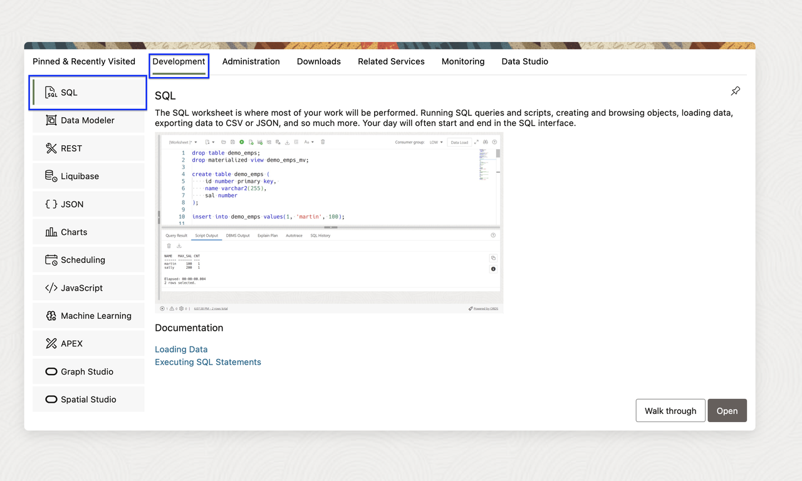

    > **NOTE:** You will use this developer user for the remainder of the labs in this workshop.

4. You should now see the SQL Worksheet. If you are prompted for a Tour, you can proceed through the helpful tips, or exit the tour. Next, you'll populate your brand new schema with database objects.

  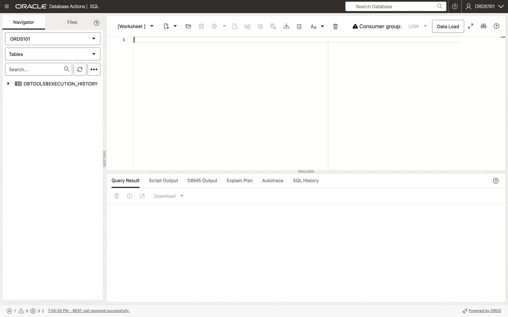

## Task 3: Populate the schema

1. Next, populate your schema with the included code snippet. Copy the contents of the snippet and paste it into the SQL Worksheet code playground, then click the **Run Script** icon to execute the script.

    <details>
        <summary><strong>SQL Script</strong></summary>
        <p></p>

    ```sql
      <copy>
      -- ==========================================
      -- CREATE DEPARTMENT TABLE
      -- Source: create_department_table.sql
      -- ==========================================
      CREATE TABLE "DEPARTMENT" 
        (	"DEPT_ID" NUMBER GENERATED BY DEFAULT AS IDENTITY MINVALUE 1 MAXVALUE 9999999999999999999999999999 INCREMENT BY 1 START WITH 1 CACHE 20 NOORDER  NOCYCLE  NOKEEP  NOSCALE , 
        "DEPT_CODE" VARCHAR2(5 BYTE) COLLATE "USING_NLS_COMP", 
        "ESTABLISHED" DATE, 
        "DETAILS" JSON
        )  DEFAULT COLLATION "USING_NLS_COMP" ;

      CREATE UNIQUE INDEX "DEPT_CODE_UK" ON "DEPARTMENT" ("DEPT_CODE") 
        ;

      CREATE UNIQUE INDEX "DEPT_ID_PK" ON "DEPARTMENT" ("DEPT_ID") 
        ;

      CREATE UNIQUE INDEX "DEPARTMENT_DEPT_CODE_UQ" ON "DEPARTMENT" (UPPER("DEPT_CODE")) 
        ;

      ALTER TABLE "DEPARTMENT" MODIFY ("DEPT_ID" NOT NULL ENABLE);

      ALTER TABLE "DEPARTMENT" MODIFY ("DEPT_CODE" CONSTRAINT "DEPT_CODE_NN" NOT NULL ENABLE);

      ALTER TABLE "DEPARTMENT" ADD CONSTRAINT "DEPT_ID_PK" PRIMARY KEY ("DEPT_ID")
        USING INDEX  ENABLE;


      -- ==========================================
      -- CREATE EMPLOYEE TABLE
      -- Source: create_employee_table.sql
      -- ==========================================
      CREATE TABLE "EMPLOYEE" 
        (	"EMP_ID" NUMBER GENERATED BY DEFAULT AS IDENTITY MINVALUE 1 MAXVALUE 9999999999999999999999999999 INCREMENT BY 1 START WITH 1 CACHE 20 NOORDER  NOCYCLE  NOKEEP  NOSCALE , 
        "EMP_NAME" VARCHAR2(100 BYTE) COLLATE "USING_NLS_COMP", 
        "DEPT_ID" NUMBER, 
        "COMMENTS" CLOB COLLATE "USING_NLS_COMP"
        )  DEFAULT COLLATION "USING_NLS_COMP" ;

      CREATE UNIQUE INDEX "EMP_ID_PK" ON "EMPLOYEE" ("EMP_ID") 
        ;

      CREATE INDEX "EMP_DEPARTMENT_IX" ON "EMPLOYEE" ("DEPT_ID") 
        ;

      ALTER TABLE "EMPLOYEE" MODIFY ("EMP_ID" NOT NULL ENABLE);

      ALTER TABLE "EMPLOYEE" MODIFY ("EMP_NAME" CONSTRAINT "EMP_NAME_NN" NOT NULL ENABLE);

      ALTER TABLE "EMPLOYEE" MODIFY ("DEPT_ID" CONSTRAINT "EMP_DEPT_ID_NN" NOT NULL ENABLE);

      ALTER TABLE "EMPLOYEE" ADD CONSTRAINT "EMP_ID_PK" PRIMARY KEY ("EMP_ID")
        USING INDEX  ENABLE;

      ALTER TABLE "EMPLOYEE" ADD CONSTRAINT "FK_EMPLOYEE_DEPT" FOREIGN KEY ("DEPT_ID")
          REFERENCES "DEPARTMENT" ("DEPT_ID") ENABLE;


      -- ==========================================
      -- CREATE PROJECT TABLE
      -- Source: create_project_table.sql
      -- ==========================================
      CREATE TABLE "PROJECT" 
        (	"PROJ_ID" NUMBER GENERATED BY DEFAULT AS IDENTITY MINVALUE 1 MAXVALUE 9999999999999999999999999999 INCREMENT BY 1 START WITH 1 CACHE 20 NOORDER  NOCYCLE  NOKEEP  NOSCALE , 
        "PROJ_NAME" VARCHAR2(100 BYTE) COLLATE "USING_NLS_COMP", 
        "DEPT_ID" NUMBER, 
        "IS_ACTIVE" BOOLEAN
        )  DEFAULT COLLATION "USING_NLS_COMP" ;

      CREATE UNIQUE INDEX "PROJ_ID_PK" ON "PROJECT" ("PROJ_ID") 
        ;

      CREATE INDEX "PROJ_DEPARTMENT_IX" ON "PROJECT" ("DEPT_ID") 
        ;

      ALTER TABLE "PROJECT" MODIFY ("PROJ_ID" NOT NULL ENABLE);

      ALTER TABLE "PROJECT" MODIFY ("PROJ_NAME" CONSTRAINT "PROJ_NAME_NN" NOT NULL ENABLE);

      ALTER TABLE "PROJECT" MODIFY ("DEPT_ID" CONSTRAINT "PROJ_DEPT_ID_NN" NOT NULL ENABLE);

      ALTER TABLE "PROJECT" ADD CONSTRAINT "PROJ_ID_PK" PRIMARY KEY ("PROJ_ID")
        USING INDEX  ENABLE;

      ALTER TABLE "PROJECT" ADD CONSTRAINT "FK_PROJECT_DEPT" FOREIGN KEY ("DEPT_ID")
          REFERENCES "DEPARTMENT" ("DEPT_ID") ENABLE;

      -- ==========================================
      -- INSERT DATA
      -- Source: insert_data.sql
      -- ==========================================
      INSERT INTO DEPARTMENT (DEPT_CODE, ESTABLISHED, DETAILS) VALUES
          ('HR001', DATE '2001-04-13', JSON_OBJECT('location' VALUE 'Bldg 1', 'members' VALUE 25)),
          ('FN002', DATE '2002-06-20', JSON_OBJECT('location' VALUE 'Bldg 2', 'members' VALUE 20)),
          ('EN003', DATE '2000-11-01', JSON_OBJECT('location' VALUE 'Bldg 3', 'members' VALUE 40)),
          ('SA004', DATE '2005-01-15', JSON_OBJECT('location' VALUE 'Bldg 4', 'members' VALUE 18)),
          ('MK005', DATE '2003-12-07', JSON_OBJECT('location' VALUE 'Bldg 5', 'members' VALUE 15)),
          ('LG006', DATE '2010-03-31', JSON_OBJECT('location' VALUE 'Bldg 6', 'members' VALUE 5)),
          ('IT007', DATE '2001-09-23', JSON_OBJECT('location' VALUE 'Bldg 7', 'members' VALUE 30)),
          ('SP008', DATE '2015-05-05', JSON_OBJECT('location' VALUE 'Bldg 8', 'members' VALUE 12)),
          ('LG009', DATE '2012-07-14', JSON_OBJECT('location' VALUE 'Bldg 9', 'members' VALUE 10)),
          ('OP010', DATE '2008-08-01', JSON_OBJECT('location' VALUE 'Bldg 10', 'members' VALUE 22));
          COMMIT;

      INSERT INTO PROJECT (PROJ_NAME, DEPT_ID, IS_ACTIVE) VALUES
          ('Onboarding', 1, TRUE),
          ('Audit2024', 2, FALSE),
          ('NewApp', 3, TRUE),
          ('SalesCampaign', 4, TRUE),
          ('SocialMediaPush', 5, FALSE),
          ('Compliance', 6, TRUE),
          ('UpgradeInfra', 7, TRUE),
          ('HelpdeskRevamp', 8, TRUE),
          ('FleetUpdate', 9, TRUE),
          ('ProcessReorg', 10, FALSE);
          COMMIT;

      INSERT INTO EMPLOYEE (EMP_NAME, DEPT_ID, COMMENTS) VALUES
          ('Alice', 1,  'Strong analyst, quick learner.'),
          ('Bob', 2,  'CPA certification in progress.'),
          ('Carol', 3,  'Dev team lead for NewApp project.'),
          ('David', 4,  'Consistent sales over target.'),
          ('Eve', 5,  'Leads digital campaigns.'),
          ('Frank', 6,  'Subject matter expert in compliance.'),
          ('Grace', 7,  'Skilled in infrastructure upgrades.'),
          ('Heidi', 8,  'Customer support supervisor.'),
          ('Ivan', 9,  'Fleet manager - long tenure.'),
          ('Judy', 10,  'Operations management veteran.');
          COMMIT;


      -- ==========================================
      -- CREATE PROCEDURE
      -- Source: create_procedure.sql
      -- ==========================================
      CREATE OR REPLACE EDITIONABLE PROCEDURE "PR_ADD_AND_ASSIGN_EMPLOYEE" (
            p_emp_name  IN VARCHAR2,
            p_dept_code IN VARCHAR2,
            p_comments  IN CLOB
        ) AS
            l_dept_id department.dept_id%TYPE;
        BEGIN
            SELECT dept_id
              INTO l_dept_id
              FROM department
            WHERE UPPER(dept_code) = UPPER(p_dept_code);

            INSERT INTO employee (
                emp_name,
                dept_id,
                comments
            )
            VALUES (
                p_emp_name,
                l_dept_id,
                p_comments
            );

        EXCEPTION
            WHEN NO_DATA_FOUND THEN
                raise_application_error(
                    -20001,
                    'Department code not found. Valid values: ' ||
                    'EN003, FN002, HR001, IT007, LG006, LG009, ' ||
                    'MK005, OP010, SA004, SP008'
                );
        END;
      /

    </copy>
    ``` 

    </details>
    </p>

    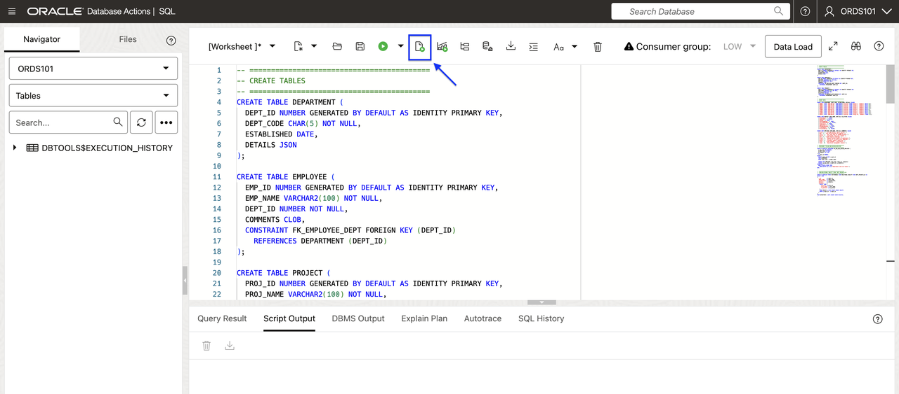

    2. Click the Refresh button in the Navigator tab to refresh the Table objects. You'll see three new tables:  

      - `DEPARTMENT`
      - `EMPLOYEE`
      - `PROJECT`
    
    3. Right-click on the `PROJECT` table. Select the **Open** option. A details slider will appear. 

      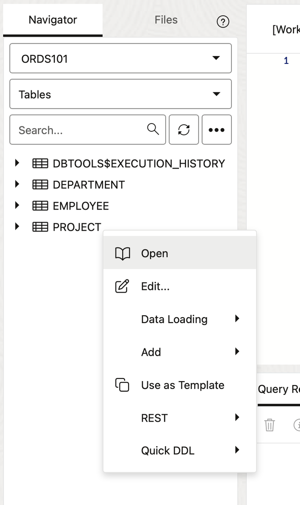

    4. Click the **Data** tab to review the `PROJECT` table data. Later on, you'll insert additional data using the ORDS `BATCHLOAD` REST API.

    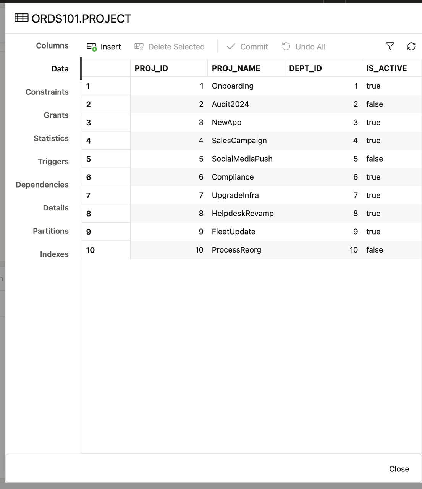

    5. Click the **Close** button, right-click on the `PROJECT` table and select **Edit**.

    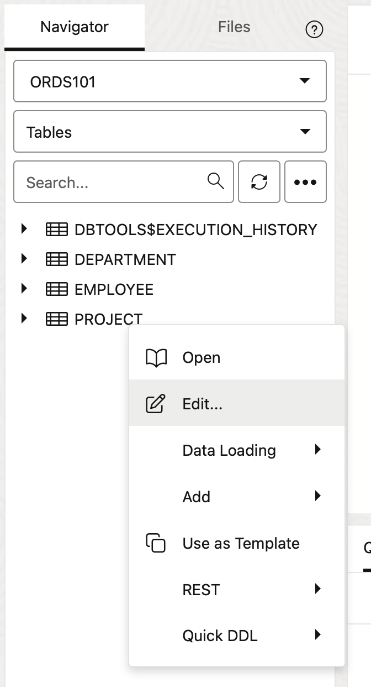

    6. Click the `DDL` tab, to review the fully formatted, and syntactically correct DDL for this table. When finished, click the **Close** button.

    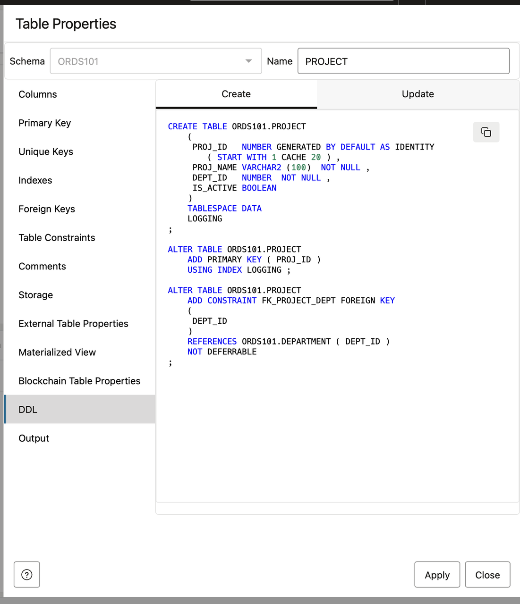

    7. Next you'll use ORDS to AutoREST-enable the `PROJECT` table. 

  ## Task 4: AutoREST-enable a table

  1. Right-click on the `PROJECT` table, select **REST**, then **Enable**.

    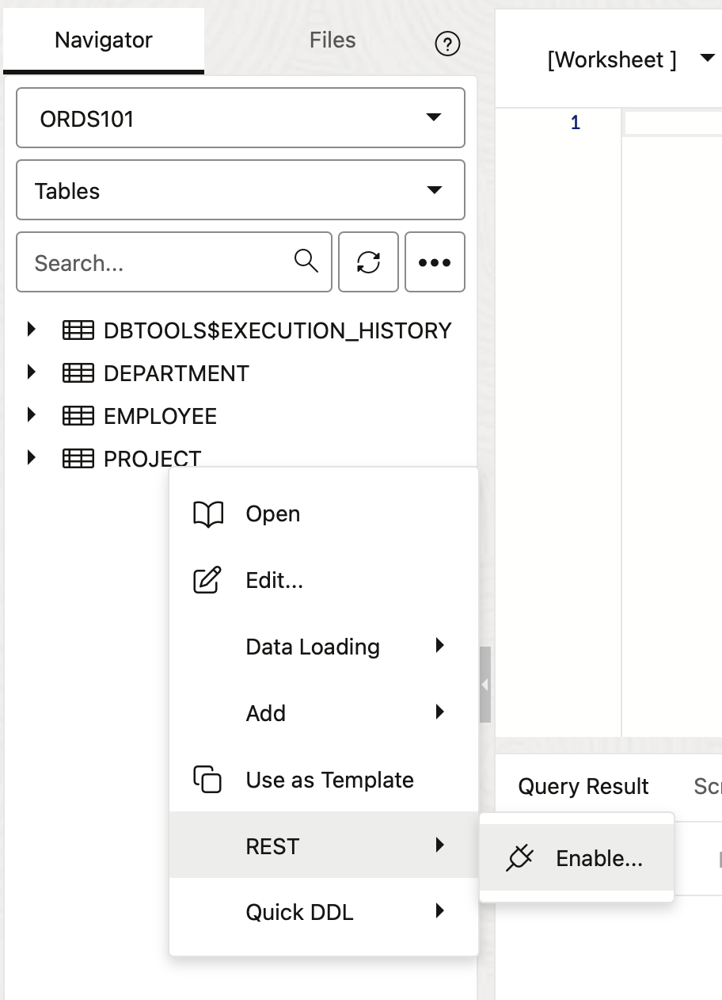

  2. A new REST Enable Object slider will appear. ORDS automatically generates an API endpoint for you, along with the Roles and Privileges associated with this new resource. You can select a new **Object Alias**; but for this lab keep the default Alias. You can also toggle the **Show Code** radio button to reveal the PL/SQL procedure that ORDS will execute to REST-enable this table. Once satisfied, click **Enable**. 

    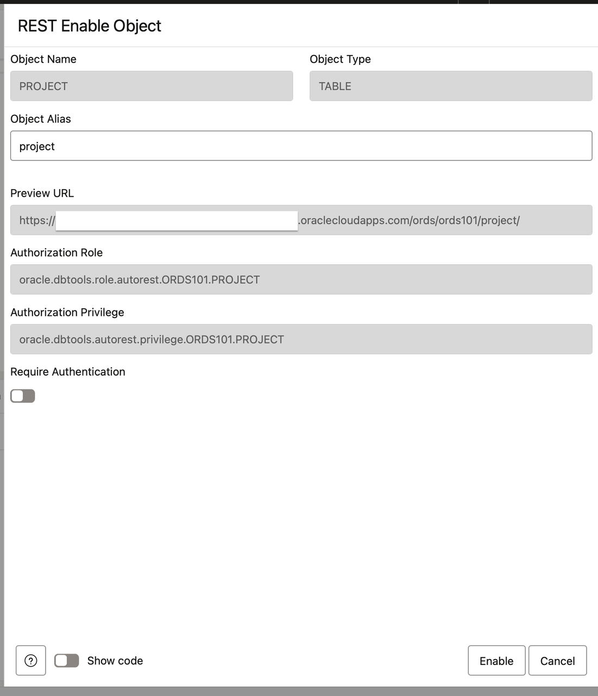

  3. You'll notice a new plug icon on the table, this indicates that the database object is now REST-enabled (i.e., it is associated with an URI for HTTP/S requests). Right-click on the `PROJECT` table, scroll to **REST**, and select the new **cURL command** menu item.

    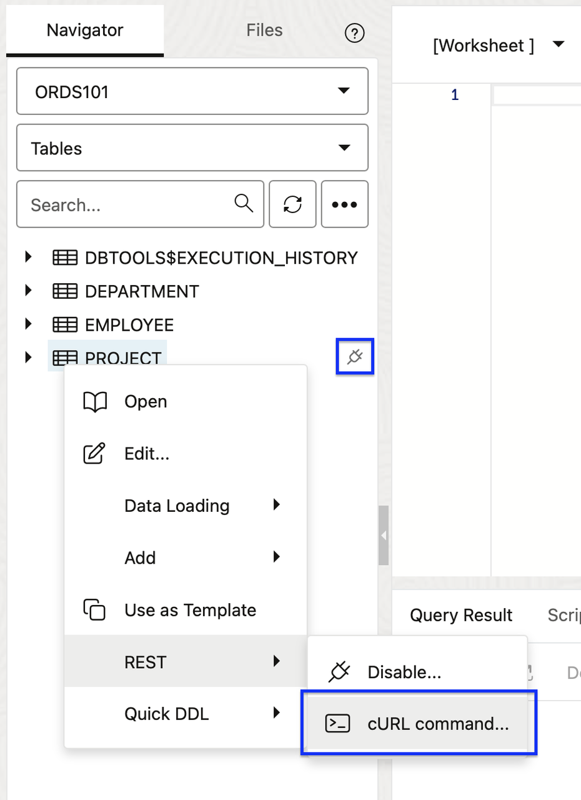

  4. ORDS API endpoints are automatically created for you: `GET ALL`, `GET Single`, `POST`, `BATCH LOAD`, `PUT`, and `DELETE`. The definitions, and procedures for these methods/operations are all securely stored and executed on the Oracle database; nothing is saved in your application layer. Highlight or copy the URI for the `GET ALL` endpoint and open it in a new browser tab or window.

    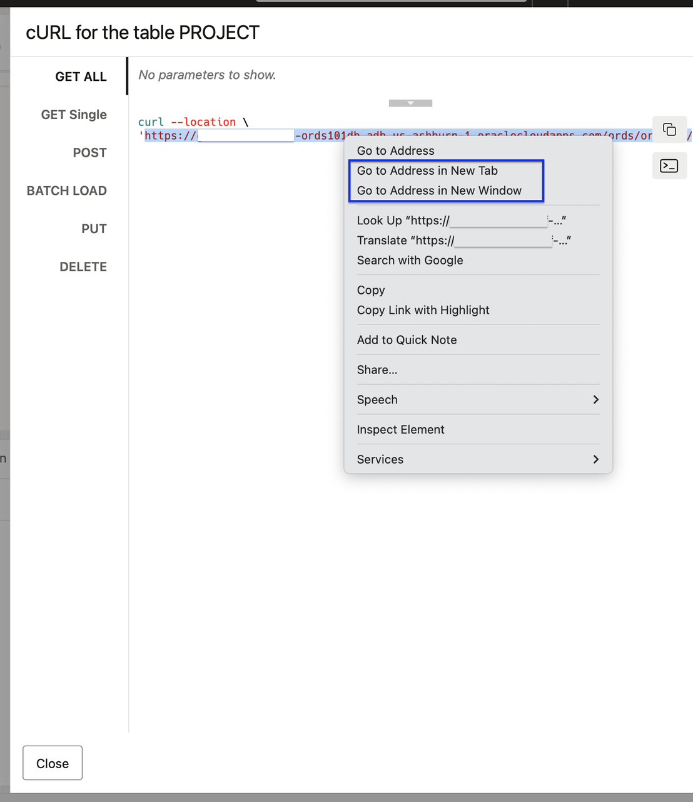

  5. Notice the JSON payload of the `GET ALL` endpoint. The results on screen are analagous to executing something like this:

      ```sql 
      SELECT * FROM PROJECT ORDER BY PROJ_ID OFFSET 0 ROWS FETCH NEXT 25 ROWS ONLY;
      ```

    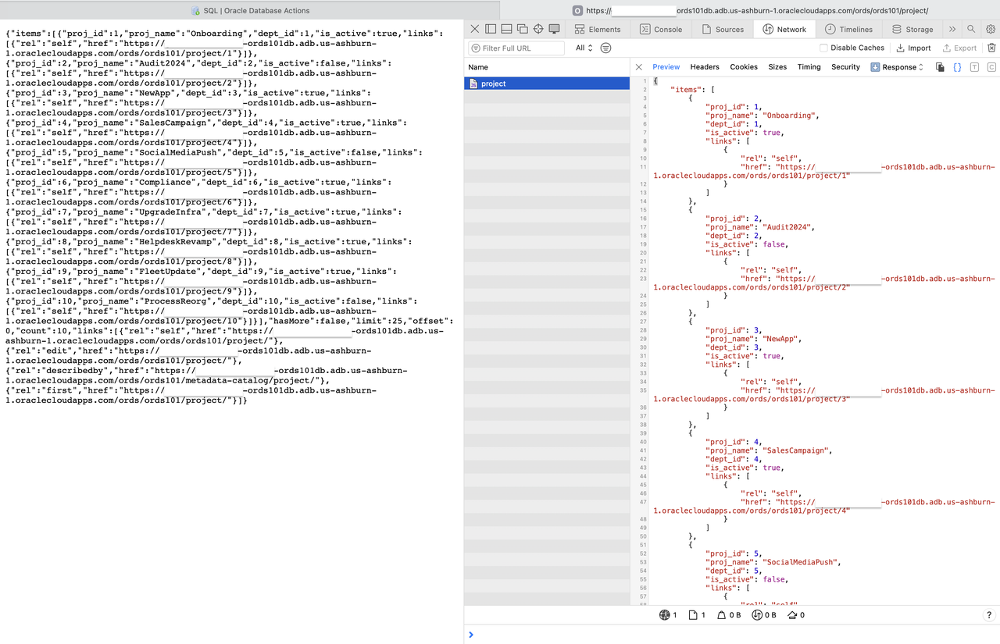

  6. Open your brower's Developer/Inspect tools, navigate to the Network tab, and adjust the page's response to view the Object Tree. In addition to `FETCHING` the first 25 rows, an ORDS AutoREST-enabled endpoint also includes links for each of the results (for an indiviual row), the total `count` (`10`) of the results of the payload (`items:Array`), the `limit` used (`25` is the ORDS default), the `offset` (`0`), and two more special properties: `hasMore` and `links:Array`. 

      - `hasMore: Boolean` - informs a client if more results exist past the initial 25; allowing you to programmatically scale the results using this condition plus `limit` and `offset` for finer grain control and easier pagination.
      - `links:Array` - provides self-describing and self-referring links
          - `first` points to the first set of results (1-25)
          - larger results sets would include `next` and `previous` links too

    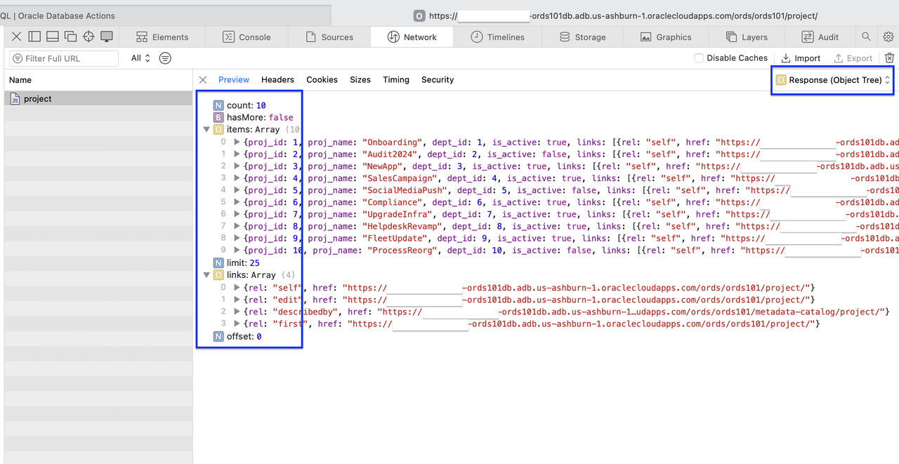

  7. Return to the SQL Worksheet. The **cURL for the table PROJECT** slider should still be visible, if not review the instructions in Step 3 above. Click the `BATCH LOAD` tab, choose the appropriate shell environment, and copy the `BATCH LOAD` cURL command to your clipboard. 

    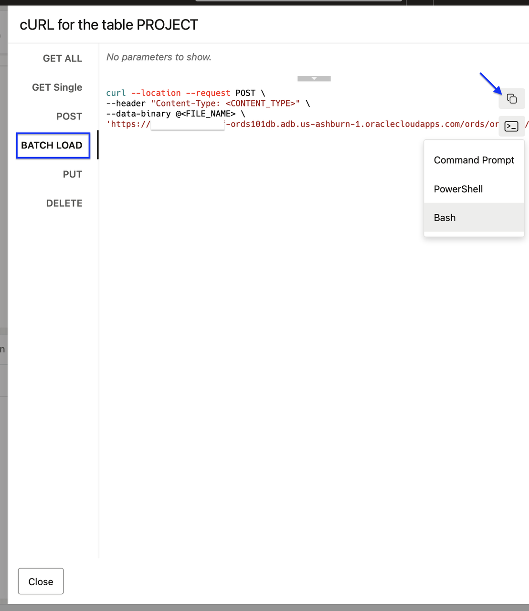

  8. You'll use this `BATCH LOAD` endpoint to perform a bulk insert on the `PROJECT` table via an HTTP request. 

  ## Task 5: Using the ORDS BATCH LOAD endpoint

  1. This `BATCH LOAD` example uses cURL to simulate a client application executing/recieving HTTP requests/responses. In a text editor, paste the example `BATCHLOAD` cURL command you copied from the previous lab. 

    

    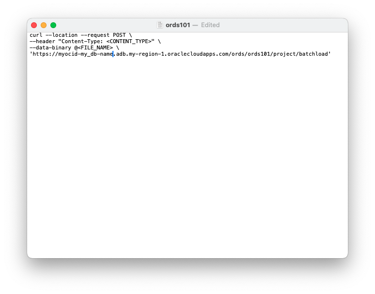

  2. Retrieve the sample payload via [this link](https://c4u04.objectstorage.us-ashburn-1.oci.customer-oci.com/p/EcTjWk2IuZPZeNnD_fYMcgUhdNDIDA6rt9gaFj_WZMiL7VvxPBNMY60837hu5hga/n/c4u04/b/livelabsfiles/o/developer-library/batchload_directory.zip) that you'll use for testing this `BATCH LOAD` endpoint. Unzip the .zip file if this did not occur automatically.

  3. Once downloaded, copy the filepath details to use in the `--data-binary` option of the cURL command. In this example, the .csv file is located at: `/Users/me/Downloads/project_batchload.csv`.

      ```shell
      <copy>
      curl -v -i -X POST 
      -H "Content-Type: text/csv"
      "https://my-ocid-db-name.adb.my-region-1.oraclecloudapps.com/ords/ords101/project/batchload"
      --data-binary "@\Users\me\Downloads\project_batchload.csv"
      </copy>
      ```

  <details>
  <summary><strong>Learn about the available <code>BATCHLOAD</code> parameters</strong></summary>
    <p></p>

  You may optionally pass reserved `BATCHLOAD` URL query parameters. in your `POST` request. Available parameters include: 

  | Parameter | Description | URL example | Details / unencoded value |
  |---|---|---|---|
  | `batchesPerCommit` | Commit frequency after batches are sent to the database. Default: every 10 batches. `0` defers commit until the end of the load. Integer. | `?batchesPerCommit=10` | `10` is the literal integer value. |
  | `batchRows` | Number of rows in each batch sent to the database. Default: 50. Integer. | `?batchRows=1000` | `1000` is the literal integer value. |
  | `dateFormat` | Format mask used to convert input values for `DATE` columns. | `?dateFormat=YYYY-MM-DD` | Unencoded value: `YYYY-MM-DD`. |
  | `delimiter` | Field delimiter for the input file. Default: comma (`,`). | `?delimiter=%2C`<br>`?delimiter=%7C` | `%2C` = `,` (comma); `%7C` = `|` (pipe). |
  | `enclosures` | Character(s) enclosing each field. Default: double quote (`"`). One character is used for both sides; two characters specify left then right enclosures. | `?enclosures=%22`<br>`?enclosures=%27%22` | `%22` = `"`; both left and right enclosures are double quotes.<br>`%27%22` = `'"`; left is `'`, right is `"`. |
  | `embeddedRightDouble` | Controls handling of two consecutive right-enclosure characters inside an enclosed field. `true` treats them as one literal enclosure; `false` treats them as an error. | `?embeddedRightDouble=true` | `true` is the literal Boolean value. |
  | `encoding` | Character encoding of the input file. Default: `UTF8`. | `?encoding=UTF-8` | Unencoded value: `UTF-8`. |
  | `errors` | Maximum row errors allowed before terminating the load, subject to the service-level `db.batchload.errorsMax` limit. `0` allows no errors; `UNLIMITED` / `-1` allows errors up to the service limit. | `?errors=0`<br>`?errors=UNLIMITED` | `0` is the literal integer value; `UNLIMITED` is the literal keyword. |
  | `lineEnd` | Input record terminator. Omit it when the file uses standard `\\r`, `\\r\\n`, or `\\n` endings. | `?lineEnd=%0A`<br>`?lineEnd=%0D%0A` | `%0A` = line feed (`LF`, `\\n`).<br>`%0D%0A` = carriage return + line feed (`CRLF`, `\\r\\n`). |
  | `lineMax` | Maximum line length used to recognize rows in the stream. Default: unlimited. | `?lineMax=4096`<br>`?lineMax=UNLIMITED` | `4096` is a literal integer; `UNLIMITED` is the literal keyword. |
  | `locale` | Locale used for locale-sensitive loader parsing and formatting. | `?locale=en-US` | Unencoded value: `en-US`. |
  | `responseEncoding` | Encoding of the loader response stream. | `?responseEncoding=UTF-8` | Unencoded value: `UTF-8`. |
  | `responseFormat` | Format of loader messages and bad-data output. Valid values: `RAW`, `SQL`. Default: `RAW`. | `?responseFormat=RAW` | `RAW` is the literal keyword. |
  | `timestampFormat` | Format mask used to convert input values for `TIMESTAMP` columns. | `?timestampFormat=YYYY-MM-DD%22T%22HH24%3AMI%3ASS` | Unencoded value: `YYYY-MM-DD"T"HH24:MI:SS`. `%22` = `"`, `%3A` = `:`. |
  | `timestampTZFormat` | Format mask used to convert input values for `TIMESTAMP WITH TIME ZONE` columns. | `?timestampTZFormat=YYYY-MM-DD%22T%22HH24%3AMI%3ASSTZH%3ATZM` | Unencoded value: `YYYY-MM-DD"T"HH24:MI:SSTZH:TZM`. `%22` = `"`, `%3A` = `:`. |
  | `truncate` | Whether to delete existing table rows before loading. `false` (default) retains them; `true` uses `DELETE`; `truncate` uses `TRUNCATE TABLE`. | `?truncate=true`<br>`?truncate=truncate` | `true` is the literal Boolean value; `truncate` is the literal keyword. |eibccddubtfcttnlbdvefekfejdcnkhdniktnddfgilr

  **A combined example**

  ```text
  /ords/hr/employees/batchload?truncate=true&batchRows=1000&batchesPerCommit=10&errors=0&dateFormat=YYYY-MM-DD&encoding=UTF-8&delimiter=%2C&lineEnd=%0A&enclosures=%22&embeddedRightDouble=true
  ```

> **Reminder:** Percent-encode URL-reserved characters; double quote &rarr; `%22`, comma &rarr; `%2C`, pipe &rarr; `%7C`, line feed &rarr; `%0A`, carriage return/line feed (CRLF) &rarr; `%0D%0A`, etc. 
  </details>
  <p></p>

4. In your text editor replace `<CONTENT_TYPE>` with `text/csv` and `--data-binary @<FILE_NAME>` with your own file path. Optionally you may include other cURL options like those in the example. 

    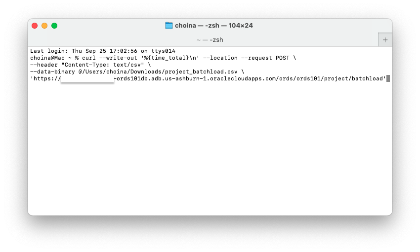

    > **NOTE:** Your `BATCHLOAD` URI will differ as well. File paths for macOS/Linux and Windows differ; double check your complete cURL command.

5. Execute the `BATCH LOAD` request. After a few moments the results of the operation will appear in your terminal.

    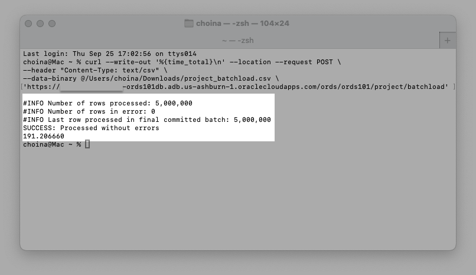

6. You've just inserted an additional 5,000,000 records into the Project table using this ORDS `BATCH LOAD` API. Execute a `Select count(*) from PROJECT;` query to review the new total entries in the `PROJECT` table. 

    ```sql
    <copy>
    Select count(*) from PROJECT;
    </copy>
    ```

    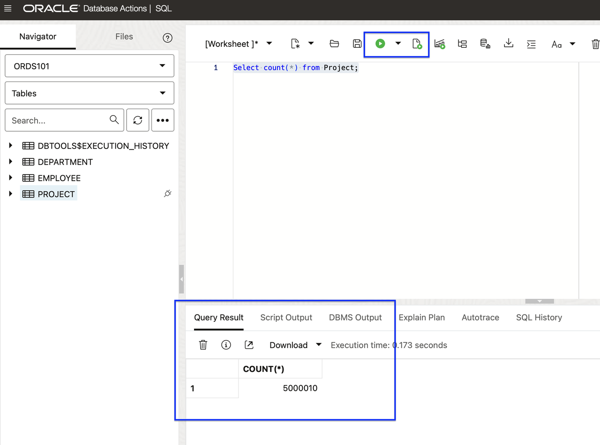

7. In the next lab you'll see how easy it is to take your existing PL/SQL and create your own custom ORDS APIs.

You may now [proceed to the next lab](#next).

## Acknowledgements

### Author

- Jeff "el jefe" Smith, Distinguished Product Manager
- Chris Hoina, Senior Product Manager

### Last Updated By/Date

- Chris Hoina, September 2026
