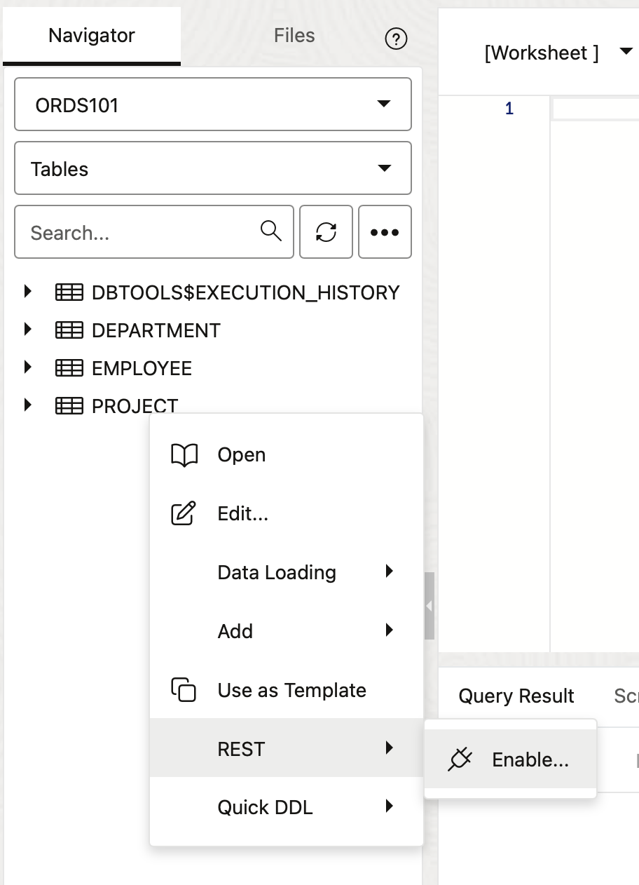

# Create and auto-REST enable a table

## Introduction

In this lab, you will, as the Admin, create a new database developer user to be used for the remainder of this workshop. Your new user will automatically be REST-enabled. This means the new user will also be able to log into Database Actions as well as have the ability to REST-enable their database objects. 

You'll build out your schema with database objects, and AutoREST-enable a table in your Autonomous Database. Finally, you'll test the endpoint using the cURL command line tool 

Estimated Lab Time: 20 minutes

### Objectives

- Create a new REST-enabled DB Developer user
- Create for the new user tables and various database objects 
- REST-enable a table for this new user

### Prerequisites

- The following lab requires an [Oracle Cloud account](https://www.oracle.com/cloud/free/). You may use your own cloud account, a cloud account obtained through a trial, or a training account whose details were given to you by an Oracle instructor.
- This lab uses the command line application cURL for testing APIs; some familiarity is suggested.
- This lab assumes you have completed all previous Labs.

## Task 1: Create a new REST-enabled database user

1. You should still be logged in as the ADMIN user, if not, sign back in as the ADMIN and select the Administration tab from the LaunchPad. Then select the Database Users menu option. 

  

  

2. From the User Management dashboard, select the **Create User** button. 

  

3. A Create User dialogu will appear. Use the name `ORDS101`, choose a password that conforms to Oracle database password requirements.

  

4. Use the Radio button to enable **REST, GraphQL, MongoDB API, and Web access**. The REST Alias should remain unchanged. 

5. The ORDS101 user will automatically be granted the `CONNECT` and `RESOURCE` roles. However, you can manually enable the new 23ai `DB_DEVELOPER_ROLE`, as this is an easy way to ensure a Developer user has many of the required roles aimed at the Oracle database developer user. Once complete, click the Create User button.

  

  

## Task 2: Sign-in as the ORDS101 user

1. After creating the ORDS101 user, you will be redirected back to the User Management dashboard. There you'll see a new card that includes the unique URL for the ORDS101 user. Click the icon to open the URL in a new tab. 

  

2. Sign-in with the ORDS101 credentials. 

  

3. From the Database Actions LaunchPad, click the Development tab, followed by the SQL menu option. 

  

    > **NOTE:** You will use this developer user for the remainder of the labs in this workshop.

4. You should now see the SQL Worksheet. If you are prompted for a Tour, you can proceed through the helpful tips, or exit the tour. Next, you'll populate your brand new schema with database objects.

  

## Task 3: Populate the schema

1. Next you'll populate your schema with the included code snippet. Copy the contents of the snippet and paste it into the SQL Worksheet code playground, then click the **Run Script** icon to execute the script.

  

   <details>
    <summary style="color: #0000FF";><kbd style="font-size: 10px;">(click) </kbd><strong>Sample prompt</strong></summary>
    <p></p>

    ```sql
    <copy>-- ==========================================
    -- CREATE TABLES
    -- ==========================================
    CREATE TABLE DEPARTMENT (
      DEPT_ID NUMBER GENERATED BY DEFAULT AS IDENTITY PRIMARY KEY,
      DEPT_CODE VARCHAR(5) NOT NULL,
      ESTABLISHED DATE,
      DETAILS JSON
    );

    CREATE TABLE EMPLOYEE (
      EMP_ID NUMBER GENERATED BY DEFAULT AS IDENTITY PRIMARY KEY,
      EMP_NAME VARCHAR2(100) NOT NULL,
      DEPT_ID NUMBER NOT NULL,
      COMMENTS CLOB,
      CONSTRAINT FK_EMPLOYEE_DEPT FOREIGN KEY (DEPT_ID)
        REFERENCES DEPARTMENT (DEPT_ID)
    );

    CREATE TABLE PROJECT (
      PROJ_ID NUMBER GENERATED BY DEFAULT AS IDENTITY PRIMARY KEY,
      PROJ_NAME VARCHAR2(100) NOT NULL,
      DEPT_ID NUMBER NOT NULL,
      IS_ACTIVE BOOLEAN,
      CONSTRAINT FK_PROJECT_DEPT FOREIGN KEY (DEPT_ID)
        REFERENCES DEPARTMENT (DEPT_ID)
    );

    -- ==========================================
    -- INSERT DATA
    -- ==========================================
    INSERT INTO DEPARTMENT (DEPT_CODE, ESTABLISHED, DETAILS) VALUES
      ('HR001', DATE '2001-04-13', JSON_OBJECT('location' VALUE 'Bldg 1', 'members' VALUE 25)),
      ('FN002', DATE '2002-06-20', JSON_OBJECT('location' VALUE 'Bldg 2', 'members' VALUE 20)),
      ('EN003', DATE '2000-11-01', JSON_OBJECT('location' VALUE 'Bldg 3', 'members' VALUE 40)),
      ('SA004', DATE '2005-01-15', JSON_OBJECT('location' VALUE 'Bldg 4', 'members' VALUE 18)),
      ('MK005', DATE '2003-12-07', JSON_OBJECT('location' VALUE 'Bldg 5', 'members' VALUE 15)),
      ('LG006', DATE '2010-03-31', JSON_OBJECT('location' VALUE 'Bldg 6', 'members' VALUE 5)),
      ('IT007', DATE '2001-09-23', JSON_OBJECT('location' VALUE 'Bldg 7', 'members' VALUE 30)),
      ('SP008', DATE '2015-05-05', JSON_OBJECT('location' VALUE 'Bldg 8', 'members' VALUE 12)),
      ('LG009', DATE '2012-07-14', JSON_OBJECT('location' VALUE 'Bldg 9', 'members' VALUE 10)),
      ('OP010', DATE '2008-08-01', JSON_OBJECT('location' VALUE 'Bldg 10', 'members' VALUE 22));

    INSERT INTO PROJECT (PROJ_NAME, DEPT_ID, IS_ACTIVE) VALUES
      ('Onboarding', 1, TRUE),
      ('Audit2024', 2, FALSE),
      ('NewApp', 3, TRUE),
      ('SalesCampaign', 4, TRUE),
      ('SocialMediaPush', 5, FALSE),
      ('Compliance', 6, TRUE),
      ('UpgradeInfra', 7, TRUE),
      ('HelpdeskRevamp', 8, TRUE),
      ('FleetUpdate', 9, TRUE),
      ('ProcessReorg', 10, FALSE);

    INSERT INTO EMPLOYEE (EMP_NAME, DEPT_ID, COMMENTS) VALUES
      ('Alice', 1,  'Strong analyst, quick learner.'),
      ('Bob', 2,  'CPA certification in progress.'),
      ('Carol', 3,  'Dev team lead for NewApp project.'),
      ('David', 4,  'Consistent sales over target.'),
      ('Eve', 5,  'Leads digital campaigns.'),
      ('Frank', 6,  'Subject matter expert in compliance.'),
      ('Grace', 7,  'Skilled in infrastructure upgrades.'),
      ('Heidi', 8,  'Customer support supervisor.'),
      ('Ivan', 9,  'Fleet manager - long tenure.'),
      ('Judy', 10,  'Operations management veteran.');

    -- ==========================================
    -- PROCEDURE: PR_ADD_AND_ASSIGN_EMPLOYEE
    -- ==========================================
    CREATE OR REPLACE PROCEDURE PR_ADD_AND_ASSIGN_EMPLOYEE (
      p_emp_name   IN VARCHAR2,  -- Name of the new employee
      p_dept_code  IN VARCHAR,      -- Department code to assign the employee to
      p_comments   IN CLOB       -- Comments about the employee
    ) AS
      v_dept_id NUMBER;          -- Variable to hold the found department ID
    BEGIN
      -- Attempt to look up the department's ID based on the provided department code
      SELECT dept_id INTO v_dept_id
      FROM DEPARTMENT
      WHERE dept_code = p_dept_code;

      -- If a matching department was found, insert the new employee record
      INSERT INTO EMPLOYEE (emp_name, dept_id, comments)
      VALUES (p_emp_name, v_dept_id, p_comments);

    EXCEPTION
      -- This block runs if no department matches the given code
      WHEN NO_DATA_FOUND THEN
        DBMS_OUTPUT.put_line('Department code not found.');

    END;

    COMMIT;
    /

    </copy>

    ``` 

    </details>

2. Click the Refresh button in the Navigator tab to refresh the Table objects. You should now see three new tables:  

    - `DEPARTMENT`
    - `EMPLOYEE`
    - `PROJECT`
  
3. Right-click on the `PROJECT` table to reveal various context menu options. Select the **Open** option. New table details slider will appear. 

    

4. Click the **Data** tab review the `PROJECT` table data. You'll notice just 10 entries; in the next lab you'll use the ORDS `BATCHLOAD` REST API to significantly add to the entries.

  

5. Click the **Close** button, then right-click on the `PROJECT` table again and select **Edit**.

  

6. Click the `DDL` tab, to review the fully formatted, and syntactically correct DDL that was used to create this table. You may explore additional details of the table. When finished, click the **Close** button.

  

7. Next you'll use ORDS to AutoREST-enable the `PROJECT` table. 

## Task 4: AutoREST-enable a table

1. Right-click on the `PROJECT` table, select **REST**, then **Enable**.

  

2. A new REST Enable Object slider will appear. ORDS automatically generates an API endpoint for you, along with the Roles and Privileges associated with this new resource. You can select a new **Object Alias**; but for this lab keep the default Alias. You can also toggle the **Show Code** radio button to reveal the PL/SQL procedure that ORDS will execute to REST-enable this table. Once satisfied, click **Enable**. Congratulations, you've just created your first ORDS API. 

  

3. You'll notice a new plug icon on the table, this indicates that the database object is now REST-enabled (i.e., it is associated with a URI for HTTP/S requests). Right-click on the `PROJECT` table, scroll to **REST**, and select the new menu item: **cURL command**.

  

4. You'll see the new ORDS API endpoints that were automatically created for you: `GET ALL`, `GET Single`, `POST`, `BATCH LOAD`, `PUT`, and `DELETE`. The definitions, and procedures for these methods/operations are all securly stored and executed on the Oracle database; nothing is saved in your application layer. Highlight or copy the URI for the `GET ALL` endpoint and open it in a new browser tab or window.

  

5. You'll see the JSON payload that was requested as a result of visiting that GET ALL endpoint. By visiting that endpoint you've effectively just accomplised something similar to logging into the database and executing something similar to the following: 

    ```sql 
    SELECT *
    FROM PROJECT
    ORDER BY PROJ_ID
    OFFSET 0 ROWS FETCH NEXT 25 ROWS ONLY;
    ```
  

6. In fact, you've accomplished a great deal more than that. From your browser's Developer/Inspect tools, navigate to the Network tab, and adjust the page's response to view the Object Tree. In addition to `FETCHING` the first 25 rows, an ORDS AutoREST-enabled endpoint also includes links for each of the results (for an indiviual row), the total `count` (`10`) of the results of the payload (`items:Array`), the `limit` used (`25` is the ORDS default), the `offset` (`0`), and two more special properties: `hasMore` and `links:Array`. 

  The `hasMore: Boolean` informs a client if more results exist past the initial 25; allowing you to programmatically scale the results using this condition plus the `limit` and `offset` for finer grain control and easier pagination. 

  The `links:Array` is a powerful property. The links therein are self-describing and self-referring; like the `first` link, which points to the first set of results (1-25). And in larger results sets you'd find `next` and `previous` links too. 

    

7. Once you've finished exploring, close out this tab, and return the the SQL Worksheet. 

8. The **cURL for the table PROJECT** slider should still be visible, if not review the instructions in Step 3 above. Click the `BATCH LOAD` tab, choose the appropriate shell environment, and copy the `BATCH LOAD` cURL command to your clipboard. 

  

9. Next you'll use this `BATCH LOAD` endpoint to perform a bulk insert on the `PROJECT` table via an HTTP request. 

## Task 5: Using the ORDS BATCH LOAD endpoint

1. This `BATCH LOAD` example uses cURL to simulate using a client application for executing and recieving HTTP requests and responses. In a text editor, paste the example `BATCHLOAD` cURL command you copied from the previous lab. 

  

  

2. Retrieve the sample payload via [this link](https://raw.githubusercontent.com/chrishoina/podman-dev/refs/heads/main/project_batchload.csv.zip) that you'll use for testing this`BATCH LOAD` endpoint. Unzip the .zip file if this did not occur automatically.

3. Once downloaded, copy the filepath details to use in the `--data-binary` option of the cURL command. In this example, the .csv file is located at: `/Users/me/Downloads/project_batchload.csv`.

4. In your text editor replace `<CONTENT_TYPE>` with `text/csv` and `--data-binary @<FILE_NAME>` with your own file path. Optionally you may include other cURL options like those in the example. 

  

    > **NOTE:** Your `BATCHLOAD` URI will differ as well.

5. Execute the `BATCH LOAD` request. After a few moments the results of the operation will appear in your terminal.

  

6. You've just inserted an additional 5,000,000 records into the Project table using this ORDS `BATCH LOAD` API! Optionally, navigate to the SQL Worksheet and execute a `Select count(*) from PROJECT` query to review the new total entries in the `PROJECT` table. 

  

7. You've just performed a massive insert using a single AutoREST-enabled endpoint.   In the next lab you'll see how easy it is to take your existing PL/SQL and create your own custom ORDS APIs.

You may now [proceed to the next lab](#next).

## Acknowledgements

### Author

- Jeff "el jefe" Smith, Distinguished Product Manager
- Chris Hoina, Senior Product Manager

### Last Updated By/Date

- Chris Hoina, September 2025
