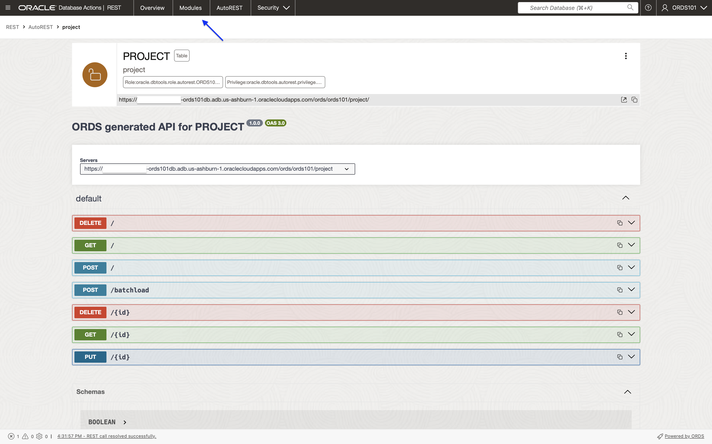
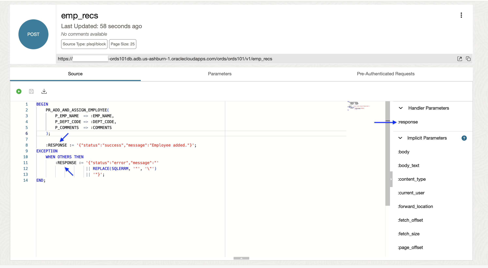

# REST-enable tables and add business logic
<!-- WMSID 4602 -->
## Introduction

In this lab, you will use the SQL Worksheet and the REST Workshop to build ORDS REST API using a parameterized PL/SQL procedure and SQL statement. You'll also test these APIs in cURL.

Estimated Lab Time: 25 minutes

### Objectives

- Publish RESTs API using Custom SQL and PL/SQL
- Publish REST API using stored PL/SQL procedure
- Explore the ORDS OpenAPI View
- Test ORDS APIs in cURL

### Prerequisites

- The following lab requires an [Oracle Cloud account](https://www.oracle.com/cloud/free/). You may use your own cloud account, a cloud account that you obtained through a trial, or a training account whose details were given to you by an Oracle instructor.
- This lab uses the command line application cURL for testing APIs; some familiarity is suggested.
- This lab assumes you have completed all previous Labs. 

## Task 1: Review provided code snippets

1. In Lab 1, you created sample database objects. Among those objects was a PL/SQL Procedure. The PL/SQL procedure, along with sample SQL will both be used when creating your ORDS Handler code. 

2. It would be helpful to understand both the SQL and PL/SQL prior to constructing your ORDS APIs. Navigate back to the SQL Worksheet.

3. Copy and paste the following snippet into a new worksheet: 

    ```sql
    <copy>SELECT
      PROJ_ID,
      PROJ_NAME,
      DEPT_ID,
      IS_ACTIVE
    FROM
      PROJECT
    WHERE
      DEPT_ID = 9
      AND IS_ACTIVE = TRUE;
      </copy>
    ```
    

4. Execute this sample SQL using either the Run Statement or Run Script button. You'll see the  results of the query in the **Query Result** or **Script Output** tabs. This should provide you with a good idea of what this SQL does: returns the `PROJ_ID`, `PROJ_NAME`, `DEPT_ID`, and `IS_ACTIVE` for the given `DEPT_ID` and `BOOLEAN`. 

    

5. Now, select Procedures from the Navigator dropdown menu. Right-click on the `PR_ADD_AND_ASSIGN_EMPLOYEE` procedure, and select **Open**.

    

    

6. The definiton for the PL/SQL procedure will be visible in the SQL Worksheet. This produre expects the following parameters; `p_emp_name`, `p_dept_code` (associated with a `dept_id`), and `comments` then inserts values into the `Employee` table.

    

7. Go back to the Navigator, and select Tables from the dropdown menu. Right-click on the Department table, then select Open. 

    

8. Review, and note down one of the valid values for the `DEPT_CODE`. Then open a new SQL Worksheet.

    

9. Use the following code snippet to insert a new record into the Employee table (replace name with your name, the value for the DEPT_CODE with the one you chose in the previous step, and include a comment describing yourself.): 

    ```sql
    <copy>BEGIN
      pr_add_and_assign_employee('Chris', 'HR001', 'Overqualified intern.');
    END;
    </copy> 
    ```

    

10. Use the **Run Script** button; you will see `PL/SQL procedure successfully completed.` in the Script Output.

    

11. You can then query for your record in the Employee table. Use the following code snippet (edit where needed):

    ```sql
    <copy>Select * from Employee where emp_name='Your name';</copy>
    ```

    

12. Now that you have a general idea of what the sample code accomplishes, its time to build your own ORDS endpoints.

## Task 2: Exploring the REST Workshop

1. Click the Hamburger menu in the upper left hand corner of your browser, then select **REST**.

    

2. You are now in the **REST** Workshop. Here is where you build and test your ORDS APIs. Click the **AUTOREST** card.

    

3. This is the table you AutoREST-enabled in a previous lab. Before you continue, take a look at the resources available to you (these apply to all of your modules). Right-click the kebab menu, then select **Export OpenAPI**.

    

4. You'll see a downloadable version of your API in the OpenAPI specification. This makes it easy for you to review, and share definitions. 

    

5. Close the Export OpenAPI slider, click the kebab menu again and select **OpenAPI View**. 

    

6. You will see an in-browser testing dashboard based on the OpenAPI specification. Here you can test your APIs without having to log into, or open a separate application. When satisfied, click the **Modules** tab at the top of the REST Workshop page. 

    

## Task 3: Building an ORDS GET API

1. You'll now build your first two custom ORDS APIs. Click the **Create Module** button. 

    

2. Next, enter in values of the Create Module slider. and click the **Create** button. Use the same values provided to make following along easier:

    - **Module Name:** `records.module`
    - **Base Path:** `v1`
    - **Protected By Privilege:** `Not Protected` (Select from drop-down)
    - **Comments:** `An employee records management module consisting of various templates and handlers for performing operations on the following target tables: Department, Project, Employee.`

     

3. Now, click the Template button; this will ultimately be the URI for your ORDS API (where clients issue HTTP requests to). 

    

   Enter in the values provided and click **Create**: 

    - **URI Template:** `dept_active/:dept_id/:is_active`
    - **Comments:** `An example template that will accept the query parameters dept_id and is_active. Relies on ORDS Automatic Binding to take the path parameters and use them in the provided handler code.`
  
      

> **NOTE:** This Template illustrates a very powerful feature in ORDS: Route Patterns (i.e., `/:det_id/:is_active`). This pattern allows developers to pass parameters directly in the URI. You'll see this in action shortly.

4. Next, click the **Create Handler** button. When the Slider appears, select `GET`, `Collection Query`, and use the following snippet for the Source, and click the **Create** button: 

      

      

    ```sql
    <copy>SELECT
      PROJ_ID,
      PROJ_NAME,
      DEPT_ID,
      IS_ACTIVE
    FROM
      PROJECT
    WHERE
      DEPT_ID = :dept_id
      AND IS_ACTIVE = :is_active
    </copy>
    ```
> **NOTE:** Notice how the the values for the Route Pattern are included in the Handler's source code. 

5. You have just created your first ORDS API, a `GET` handler. Click the Open in new Tab button, you'll be prompted to enter in values for the Route Parameters. ORDS will bind these values of the URI to those in the Handler's SQL source code, satisfying the conditions of the `WHERE` clause. 

      

6. Enter a value between `1` and `10` for `dept_id`, and use either `true` or `false` (`BOOLEAN`) for the `is_active` parameter. Then, select **OK**.

      

7. A new browser tab will appear, with the results of your `GET` request. You can review the Response in the Object Tree format using your browser's developer/inspect tools. Notice the `links:Array` property; specifically the `self` link. Also, notice the URI includes those parameters you selected in the previous step (the same parameters that ORDS uses in the Handler source code).

    

8. When you are ready, return the the Handler dashboard. You can test this API in cURL too. Click the kebab menu of your Handler, and select **Get cURL command**.

    

9. Press the **+ plus** button, and enter in Substitution values for the cURL command (you can use the same ones as before). Then press **OK**.

    

    

10. Copy the cURL command, and paste it into a new Terminal window. You'll notice how your values have been appended to the URI of your ORDS API. Press **Enter** to execute the cURL command.

    

    

> **NOTE:** You can optionally pipe in the `jq` processer to pretty print your `JSON` response.

11. You should see the response payload in your terminal. Scroll down, and you will see the rest of the payload. Because this is a large results set, you'll see a `next` link in the `links` array (unlike what you observed in the AutoREST lab).

    

    

12. In the next task you'll create a slightly more advanced `POST` endpoint.

## Task 4: Building an ORDS POST API

1. In this example, you'll build a slightly more advanced ORDS API. You'll use an Anonymous Block in your ORDS Handler code to execute the `PR_ADD_AND_ASSIGN_EMPLOYEE` PL/SL procedure. Using the breadcrumbs in the REST Workshop, return to the `records.module` Resource.

    

2. Click the **+ Create Template** button. Use `emp_recs` as the value for the **URI Template**, and click **Create**.

    

    

3. Click the **+ Create Handler** button, and in the Create Handler slider enter/select POST for the Method and the below source, then click the **Create** button: 

    

    ```
    <copy>BEGIN
      PR_ADD_AND_ASSIGN_EMPLOYEE(
          P_EMP_NAME  => :EMP_NAME,
          P_DEPT_CODE => :DEPT_CODE,
          P_COMMENTS  => :COMMENTS
      );

      :RESPONSE := '{"status":"success","message":"Employee added."}';
    EXCEPTION
      WHEN OTHERS THEN
           :RESPONSE := '{"status":"error","message":"'
                        || REPLACE(SQLERRM, '"', '\"')
                        || '"}';
    END;</copy>
    ```

4. For this example, you'll create an output Bind Parameter. Press the Parameters tab, then the **+ Create Parameter** button.

    

    

5. Enter the following values for the response Parameter, and click the **Create** button: 
    - **Parameter name:** `response`
    - **Bind Variable Name:** `response`
    - **Source Type:** `Response`
    - **Parameter Type:** `STRING`
    - **Access Method:** `Output`

    

6. You'll see the new Output Bind Parameter in the Parameter tab.

    

7. You'll use this Bind Parameter (aka Handler Parameter) to send the responses/results of your ORDS API to your client application. 

    

> **NOTE:** The values have already been included in the sample Anonymous Block snippet, but simply clicking the Handler Parameter name will place the parameter value at the current location of your cursor.

8. Now, you can test this new POST API. From the Handler's kebab menu, select **Get cURL command**, then the **+ plus** button of the curl Command modal. A Substitutions modal will appear. Enter in values for `EMP_NAME`, `DEPT_CODE`, `COMMENTS`, and check Null for the `RESPONSE`. Be sure to review and select valid values for the `DEPT_CODE`. Once finished, click **OK**.

    

    

    

9. Copy the curl command, and paste into a new Terminal window. Press **enter** to execute the curl command.
   
    

    

> **NOTE:** IF you observe a value of `<VALUE>` for `RESPONSE` remove it, so there is an empty string, before executing the cURL command.

10. You should see the success response message in your terminal. 

    

11. You can also perform a simple query to review that latest INSERT using the following code snippet: 

    ```sql
    <copy>Select * from Employee where emp_name='The name you used in the POST request';</copy>
    ```

    

12. And that's it, you've just successfully created your first two custom ORDS APIs. But you've probably noticed, no security? Continue to the next lab to learn more about securing your ORDS APIs.

You may now [proceed to the next lab](#next).

## Acknowledgements

### Author

- Jeff "el jefe" Smith, Distinguished Product Manager
- Chris Hoina, Senior Product Manager

### Last Updated By/Date

- Chris Hoina, October 2025
