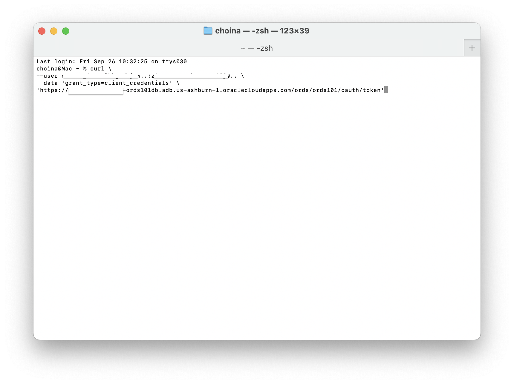
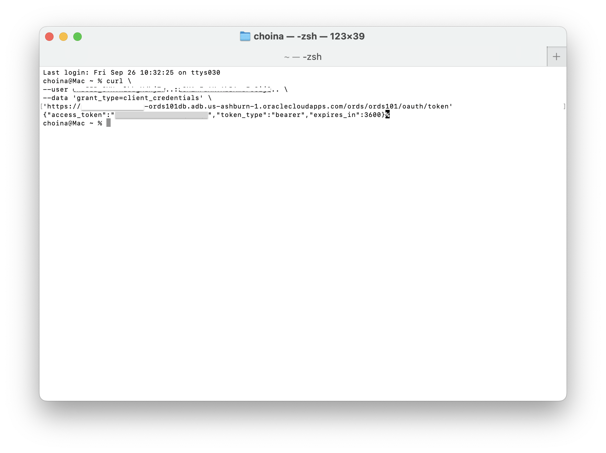
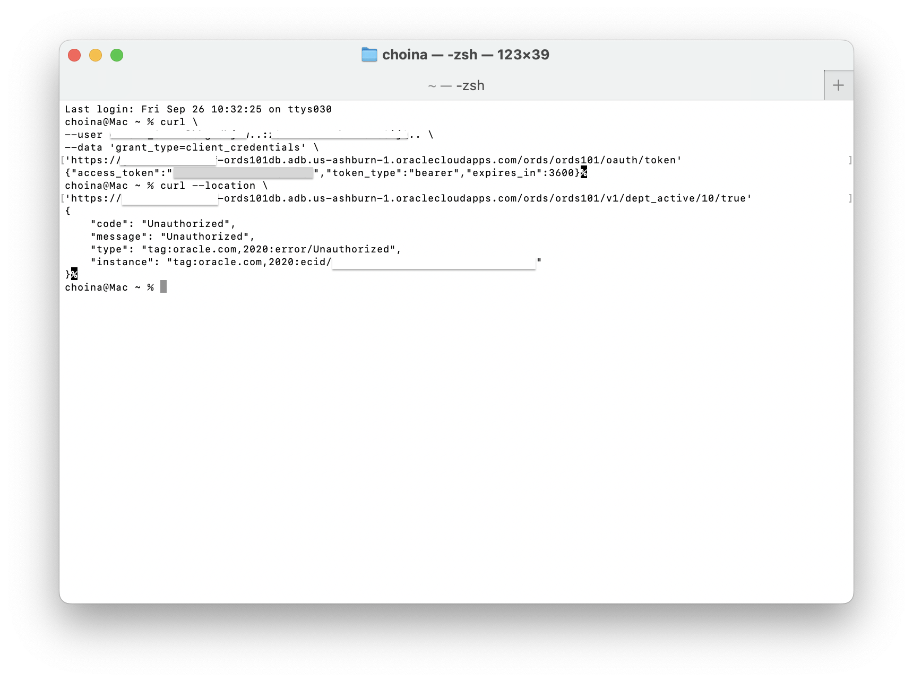
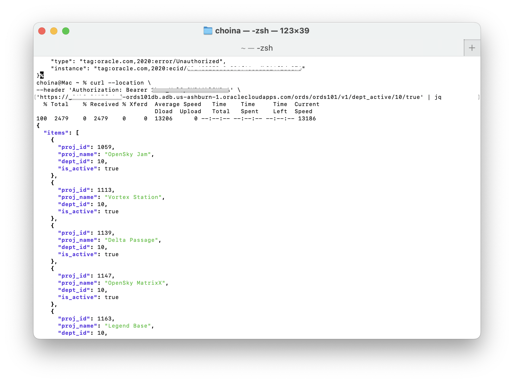

# Secure REST-enabled endpoints

## Introduction

In this lab you secure the REST endpoints created in the previous lab, and test ORDS's built-in OAuth2.0 security with the Client Credentials grant type.

Estimated Lab Time: 10 minutes

### Objectives

- Secure REST endpoints
- Create an OAuth2 token
- Test the secure end-to-end flow

### Prerequisites

- The following lab requires an [Oracle Cloud account](https://www.oracle.com/cloud/free/). You may use your own cloud account, a cloud account that you obtained through a trial, or a training account whose details were given to you by an Oracle instructor.
- This lab uses the command line application cURL for testing APIs; some familiarity is suggested.
- This lab assumes you have completed all previous Labs. 

## Task 1: Create a Role for an OAuth2.0 client

1. From the REST Workshop, select **Roles** from the **Security** dropdown menu.

    

2. Next, click the **+ Create Role** button.

    

3. In the Role Definition modal, enter in a **Role Name**, such as: `my.test.role`, then click **Create**.

    

## Task 2: Create a Privilege for an OAuth2.0 client

1. Next, you'll create a Privilege for the OAuth2.0 client. Select **Privileges** from the **Security** dropdown menu. 

    

2. Click the **+ Create Privilege** button, and enter in values for this privilege. 

   

   To better follow along, choose values similar to the examples: 

    **Privilege Definition**
    - **Label:** `my.test.priv`
    - **Name:** `my.test.priv`
    - **Description:** `my.test.priv` (You can alter this as needed)
    - **Comments:** optional 

     

    **Roles**
    - **Roles:** `my.test.role` (or your unique role, if it differs)

       

    **Protected Modules**
    - **Selected Modules**: `records.module`

      

    > **TIP:** Move a Module into the Selected Modules column by dragging, or using the arrow buttons.

3. Once complete, click the **Create** button.

## Task 3: Create an ORDS OAuth Client

1. Select **OAuth Clients** from the **Security Tab**.

    

2. Then, click the **+ Create OAuth Client** button.

    

3. In the Create OAuth Client slider, enter in the following values and click the **Create** button when complete:

    **Client Definition**
    - **Grant type:** `CLIENT_CRED`
    - **Name:** `my_test_oauth_client`
    - **Description:** Your choice (mandatory field)
    - **Support email:** your choice (mandatory field)
    - **Support URI:** https://www.my-company.com/support (can be fictitious)

     

    **Roles**
    - **Roles:** `my.test.role` (or your unique role, if it differs)

       

    **Privileges**
    - **Roles:** `my.test.role` (or your unique role, if it differs)

       

## Task 4: Testing the OAuth2.0 client

1. After clicking **Create**, a Client Secret modal will appear. Copy the Secrect Client value to your clipboard or a text editor. 

     > **NOTE:** If you click OK prior to copying, you can also Rotate in a new Client Secret value.

     

     

2. You will also next need to copy your Client ID.

    

3. You will first request an Access token from the ORDS OAuth2.0 `/token` endpoint. The Token endpoint is located at the following URL, where `server.com` is the location of your database server (this example assumes your schema is also `ords101`):

    ```http
    <copy>https://[MY ADB's OCI]-[My ADB Name].adb.[My-Region].oraclecloudapps.com/ords/ords101/oauth/token</copy>
    ```

    Your cURL command for retrieving an Access Token should resemble the following (where the `--user` value is your `Client_ID`:`Client_Secret`):

    ```shell
    <copy>curl \
    --user AbcDef3456XYz..:a45AbcdeF8675309abcd.. \
    --data 'grant_type=client_credentials' \
    'https://abcdefgh12345-ords101db.adb.us-ashburn-1.oraclecloudapps.com/ords/ords101/oauth/token'</copy>
    ```

    

4. Execute your cURL command; you will recieve a valid Access Token. In this example, you can use the `GET` endpoint that you created in **Lab 2, Task 3: Building an ORDS GET API** as your target endpoint.

    

5. Before proceeding, attempt a GET request on your GET Handler, it will fail as you have not provided a valid Access Token (Unauthorized).

    

6. Finally, with a valid Access Token, perform a GET request on your target endpoint, using the following cURL command as an example: 

    ```shell
    <copy>curl --location \
    --header 'Authorization: Bearer [Your valid Access Token]' \
    'https://abcdefgh12345-ords101db.adb.us-ashburn-1.oraclecloudapps.com/ords/ords101/v1/dept_active/10/true'</copy>
    ```

    

7. What you should see is the successful response from your `/ords101/v1/dept_active/` endpoint. Congratulations, you've just completed the ORDS 101 Workshop!

8. In this lab, you secured your custom REST APIs with OAuth2 authentication.

You may now [proceed to the next lab](#next).

## Acknowledgements

### Author

- Jeff Smith, Distinguished Product Manager
- Chris Hoina, Senior Product Manager

### Last Updated By/Date

- Chris Hoina, September 2025
