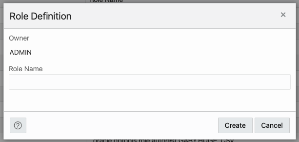
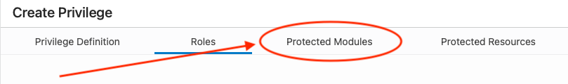
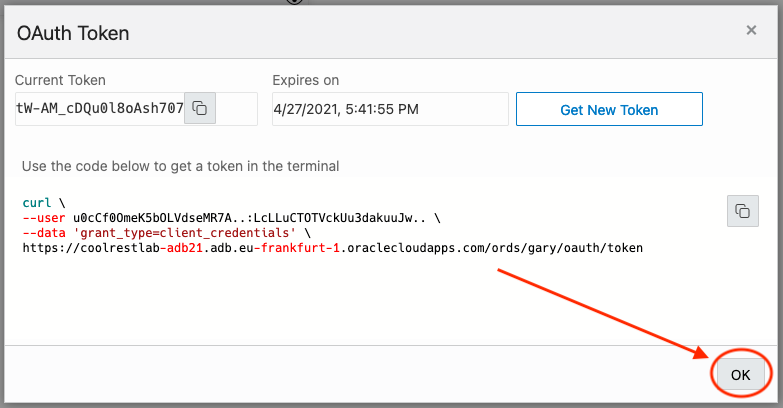

# Secure REST-enabled endpoints

## Introduction

In this lab you secure the REST endpoints created in the previous lab.

Estimated Lab Time: 10 minutes

Watch the video below for a quick walk-through of the lab.
[Secure REST-enabled endpoints](videohub:1_6ox6rq26)

### Objectives

- Create an OAuth2 token
- Secure REST endpoints
- Test the secure end-to-end flow

### Prerequisites

- The following lab requires an [Oracle Cloud account](https://www.oracle.com/cloud/free/). You may use your own cloud account, a cloud account that you obtained through a trial, or a training account whose details were given to you by an Oracle instructor.

- This lab assumes you have completed all previous Labs.

## Task 1: Create a Role to secure a REST Endpoint

1. Navigate to the **REST Database Actions** page. You may do this by navigating to the **Database Actions menu** in the upper left of the page. Choose **REST** in the Development list.

    

2. Next, select the **Security Tab**, then **Roles**.

    

3. From the **Roles** page, click the **+ Create Role** button.

    

4. A **Role Definition** modal will appear. Use **oracle.livelabs.role.admin** for the Role Name.

    

     ```sh
    <copy>oracle.livelabs.role.admin</copy>
    ```

    

5. When complete, click the **Create** button.

    

## Task 2: Create a Privilege to secure a REST Endpoint

1. Next, we'll assign **Privileges** to this role. From the **Security** menu, select **Privileges**.

    

2. Click the **+ Create Privilege** button.

    

3. Enter `Livelabs REST Privilege` in the **Create Privilege** Label field.

    

     ```sh
    <copy>Livelabs REST Privilege</copy>
    ```

    

4. Use `oracle.livelabs.privilege.admin` for the Name field.

     ```sh
    <copy>oracle.livelabs.privilege.admin</copy>
    ```

    

5. In the Description field enter `Livelabs Privilege for Business Logic REST Services`.

     ```sh
    <copy>Livelabs Privilege for Business Logic REST Services</copy>
    ```

    

6. When complete, click the **Roles** tab near the top of the slider.

    

    

7. On the **Roles** tab, use the shuttle to move the `oracle.livelabs.role.admin` role to the right column. Either double click the role or highlight it then click the single arrow (that points to the right column).

    

    > 💡 **NOTE:** Privileges and roles were automatically created (oracle.dbtools.role.autorest.ADMIN.CSV_DATA) when the table is auto-REST enabled.

8. Once the role has been moved, click the **Protected Modules** tab near the top of the **Create Privilege** slider.

    

9. Move the `com.oracle.livelab.api` privilege from the left column to the right. When complete, click the **Create** button on the **Create Privilege** slider.

    

    

## Task 3: Create an OAuth Client for secure REST Endpoint

1. Select **OAuth Clients** from the **Security Tab**.

    

2. Next, click the **+ Create OAuth Client** button.

    

3. The **Create OAuth Client** slider will appear.

      

    <details><summary>*About the Grant types*</summary>

    ORDS Supports many Grant Types.  

    

    You can refer to Two-legged and Three-legged OAuth code flows (Grant types) [here](https://docs.oracle.com/en/database/oracle/oracle-rest-data-services/24.2/orddg/developing-REST-applications.html#GUID-5B39A5A6-C55D-452D-AE53-F49431A4DE97).

    ORDS also supports JSON Web Tokens (JWTs) for Authentication and Authorization. Details can be found [here](https://docs.oracle.com/en/database/oracle/oracle-rest-data-services/24.2/orddg/developing-REST-applications.html#GUID-02B6DC5B-347A-417A-855F-C4A3F4B77538).
    </details>

4. Enter `oauthclient` into the **Name** field.

    ```sh
    <copy>oauthclient</copy>
    ```

    

5. Enter `Security on my REST Service` in the **Description Field**.

    ```sh
    <copy>Security on my REST Service</copy>
    ```

    

6. The **Support URI** is a required field. This is where a client will be redirected to should an authorization error or failure occur. For this lab, use `https://www.oracle.com/rest/`

     ```sh
    <copy>https://www.oracle.com/rest/</copy>
    ```

    

7. You may enter your email address or use `support@support.com` in the **Support Email** field.

     ```sh
    <copy>support@support.com</copy>
    ```

    

8. Once complete, left click the **Roles Tab** on the top of the Create OAuth Client slider.

    

    

9. Move the `oracle.livelabs.role.admin` role to the right column.

    

10. Next, navigate to the Protected Modules tab. Move the `com.oracle.livelab.api` module from the Available Modules column to the Selected Modules column.

    

11. Once complete, click the **Create** button.

    

12. The newly created **OAuth Client** tile will appear on the OAuth Clients page.

    

13. You may navigate to your `com.oracle.livelab.api` Resource Module, to review the effect of your changes.

    

    

## Task 4: Obtain a Bearer Token for accessing a secure REST Endpoint

1. Before accessing an OAuth-protected REST endpoint, you must first obtain a token to pass to the secured REST service for authentication. To obtain this token, we can click the kebab menu icon on our OAuth tile and select **Get Bearer Token**.  

   

   

2. The OAuth Token modal will provide the token text in the **Current Token** field. You can use the copy icon to copy this token text. Save this to a text document or notes application. The modal will also provide us with a cURL command to obtain a token should we need to include it in our applications.

    

    Click **OK** when you have copied the cURL command.

    

3. Next, we'll test the secure REST service . Recall in the previous Lab lab, where we created a REST API for our `bizlogic`? Attempt to access this REST endpoint with the following cURL command (**your URL hostname will be different than the below command**):

   

   

    ```sh
    <copy>curl --location --request POST \
    'https://coolrestlab-adb21.adb.eu-frankfurt-1.oraclecloudapps.com/ords/admin/api/bizlogic' \
    --header 'Content-Type: application/json' \
    --data-binary '{
    "id": "a1",
    "output": "" 
    }'</copy>
    ```

4. Attempt to run this `cURL` command in the Cloud Shell. Since the endpoint is now secure, you should see the following response:

   

5. In order to access this REST API, you must include a `--header 'Authorization: Bearer [The Access Token value]'` header to the cURL command. The `Access Token value` is the same Access Token you saved in Step 2 (**your URL hostname will be different than the below command**). Your updated cURL command should resemble the following:

   

6. Using the Cloud Shell, or local environment, execute *your* version of the cURL command (**your URL hostname and Bearer Token will differ from the one below**)

   

   You should see a similar value, returned from the REST API.

   

7. You have just simulated what an application might do when requesting access to a secure Resource. You've requested an Access Token, using your Client ID and Client Secret. Your credentials were verified; you were then issued an Access Token.

   And finally, you used the Access Token to perform a POST request on a target resource (i.e., the `bizlogic` resource).

8. Congratulations. You've successfully completed this Workshop. And in this lab, you secured your custom REST APIs with OAuth2.0 authentication.

You may now [proceed to the next lab](#next).

## Acknowledgements

### Author

- Jeff Smith, Distinguished Product Manager
- Chris Hoina, Senior Product Manager

## Last Updated By/Date

- Chris Hoina, August 2024
