# Create and auto-REST enable a table
<!-- WMSID 4602 -->
## Introduction

In this lab you will use Database Actions to connect to your database. You will then create a table, and REST enable it.

Estimated Lab Time: 20 minutes

Watch the video below for a quick walk-through of the lab.
[Create and auto-REST enable a table](videohub:1_7agj8yum)

### Objectives

- Create and Auto-REST enable a table

### Prerequisites

- The following lab requires an [Oracle Cloud account](https://www.oracle.com/cloud/free/). You may use your own cloud account, a cloud account that you obtained through a trial, or a training account whose details were given to you by an Oracle instructor.

- This lab assumes you have completed all previous Labs.

## Task 1: Create a Table in the Autonomous Database

1. Sign in to your Autonomous database as the **admin** using [Database Actions](https://oracle-livelabs.github.io/common/labs/sqldevweb-login/sqldevweb-login.md) and navigate to the SQL Worksheet. You can do this from the OCI Console. Once logged in, click the **SQL tile**.

    

   💡 *If this is your first time accessing the SQL Worksheet, you will be presented with a guided tour. Complete the tour or click the X in any tour popup window to quit the tour.*

2. We are now ready to load data into the database. For this task, we will use the **Data Loading tab** in the SQL Worksheet.

    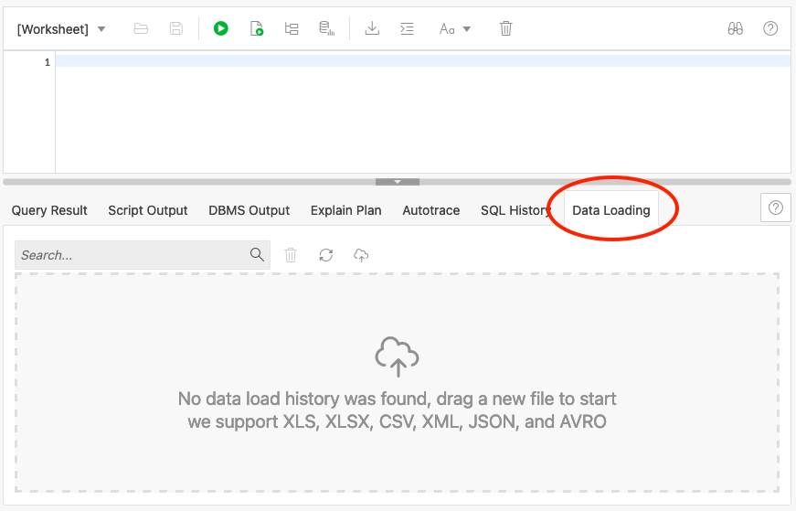

3. Click the **Data Loading area**; the center of the gray dotted-line box.

    

4. The **Upload Data into New Table modal** will appear.

    

5. We'll load some sample data into the database and create a table at the same time. Start by **downloading** this file

    💾 [CSV data](https://objectstorage.us-ashburn-1.oraclecloud.com/p/LNAcA6wNFvhkvHGPcWIbKlyGkicSOVCIgWLIu6t7W2BQfwq2NSLCsXpTL9wVzjuP/n/c4u04/b/livelabsfiles/o/developer-library/csv_data.csv)

6. Once on your desktop, **drag the file into the Upload Data into New Table modal**. You can also click the Select Files button and find where you downloaded it via your operating system's/Web Browser's file browser.

    

7. The modal will then give you a preview of what the data will look like in an Oracle table. Go ahead and **click the Next button** on the bottom right of the modal.

    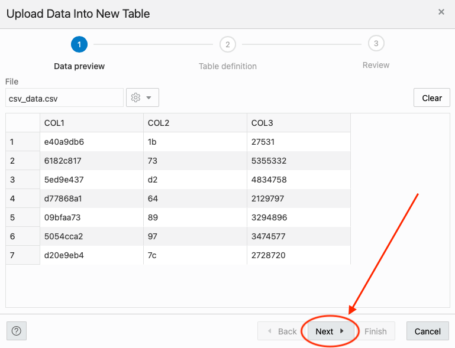

8. On the following step of the data loading modal, we can see the **name of the table** we are going to create (CSV_DATA) as well as the column and data types for the table.

     

     Set all columns to VARCHAR2 with a length of 4000. This will provide a flawless data loading experience.

     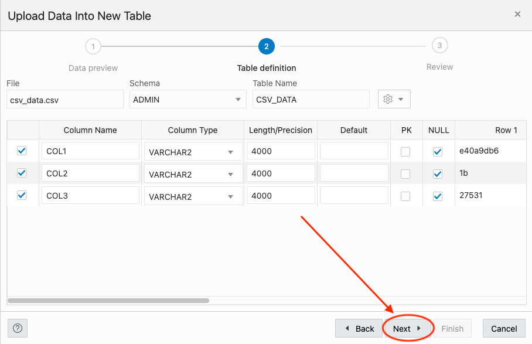

     When table and columns look like the below image, **Click Next** on the bottom right of the modal.

     

9. On the **last step** of the modal, we can see a review of the table name and source file

    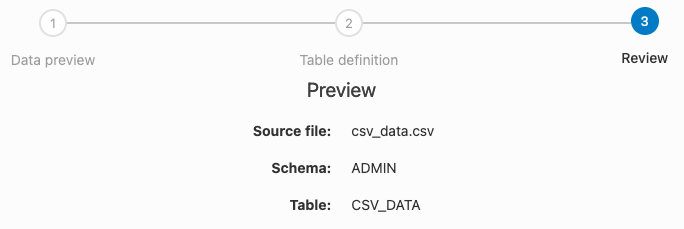

    the DDL (Data Definition Language) for creating the table

    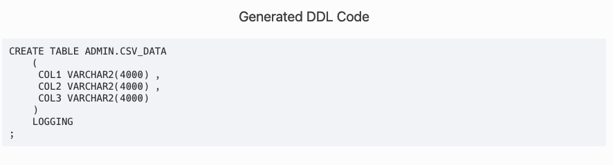

    and if you scroll down, the column mappings.

    

10. When you are finished reviewing, **click the Finish button** in the lower right of the modal.

    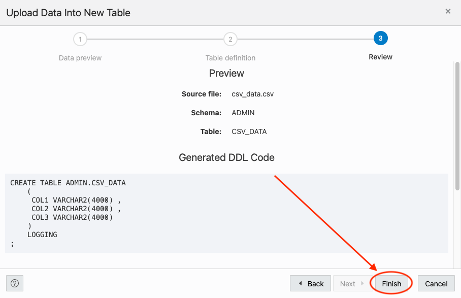

    The Data Loader will now process the file by creating a table and loading the CSV file data into that table. 

    

    Once its done, you will see a row in the Data Loading tab that indicates how many rows were uploaded, if any failed and the table name.

    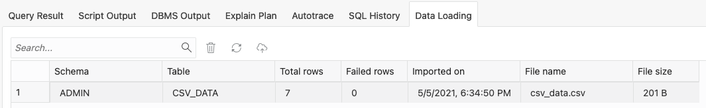

11. We can take a look at our newly created table and the data in it **by using the navigator on the left of the SQL Worksheet**. Just **right click the table name CSV_DATA** and **select Open** from the pop up menu.

    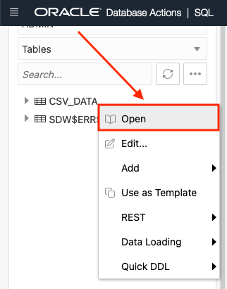

    In the slider that extends from the right of the page, we can review the data definition, triggers, constraints and even the data itself.

    

## Task 2: Auto-REST Enable a Table

1. REST enabling a table is simple. To do this, find the table we just created named **CSV_DATA** in the navigator on the left of the SQL Worksheet.

    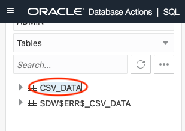

2. Right click on the table name and select **REST** in the pop up menu then **Enable**.

    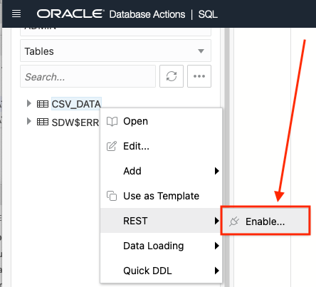

3. The REST Enable Object slider will appear from the right side of the page. Keep the default values and when ready, click the **Enable** button in the lower right of the slider.

    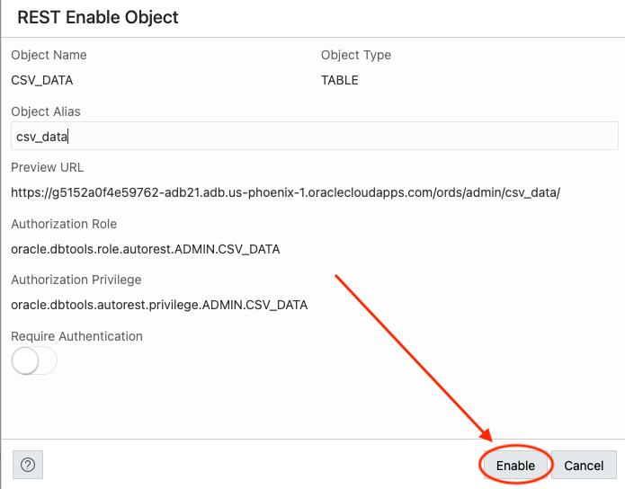

4. Thats it! Your table is REST enabled. We can work with the REST endpoints by using cURL commands provided by SQL Worksheet. To get to these endpoints, again right click the table name as we did in the previous step, select **REST**, then **cURL Command**.

    

    

      
 Oracle CloudWorld 2023 <i>Exclusive</i>

    

5. Another way to a retrieve `cURL` commands, is through the built-in OpenAPI Viewer. To do this, navigate back to the Database Actions Launchpad, by clicking the header at the top of your SQL Worksheet.

   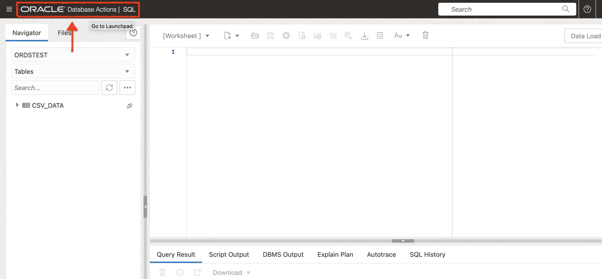

6. Once you've returned to the Launchpad, select the `REST` tile.

   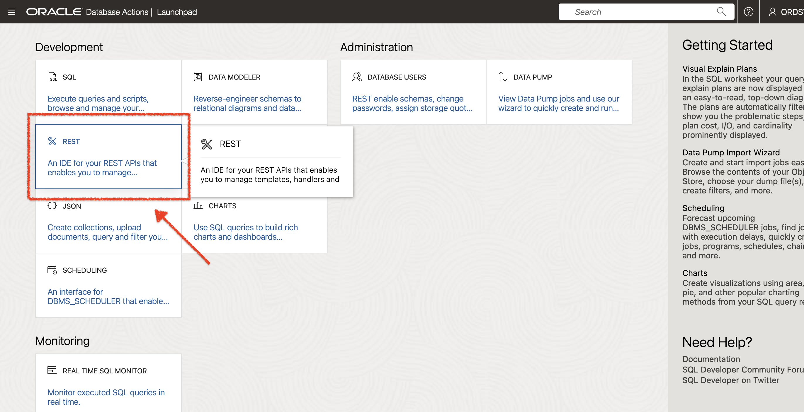

   This will take you to the `REST` Workshop. Under the `Objects` widget, you'll see the `AUTOREST` card. Click it.

   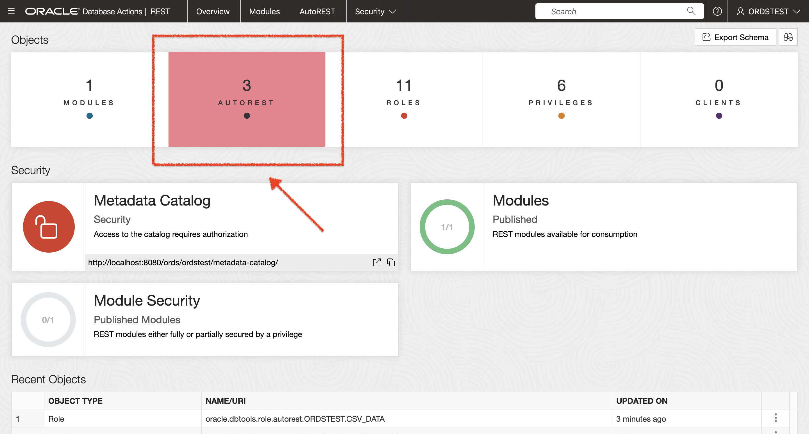

7. A report dashboard will appear. Scroll to the bottom of the page and locate the `CSV_DATA` object.

   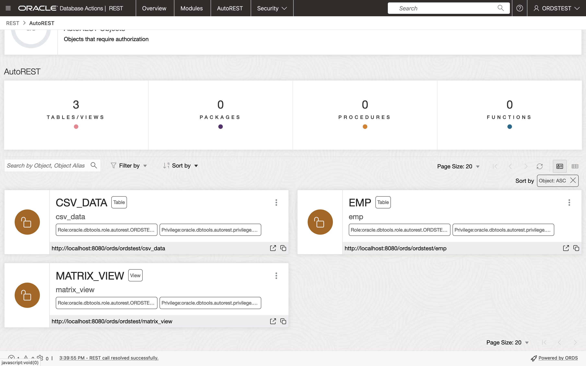

   Click the kebab icon at the corner of the object card, and select `OpenAPI View`.

   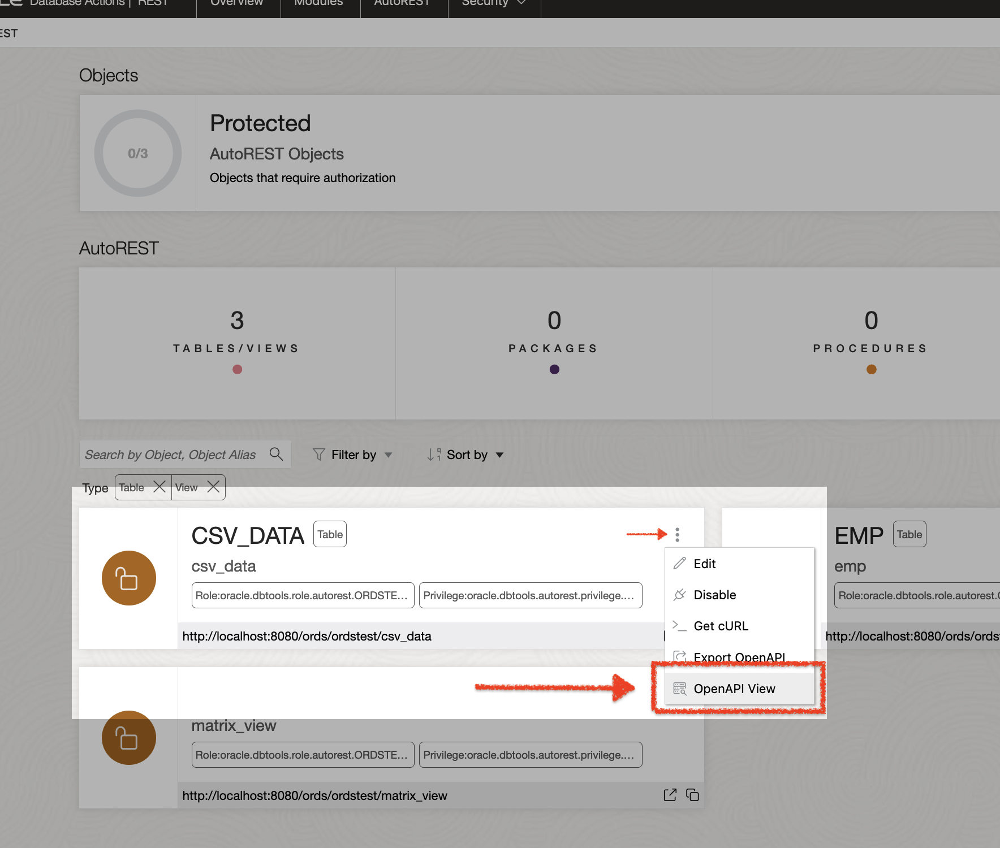

8. The OpenAPI View will appear. You'll see every auto-`REST` endpoint that has been created for you by ORDS.

   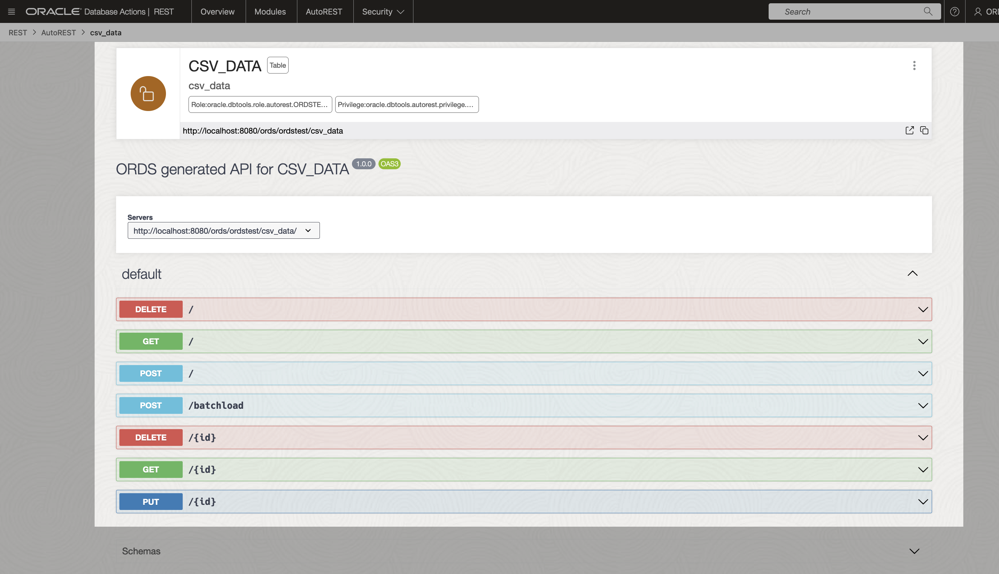

9. Navigate to the `GET` method. Expand the `GET` Operation block. Click the `Try it out` button.

   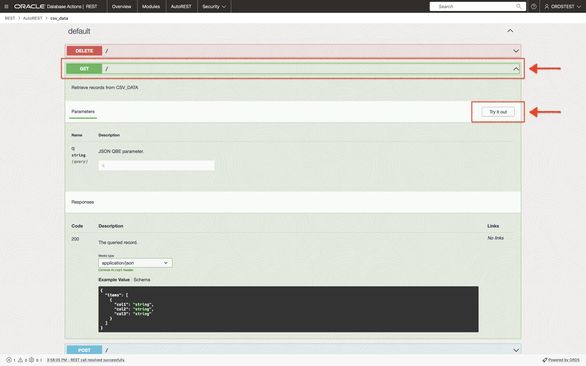

   Next, click the `Execute` button.

   

10. You'll notice a response has been returned to you. 

    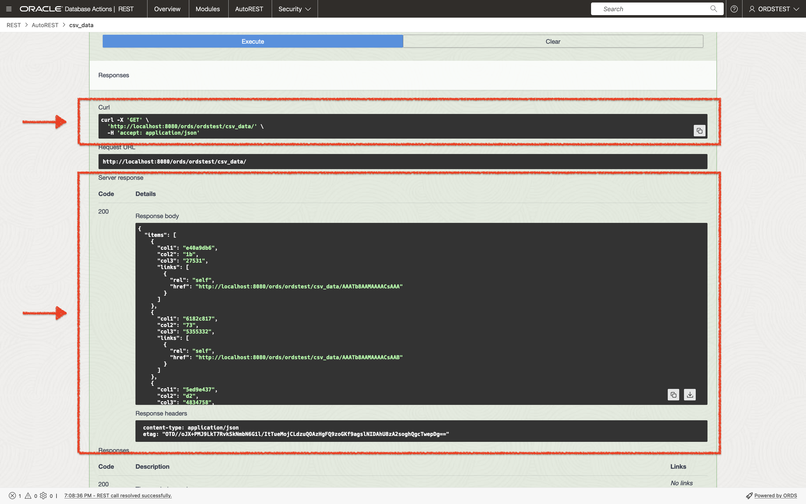

    Under the `Curl` section, locate the pre-built `curl` command. You can use this to execute your own `curl` command in your local Terminal or Command Prompt, or in the Oracle Cloud Shell.

    

11. Here is an example `curl` command in a Terminal session:

    

12. In this lab, you created a table from a csv file and REST enabled it with auto-REST.

    Next, you will learn about using a **BATCH LOAD** endpoint.

You may now [proceed to the next lab](#next).

## Acknowledgements

 - **Author**
    - Jeff Smith, Distinguished Product Manager
    - Chris Hoina, Senior Product Manager
 - **Last Updated By/Date**
    - Chris Hoina, September 2022
