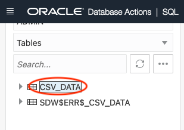
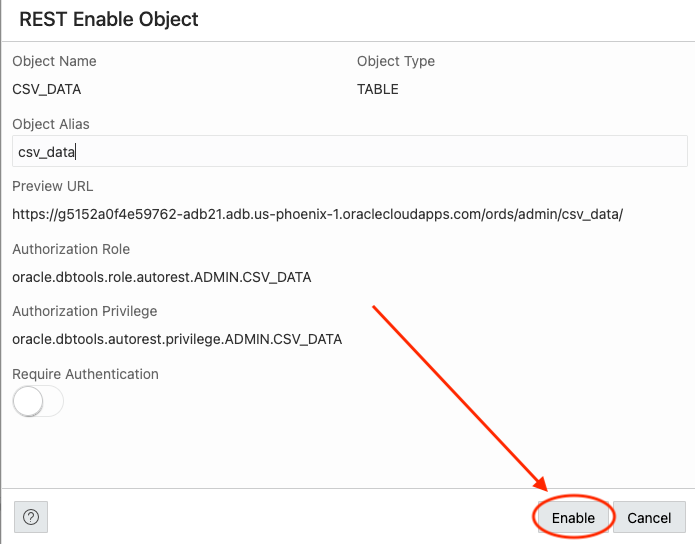
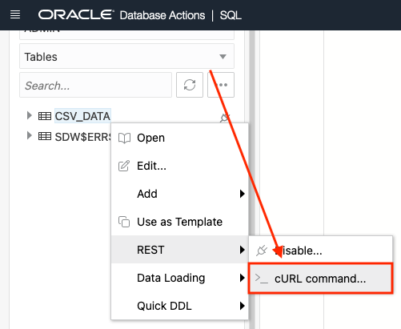

# Create and auto-REST enable a table
<!-- WMSID 4602 -->
## Introduction

In this lab you will use Database Actions/SQL Developer Web to connect to your database, create a table, and then REST enable the table.

Estimated Lab Time: 20 minutes

Watch the video below for a quick walk-through of the lab.
[Create and auto-REST enable a table](videohub:1_7agj8yum)

### Objectives

- Create and Auto-REST enable a table

### Prerequisites

- The following lab requires an [Oracle Cloud account](https://www.oracle.com/cloud/free/). You may use your own cloud account, a cloud account that you obtained through a trial, or a training account whose details were given to you by an Oracle instructor.

- This lab assumes you have completed all previous Labs.

## Task 1: Create a Table in the Autonomous Database

1. Sign in to [Database Actions](https://oracle-livelabs.github.io/common/labs/sqldevweb-login/sqldevweb-login.md) as the **admin** user and navigate to the SQL Worksheet. You can also do this from within the OCI Cloud Console.

    

    > 💡 **NOTE:** If this is your first time accessing the SQL Worksheet, you will be
    > presented with a guided tour. Complete the tour or click the X in any
    > tour popup window to quit the tour.

     

2. Save the following [CSV file](https://objectstorage.us-ashburn-1.oraclecloud.com/p/LNAcA6wNFvhkvHGPcWIbKlyGkicSOVCIgWLIu6t7W2BQfwq2NSLCsXpTL9wVzjuP/n/c4u04/b/livelabsfiles/o/developer-library/csv_data.csv), locally.

3. Next, click the **Data Load** button in the SQL Worksheet to load the CSV data into a new table.

    

4. A Data loading slider will appear. Drag and drop the CSV file into the Data loading slider window.

    

5. The `csv_data.csv` file will appear as "pending." Next, select `Settings` from the kebab menu icon.

    

6. Review the File Preview page, then click `Next`.

    

7. Review the Table name, it should be named `CSV_DATA`. Next review the column names and data types. Once you've verified all is correct, click the `Save Settings` button.

    

8. Next, click the `Upload` button. The `CSV_DATA` create table job will transition from "Pending" to "Uploaded. Once complete, click the `Close` button.

    

    

9. We can take a look at our newly created table and the data in it **by using the navigator on the left of the SQL Worksheet**. Just **right click the table name CSV_DATA** and **select Open** from the pop up menu.

    

    In the slider that extends from the right of the page, we can review the data definition, triggers, constraints and even the data itself.

    

## Task 2: Auto-REST Enable a Table

1. Next, you'll Auto-REST enable the `CSV_DATA` table. From the Navigator tab, locate the `CSV_DATA` table.

    

2. Right click on the table name and select **REST** in the pop up menu then **Enable**.

    

3. A REST Enable Object slider will appear from the right side of the page. Keep the default values, then click the **Enable** button of the slider.

    

4. The `CSV_DATA` table is now Auto-REST enabled. In later labs, you'll interact with the `CSV_DATA` table's REST endpoints with cURL commands. You can view the available REST endpoints by right-clicking the table name, selecting **REST**, then **cURL command**.

    

    > 💡 **NOTE:** Notice the available cURL commands, and options for various shell
    > environments: Command Prompt, PowerShell, and Bash.

      

      

      

5. The next lab you will learn about using a **BATCH LOAD** endpoint.

You may now [proceed to the next lab](#next).

## Acknowledgements

### Author

- Jeff "el jefe" Smith, Distinguished Product Manager
- Chris Hoina, Senior Product Manager

### Last Updated By/Date

- Chris Hoina, May 2024
