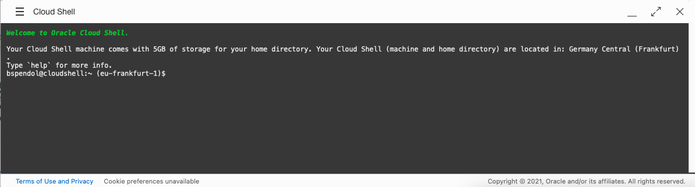

# Load data and create business logic
<!-- WMSID 4602 -->
## Introduction

In this lab you will use the `BATCH LOAD` API to load large amounts of data into a table.

Estimated Lab Time: 20 minutes

Watch the video below for a quick walk-through of the lab.
[Load data and create business logic](videohub:1_rgksftgt)

### Objectives

- Load a CSV of over 2 million rows into the `CSV_DATA` table
- Create PL/SQL business objects in the database

### Prerequisites

- The following lab requires an [Oracle Cloud account](https://www.oracle.com/cloud/free/). You may use your own cloud account, a cloud account that you obtained through a trial, or a training account whose details were given to you by an Oracle instructor.

- This Lab assumes you have completed all previous Labs.

## Task 1: Load data into the Database

1. Navigate to the **cURL slide out** of the `CSV_DATA` table.

    

2. Once the cURL command slider appears, click `BATCH LOAD`.

    

    Left click the **BATCH LOAD** side tab.

    

3. Click the copy icon for the **BATCH LOAD** endpoint.

    

    > The cURL command should resemble the following:

       ```sh
       <copy>curl --location --request POST \       
       --header "Content-Type: <CONTENT_TYPE>" \
       --data-binary @<FILE_NAME> \
       'https://coolrestlab-adb21.adb.eu-frankfurt-1.oraclecloudapps.com/ords/admin/csv_data/ batchload'
       </copy> 
       ```

    > 📝 *Save this code in a text editor or a notes application!*

4. Open the **Oracle Cloud Infrastructure Cloud Shell** or a local computer shell.

    > ⚠️ If choosing to use a local computer shell, you must have cURL installed! [Downloading cURL](https://curl.se/download.html " ").

    <details>
    <summary>*Using Cloud Shell*</summary>

      > 💡 [Learn more](https://www.oracle.com/devops/cloud-shell/) about Oracle Cloud Shell.

      1. Once logged-in to your Oracle Cloud Infrastructure account, click the Cloud Shell icon in the upper right of the Oracle Cloud Infrastructure banner:

         

      2. The Cloud Shell will open on the lower part of the web browser:

         

      3. We will be using the Oracle Cloud Infrastructure Cloud Shell for examples in this lab going forward.

    </details>

5. Download the CSV file using Cloud Shell or locally with the following command:

       ```sh
       <copy>
       curl -o 2M.csv https://objectstorage.us-ashburn-1.oraclecloud.com/p/LNAcA6wNFvhkvHGPcWIbKlyGkicSOVCIgWLIu6t7W2BQfwq2NSLCsXpTL9wVzjuP/n/c4u04/b/livelabsfiles/o/developer-library/2M.csv</copy>
       ```

6. With the file saved locally, it can now be loaded into the database. With the cURL command found in Step 3, include the following:

    - `--write-out '%{time_total}'`
    - `--data-binary "@2M.csv"` so that the cURL application knows which file to upload
    - `-H "Content-Type:text/csv` to specify a Content Type header
    - `?batchRows=5000&errorMax=20` as query parameters
    - `--user "admin:[your password]"` with your own admin credentials

7. Once the changes have been made, your cURL command should resemble:

       ```sh
       <copy>curl --write-out '%{time_total}' -X POST --data-binary "@2M.csv" \
       -H "Content-Type:text/csv" --user "admin:123456ZAQWSX!!" \
       "https://coolrestlab-adb21.adb.eu-frankfurt-1.oraclecloudapps.com/ords/admin/csv_data/batchload?batchRows=5000&errorsMax=20"</copy>
       ```

8. Using the **Cloud Shell**, **paste** your constructed cURL at the **command prompt**.

    

   > ⚠️ **NOTE:** Before executing this cURL command, ensure you `"cd"` to the directory where your `2M.csv` file is located.

9. When the **command is finished**, you should see that all **2,097,148 records were inserted** into the table.

        ```
        <copy>
        curl --write-out '%{time_total}' -X POST --data-binary "@2M.csv" \
        -H "Content-Type:text/csv" --user "admin:123456ZAQWSX!!" \
        "https://coolrestlab-adb21.adb.eu-frankfurt-1.oraclecloudapps.com/ords/admin/csv_data/batchload?batchRows=5000&errorsMax=20"

        #INFO Number of rows processed: 2,097,148
        #INFO Number of rows in error: 0
        #INFO Last row processed in final committed batch: 2,097,148
        0 - SUCCESS: Load processed without errors
        29.447</copy>
        ```
        
       `29.447` is the result of the **--write-out '%{time_total}'** option we added, indicating it took about 30 seconds to load 2 million records!

## Task 2: Adding business logic

1. We'll now add a function, simulating business logic. The following function returns a count of all the rows that match the input provided to col2 in the table:

       ```sql
        <copy>create or replace procedure 
        return_count (p_input in varchar2,
        p_output out number) is begin
            select count(*)
            into p_output
            from csv_data
            where col2 = p_input;
            end return_count;
            /</copy>
            ```

2. Copy and paste this code into the SQL Worksheet and left click the **Run Script** button on the toolbar:

    

3. We can now test this procedure. Copy and paste the following and execute it in the SQL Worksheet with the **Run Script** button:

       ```sql
       <copy>
       declare
           l_output number;
       begin
           return_count(   p_input => 'a1',
                           p_output => l_output);
       dbms_output.put_line(l_output);

       end;
       /
       </copy>
       ```

   

4. In this lab, you loaded over two million rows into a table with cURL and REST as well as added business logic to the database.

You may now [proceed to the next lab](#next).

## Acknowledgements

### Author

- Jeff Smith, Distinguished Product Manager
- Chris Hoina, Senior Product Manager

### Last Updated By/Date

- Chris Hoina, May 2024