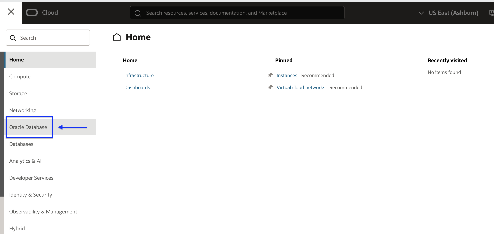
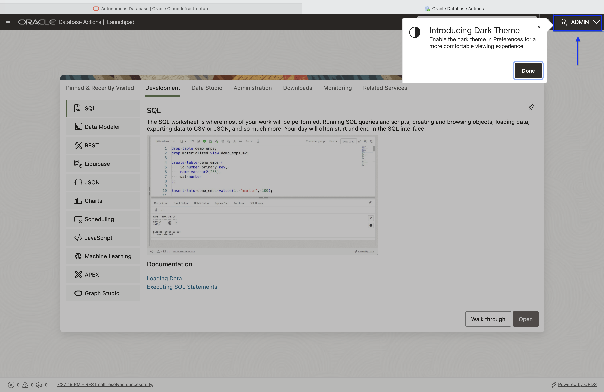

# Provision and Connect to an Oracle Autonomous Database

## Introduction

This lab guides you through the steps for provisioning an Oracle Autonomous database 23ai. This workshop uses a Free Tier Autonomous Data Warehouse (ADW) on Oracle Cloud Infrastructure. All examples in this workshop assume a 23ai ADB. 

Estimated lab time: 10 minutes

### Objectives

- Provision a new Autonomous Transaction Processing instance.

### Prerequisites

- This lab requires completion of the **Register for Free Tier** lab.

## Task 1: Choosing an Autonomous Database from the Services Menu

1. Log in to the Oracle Cloud, as shown in the previous lab.
2. Once you are logged in, click the navigation menu in the upper left of the Cloud Console.

  

3. Select Oracle Database, then Autonomous Database. 
 
  

  

4. Ensure you are in your Root compartment; select the **Create Autonomous Database** button.

  

## Task 2: Creating the Autonomous Database Instance

1. Begin by entering in a unique Display name and Database name; to better follow along it is recommended you choose `ords101db` for your Display name and Database name. Ensure you are in your Root compartment, choose Data Warehouse as the Workload type.

  

2. Toggle the Always Free radio button to the on position. Choose 23ai as the database version.

  

3. Enter in a password for your ADB's Administrator. Keep the default Network access settings.

  

> NOTE:  For security purposes, this password should differ from your Tenany Administrator password.  
> NOTE: The password must meet the following requirements:
>   - The password must be between 12 and 30 characters long and must include at least one uppercase letter, one lowercase letter, and one numeric character.
>   - The password cannot contain the username.
>   - The password cannot contain the double quote (") character.

4. Finally, enter in your valid email address, and click **Create**.

  

5. You will automatically be redirected to your new ADB dashboard. In a few moments the ADB will transition from a **Provisioning** state to an **Available** state.

  

## Task 3: Accessing Database Actions

1. Once the ADB reaches an Available state, click the **Database actions** button, and selecet **View all database actions** from the dropdown menu.

  

2. A new browser tab or window will appear, revealing the Database Actions LaunchPad. If you are not automatically logged in, sign in with username Admin, and the password you created when you created your ADB (see step 7 above). 

  

### Let's Get Started

You may now [proceed to the next lab](#next).

## Acknowledgements

### Authors

- Jeff Smith, Distinguished Product Manager
- Chris Hoina, Senior Product Manager

## Last Updated By/Date

- Chris Hoina, September 2025
