# REST-enable tables and add business logic

## Introduction

In this lab, you will use Database Actions and the REST Workshop to turn a PL/SQL procedure and an SQL statement into REST APIs.

Estimated Lab Time: 20 minutes

Watch the video below for a quick walk-through of the lab.
[REST-enable tables and add business logic](videohub:1_y8l03s43)

### Objectives

- Publish REST API using Custom SQL
- Publish REST API using stored PL/SQL procedure
- Explore the OpenAPI View

### Prerequisites

- The following lab requires an [Oracle Cloud account](https://www.oracle.com/cloud/free/). You may use your own cloud account, a cloud account obtained through a trial, or a training account whose details were given to you by an Oracle instructor.

- This lab assumes you have completed all previous Labs.

## Task 1: REST Enable a SQL Statement

1. Navigate to the **Database Actions Menu** in the upper left of the page and select **REST**.

   

2. Once on the **REST page**, use the upper tab bar to select **Modules**.

    

3. On the Modules page, left-click the **+Create Module** button in the upper right.

    

4. The **Create Module** slider appears from the right of the page.

    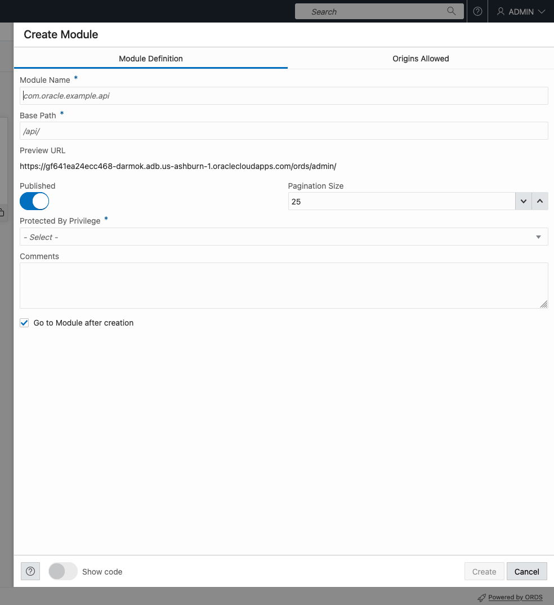

5. Using the **Create Module** slider, enter the following Module name: `com.oracle.livelab.api`

    ```sh
    <copy>com.oracle.livelab.api</copy>
    ```

    <details>
    <summary>*About Resource Modules*</summary>

    A module is an organizational unit used to group related resource templates. Templates will have handlers, which are responsible for providing the logic required to service a specific HTTP method (e.g., GET, POST, PUT, DELETE, UPDATE, etc.).

    </details>

    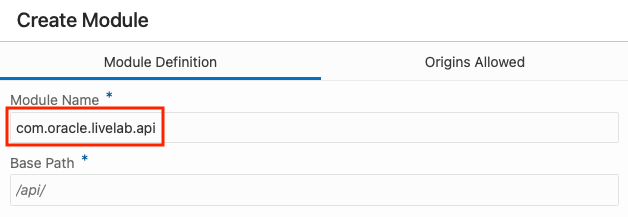

6. Enter **/api/** in the **base path field**:

    ```sh
    <copy>/api/</copy>
    ```

    

7. Select **Not Protected** from the **Protected By Privilege** dropdown list.

    

8. Once complete (**your URL hostname will be different than the below image**), click the **Create** button.

    

    > **INFO:** Here you can toggle "Show Code" to review what module creation might look like if it were performed manually.
    >
    > 

9. Next, we'll create a **Template** for our newly created module. To do so, click the **+ Create Template** button on the right side of the page.

    

10. The **Create Template** slider will appear. Here, we will create the endpoint, or URL location, for our REST-enabled SQL statement. This statement will expect a value. In the **URI Template** template field, enter:

    ```sh
    <copy>sqlreport/:id
    </copy>
    ```  

    <details>
    <summary>*What does the **`/:id`** in **`sqlreport/:id`** mean?*</summary>

    This is called a "Route Pattern." You can use route patterns for required parameters in the URI to specify parameters for REST requests such as the GET method (which does not have a body) and in other special cases.

    **Want to learn more?** Read the full specification for ORDS Route Pattern syntax [here](https://docs.oracle.com/en/database/oracle/oracle-rest-data-services/24.2/ordjv/doc-files/route-patterns.html).
    </details>

      

11. When complete (**your URL hostname will be different than the below image**), click the **Create** button.

    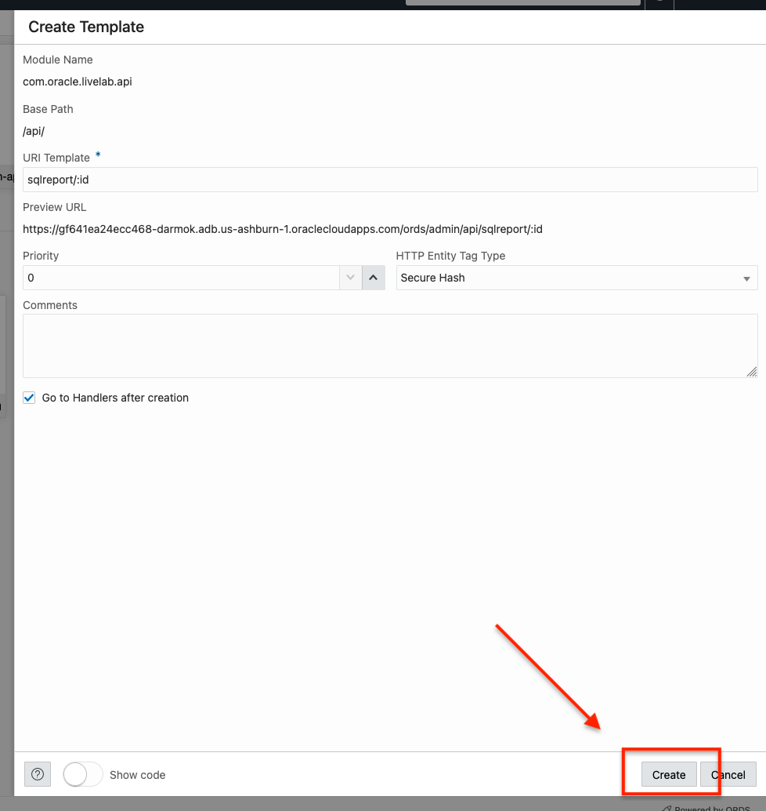

12. Next we will create the **Handler**; which contains the actual SQL statement. Click the **+ Create Handler** button.

    

13. The **Create Handler** appears from the right of the page.

    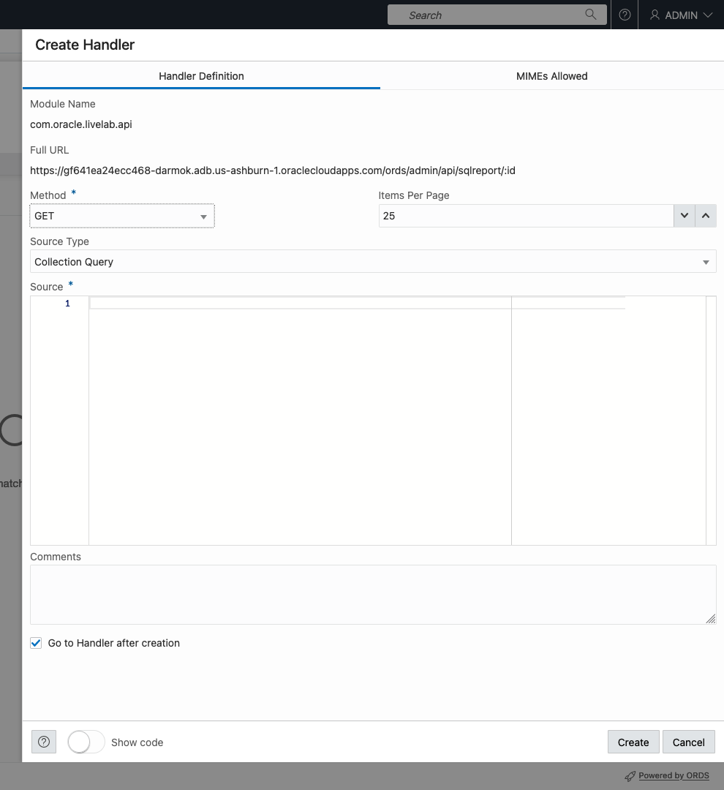

14. Enter `Select * from csv_data where col2 = :id` in the **Source** section of the **Create Handler** slider:

    ```sh
    <copy>select * from csv_data where col2 = :id</copy>
    ```

    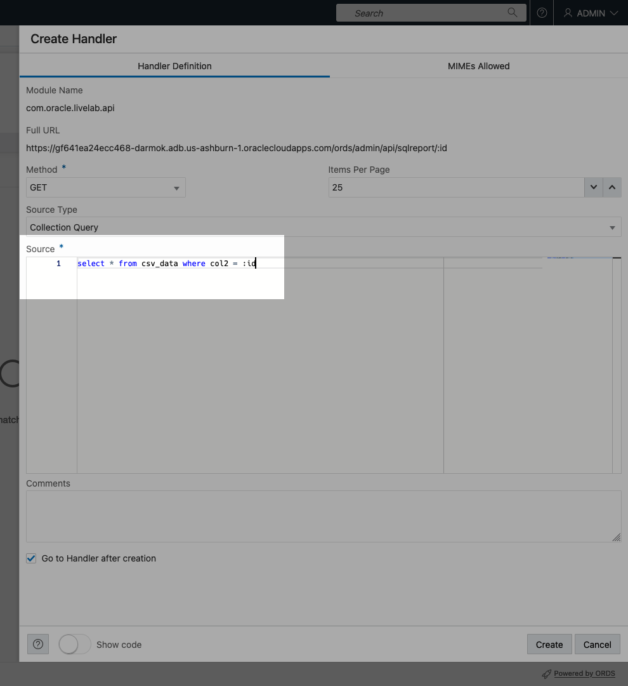

15. When complete (**your URL hostname will be different than the below image**), click the **Create** button.

    

16. We can test our Handler on the Template page. Click the **Execute** button in the **Source** section of the page.

    

17. After clicking the **execute** button a **Bind Variables** modal will appear. Enter **a1** for the value in the **id** field and then click **OK**.

    

18. You can see the results of the query just below the **Source** section. (You may need to scroll the page down):

    

19. We can also test this endpoint in a browser. Click the **Open in New Browser Tab** button.

    

20. In the new browser tab/window with the REST endpoint URL, replace the `:id` with a1 and submit the URL.

    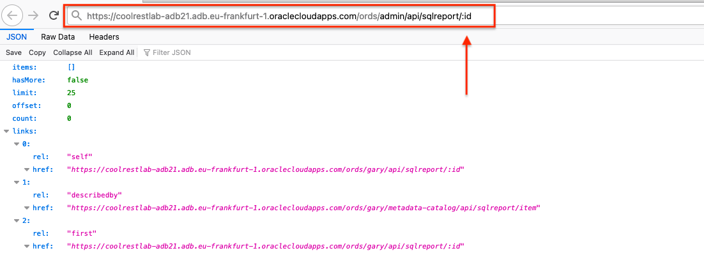

    

## Task 2: REST Enable Business Logic (PL/SQL procedure)

1. Next, we'll REST enable our business logic or PL/SQL procedure. To do so, click `com.oracle.livelab.api` in the Database Actions breadcrumbs.

    

2. Next click the **+ Create Template** button on the right side of the page.

    

3. The **Create Template** appears from the right of the page.

    

4. In the **URI Template** template field, enter `bizlogic`

    ```sh
    <copy>bizlogic</copy>
    ```

    

5. When complete (**your URL hostname will be different than the below image**), click the **Create** button.

    

6. Click the **+ Create Handler** button.

    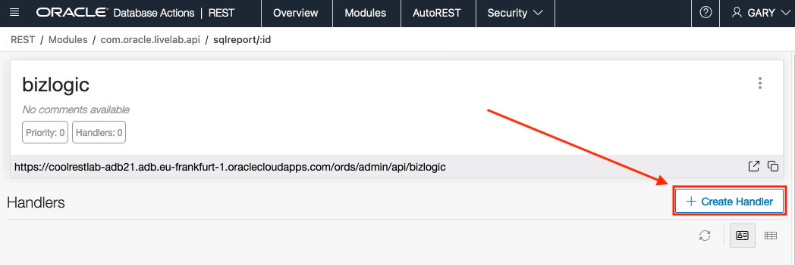

7. Change the **Method** from `GET` to `POST` since we are *submitting* a value to the REST Service. Use the dropdown in the **Method** field to select **POST**.

    

    > Upon changing the **Method** to post, we see the **Source Type** change to PL/SQL.

8. Enter the following PL/SQL into the **Source** field:

    ```sql
    <copy>
    BEGIN
        return_count(p_input => :id, p_output => :output);
    end;
    </copy>
    ```

    

9. When complete (**your URL hostname will be different than the below image**), click the **Create** button.

    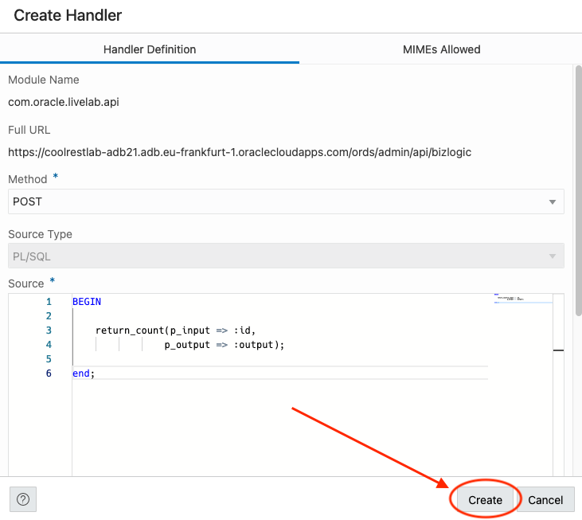

10. Next we'll create an output parameter so we can return a result.

    > **NOTE:** We should expect the count or rows where the passed-in value is equal to the values in col2 in our table.

11. Under the **Source** area, locate the **+ Create Parameter** button. Click the **+ Create Parameter** button.

    

12. The **Create Parameter** slider will appear.

    

13. For the **Parameter Name** field and the **Bind Variable Name** field, enter **output**

    ```sh
    <copy>output</copy>
    ```

    

14. Select `Response` from the **Source Type** dropdown field.

    

15. Select `INT` for the **Parameter Type** field (recall, we are returning a number or integer).

    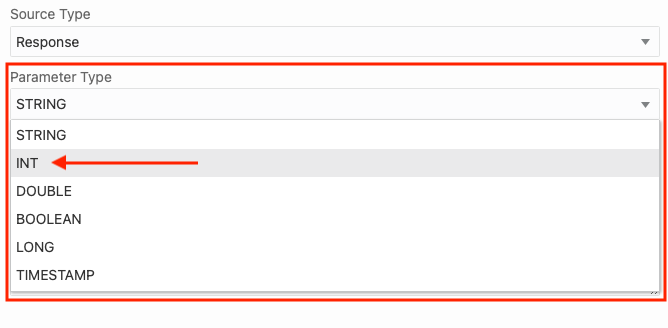

16. Choose `Output` as the **Access Method**.

    

17. When complete (**your URL hostname will be different than the below image**), click the **Create** button.

    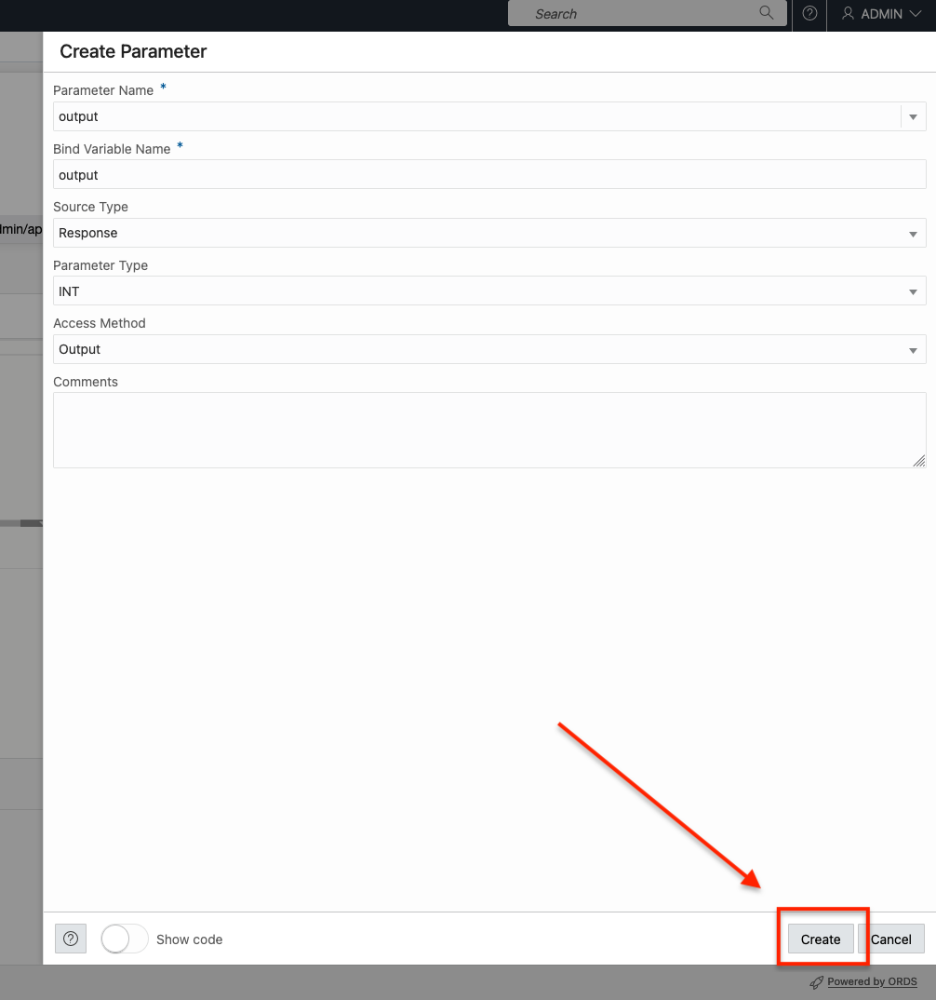

18. You will see the newly created parameter in the parameters table at the bottom of the page.

    

## Task 3: Test an ORDS APIs

1. Next we will test our API. Click **bizlogic** from the Database Actions breadcrumbs.

    

2. Click the kebab menu icon  on the **bizlogic POST tile**. Then select **Get cURL command**.

    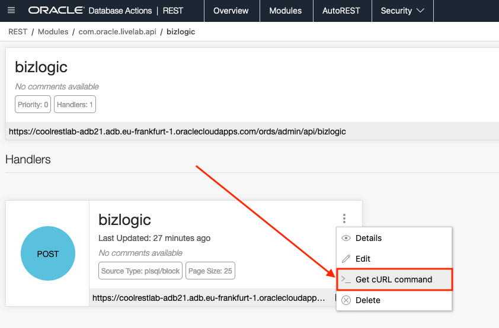

3. The cURL Command modal appears:

    

    > 💡 Choose the appropriate cURL command for your environment!
    > 

4. Click the `Substitutions` icon, and a modal will appear.

    

5. Enter `a1` into the **id** field, and place a ✔️ in the `Null` option for the `Output` field. Then click `OK`.

    

6. Copy the cURL command with the added Substitution value.

    

7. Then, using the Oracle Cloud Infrastructure Cloud Shell, paste the cURL command and run it. The shell will display the output variable response.

    ```sh
    <copy>curl -X POST \
    'https://livelab.adb.eu-frankfurt-1.oraclecloudapps.com/ords/admin/api/bizlogic' \
    --header 'Content-Type: application/json' \
    --data-binary '{
    "id": "a1",
    "output": "" 
    }'</copy>
    ```

    

    > You can test other values by changing the id variable. Valid combinations are:
    >
    >| Variable position | Valid characters | Case      |
    >| ----------------- | ---------------- | --------- |
    >| First character   | `a` through `f`  | lower-case|
    >| Second character  | `1` through `9`  | n/a       |
    >
    > *Some valid examples are: a1, e9, d3, b6*

## Task 4: Explore the OpenAPI View created by ORDS

1. Return to the Module's main page by clicking its name in the breadcrumbs at the top left of the page.

    

2. Click the the kebab icon  in the Module region and select **OpenAPI View**.

    

3. The OpenAPI View page displays your REST services as a Swagger UI implementation.

    

    You can explore your created APIs and try them out *directly* in the browser window.

    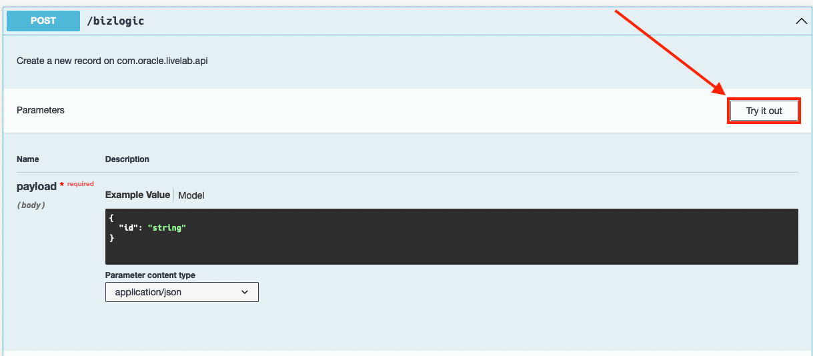

    Using the pop-out icon, you can also export this page as an OpenAPI doc for use in other tools and services.  Select **Export Module** then **OpenAPI**.

    

    **An example of what the OpenAPI export will look like.**

    

4. In this lab, you published a REST API that accepts input using custom SQL and a REST API that uses a stored PL/SQL procedure.

You may now [proceed to the next lab](#next).

## Acknowledgements

### Author

- Jeff Smith, Distinguished Product Manager
- Chris Hoina, Senior Product Manager

### Last Updated By/Date

- Chris Hoina, August 2024
