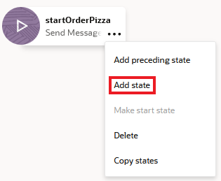
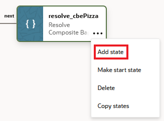
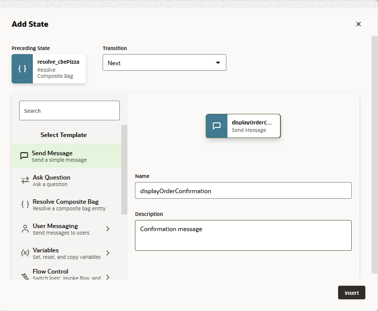

## Introduction

With the NLP model created, you are ready to build a dialog flow for the skill. The dialog flow is a blueprint for the interactions that enable the conversation between the skill and the user. Although you're going to create a single flow in this tutorial, a skill can have multiple flows that support different use cases and functions.

Each flow is made up of one or more states, and each state executes a function: rendering a skill response message, authenticating a user, branching the conversation when certain conditions are met, etc. The Visual Flow Designer provides you with templates for each state.

## Task 1: Create the Order Pizza Flow

Now that you have the OrderPizza intent and the pizza variable, you're ready to start building the dialog flow.

1.  Click  **Flows** in the left navbar.
2.  Click **Add Flow**.
4.  In the Create Flow dialog, enter `intent.reg.order` as the name.
3.  For the description, enter `Order pizza flow`.
4.  Select **OrderPizza** from the Intent Name list to create a mapping between the OrderPizza intent and this flow. This mapping instructs the Main Flow to execute this flow when user input resolves to the OrderPizza intent. You can also set intent event mappings like this one within the Main Flow.
.


5.  Click **Create**.
6.  Click **intent.reg.order** in the flow list.


7.  In the dialog flow editor, hover over the Start node to display its menu . Click the menu then click **Add start state**.


8.  In the Add State dialog, choose **Send Message**, then enter `startOrderPizza` as the name and `Greeting Message` as the description. Then click **Insert**.  
    
    
    
        
    When you're done, the `startOrderPizza` state should appear in the canvas with its property editor open to the Component page. (If the property editor isn't open, click the `startOrderPizza` state.) Note that the editor notes that this flow has an error  that prevents it from being viable. In this case, it's because this component needs a text message.
    
    
    
        
9.  Paste the following into the Messages field:
    
    ```   
    Ok, let's get that order sorted.
    ```

    When you're done, the Order Pizza flow should look like this so far.


10.  Hover over the `startOrderPizza` state to access the menu. Then click **Add State**.




11.  In the Add State dialog, choose **Resolve Composite Bag**.
12.  Name the state `resolve_cbePizza`.
13.  Enter `Pizza menu` as then description. Then click **Insert**.


When you're done, the `resolve_cbePizza` state should appear in the canvas with its property editor open to the Components page. Note the `next` transition line that connects it to the `startOrderPizza` state.


14.  Like the startOrderPizza state, the resove\_cbePizza state is flagged with an error because of an undefined property. For this state, the Component page tells you that you can fix this error by adding a variable reference a composite bag entity, which in this case, is the cbePizza entity. To create this variable, click **Create**.
15.  Because only the `intent.reg.order` flow uses this variable, choose **Flow Scope Variable**. The value held by this variable will persist only until the flow executes. If the other flows in this skill needed this variable, then you would create a skill scope variable instead.


16.  For the name, enter `pizza`.
17.  For the description, enter `Resolves the pizza order`.
18.  Select **Entity** as the variable type, then select **cbePizza** as the entity name.
19.  Click **Apply**.


20.  Hover over the `resolvePizza` state to access the menu, then click **Add state**.




21.  Select **Send Message**.
22.  Name the state `displayOrderConfirmation`.
23.  Enter `Confirmation message` as the description. Then click **Insert**.
    
    
    
        
24.  In the Component page of the property inspector, enter the following confirmation message. It uses ApacheFreeMarker expressions to access the values set for the pizza variable:
    
    *   For Versions 22.04 and 22.06:
        
        ```       
        Your ${pizza.value.pizzaSize.value} ${pizza.value.pizzaTopping.value} pizza will be delivered at ${pizza.value.deliveryTime.date?long?number\_to\_time?string('HH:mm')}
        ```
        
        
               
    *   For Version 22.08 and higher:
        
        ```       
        Your ${pizza.value.pizzaSize.value} ${pizza.value.pizzaTopping.value} pizza will be delivered at ${pizza.value.deliveryTime.value\[0..4\]}.
        ```
    
    When you're done, the flow should look like this:
    
    
    
        
    If you're stuck, you can import a [complete version of the skill](https://docs.oracle.com/en/cloud/paas/digital-assistant/tutorial-skill/files/PizzaKing_Complete(1.0).zip) for your reference.
    

### Notes on What You Just Did

In this section:

*   You created a variable that references the composite bag entity and a state for resolving this composite bag entity. If you hadn't created the composite bag entity, you would have needed to create separate variables for pizza size, pizza topping, and delivery time that would, in turn, require separate states in the dialog flow.
*   When you created the dialog flow, you mapped it to the OrderPizza intent so that it's executed whenever user input gets resolved to the OrderPizza intent at or above the confidence level.
*   By creating the `resolve_cbePizza` state, you learned how to leverage a composite bag to create a compact flow. Finally, for the output message in the `displayOrderConfirmation` state, you added an Apache FreeMarker expression that accessed the values set for the skill-level pizza variable through the skill. property.