## Introduction

Now it's time to add entities, which detect information in the user input that can help the intent fulfill a user request. For the Pizza King business, such information could be pizza size, pizza toppings, and delivery time. For example, the user input "I'd like to order a _small meaty_ pizza at _9:00 pm_" contains all three of these information types.

We'll create custom entities for size and topping and later use a built-in entity for time. While we're at it, we'll add some synonyms (including some common misspellings) that optimize the entity's ability to tag words from sloppy user input.

## Task 1: Create Entities for Pizza Size and Pizza Topping

1.  In the left navigation for the designer, select .
2.  Click **\+ Add Entity** to create a new entity.
3.  In the **Name** field, change the value to `PizzaSize`.
4.  In the Configuration section, select **Value list** from the **Type** menu.
5.  Click **\+ Value**.
6.  For **Value**, type `small`.
7.  For **Synonyms**, type `Personal`, then click Enter. Type `smallest`, and then click Enter again.
8.  Click **Create**.

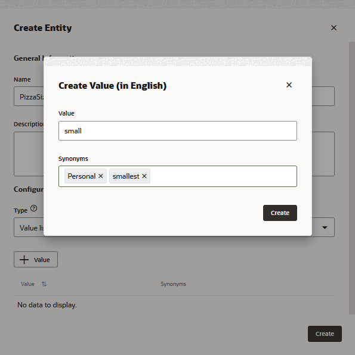

10.  Following the procedure described in the previous four steps, you are going to add two more values to the PizzaSize entity: one for medium-sized pizza orders, and one for large-sized pizza orders.
    
    | Value | Synonym(s) |
| -------- |:----:| 
| `medium` | `Middle` | 
| `large`| *   `Big`  *   `grande`   *   `biggest` | 

    
11.  Click **Create** to complete the entity.
12.  Click **\+ Add Entity** to create another entity.
13.  In the **Name** field, change the value to `PizzaTopping`.
14.  In the Configuration section, select **Value List** from the **Type** menu
15.  Add separate values for `Meaty`, `Veggie`, `Hot and Spicy`, and `American Hot`.
16.  Click **Create**.

PizzaSize and PizzaToppings should appear in the list of entities, as shown in this image:

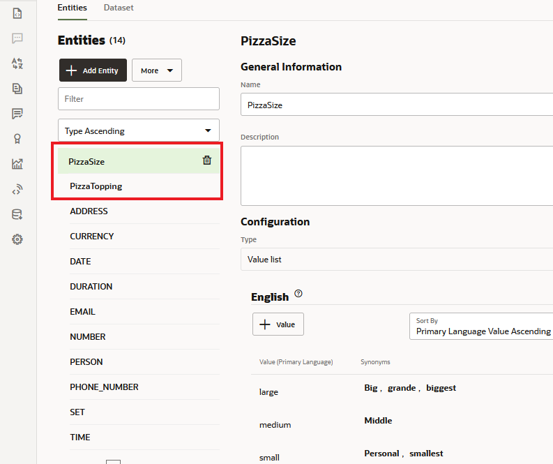

## Task 2: Edit Prompts for the Entities

Now let's enter some text to prompt users to enter values that can be matched by these entities.

1.  In the list of entities, select **PizzaSize**.
2.  Scroll down to the Prompts section.

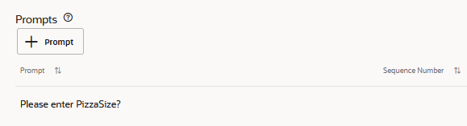

3.  In the row for the default prompt ("Please enter PizzaSize"), click , replace the text with Which size would you like for your pizza? Then click Enter.
    
    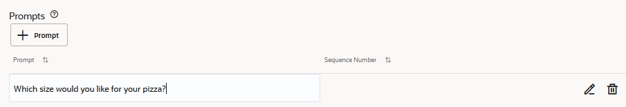    
       

4.  In the list of entities, select **PizzaTopping**.
5.  Scroll down to the Prompts section.
6.  In the row for the default prompt ("Please enter PizzaTopping"), click , replace the text with `What type of pizza would you like?`

Later on in the tutorial, you'll notice that the skill will use these prompts when it needs to ask the user for pizza size and pizza topping.

## Task 3: Create a Composite Bag Entity

In this step, you're going to simplify your development efforts using a composite bag entity, which enables you to manage the three entities that you just created as a consolidated entity. When these entities are controlled by a composite bag, you won't need to create separate references for them when you create the voice of your skill (aka the dialog flow) later on. In addition to unifying your entities, the various composite bag properties enable your skill to match entity values in complex, real-world scenarios that involve erratic user input.

1.  Click **\+ Add Entity**.
2.  In the **Name** field, enter `cbePizza`.
3.  In the Configuration section, select **Composite Bag** from the **Type** menu.

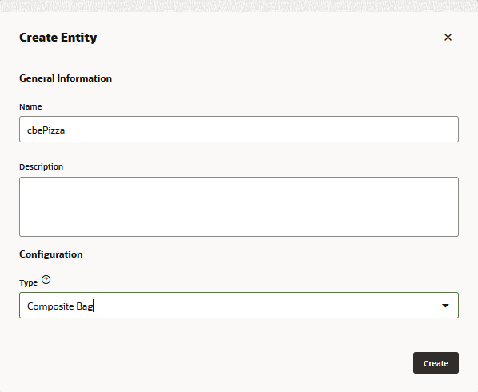

## Task 4:  Add Entities to the Composite Bag

1.  Click **cbePizza** in the entity list to access its editing page.
2.  To add the entities that are managed by the composite bag, you need to create references for them called bag items. Click **\+ Bag Item**.

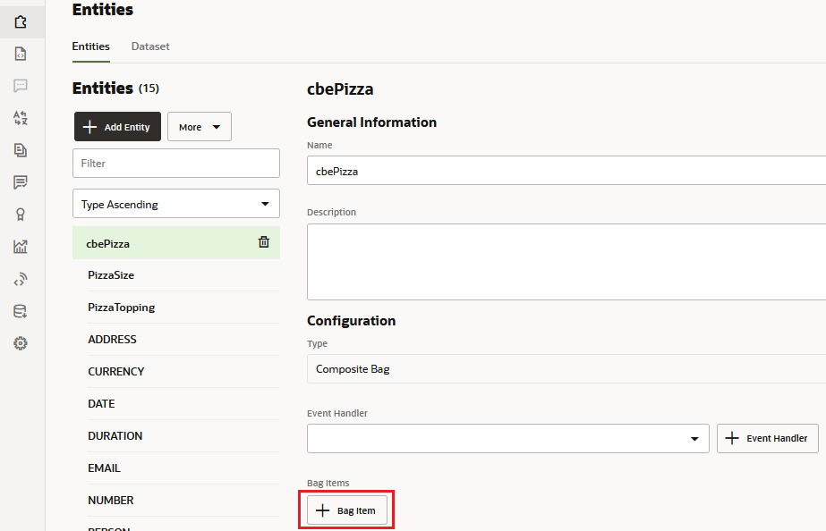

4.  In the Add Bag Item dialog, replace _BagItem1_ in the Name field with `pizzaSize`.
5.  Select **Entity** as the type.
6.  Choose **PizzaSize** from the Entity Name list.

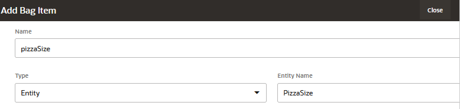

8.  Click **Close** (located at the upper right).
9.  Repeat these steps to create the Create a bag item for the PizzaTopping entity:
    *   Name the item `pizzaTopping`.
    *   Choose **PizzaTopping** from the Entity Name list.
10.  In addition to enabling users to select the pizza type and size, the skill will also enable them to enter a delivery time. For this, you're going add another entity item to the bag. Unlike the PizzaSize and PizzaType entities that you created from scratch, you're instead going to use the built-in TIME entity (or if you're skill is Version 22.08 higher, the DATE\_TIME entity), which recognizes various time formats in the user input. To create this item:
    *   Click **+Bag Item**.
    *   Enter `deliveryTime` in the Name field.
    *   Select **Entity** from the Type list.
    *   Choose **TIME** from the Entity Name List. If your skill is Version 22.08 or higher, choose **DATE\_TIME** from the Entity Name List. Then choose **TIME** from the Subtype menu.
    
    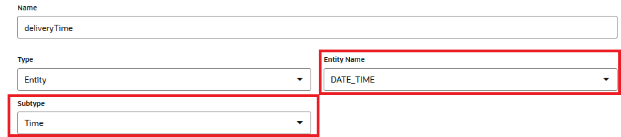
    
        
    *   Scroll down the page, then click **\+ Prompt**.
    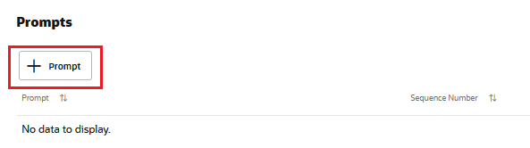*   Type `When can we deliver that for you (e.g., 4pm)?` and then click Enter.
    
    
    
       
    *   Click **Close**. When you're done, the Bag Items section of the cbePizza editing page should look like this:
    
    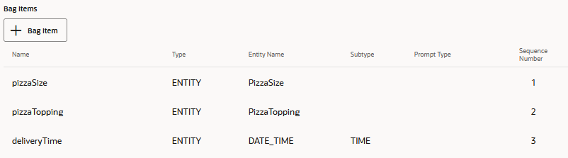
    
       
11.  Click **Train**.
12.  Select **Entity**, then click **Submit**.

## Task 5: Associate the Entities with OrderPizza Intent

For an entity to be recognized when parsing the user input message, it needs to be associated with the appropriate intents. In this case, we need to associate the composite bag entity with the OrderPizza intent.

1.  In the left navigation for the designer, select .
2.  Select the **OrderPizza** intent.
3.  Click the **Add Entity** dropdown (in the upper right side of the page), type `pizza` in the **Filter Field**, and select **cbePizza**.

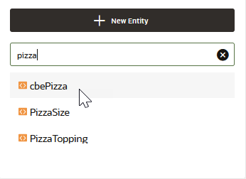

5.  Retrain the model with Trainer Tm.

## Task 6: Test the Entities

The Utterance Tester feature enables you to test whether the skill identifies entity values in user input.

1.  In the left navigation for the designer, select .
2.  Click the **Test Utterances** link. Click **Reset** to clear the input field.
3.  In the **Utterance** field of the dialog, type I want to order a small hot and spicy pizza at 7:30 pm and click **Test**.
    
    The Utterance applies entity labels to the matched terms in the utterance. It also notes that the entities belong to the cbePizza entity.
    
    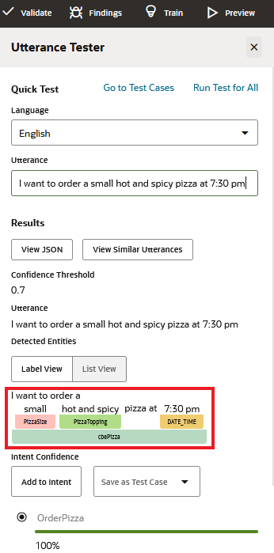
    
        
    Since the entities are recognized in the user input, the skill doesn’t have to ask the user for that information later in the flow.
    
    Now let's try another one.
    
4.  In the **Utterance** field, now type I want to order the biggest meaty pizza at noon and click **Test**.
    
    The result should look like what is shown below. The PizzaSize label notes that the "biggest" synonym is matched for the PizzaSize entity. The Time label notes that "noon" is a recognized value.
    

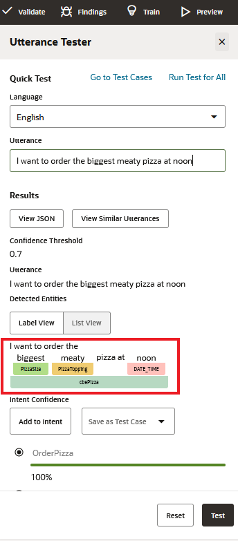

### Notes on What You Just Did

In this part of the tutorial, you have created custom entities for the Pizza King OrderPizza intent, associated the entities with the intent, and tested the entity recognition in the embedded skill tester.

Similar to the PizzaOrder intent, you would typically need to create and associate entities for the other intents as well. In the interest of time, this tutorial only focuses on the PizzaOrder intent.