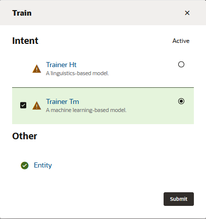

## Introduction

Oracle Digital Assistant's underlying natural language processing (NLP) engine doesn't inherently know about the business or task that a skill is supposed to assist with. For the skill to understand what it should react to, you need to define intents and examples (utterances) for how a user would request a specific intent.

For the Pizza King example, you will create intents for ordering pizza, cancelling an order, and filing a complaint. The order pizza intent is a regular intent, which means that it's mapped to a specific flow that will likely involve one or more exchanges between the user and skill. The cancel pizza and file complaint intents are answer intents, meaning that users who express these intents will get a simple static answer. You are implementing these intents as answer intents in the interest of time. You would not typically implement intents that are related to a process like filing a complaint as answer intents, which are often used for returning answers to FAQs.

## Task 1: Create the Order Pizza Intent

1.  Click the **\+ Intent** button.
2.  Next to the **Conversation Name** field, click , and enter `Order Pizza`.
3.  In the **Name** field, type `OrderPizza`.
4.  Select and copy all of the example sentences below to your clipboard:
    
    *   Would you happen to have thin crust options on your Pizzas?
    *   Let's order a cheese pizza
    *   Would love a large Pepperoni please!
    *   I feel like eating some pizza
    *   I would like to order a pizza
    *   Can I order a Pizza?
    *   What's on the menu today?
    *   I want pizza
    *   Do you server gluten-free pizza?
    *   I want to order pizza for lunch
    *   Do you have deep dish pizzas available?
    *   Order Pizza!
    
    (You'll notice that it's fine for utterances to have inconsistent punctuation and capitalization.)
    
5.  In the Examples section, click **Advanced input mode**.

7.  In the **Utterances to Add** field, paste the examples. Then click **Create**.

Below the Examples section, you should see a table with the utterances that you just added.

## Task 2: Create the Cancel Pizza Intent

The next two intents are not for a transactional intents like OrderPizza. They are instead answer intents: they return a single answer in response to the resolved user input. Though you typically use answer intents for FAQs, here we'll use them for Cancel Pizza and File Complaint so that we can demonstrate a multi-intent skill in action without first having to implement flows for all of the intents.

1.  Click the **\+ Add Intent** button (located at the top left of the page).
2.  Next to the **Conversation Name** field, click , and enter `Cancel Pizza`.
3.  In the **Name** field, type `CancelPizza`.
4.  Click  in the Answer field. Enter `I am sorry to hear this. Let me take your cancellation request.`

6.  Select and copy all of the example sentences below to your clipboard:
    *   Can i cancel my order?
    *   Cancel my order
    *   Cancel my Pizza please
    *   How do I cancel my order?
    *   I don't want my Pizza anymore
    *   I really don't want the Pizza anymore
    *   I'd like to cancel my order please
    *   Its been more than 20 mts. Please cancel my order and issue a refund to my card.
    *   Need to cancel my order
    *   Please cancel my pizza order
    *   Please don't deliver my Pizza
7.  In the **Utterances to Add** field, select **Advanced input mode** (if needed), then paste the examples.
8.  Click **Create**.

## Task 3: Create the File Complaint Intent

1.  Click the **\+ Add Intent** button.
2.  Next to the **Conversation Name** field, click , and enter `File Complaint`.
3.  In the **Name** field, enter `FileComplaint`.
4.  Click  in the Answer field. Enter `I am sorry to hear this. Let me take your complaint details.`
5.  Select and copy all of the example phrases below to your clipboard:
    *   I am upset
    *   You charged me wrong
    *   I want to file a complaint
    *   I am not happy with my recent order
    *   I have some grief to share
    *   I want to speak with a manager
    *   Can I raise a complaint
6.  In the **Utterances to Add** field, paste the examples and then click **Create**.

Your screen should look similar to what is shown in the image below:

**Note:** If you're stuck, you can import the intents and utterances using [PizzaKing-Intents.csv](https://docs.oracle.com/en/cloud/paas/digital-assistant/tutorial-skill/files/PizzaKing-Intents.csv). To import this CSV, click **More** (located next to **+Add Intent**), choose **Import intents**, and then browse to, and select, the `PizzaKing-Intents.csv` file.

## Task 4: Train Your Intents

You've now provided the basic ingredients that allow the skill to recognize user input for ordering a pizza, but right now, the skill has no cognition. It can't understand any user input.

To enable the skill to interpret user input based on the utterances that you just added, you need to train to build the intent model.

1.  On the right side of the page, locate and click the **Train**.

3.  Select **Trainer Tm** and then click **Submit**.  
    

    
 
    
 Wait for the training to complete. It might take a few minutes. 
 

