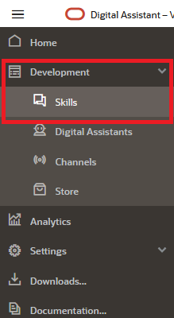
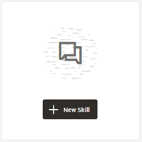
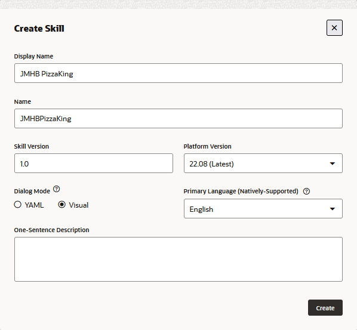
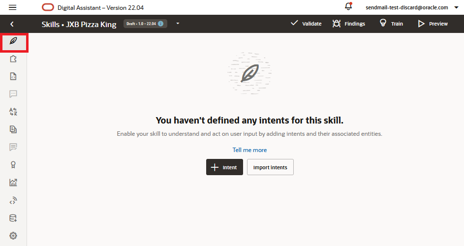

## Introduction
In this lab, we're starting from scratch. So the first thing you'll do is create a new skill.

## Task 1: Create a Skill

In this lab, we're starting from scratch. So the first thing you'll do is create a new skill.

1.  With the Oracle Digital Assistant UI open in your browser, click  to open the side menu.
2.  Click **Development** and then select **Skills**.

.

4.  Click  again to collapse the side menu.
5.  Click the **\+ New Skill** button.
    
.

The Create Skill dialog appears.

8.  For **Display Name** enter `Pizza King`. If you are working in an environment where others may also be creating the same tutorial, prefix `Pizza King` with your unique initials.
9.  Optionally, fill in a one-sentence description (e.g., `Skill for ordering from Pizza King`)
10.  For the other fields, leave the default values. Note that the Dialog Mode is **Visual**. Later on in this tutorial, you're going to create a dialog flow, the definition of the skill-user conversation, using the declarative approach of the Visual Flow Designer.
    
    
    
    
    
11.  Click **Create**.
    
    The designer will then open on the Intents  page. Here's where we'll begin to express the Pizza King customer use case in terms of the concepts that support Natural Language Processing (NLP).
    
    
    
   