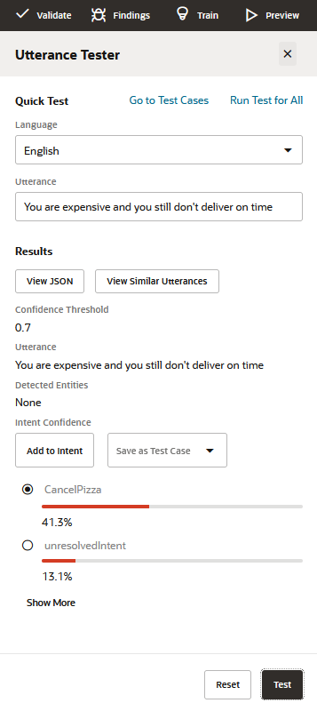

## Introduction
It is not realistic to expect to get the training of your intent model right the first time you do it. Good intent models are created in an iterative cycle of training, testing, retraining, and retesting.

A good intent model is one that has a low ambiguity between the different intents. So let's see how well we’re doing so far.

## Task 1: Test Your Model

1.  Click the **Test Utterances** link that appears near the top of the Intents page.
    

    
The Utterance Tester slides out from the right side of the page with its Quick Test page open.    

3.  In the **Language** field of the dialog, select **English**.
4.  In the **Utterance** field, type I want to order pizza. Then click the **Test** button (located at the bottom right of the tester) and look at the test results.

6.  Click **Reset** (located at the bottom right of the tester).
7.  Now scroll back to the top of the dialog, enter I feel like eating some pizza in the **Utterance** field, and then click **Test**.
    
    This should also resolve to the OrderPizza intent. Click **Reset**.
    
8.  Now try Cancel my order.
    
    This should resolve to the CancelPizza intent. Click **Reset**.
    
9.  And now try Dude, bring me pizza and see what that resolves to.  
    
10.  Type You are expensive and you still don't deliver on time in the **Utterance** field and click **Test**.  
    
        
    
    
    In all likelihood, the FileComplaint intent did not receive the highest score. In the above screenshot, CancelPizza "won". For us humans it is easy to see that "You are expensive and you still don't deliver on time" is not an order but a complaint. However, a skill first needs to be trained with relevant utterances before it is able to gain the same understanding.
    
11.  To remedy this, you're going to add this utterance to the FileComplaint intent:
    
    *   Click **Show More** to access the FileComplaint result.

    *   
    
    *   Select the **FileComplaint** radio button.
    
    
    
       
    *   Click **Add to Intent**.
    
    
   **Note:** In these examples, you might get slightly different confidence scores than the ones shown here. And in some cases, the matching intents themselves could vary, should the differing confidence scores push those intents above or below the given confidence thresholds. The cause of this variance is the non-deterministic nature of the AI behind the natural language processing and the fact that these skills have a limited number of training utterances (in order to make the tutorial simpler). In real world scenarios, you would be adding a minimum of 80 to 100 utterances per intent.
    
12.  Retrain the skill with **Trainer Tm**.
13.  Think of two or three more phrases that the system might have problems matching to an intent with high confidence and try them in the Intent tester. If you find one that doesn’t match well, select the intent that it should be resolved to and click **Add to Intent**.
14.  Train the model again and then re-test.

### Notes on What You Just Did

In this part of the tutorial, you have tested the quality of your intent training with the goal being to ensure a high level of confidence when resolving intents.

In a real skill project, you would always need to go back to the intent testing with user-provided entries you find in the conversation logs. In cases where the test input doesn't resolve to intents as well as it should, you'll want to augment the intent's utterances to improve the training model.

**Note:** You can save test cases in the Utterance Tester to run every time you change the model.