## Introduction

In this section, you'll test out the `intent.reg.order` flow, but also test out the conversation flows that are handled automatically: the FileComplaint and CancelPizza answer intents and `unresolvedIntent`.

## Task 1: Test the Order Pizza Flow

1.  Open the skill tester by clicking  at the top of the page.

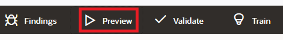

2.  In the **Utterance** field, type `I want to order pizza` and then press Enter.
    
    You should see a menu of pizza sizes:
    
    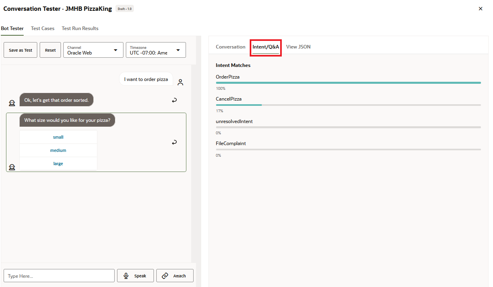
    
    
3.  Click the **Intent/Q&A** view to see how the utterance resolves to the OrderPizza intent.
4.  Click the **Conversation** view.  
    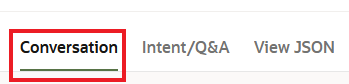
    
    Note the dialog flow traversal that routes the request from the Main Flow to the `intent.reg.order` flow.
    

5.  Back in the tester, select an option (e.g., **small**) from the menu.
    
    A prompt for the pizza topping should appear.
    

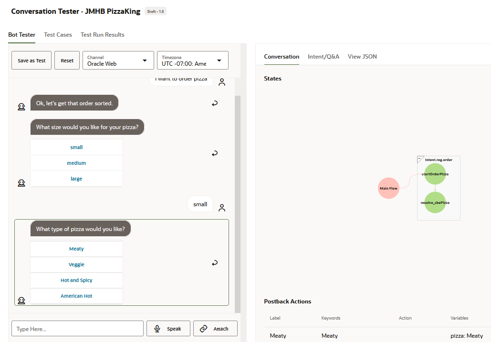

6.  Continue the conversation by selecting a topping (e.g., **Veggie**).
    
    A prompt for delivery time should appear.
    
7.  Enter a delivery time, such as `7:30 p.m.`
    
    You should receive an order confirmation that summarizes the order. In the Conversation Tester, note the dialog flow traversal that routes the request from the Main Flow to the `intent.reg.order` flow.
    
    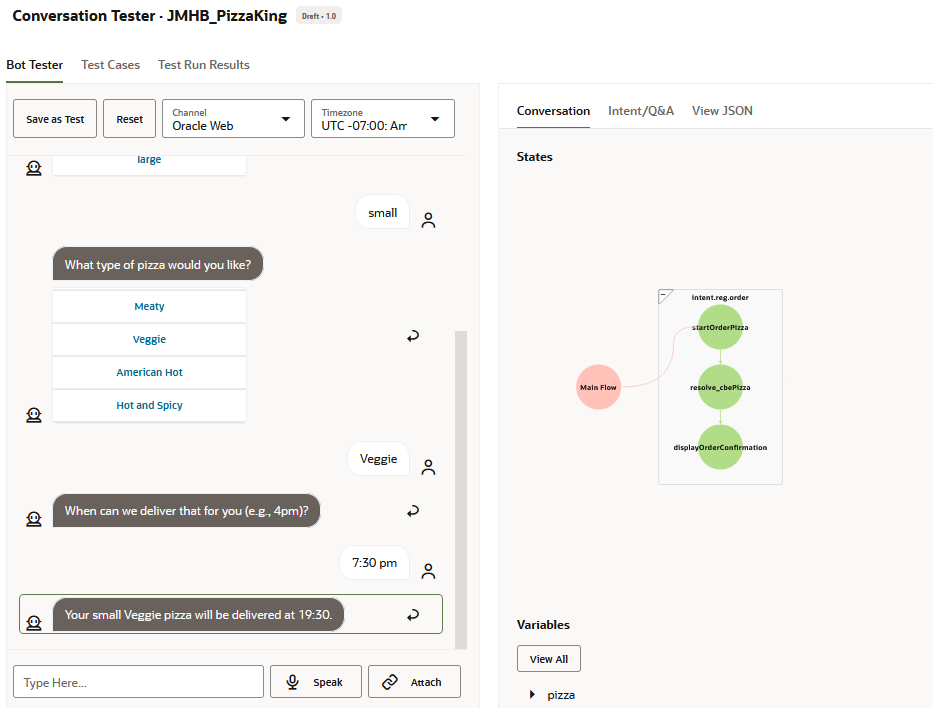
    
    
8.  Note that the state traversal rendered in the Conversation view includes the `displayOrderConfirmation` state.

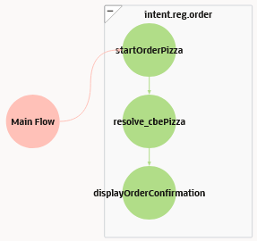

9.  Click **Reset**.
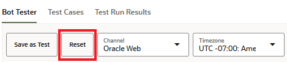

10.  Now try entering `Dude, can you get me the biggest hot and spicy pizza you can make at noon`.
    
    This time, you should receive the confirmation message immediately.
    
    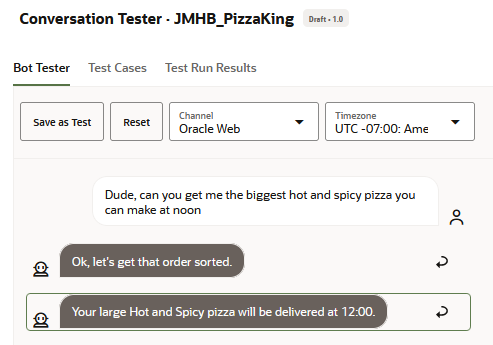
    
    
11.  Within the **Conversation** tab of the tester, scroll down to take a look at the Variables section to see the entity values that were extracted from your input.
    
    You can expand the nodes for each entity to see details of the entity values that were extracted.
    

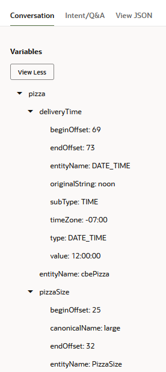

12.  Finally, enter `I want to order a veggie pizza at 8:00pm.`
    
    This time the topping menu and the delivery time should be skipped, but the pizza size list should be displayed.
    
13.  Select a pizza size.
    
    Your order should then be completed.
    

## Task 2: Test the Answer Intents

In testing the order pizza intent, you saw how utterance was resolved to the OrderPizza intent, which you mapped to the `intent.reg.order` flow. Now, you're going to test out the FileComplaint and CancelPizza answer intents which are handled automatically. You'll also test out `unresolvedIntent`, the flow for handling the user input that can't be resolved to any of the intents that you defined.

1.  In the **Utterance** field, enter `I want to cancel my order.`
    
    The skill should respond with a message regarding pizza cancelation. Because the Main flow alone handles this intent (and the other answer intents that you'll be testing in the section), only the Main flow gets rendered in the Conversation view.
    
    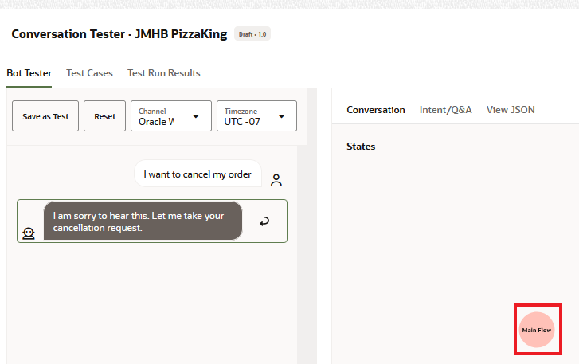
    
    
    And, in the Intent/Q&A view, you should see that the CancelPizza intent is matched.
    

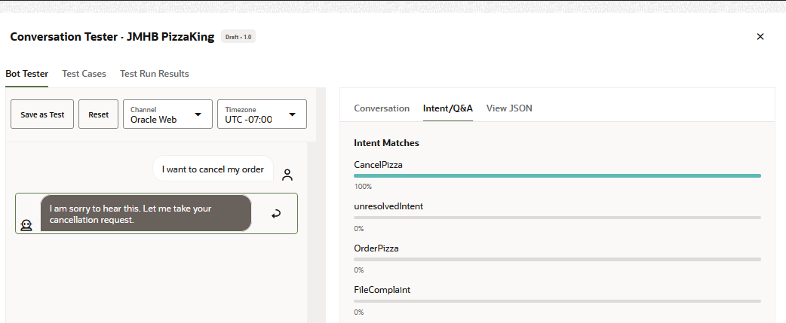

2.  Click **Reset**
3.  In the **Utterance** field, enter `I want to speak to your manager` and then press Enter.
    
    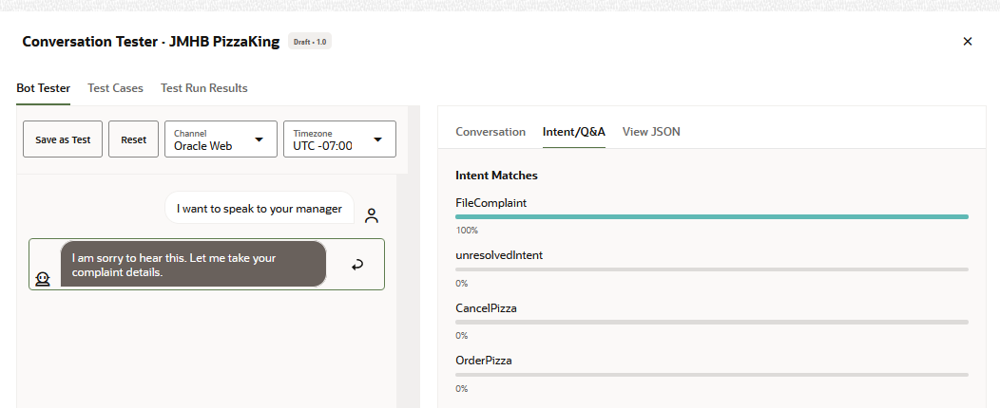
    
    
    The skill should respond with "I am sorry to hear this. Let me take your complaint details."
    
4.  Now let's try a more random utterance.
    
    Click **Reset**.
5.  In the **Utterance** field, enter `Can you get me a radio taxi now?`
    
    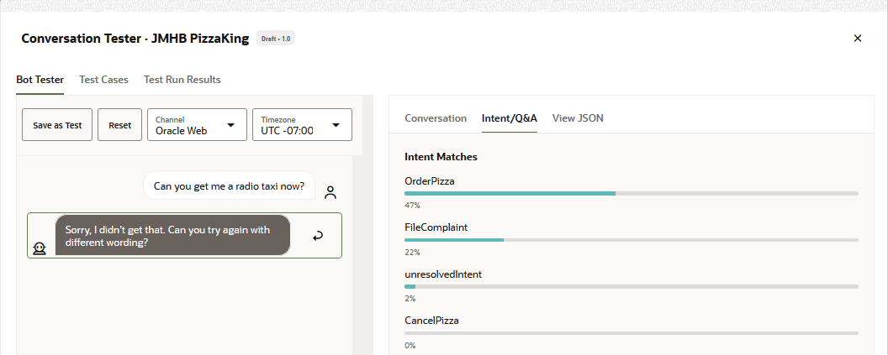
    
    
    As you can see in the Intent/Q&A view, the confidence threshold level falls below this minimum value of 60% in this case, so the component triggers its unresolvedIntent action.
    

Congratulations! You have created your first skill and learned key aspects of defining intents, defining entities, designing the conversation flow, and using the Skill Tester to evaluate intent resolution and the conversation flow.