# Building, Containerizing Java REST Services

## Introduction

In this lab you will deploy a Java application using Docker. This will require you to setup Visual Builder Studio configurations of build job and run the job to deploy java REST application container to OKE.

Estimated time: 45 minutes

### Objectives
- Setup Visual Builder Studio Project and build job configuration
- Create a Docker image and then deploy java REST application
- Deploy Docker container to Oracle Kubernetes Engine

### Prerequisites
- Successful completion of previous labs

*In addition to the workshop*, feel free to watch the walkthrough companion video by clicking on the following image:
[](youtube:uty6BgUWeeA)

## Task 1: Create Project and Setup Build VM
1.  Navigate to Visual Builder Studio by selecting **Platform Services**->**Developer**

  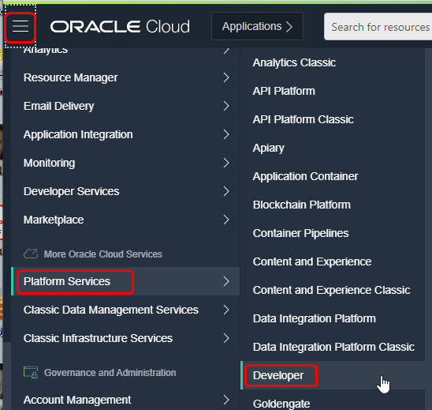

2.  Click the **Access Service Instance** for the **AppDev** instance

  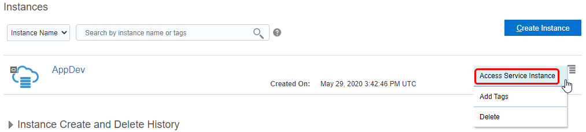

3.  Click on **OCI Account** to validate the setup.

  


4. If you're an Organization Administrator, you first create **Build VM templates** with software that your organization members use. After creating the templates, you allocate some Build VMs to each Build VM template. When your organization's members create jobs, they associate the Build VM template with each job.  Click on **Virtual Machine Templates** then **Create Template**.

  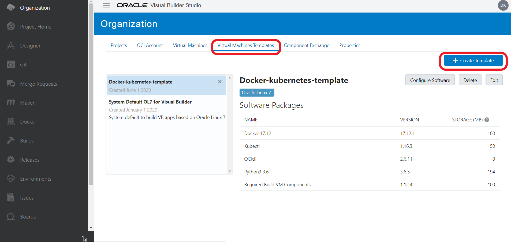


5. You can create a new VM Template, specify a unique name to identify templates to be used for jobs.  Click **Create**.

  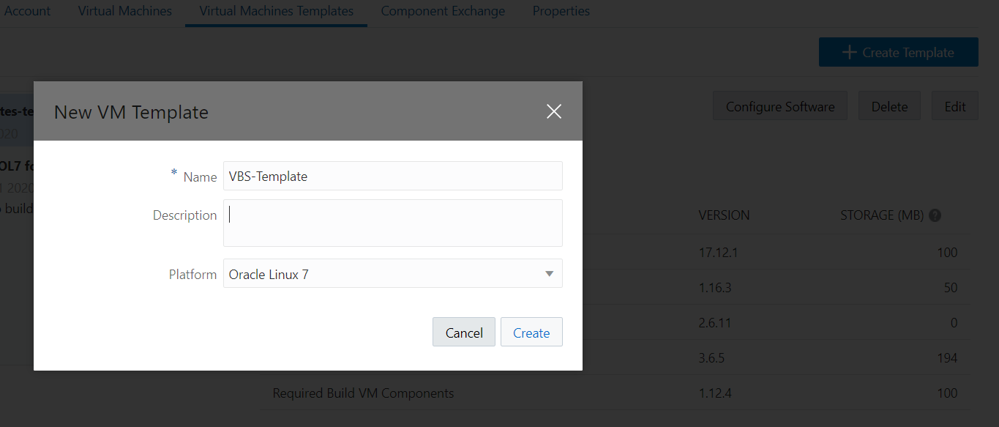

6. Once you have created your Build VM template, click on **Configure Software**.

  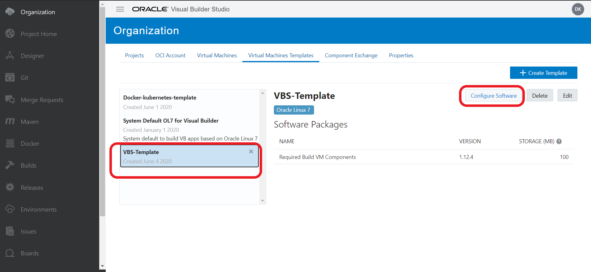

7. Add required software to run build job with latest versions available, for **Docker, Kubectl, OCIcli, Python, SQLcl**. Click **Done**.

  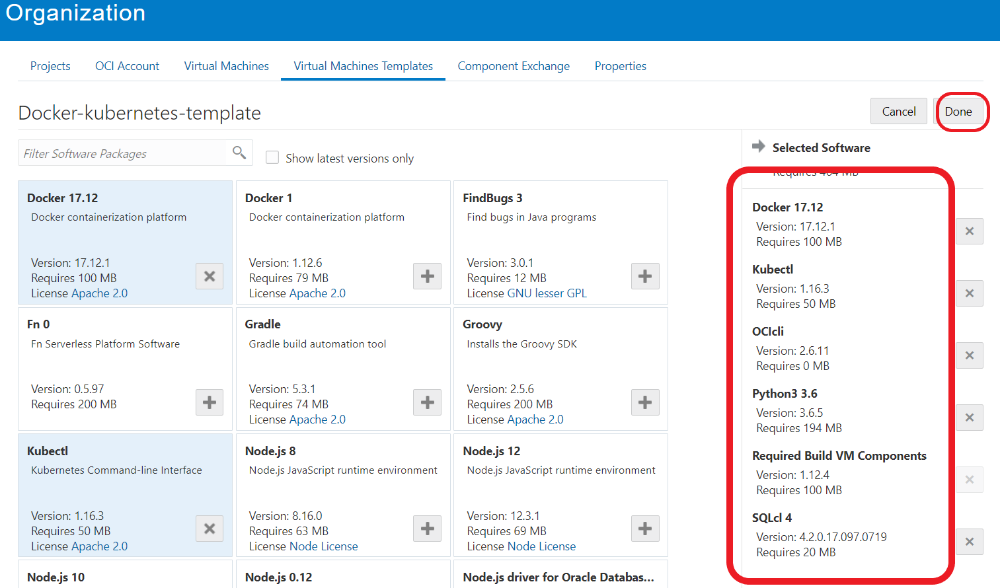


8. Next, Click on **Virtual Machines** then **Create VM** to add one to the project.

  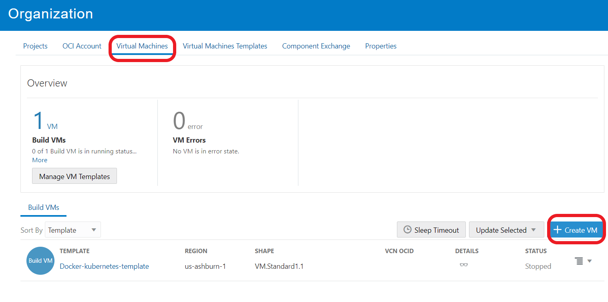

9. Select the template you just created.  In this example it is named **Docker-kubernetes-template**.

  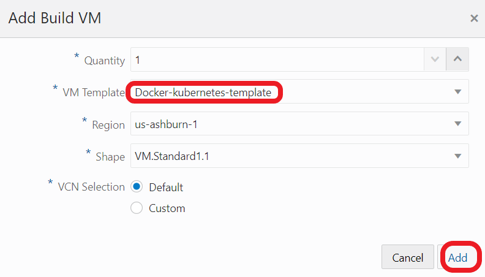


10. Create a **Project**.

  From the Organization page, you can create a project with a Git repository.

  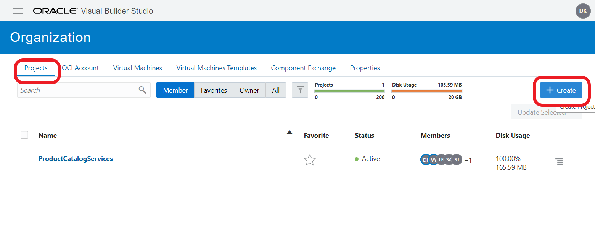

11. Click **Create**, enter the Project name **Product-services**, click **Next**.

  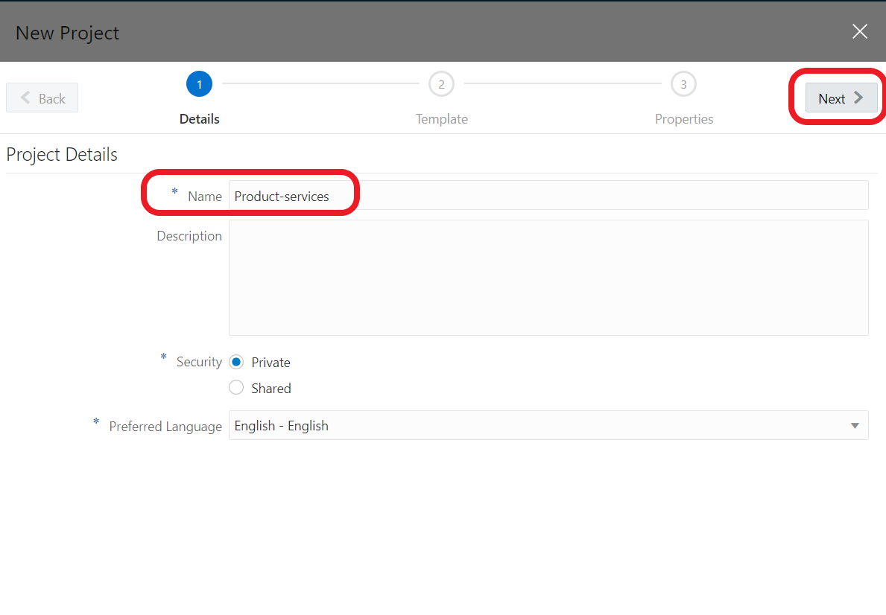

12. Select **Empty Project** and click Next.

  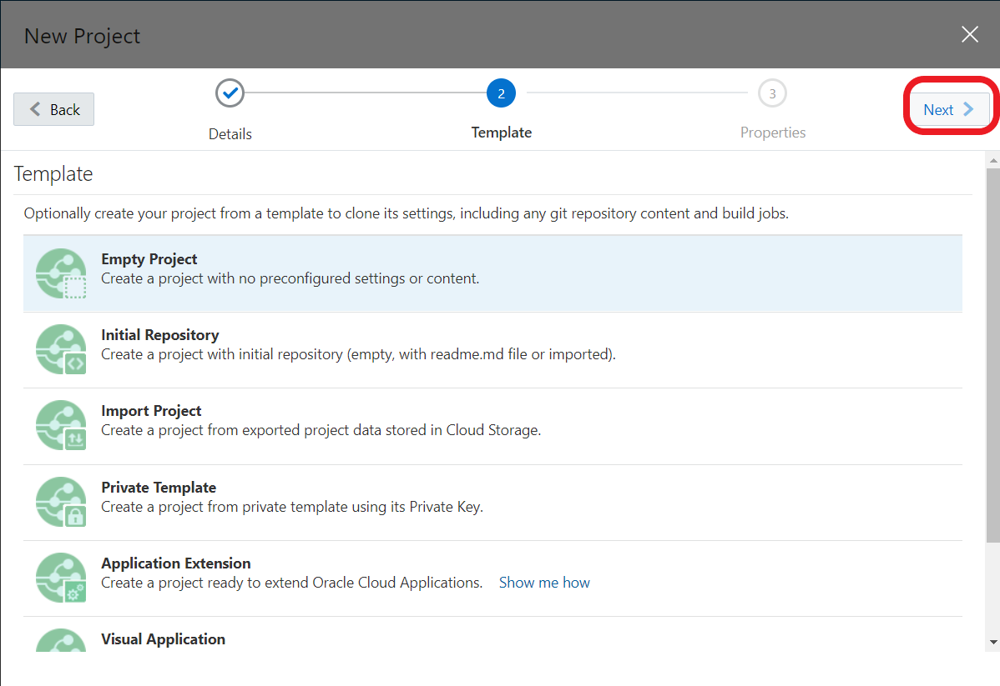

13. Click **Finish**.

  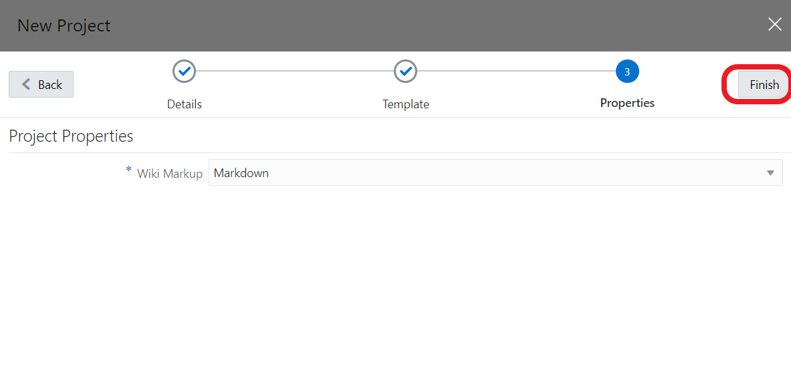

  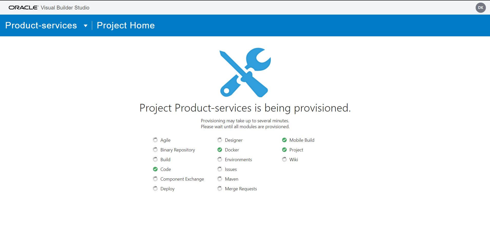

14. Once the Project services are provisioned, you land on the Project Home Page. From the Project Home page, you can view a summary of the project's actions, repositories, team members, and statistics.

  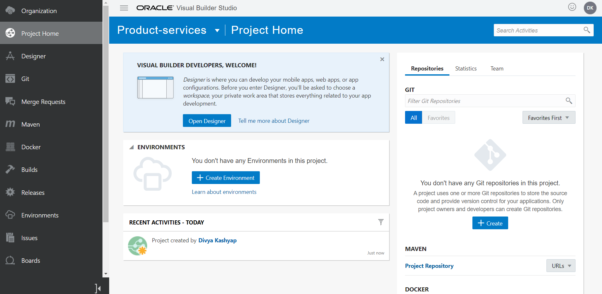


## Task 2: Create Build Job to Build and Deploy Docker Container

In this step, you will clone the application code, edit the Kubernetes secret file for ATP username and password. Next, create and setup build job configuration to containerize java microservice code, push the docker image to Oracle Cloud Infrastructure Registry (OCIR) and deploy the image to run pod and service in Oracle Kubernetes Engine.


Add **Git Repository** in your VBS Project

1. On your Project Home, click **Repositories** and click **Create**.

  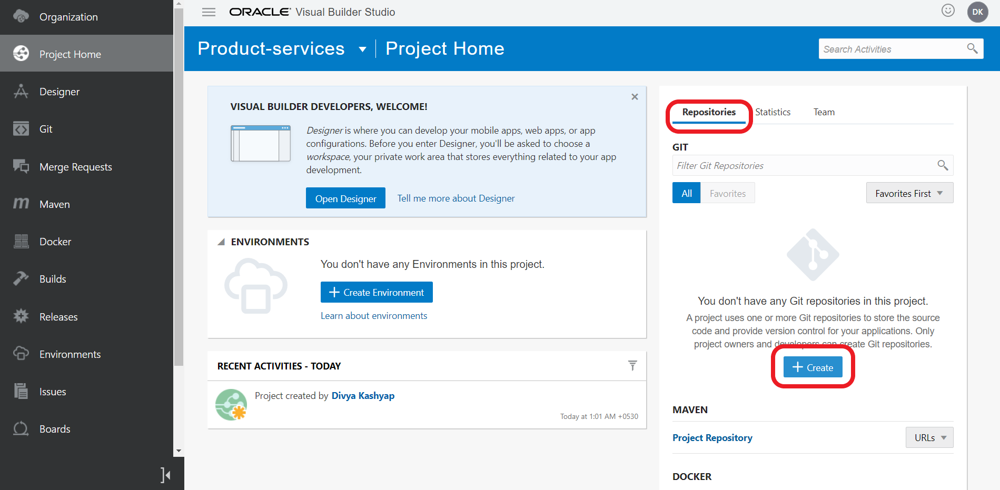


2. Enter the repository name **product-catalog-service** and select **Import existing repository**, enter the Git repository listed below and click **Create**.

    ```
    <copy> https://github.com/sasankapdn/product-catalog </copy>
    ```


  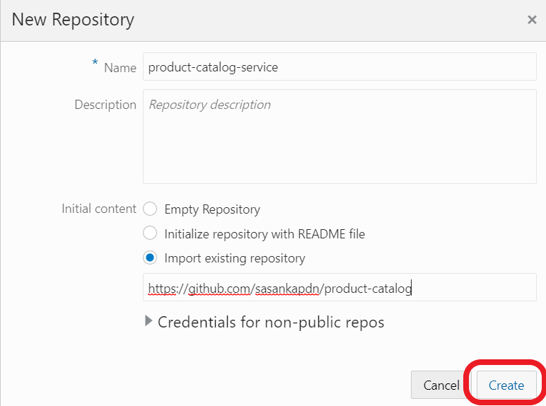


  It will import the contents and you can access files from VBS Git.

3. Similarly, create second repository for user-catalog service code.

    ```
    <copy> https://github.com/sasankapdn/user-catalog </copy>
    ```

    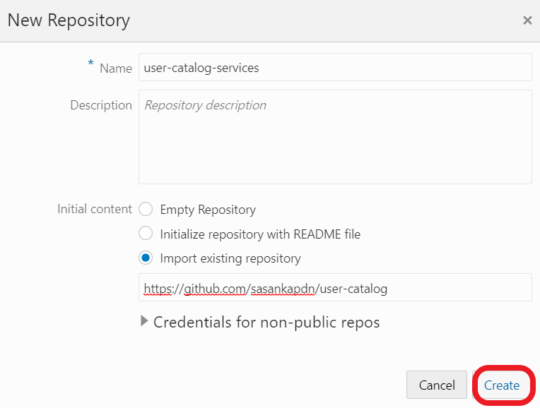


4. Change the **DBusername, DBpassword and DBurl base64 coded** in the secret yaml files.  **product-svc-secret.yaml**, **user-svc-secret.yaml** files are applied to Kubernetes cluster, so that the ATP DB username, password and DBurl are configured with the application container.

5. Before we change the values in VBS Git, let's encode them into base64.

  From ATP DBs created in lab 50,

  Values Required:
    ```
    ATP:  ProductCatalog
          Username: Alpha
          Password: AppD3v0ps01_
          DBurl: jdbc:oracle:thin:@product_LOW?TNS_ADMIN=/helidon/wallet

    ATP:  UserCatalog
          Username: Alpha
          Password: AppD3v0ps01_
          DBurl: jdbc:oracle:thin:@user_LOW?TNS_ADMIN=/helidon/wallet
    ```

6. Go to OCI console, and click on cloud shell, once it is ready with your user directory, convert the values and save it in your notepad.

  **Note:**  If your ATP Database names are NOT **product** and **user**, please be sure to change them accordingly in the below commands.

    ```
    <copy> echo -n Alpha | base64 </copy>
    ```
    ```
    <copy>echo -n AppD3v0ps01_ | base64 </copy>
    ```
    ```
    <copy>echo -n jdbc:oracle:thin:@product_LOW?TNS_ADMIN=/helidon/wallet | base64 </copy>
    ```
    ```
    <copy> echo -n jdbc:oracle:thin:@user_LOW?TNS_ADMIN=/helidon/wallet | base64 </copy>
    ```


  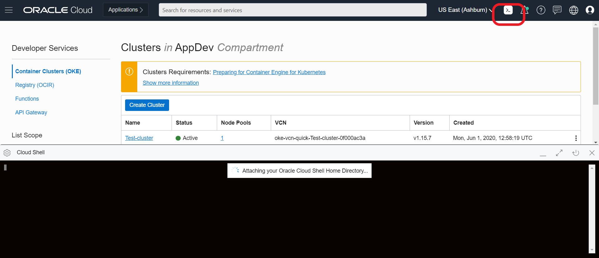


  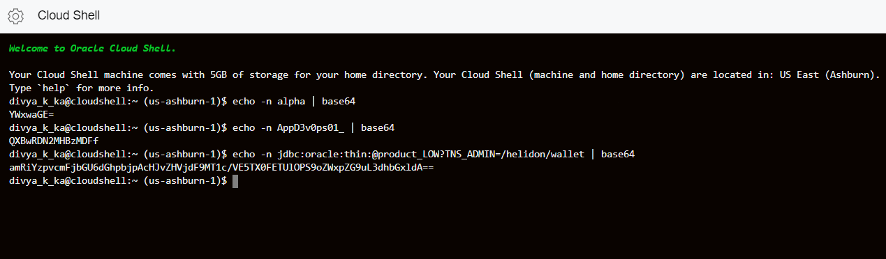


7. Now, go back to your VBS instance project, Select **product-catalog.git** from Git Section.


  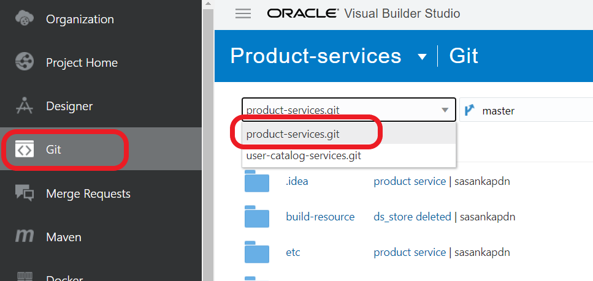


8. Select **product-svc-secret.yaml** file. Edit the file by clicking on **Edit file** option from the right corner. Change the parameter value under data block for **dbUser**, **dbPassword** and **dbUrl** that you have encoded to base64 from cloud shell. **Commit** the changes.


  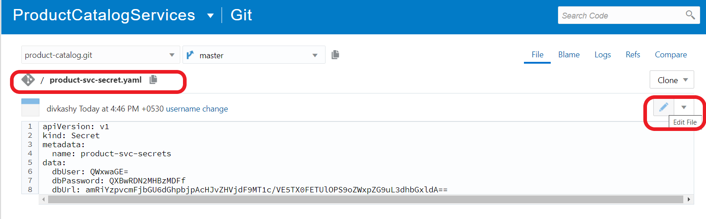


  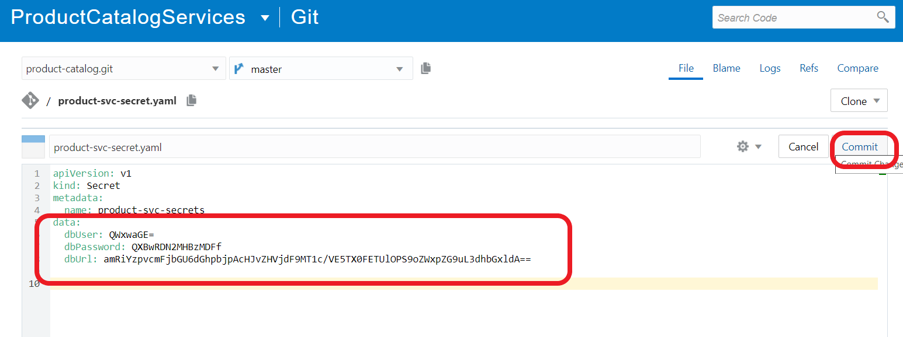


9. Similarly, switch to **user-catalog.git**, select **user-svc-secret.yaml** file and edit the parameter values under data block for **dbUser, dbPassword** and **dbUrl** that you have encoded to base64. Commit the changes.

10. Change the docker image name you care going to create in your job build.
  Under, **product-services.git**, **edit** app.yaml file. And **Commit** the changes.

  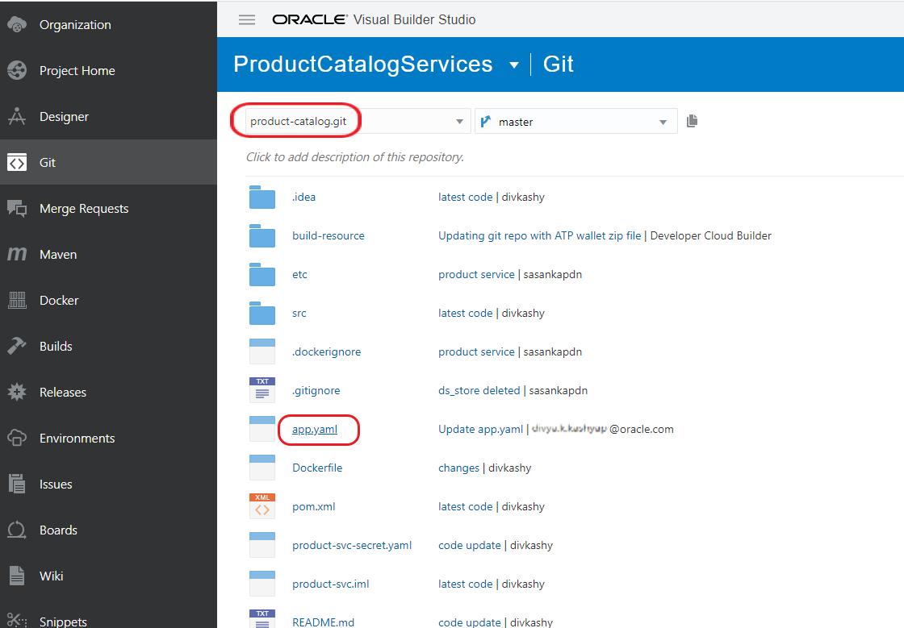


  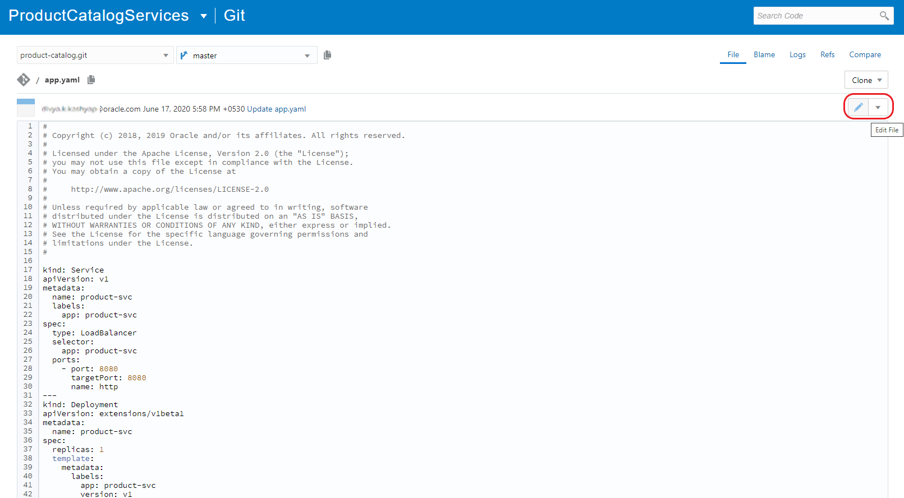


11. Change the value for parameter image as
    ```
    image: [region].ocir.io/[storage namespace]/product_catalog:{{BUILD_NUMBER}}

    ```


  For Region code: (see [Availability by Region](https://docs.cloud.oracle.com/en-us/iaas/Content/Registry/Concepts/registryprerequisites.htm#Availab))


  Storage Namespace: Refer to lab 50, Step 5.6.


  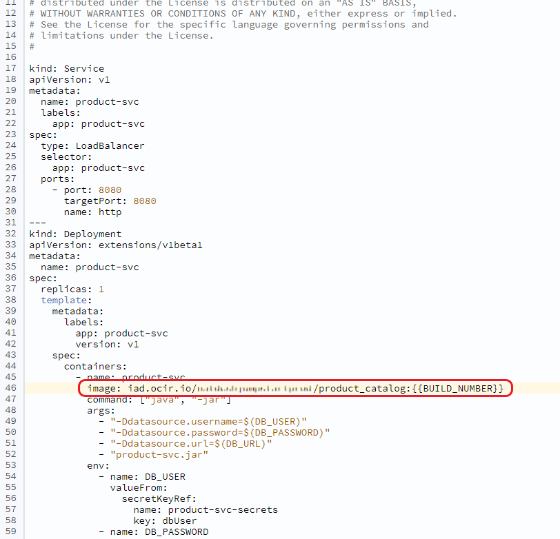


  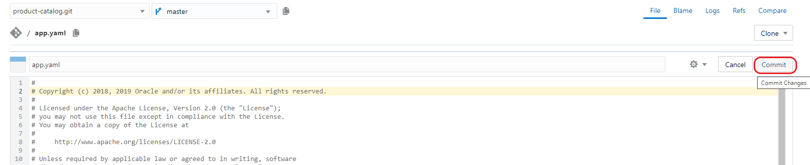

12. Similarly, switch to **user-catalog.git**, edit app.yaml file, change the docker image name you care going to create in your job build.

  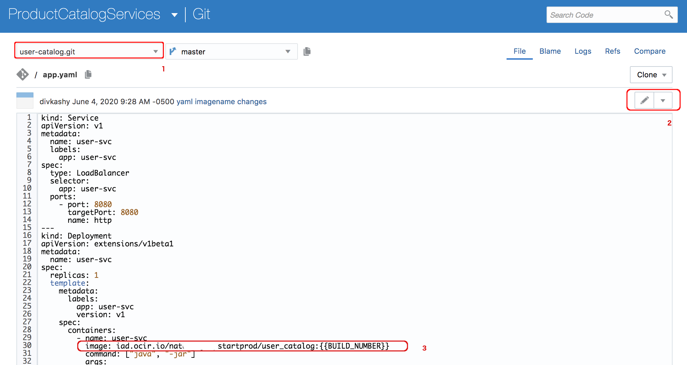

13. Change the value for parameter image as
    ```
    image: [region].ocir.io/[storage namespace]/user_catalog:{{BUILD_NUMBER}}

    ```

    **Commit** the changes.

    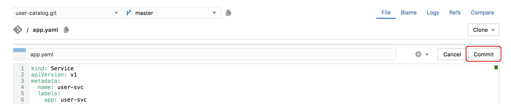


14. Create a **Build Job**

    ***3.1. Creating Product-catalog JAVA REST service docker container***

15. From left panel, click **Builds**. Create a new **job**.

    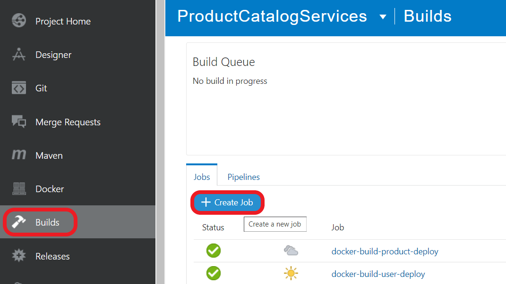

16. Enter a **Name**, select the template created earlier and click **Create**.

    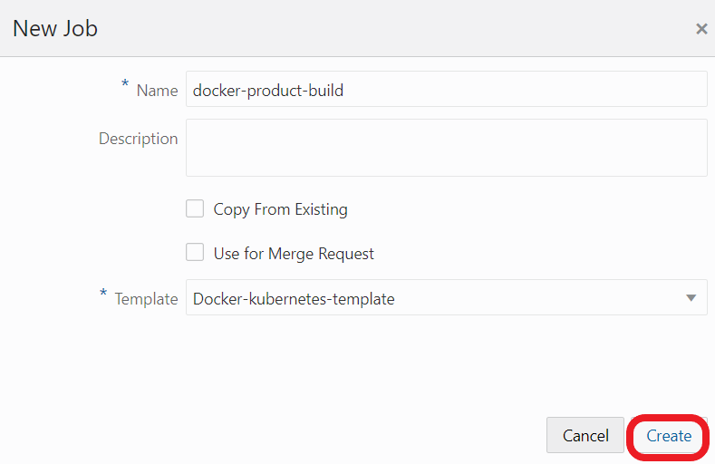


    This lands you on the job **configure** section.

17. Add **Git**. Select **product-catalog.git**.  

    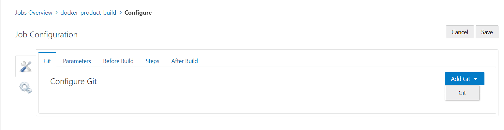


    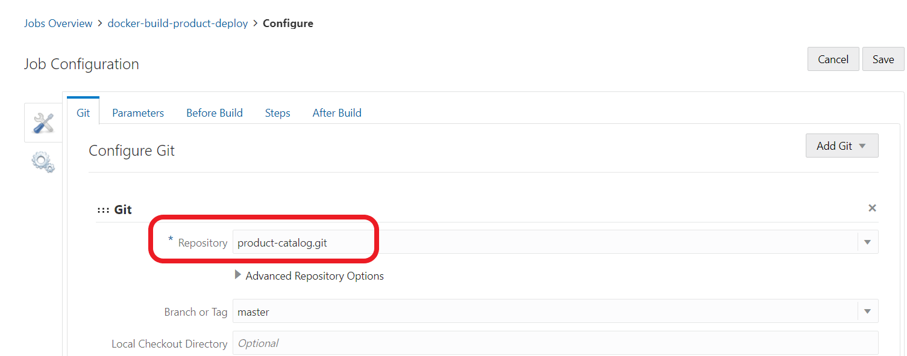


18. Under **Steps**, Click the **Add Step**

    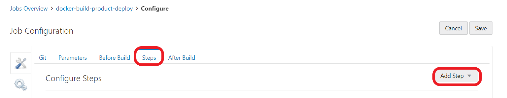


19. Select **OCIcli**

20. Enter values for **user ocid, Fingerprint, tenancy ocid, private key (pem format), region**. You can refer to Step 2.2.


    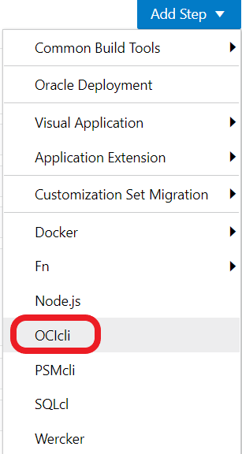

    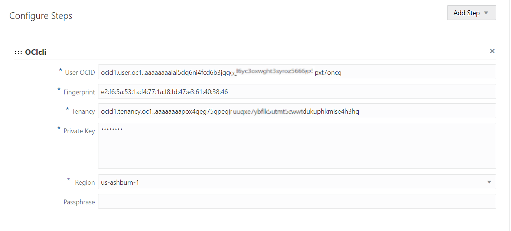


21. Under **Common Build Tools** select  **Unix Shell**

    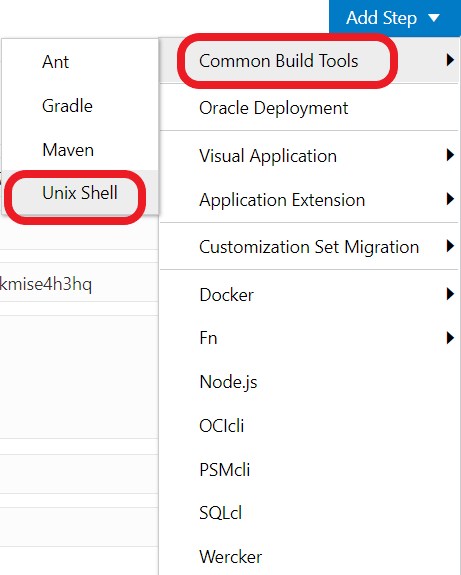

    You need product-catalog ATP ocid, admin password. This step will download the wallet.zip file and store it in required location. Replace these in this format.

    oci db autonomous-database generate-wallet --autonomous-database-id **ATP ocid** --password **password** --file Wallet_**ATP Database name**.zip

    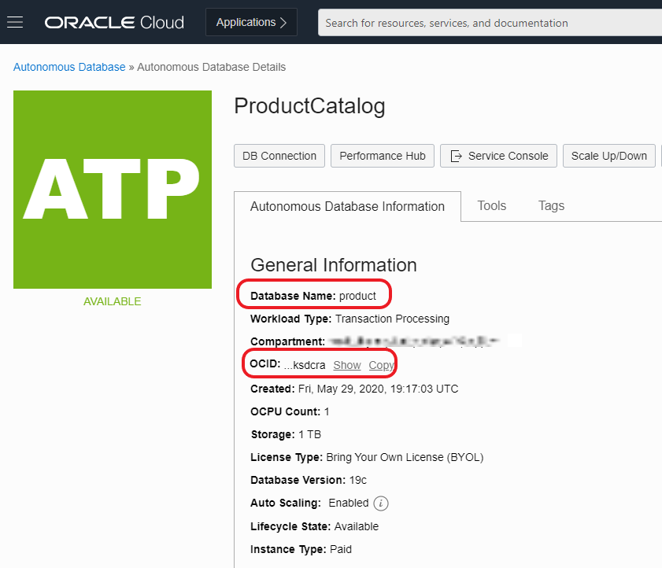


    ```
    <copy>
    oci db autonomous-database generate-wallet --autonomous-database-id ocid1.autonomousdatabase.oc1.iad.abuwcljto2uskxs53rn5iuiw7doebwidhoh4p3dwc336qllbiwv5f --password AppD3v0ps01_ --file Wallet_ProductCatalog.zip

    unzip -o Wallet_ProductCatalog.zip -d build-resource/wallet
    git add .
    git commit -m"Updating git repo with ATP wallet zip file"
    git push --force
    </copy>
    ```

    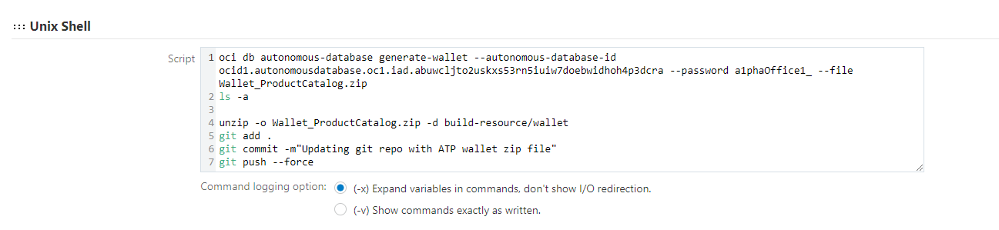


22. Add the Step **Docker Login**

    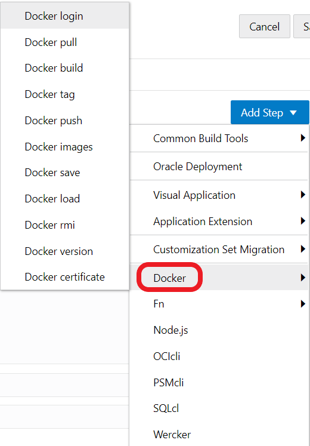

    ```
    <copy>
    Registry Host: [region].ocir.io
    Username: [Storage namespace]/[username]
    Password: [Auth Token]
    </copy>
    ```
    For Region code: (see [Availability by Region](https://docs.cloud.oracle.com/en-us/iaas/Content/Registry/Concepts/registryprerequisites.htm#Availab))

    Storage Namespace: Refer to lab 50, Step 5.6.

    Username: Local user (non-federated)

    *Note: Go to OCI Navigation Menu > Identity > Users, you can notice 2 users with your name, refer non-federated user here. Select the user, scroll down and Select **Auth Token** from left panel.  Enter description, click Generate Token. **Save it in your notepad, as it will be only visible this one-time.***


    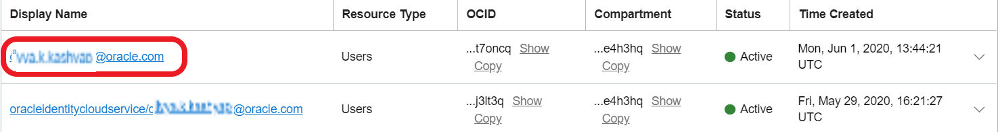


    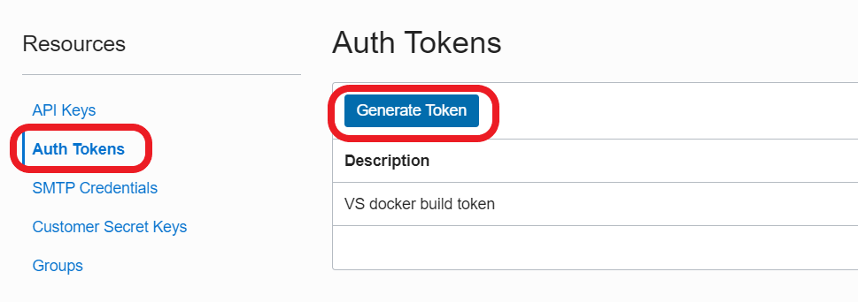


    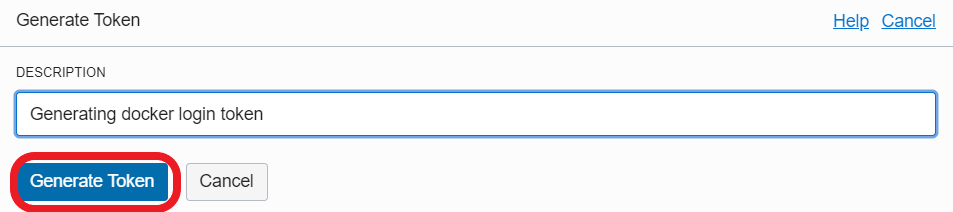


    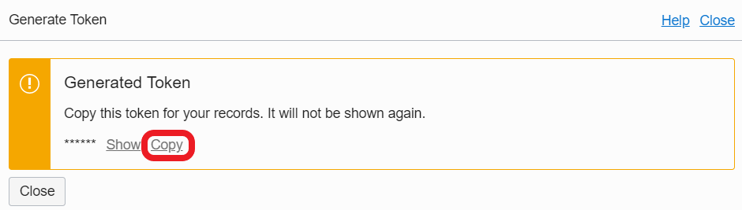

23. Enter these values in Docker login parameters.

    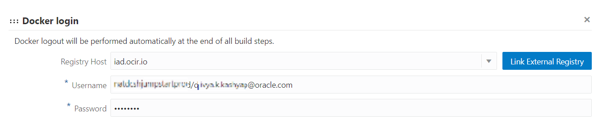


24. Add the Step **Docker Build**

    ```
    Registry Host: [Region].ocir.io
    Image Name: [Storage Namespace]/[OCIR Name]
    Version Tag: $BUILD_NUMBER
    ```
25. For OCIR Name, go to OCI Navigation Menu > **Developer Services** > **Registry (OCIR)**.

26. Click Create Repository. '**product_catalog**' as Name and change Access to **Public**.

27. Similarly, you can create one more repository for the user service **user_catalog** as Name and change Access to **Public**.

    *NOTE: OCIR names does not take capital letters as valid names.*

      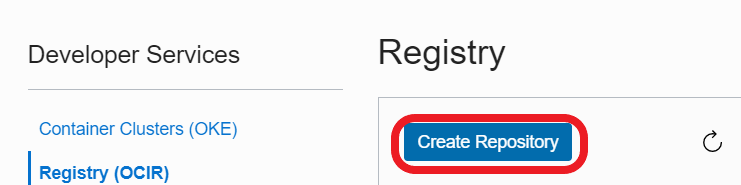


      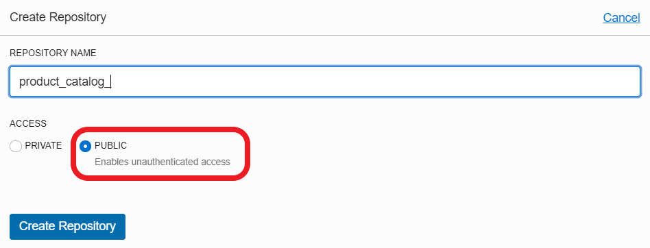

28. Enter these values, Full Image name will get populated itself. Here *$BUILD_NUMBER* represents the VBS build number to create a new image every time the build is run, to retain backups of your old images.

      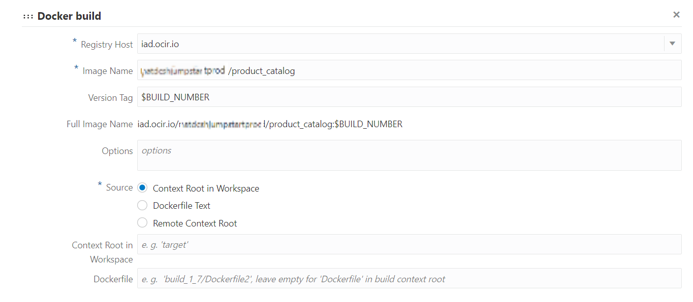


29. Add the Step **Docker Push**

    The values populate from the Docker build step.

      


30. Add the Step **Unix Shell**

31. To get the command for your Kubernetes cluster kubeconfig generation. Go to OCI Navigation Menu > **Developer Services** > **OKE**.

32. Select your cluster, Click **Access Cluster**. And copy command and replace it in the script below.

      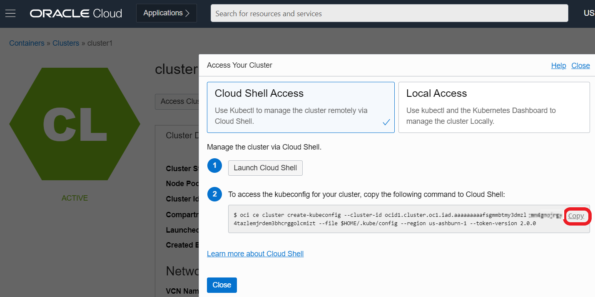

    ```
    <copy>
    mkdir -p $HOME/.kube
    oci ce cluster create-kubeconfig --cluster-id ocid1.cluster.oc1.iad.aaaaaaaaae4gcnbumvqwkodbgzqtcyjshftdczrrgu2dazdgmczdmmz --file $HOME/.kube/config --region us-ashburn-1 --token-version 2.0.0
    export BUILD_NUMBER=$BUILD_NUMBER
    export KUBECONFIG=$HOME/.kube/config

    kubectl apply -f product-svc-secret.yaml

    cat app.yaml | sed "s/{{BUILD_NUMBER}}/${BUILD_NUMBER}/g" | kubectl apply -f -

    kubectl get pods -A
    kubectl get svc -A
    </copy>
    ```

      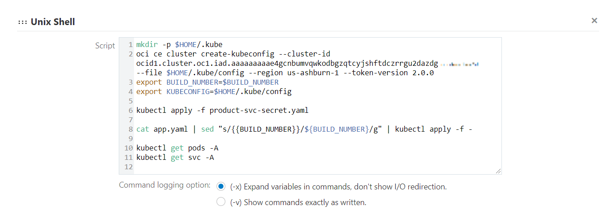


33. Now, you are done with the job configurations. Click **Save**.

34. To run the job, click **Build Now**.

      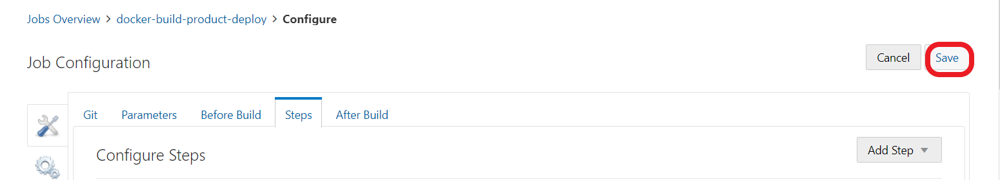


      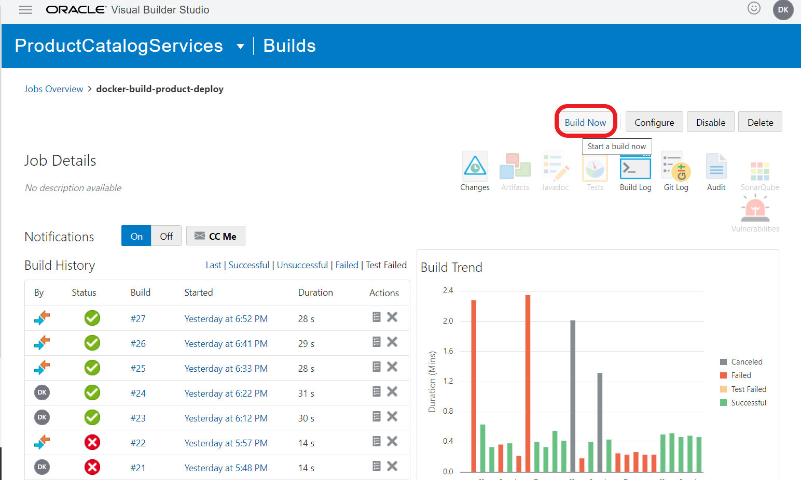


    Build gets assigned to the Build VM created earlier in Step 2.4.
35. You can check the logs from **Build Log**.


      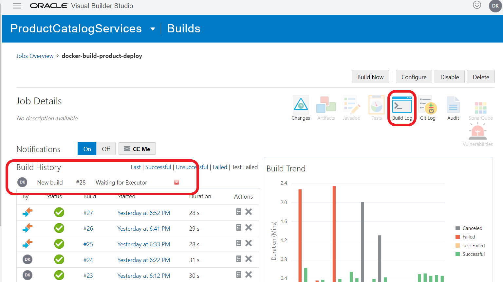


    If you get the job status as **SUCCESSFUL**, it shows the deployment result in the logs.


      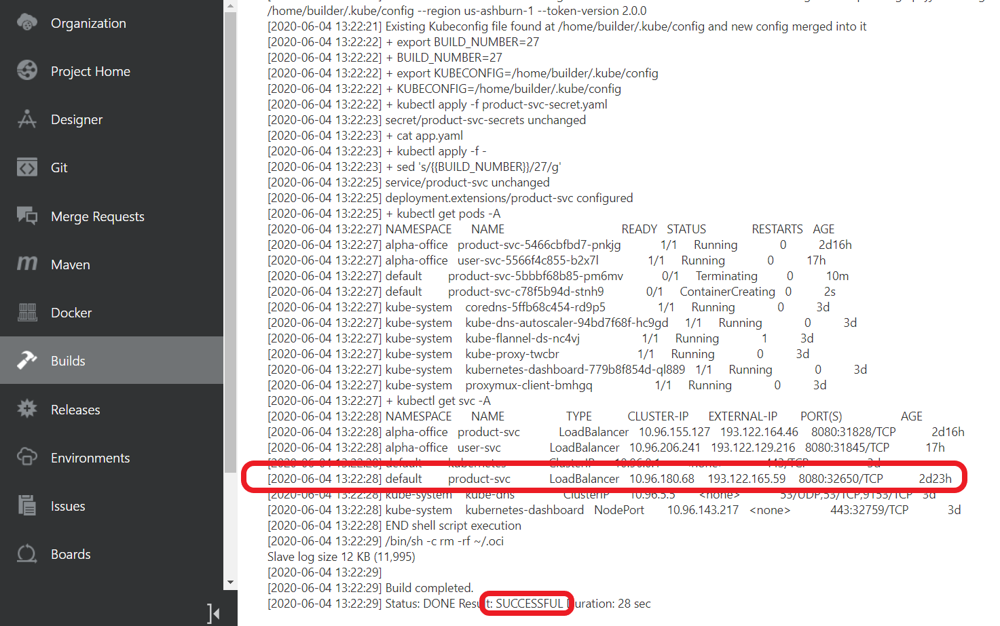


    You have successfully deployed your product-catalog JAVA REST service on Oracle Kubernetes Engine.


    ***3.2. Creating User-catalog JAVA REST service docker container***

    Now you can perform the same steps for you user-catalog service deployment.
    Make sure you **replace the following required configurations**.

36. To avoid creating similar steps again, you can use the same job build configuration, while creating a new Build Job. Select **Copy from Existing**. Click Create.

      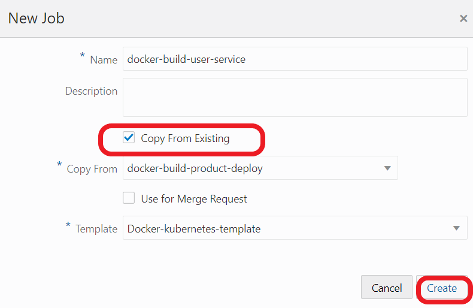

    This lands you on the Job Configure section. All other steps will remain same.

37. Change **Git** to user-catalog.git.

38. Next, click **Steps** section.

      

39. Change the **ATP ocid, file names for the wallet zip file(in lines 1 and 4)**.

      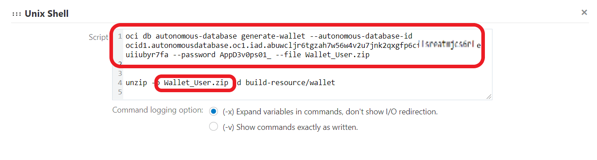

40. Change the repository to user_catalog in **Image Name**.

      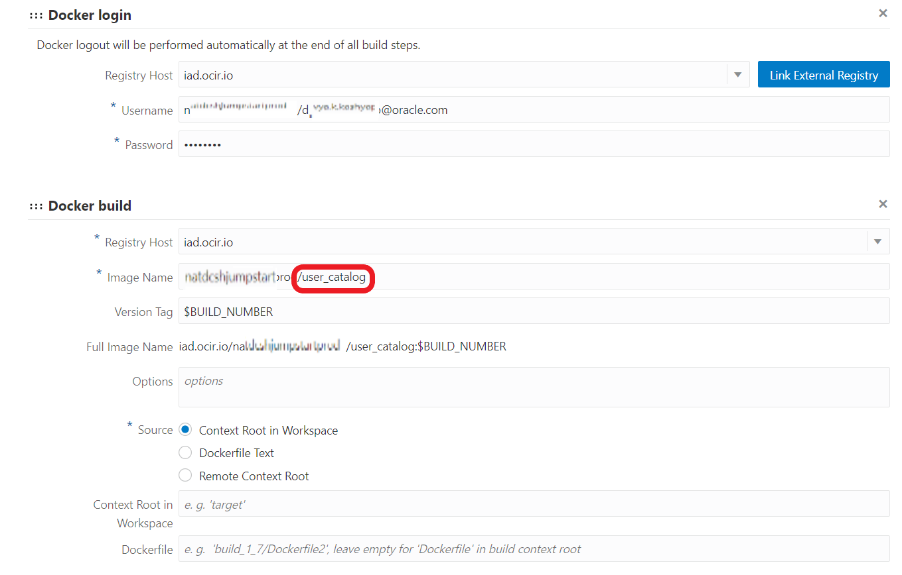


      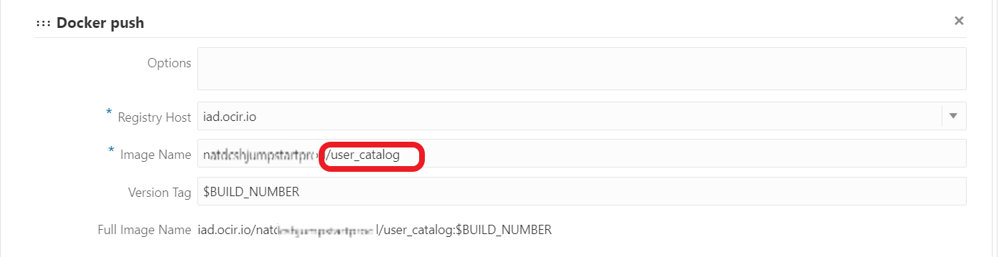

41. Change the **secret yaml name** in the shell script.

      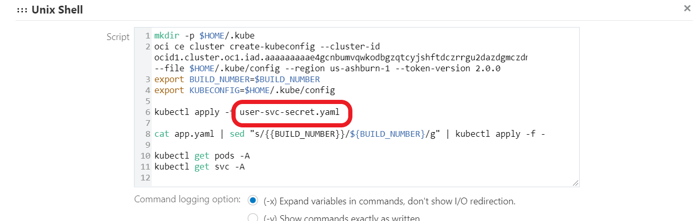


42. Click **Save**.

43. Click **Build Now**.

    If the job status is **SUCCESSFUL**. You can track the build logs for deployment details.

      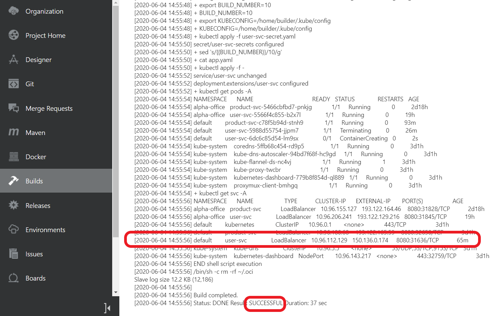

*You are ready to proceed to the next lab...*

## Acknowledgements

- **Author** - Divya Kashyap
- **Last Updated By/Date** - Kamryn Vinson, October 2020

