# Setup Cloud Environment

## Introduction

You will take on the persona of an Operations Engineer. You will initiate the Oracle cloud environment that will be used to create and deploy your microservices applications. This environment will be contained within a cloud Compartment, and communication within the Compartment will be via a Virtual Cloud Network (VCN). The Compartment and VCN will isolate and secure the overall environment. You will deploy the Oracle Cloud Infrastructure Container Engine for Kubernetes(OKE).

Estimated time: 20 minutes

### Objectives

- Log into OCI Tenancy.
- Setup Oracle Cloud Infrastructure (OCI) components.  

***We recommend that you create a notes page to write down all of the credentials you will need.***

### Prerequisites

- Your Oracle Cloud Trial Account
- You have already applied for and received your Oracle Cloud Free Tier Account.

## Task 1: Log into OCI Tenancy

   Log in to your OCI dashboard and retrieve information required to create resources.

1. Once you log in you will see a page similar to the one below. Click on "Infrastructure Dashboard."

  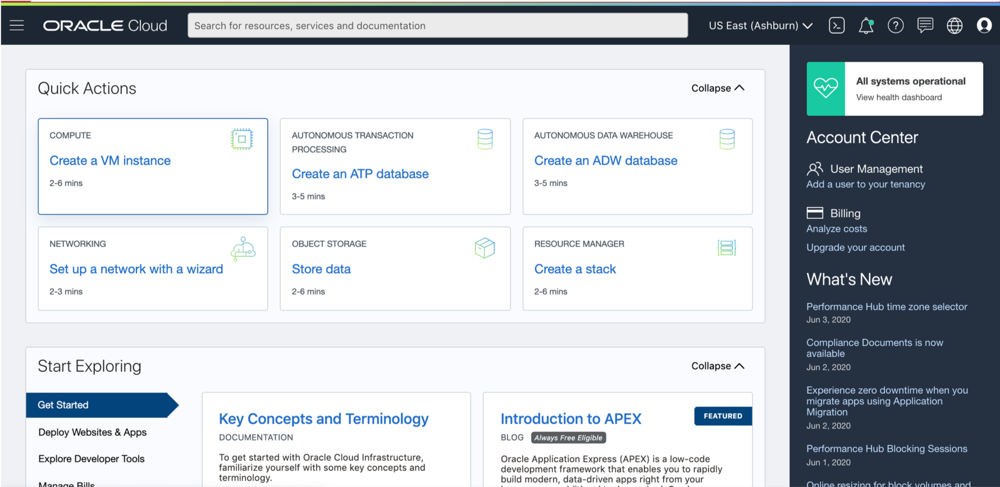

## Task 2: Basic OCI Infrastructure Setup

1. Open the navigation menu. Under Governance and Administration, go to **Identity** and click **Compartments**. From this screen, you will see a list of compartments, click **Create Compartment**.

   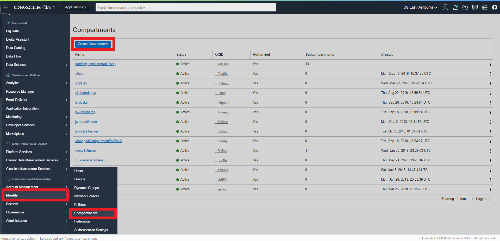

   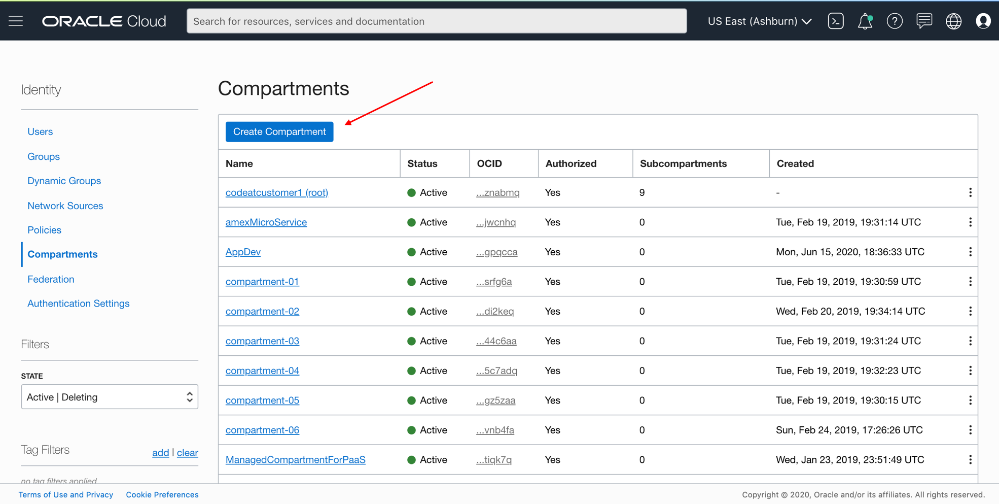

1. Enter the following:
      - Name: Enter **"AppDev".**
      - Description: Enter a description (required), for example: "AppDev compartment for the getting started tutorial". Avoid entering confidential information.
      - Parent Compartment: Select the compartment you want this compartment to reside in. Defaults to the root compartment (or tenancy).
      - Click **Create Compartment**.
      - Your compartment is displayed in the list.

  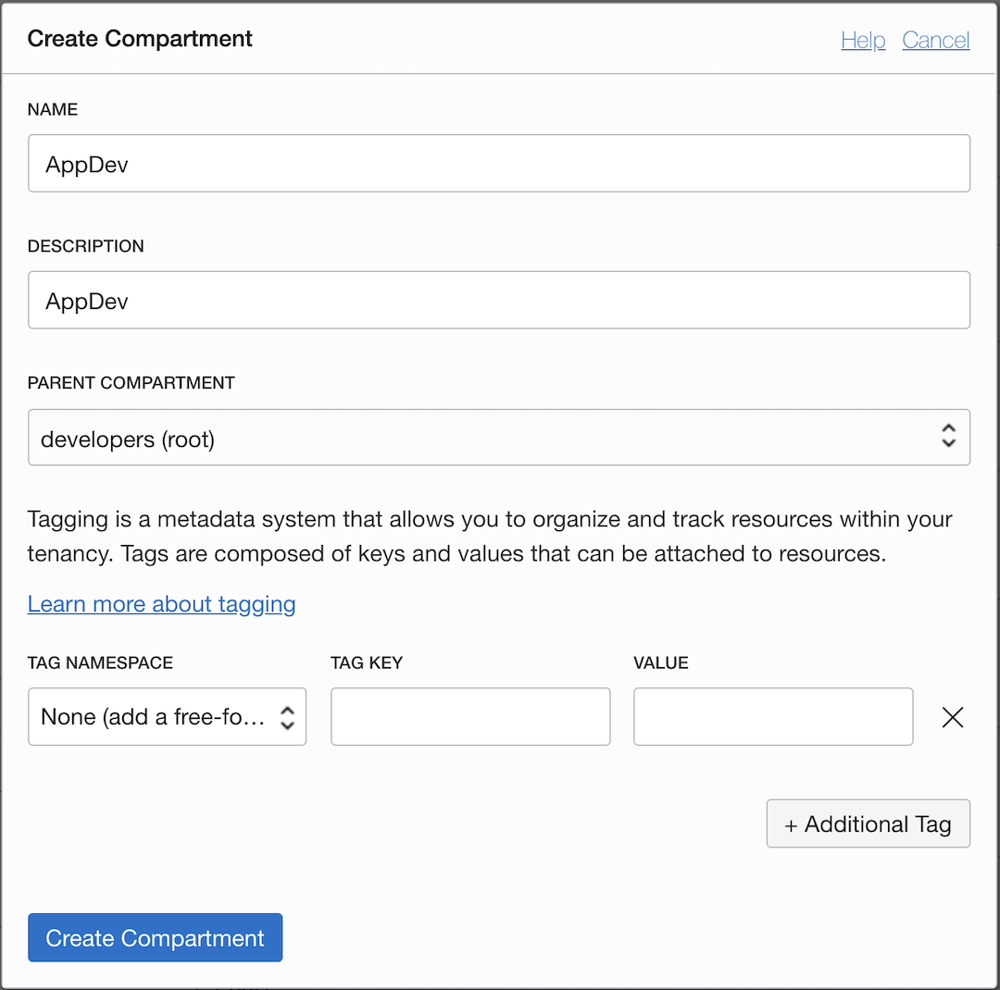

1. Click the Cloud Shell icon in the Console header. Note that the OCI CLI running in the Cloud Shell will execute commands against the region selected in the Console's Region selection menu when the Cloud Shell was started.

  

  

Now you are ready to move on to Step 3.

## Task 3: Create OKE Kubernetes Cluster

1. To create an OKE cluster, open up the hamburger button in the top-left corner of the Console and go to **Developer Services** >   **Kubernetes Clusters**.

   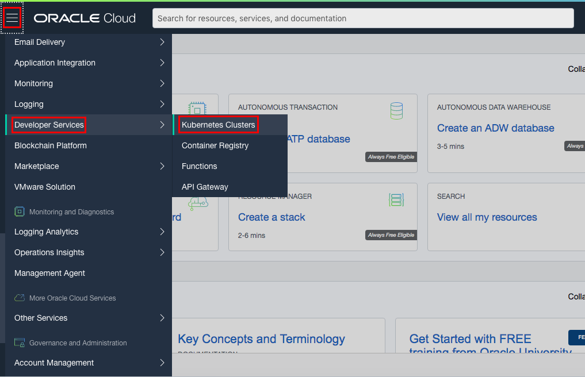

1. Verify you are in the **AppDev** Compartment and click **Create Cluster**.

  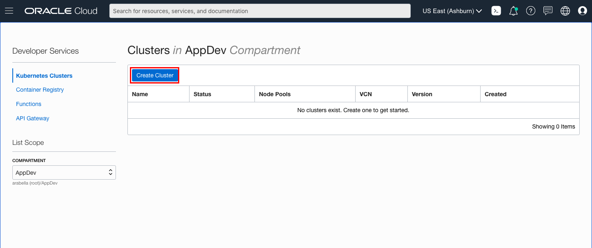

1. Choose Quick Create as it will create the new cluster along with the new network resources such as Virtual Cloud Network (VCN), Internet Gateway (IG), NAT Gateway (NAT), Regional Subnet for worker nodes, and a Regional Subnet for load balancers. Select **Launch Workflow**

   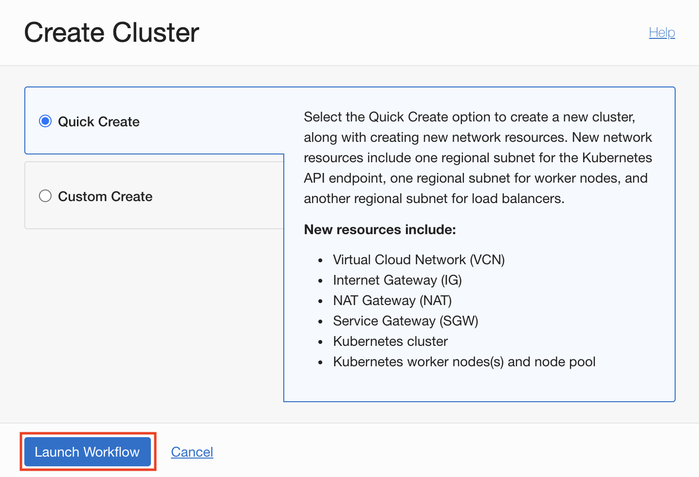

1. Keep the name to **cluster1** and the other default values, click Next to review the cluster settings. Do not choose the Kubernetes API Endpoint to be _Private Endpoint_ or you will need a bastion or an admin instance to access the kubectl commands. You can explore Private Endpoint on an expecific lab.
<sup>_Optionally choose visibility of the Kubernetes Worker Nodes to **Public Workers** if you want public access to your nodes and number of nodes to **2** or **1** if you want reduced number of nodes_</sup>

Keep the name to cluster1 and the other default values, click Next to review the cluster settings
Optionally choose visibility type to Private Endpoint to host your Kubernetes endpoint in a private subnet. Also choose visibility type to Public Workers if you want public access to your nodes. You can also change the number of nodes to 2 or 1 if you want to reduce the number of nodes.

   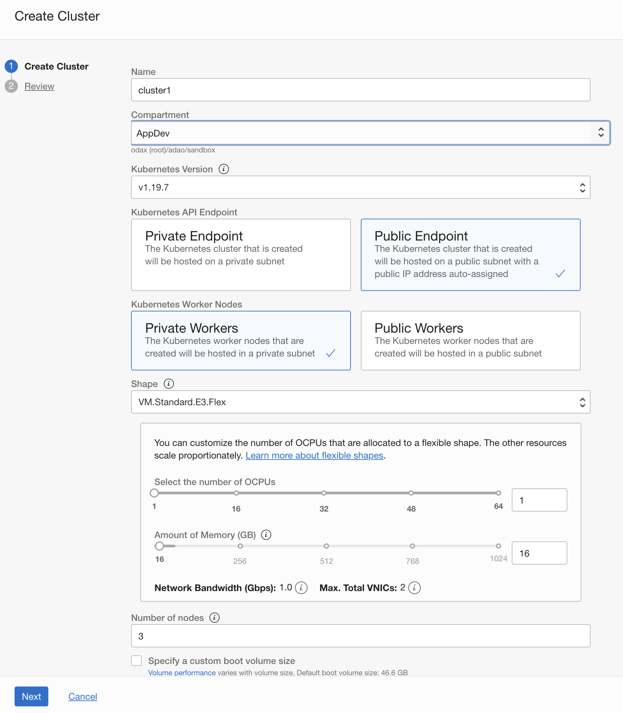

1. Review the the Cluster Creation and then select **Create Cluster**.

   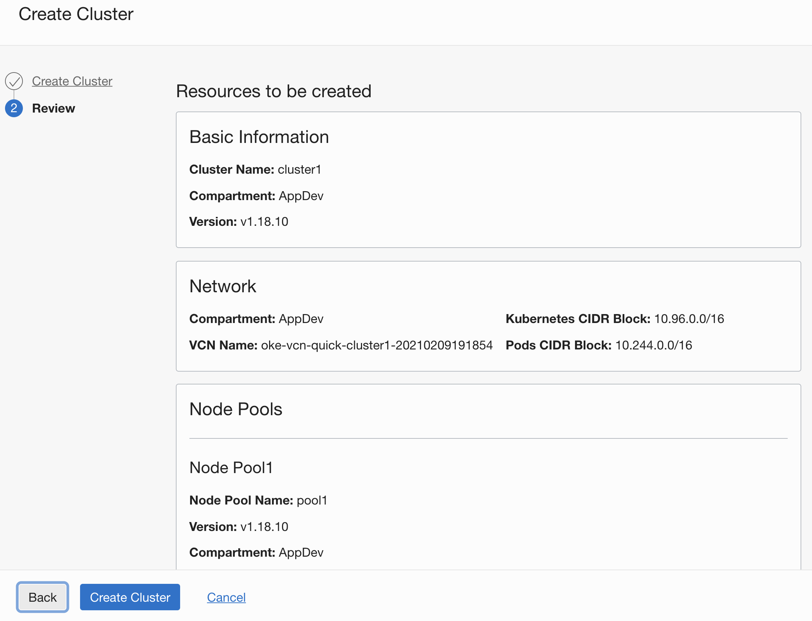

1. Once launched it should usually take around 5-10 minutes for the cluster to be fully provisioned and display an Active.

## Task 4: Setup OKE Kubernetes Cluster Cloud Shell Access

1. On the **Clusters** view, select the just created cluster and then click on the **Access Cluster** button.

   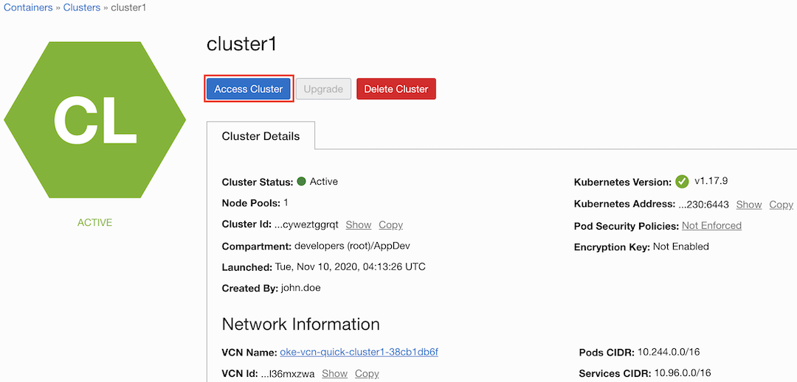

1. Leave the **Cloud Shell Access** selected. If Cloud Shell is not already open, **Launch Cloud Shell**, copy the oci cli command to create the kubeconfig and paste on the Cloud Shell Terminal.

   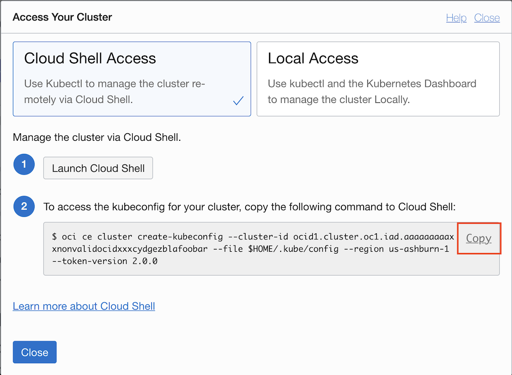

   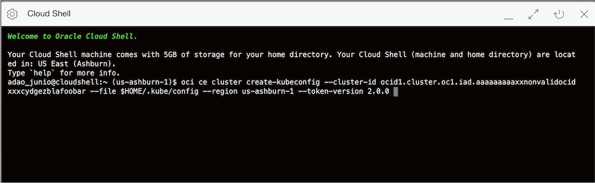

1. Check if you have access to your cluster with `kubectl`.

    ````shell
    <copy>
    kubectl get cs
    </copy>
    ````

    ````shell
    NAME                 STATUS    MESSAGE             ERROR
    scheduler            Healthy   ok
    controller-manager   Healthy   ok
    etcd-0               Healthy   {"health":"true"}
    ````

1. Check the version of your kubectl client and kubernetes server with `kubectl`.

    ````shell
    <copy>
    kubectl version
    </copy>
    ````

1. Get the nodes and check if they are _Ready_ with `kubectl`.

    ````shell
    <copy>
    kubectl get nodes
    </copy>
    ````

    ````shell
   NAME        STATUS   ROLES   AGE   VERSION
   10.0.10.2   Ready    node    1m    v1.19.7
   10.0.10.3   Ready    node    1m    v1.19.7
   10.0.10.4   Ready    node    1m    v1.19.7
    ````

You may now [proceed to the next lab](#next).

## Acknowledgements

- **Author** - Satyajeet Joshi
- **Contributors** -  Kamryn Vinson, Adao Junior
- **Last Updated By/Date** - Adao Junior, April 2021

