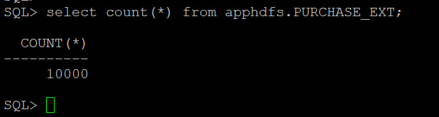

# Environment Setup

## Lab Introduction
Enter a brief introduction here

## Task 1: Login to Oracle Database and Create User

1. Login to **Database**
  
    ````
    <copy>
    ps -ef | grep pmon
    </copy>
    ````

    ````
    <copy>
    .oraenv  </copy>
    orcl
    sqlplus / as sysdba
    </copy>
    ````

2. Connect to the **container**
   
    ````
    <copy>
    alter session set container=ORCLPDB;
    </copy>
    ````
3. Create the apphdfs user **user**

    ````
    <copy>
    create user apphdfs identified by apphdfs container=current;
    </copy>
    ````

4. Grant **read** to directory 
    ````
    <copy>
    grant read on directory ORACLE_BIGDATA_CONFIG to apphdfs;
    </copy>
    ````

5. Grant permission to **user**
    ````
    <copy>
    grant BDSQL_USER to apphdfs;
    </copy>
    ````

    ````
    <copy>
    exit
    </copy>
    ````

6. Make **Directory**
    ````
    <copy>
    hdfs dfs -mkdir /data/jsondoc
    </copy>
    ````
    ````
    <copy>
    hdfs dfs -put /home/oracle/PurchaseOrders.dmp /data/jsondoc/
    </copy>
    ````
    ````
    <copy>
    hdfs dfs -ls /data/jsondoc/
    </copy>
    ````

## Task 2: Connect to Database and Create Table

Since data in the Hadoop HDFS file system is stored in an undetermined format, SQL queries require some constructs to parse and interpret data for it to be processed in rows and columns. Oracle Big Data SQL leverages available Hadoop constructs to accomplish this, notably InputFormat and SerDe Java classes, optionally through Hive metadata definitions. The Oracle Big Data SQL processing cells on the DataNodes are a layer on top of this generic Hadoop infrastructure. Three key features provided by the cells are Smart Scan, Storage Indexes, and Aggregation Offload.

Oracle Big Data SQL provides external tables with next generation performance gains. An external table is an Oracle Database object that identifies and describes the location of data outside of a database. You can query an external table using the same SQL SELECT syntax that you use for any other database tables. 

1. Connect to **Database**

    ````
    <copy>
    sqlplus apphdfs/apphdfs@orclpdb
    </copy>
    ````

2. Create **Table**

    ````
    <copy>
    CREATE TABLE apphdfs.PURCHASE_EXT (
    doc varchar2(4000)
    )
      ORGANIZATION EXTERNAL
        ( TYPE ORACLE_HDFS
          DEFAULT DIRECTORY DEFAULT_DIR
          LOCATION ('/data/jsondoc')
        )
    REJECT LIMIT UNLIMITED;
    </copy>   
    ````

    

## Task 3: Use the Hive Access Driver

ORACLE HDFS enables you to create Oracle external tables directly over files stored in HDFS. This access driver uses Hive syntax to describe a data source, assigning default column names of COL 1, COL 2, and so forth. You do not need to create a Hive table manually as a separate step.

   

1. Login to the pdb as the apphdfs user
    ````
    <copy>
    sqlplus apphdfs/apphdfs@orclpdb
    </copy>
    ````

2. Use **Oracle dot notation JSON** syntax to parse the data
   
    ````
    <copy>
    select s.doc.PONumber,
    s.doc.Reference,
    s.doc.Requestor,
    s.doc.CostCenter,
    s.doc.ShippingInstructions.name as CustomerName,
    s.doc.ShippingInstructions.Address.street as Street,
    s.doc.ShippingInstructions.Phone.type as PhoneType,
    s.doc.ShippingInstructions.Address.city as City,
    s.doc.ShippingInstructions.Address.state as State,
    s.doc.ShippingInstructions.Address.zipCode as Zipcode,
    s.doc.ShippingInstructions.Address.country as Country,
    s.doc.LineItems.Part.Description as ProductDescription,
    s.doc.LineItems.Part.UPCCode as UPCCode,
    s.doc.LineItems.Part.UnitPrice as UnitPrice,
    s.doc."Special Instructions" as SpecialInstructions 
    from PURCHASE_EXT s;
    </copy>
    ````
    

You may now proceed to the next lab.

## Acknowledgements

- **Authors/Contributors** - Enter author  name
- **Last Updated By/Date** - Kay Malcolm, Database Product Management, May 2020


