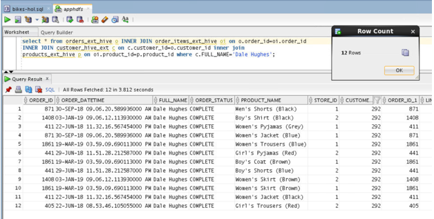
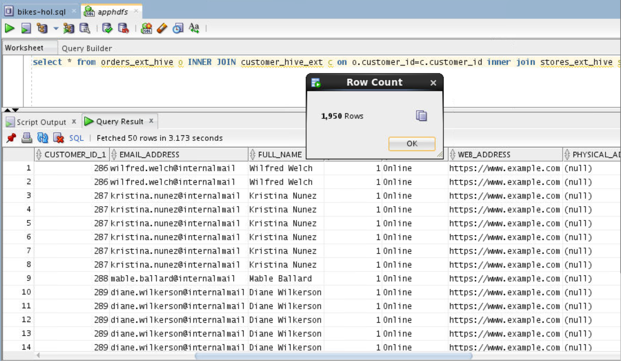
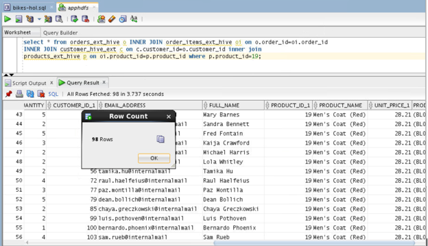

# Oracle BigDataSQL-HIVE

## Introduction

## Task 1: A Customer Purchase Order History

1. Connect to Database
    ````
    <copy>
    . oraenv
    </copy>
    ````
    ````
    <copy>
    sqlplus apphdfs/apphdfs@orclpdb
    </copy>
    ````
2. List purchase order history of customer 
    ````
    <copy>
    select * from orders_ext_hive o INNER JOIN order_items_ext_hive oi on o.order_id=oi.order_id 
    INNER JOIN customer_hive_ext c on c.customer_id=o.customer_id inner join 
    products_ext_hive p on oi.product_id=p.product_id where c.FULL_NAME='Dale Hughes';
    </copy>
    ````
    

## Task 2: Customers windows shopping history (through online)

1. Connect to **Database**
    ````
    <copy>
    .oraenv
    </copy>
    ````
    ````
    <copy>
    sqlplus apphdfs/apphdfs@orclpdb
    </copy>
    ````
2. List customers with **window shopping** history
````
<copy>
select * from orders_ext_hive o INNER JOIN customer_hive_ext c on o.customer_id=c.customer_id inner join stores_ext_hive s on s.store_id=o.store_id;
</copy>
````


## Task 3: Customer who ordered some specific products


1. Connect to **Database**
    ````
    <copy>
    .oraenv
    </copy>
    ````
    ````
    <copy>
    sqlplus apphdfs/apphdfs@orclpdb
    </copy>
    ````

2. List customers who ordered **specific products** 
    ````
    <copy>
    select * from orders_ext_hive o INNER JOIN order_items_ext_hive oi on o.order_id=oi.order_id 
    INNER JOIN customer_hive_ext c on c.customer_id=o.customer_id inner join 
    products_ext_hive p on oi.product_id=p.product_id where p.product_id=19;

    </copy>
    ````
    

This is the end of the lab.

## Acknowledgements

- **Authors/Contributors** - Enter author  name
- **Last Updated By/Date** - Kay Malcolm, Database Product Management, May 2020


