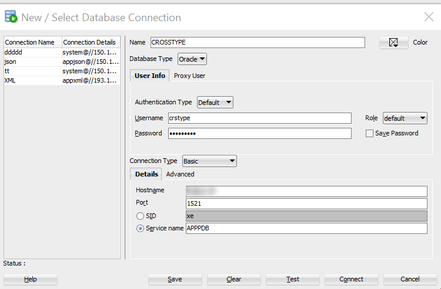
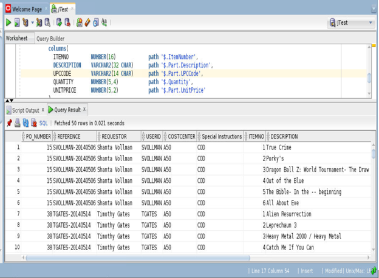
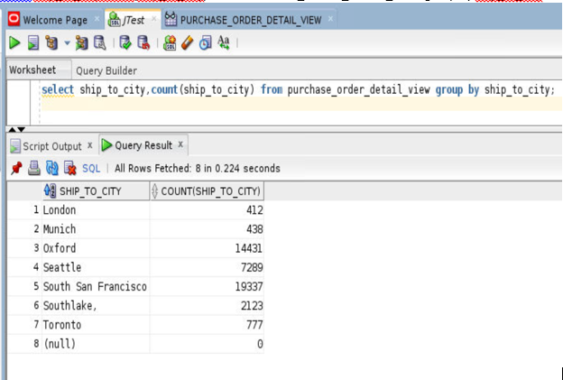
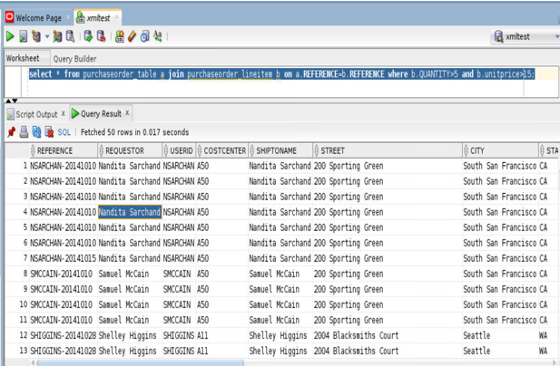
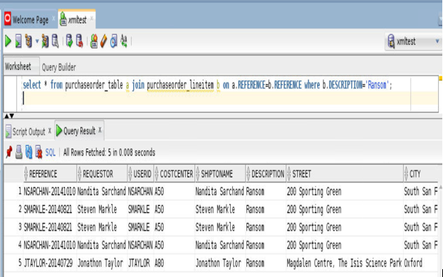

# Oracle Cross Datatype

## Introduction
Cross datatype lab is designed to showcase the functionality of multi datatype like json, xml and spatial and how all of them can be used same like relational data format.

*Estimated Lab Time*: 20 Minutes

### About Oracle Cross Datatype

JSON_TABLE creates a relational view of JSON data. It maps the result of a JSON data evaluation into relational rows and columns. The COLUMNS clause evaluates the row source, finds specific JSON values within the row source, and returns those JSON values as SQL values in individual columns of a row of relational data.

### Objectives
In this lab, you will:
* Setup the environment for Cross Datatype lab.
* Connect the oracle SQL developer to access the JSON, XML, Spatial data in Relational formate by using different type of function.
* Learn about how to use Cross data function :
    - JSON with Relational
    - XML with Relational
    - JSON with Spatial

### Prerequisites
This lab assumes you have:
- A Free Tier, Paid or LiveLabs Oracle Cloud account
- You have completed:
    - Lab: Prepare Setup (*Free-tier* and *Paid Tenants* only)
    - Lab: Environment Setup
    - Lab: Initialize Environment


<!-- ## Task 1: Connect to the Pluggable Database (PDB) -->

<!-- 1. As oracle user set oracle Environment and connect to the PDB.

    ```
    <copy>
    . oraenv
    </copy>
    ```

    ```
    <copy>
    convergedcdb
    </copy>
    ```

    ```
    <copy>
    sqlplus CRSTYPE/Oracle_4U@APPPDB
    </copy>
    ``` -->

## Task 1: Connect to SQL Developer

1. Make a connection to SQL Developer. Use the details as below and click on connect.


  - **Name**: CROSSTYPE
  - **Username**: CRSTYPE
  - **Password**: `Oracle_4U`
  - **Hostname**: localhost
  - **Port**: 1521
  - **Service name**: APPPDB

    


## Task 2: JSON with Relational

**JSON_TABLE** creates a relational view of JSON data. It maps the result of a JSON data evaluation into relational rows and columns. The COLUMNS clause evaluates the row source, finds specific JSON values within the row source, and returns those JSON values as SQL values in individual columns of a row of relational data

Below are the examples using **JSON_TABLE**.

1. Find all the Products, those sold with payment mode – Cash on Delivery

    ```
    <copy>
    select D.*
      from PURCHASE_ORDER p,
          JSON_TABLE(
            p.PO_DOCUMENT,
            '$'
            columns(
              PO_NUMBER            NUMBER(10)                  path  '$.PONumber',
              REFERENCE            VARCHAR2(30 CHAR)           path  '$.Reference',
              REQUESTOR            VARCHAR2(32 CHAR)           path  '$.Requestor',
              USERID               VARCHAR2(10 CHAR)           path  '$.User',
              COSTCENTER           VARCHAR2(16)                path  '$.CostCenter',
          "Special Instructions" VARCHAR2(4000) PATH '$."Special Instructions"',
              NESTED PATH '$.LineItems[*]'
              columns(
                ITEMNO         NUMBER(16)             path '$.ItemNumber',
                DESCRIPTION    VARCHAR2(32 CHAR)      path '$.Part.Description',
                UPCCODE        VARCHAR2(14 CHAR)      path '$.Part.UPCCode',
                QUANTITY       NUMBER(5,4)            path '$.Quantity',
                UNITPRICE      NUMBER(5,2)            path '$.Part.UnitPrice'
              )
            )
          ) D
    where "Special Instructions"='COD'
    /
    </copy>
    ```

    

2.  Purchase order history count based on City

    ```
    <copy>
    select ship_to_city,count(ship_to_city) from PURCHASE_ORDER_DETAIL_VIEW group by ship_to_city;
    </copy>
    ```
    

## Task 3: XML with Relational

**XMLTABLE:** Convert XML Data into Rows and Columns using SQL. The XMLTABLE operator, which allows you to project columns on to XML data in an XMLTYPE , making it possible to query the data directly from SQL as if it were relational data.

Below are the examples using **XMLTABLE**

1. Customers who ordered quantity of items more than 5 and unit price is greater than $15

    ```
    <copy>
    select * from purchaseorder_table a join purchaseorder_lineitem b on a.REFERENCE=b.REFERENCE where b.QUANTITY>5 and b.unitprice>15;
    </copy>
    ```

    

2. History of customers who ordered for a specific products

    ```
    <copy>
    select * from purchaseorder_table a join purchaseorder_lineitem b on a.REFERENCE=b.REFERENCE where b.DESCRIPTION='Ransom';
    </copy>
    ```

    

## Task 4: JSON with Spatial

GeoJSON Objects: Geometry, Feature, Feature Collection
GeoJSON uses JSON objects that represent various geometrical entities and combinations of these together with user-defined properties.
    - A position is an array of two or more spatial (numerical) coordinates, the first three of which generally represent longitude, latitude, and altitude.
    - A geometry object has a type field and (except for a geometry-collection object) a coordinates field
    - A geometry collection is a geometry object with type GeometryCollection. Instead of a coordinates field it has a geometries field, whose value is an array of geometry objects other than GeometryCollection objects.


1. Compute the distance in KM from specific point to each Geometry. This example selects the documents (there is only one in this table) for which the geometry field of the first features element is within 100 kilometers of a given point. The point is provided literally here (its coordinates are the longitude and latitude of San Francisco, California). The distance is computed from this point to each geometry object. The query orders the selected documents by the calculated distance. The tolerance in meters for the distance calculation is provided in this query as the literal argument 100.


    ```
    <copy>
    SELECT id,json_value(geo_doc, '$.features[0].properties.Name') "Name", SDO_GEOM.sdo_distance(json_value(geo_doc, '$.features[0].geometry' RETURNING SDO_GEOMETRY),SDO_GEOMETRY(2001,4326,SDO_POINT_TYPE(-122.416667, 37.783333, NULL), NULL, NULL), 100, -- Tolerance in meters
    'unit=KM') "Distance in kilometers" FROM json_geo WHERE sdo_within_distance(json_value(geo_doc, '$.features[0].geometry' RETURNING SDO_GEOMETRY),SDO_GEOMETRY(2001,4326,SDO_POINT_TYPE(-122.416667, 37.783333, NULL), NULL, NULL),'distance=100 unit=KM') = 'TRUE';
    </copy>
    ```
    

You may now [proceed to the next lab](#next).

## Rate this Workshop
When you are finished don't forget to rate this workshop!  We rely on this feedback to help us improve and refine our LiveLabs catalog.  Follow the steps to submit your rating.

1.  Go back to your **workshop homepage** in LiveLabs by searching for your workshop and clicking the Launch button.
2.  Click on the **Brown Button** to re-access the workshop  

    

3.  Click **Rate this workshop**

    

If you selected the **Green Button** for this workshop and still have an active reservation, you can also rate by going to My Reservations -> Launch Workshop.

## Acknowledgements
* **Authors** - Balasubramanian Ramamoorthy, Arvind Bhope
* **Contributors** - Laxmi Amarappanavar, Kanika Sharma, Venkata Bandaru, Ashish Kumar, Priya Dhuriya, Maniselvan K, Robert Ruppel, David Start, Rene Fontcha
* **Last Updated By/Date** - Rene Fontcha, LiveLabs Platform Lead, NA Technology, December 2020
