# Oracle Graph

## Introduction
This lab walks you through the steps of setting up the environment for property graph. You will then get to run queries and publish your graph. In the rest of the lab you will get a chance to use GraphViz and explore visualizing your graph.

*Estimated Lab Time*: 30 Minutes

### About Oracle Graph
A graph database is a specialized, single-purpose platform for creating and manipulating graphs. Graphs contain nodes, edges, and properties, all of which are used to represent and store data in a way that relational databases are not equipped to do.
Graph analytics is another commonly used term, and it refers specifically to the process of analyzing data in a graph format using data points as nodes and relationships as edges. Graph analytics requires a database that can support graph formats; this could be a dedicated graph database, or a multi-model database that supports multiple data models, including graph.

[](youtube:-DYVgYJPbQA)

For More Details About Oracle Graph [Click here](#Appendix2:MoreaboutOracleGraph)

### Objectives
In this lab, you will:
* Setup the environment for property graph.
* Connect the Graph Server and Client to access the Spatial Data from Oracle Database by using PGQL Query.
* Learn More about the Graph query, PGQL Query, Graph server and client.

### Prerequisites
This lab assumes you have:
- A Free Tier, Paid or LiveLabs Oracle Cloud account
- You have completed:
    - Lab: Prepare Setup (*Free-tier* and *Paid Tenants* only)
    - Lab: Environment Setup
    - Lab: Initialize Environment

## Task 1: Connect to Graph Server and Client

The graph server has already been setup for you. For more information on the graph server setup see the "Learn More section" of this lab.
1. For connecting to graph server, open a terminal and execute below steps as oracle user.

    ```
    <copy>
    cd /u01/script/graph_startup
    </copy>
    ```
    ```
    <copy>
    nohup ./01_graph_server.sh &
    </copy>
    ```

2. After running the above script, once we get the prompt will run below script to start the graph client.

    ```
    <copy>
    ./02_graph_client.sh
    </copy>
    ```
The below screenshot is an example of what a Connection to a PGX server using Jshell looks like

    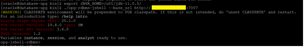

3. Make a JDBC connection to the database, run the below at the jshell prompt.

    ```
    <copy>
    /open /u01/script/graph_startup/03_graphload.jsh
    </copy>
    ```

## Task 2: Create Graph

For Step 2 the SQL statements have already been run as a part of the script 03_graphload.jsh.
If you want to learn more about the Create Graph [Click here](#Appendix1:CreateGraph)


## Task 3: Querying Graph using PGQL

1. Find the edge labels. We used labels here to tag an edge with a relationship type

    ```
    <copy>
    query.accept("select distinct label(e) from oe_sample_graph match ()-[e]->(m)");
    </copy>
    ```

    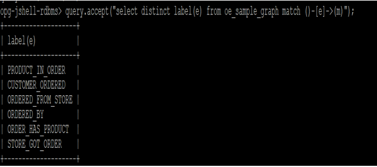

2. Finding vertex label using PGQL. We used labels here to tag a vertex as an entity type.

    ```
    <copy>
    query.accept("select distinct label(v) from oe_sample_graph match (v)") ;
    </copy>
    ```

    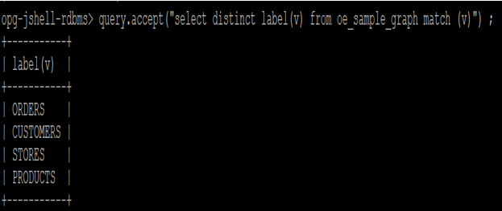

3. Getting count from customer table

    ```
    <copy>
    query.accept("select count(v) from oe_sample_graph match (v:CUSTOMERS)");
    </copy>
    ```

    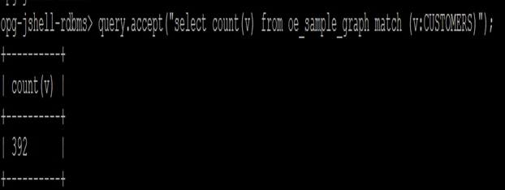

4. Identifying the store using PGQL

    ```
    <copy>
    query.accept("select s.STORE_NAME from oe_sample_graph match (c:CUSTOMERS)->(o:ORDERS)->(s:STORES) where c.CUSTOMER_ID=202");
    </copy>
    ```

    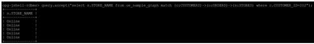

5. Identifying customer's purchases using PGQL

    ```
    <copy>
    query.accept(
      "select o.ORDER_STATUS, op.QUANTITY, p.UNIT_PRICE, p.PRODUCT_NAME from oe_sample_graph match (c)-[co]->(o:ORDERS)-[op]->(p:PRODUCTS) where c.FULL_NAME='Dale Hughes'");
    </copy>
    ```

    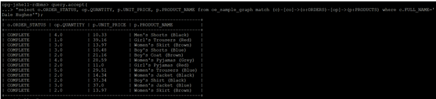

6. What did people buy from the Online Store. Return the first 50 results of what the people purchased.

    ```
    <copy>
    query.accept(
      "select c.FULL_NAME, p.PRODUCT_NAME from oe_sample_graph match (o)-[os:ORDERED_FROM_STORE]->(s:STORES),(c)-[co]->(o:ORDERS)-[op]->(p:PRODUCTS) where s.STORE_ID=1 limit 50");
      </copy>
    ```

    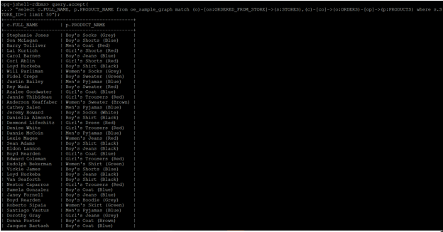

7. The amount of product purchased by using Id 19 and by whom.

    ```
    <copy>
    query.accept("select c.FULL_NAME, op.QUANTITY from oe_sample_graph match (c)-[co]->(o:ORDERS)-[op]->(p:PRODUCTS) where p.PRODUCT_ID=19 order by op.QUANTITY desc");
    </copy>
    ```

    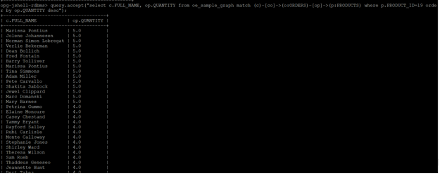

8. Which customers bought products that customer 202 bought? Return the first 10 results  that had the most products in common with 202

    ```
    <copy>
    var qStr =
    "select c1.FULL_NAME " +
    "FROM oe_sample_graph " +
    "MATCH (c:CUSTOMERS)->(:ORDERS)-[:ORDER_HAS_PRODUCT]->(p:PRODUCTS)," +
    "(c1:CUSTOMERS)->(:ORDERS)-[:ORDER_HAS_PRODUCT]->(p:PRODUCTS) " +
    "WHERE c.CUSTOMER_ID=202 " +
    "AND c.CUSTOMER_ID <> c1.CUSTOMER_ID " +
    "GROUP BY c1 " +
    "ORDER BY count(DISTINCT p) DESC " +
    "LIMIT 10";

    query.accept(qStr);
    </copy>
    ```

    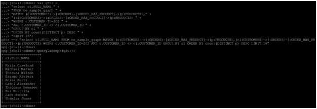

## Task 4: Load the Graph into memory and publish it.

1. Run the below command in jshell prompt. This step will run the script called "04_graphintoMemory.jsh"  which will perform two steps. The first step is loading the graph into memory. The second step is publishing the graph. After running this command we will look at some of the examples about customers and their orders.

    ```
    <copy>
    /open /u01/script/graph_startup/04_graphintoMemory.jsh
    </copy>
    ```

2. Which stores did customer with id 202 order from?

    ```
    <copy>
    session.queryPgql("select s.STORE_NAME from oe_sample_graph match (c:CUSTOMERS)->(o:ORDERS)->(s:STORES) where c.CUSTOMER_ID=202").print().close();
    </copy>
    ```

    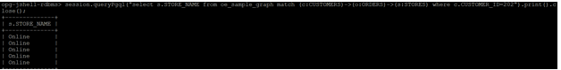

3. What products did customer 202 buy?

    ```
    <copy>
    session.queryPgql("select s.STORE_NAME, o.ORDER_ID, p.PRODUCT_NAME from oe_sample_graph match (c:CUSTOMERS)->(o:ORDERS)->(s:STORES), (o:ORDERS)-[e:ORDER_HAS_PRODUCT]->(p:PRODUCTS) where c.CUSTOMER_ID=202").print().close();
    </copy>
    ```

    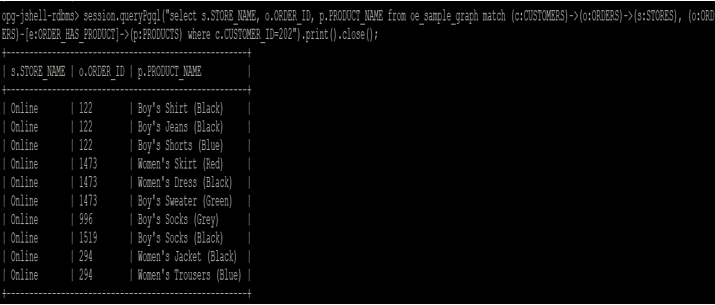

4. List the first 50 other customers who ordered from the same store(s) as customer 202

    ```
    <copy>
    session.queryPgql("Select c.CUSTOMER_ID, c.FULL_NAME from oe_sample_graph match (b:CUSTOMERS)->(o:ORDERS)->(s:STORES)<-(o2:ORDERS)<-(c:CUSTOMERS) Where b.CUSTOMER_ID=202 and b.CUSTOMER_ID <> c.CUSTOMER_ID LIMIT 50").print().close();
    </copy>
    ```

    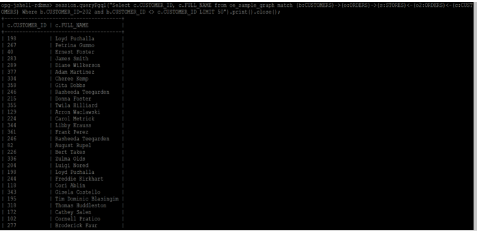

5. List the first 30 products that customers ordered from the same stores as customer 202

    ```
    <copy>
    session.queryPgql("select c2.FULL_NAME, p2.PRODUCT_NAME from oe_sample_graph match (c:CUSTOMERS)-[co]->(o:ORDERS)-[os]->(s:STORES), (o:ORDERS)-[e:ORDER_HAS_PRODUCT]->(p:PRODUCTS), (c2:CUSTOMERS)-[co2]->(o2: ORDERS)-[os2]->(s2: STORES), (o2: ORDERS)-[e2:ORDER_HAS_PRODUCT]->(p2:PRODUCTS) where c.CUSTOMER_ID=202 and s.STORE_ID=s2.STORE_ID and c.CUSTOMER_ID <> c2.CUSTOMER_ID LIMIT 30").print().close();
    </copy>
    ```

    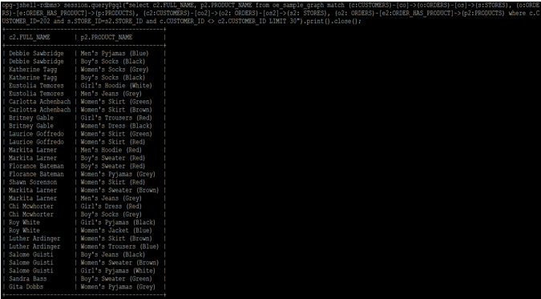

6. List the 10 customers who had the most product purchases in common with customer 202, see definition of qStr above or just enter qStr in the shell to see its content

    ```
    <copy>
    qStr ;
    session.queryPgql(qStr).print().close();
    </copy>
    ```

    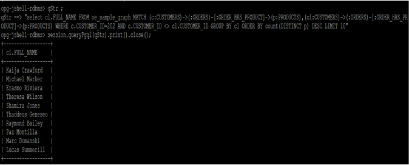

## Task 5: Visualize the Graph

We will use the Graph Visualization component to run some PGQL queries and visualize the results as a graph instead of a tabular result. Make sure that you completed the previous step and that your graph has been loaded into memory and published otherwise this step will fail.

   - GraphViz should be accessible at

    ```
    <copy>
    http://localhost:7007/ui
    </copy>
    ```

The principal points of entry for the GraphViz application are the query editor and the graph lists.
When you start GraphViz, the graph list will be populated with the graphs loaded in the graph server. To run queries against a graph, select that graph. The query lets you write PGQL queries that can be visualized. (PGQL is the SQL-like query language supported by GraphViz.)
Once the query is ready and the desired graph is selected, click Run to execute the query.

1. This statement shows what products did customer 202 buy from which store(s)?

    ```
    <copy>
    select * from oe_sample_graph
    match (c:CUSTOMERS)-[co]->(o:ORDERS)-[os]->(s:STORES), (o:ORDERS)-[e:ORDER_HAS_PRODUCT]->(p:PRODUCTS)
    where c.CUSTOMER_ID=202
    </copy>
    ```

    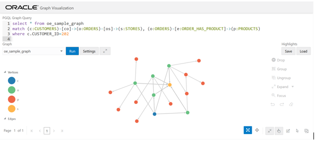

2. Add some labels to the vertices. Click on Settings -> Then choose the Visualization tab

3. Scroll down to Labeling and in the Vertex Label drop down select "label" then click OK.

    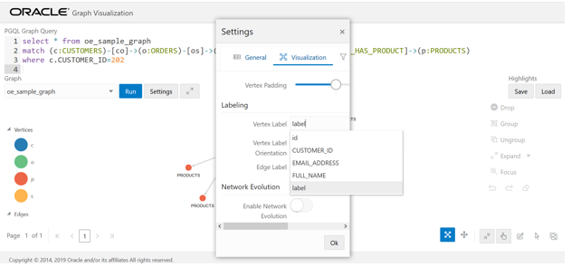

    The result should look like as below:
    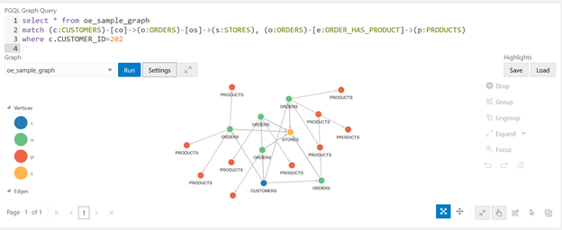

4. Here we look at which customers placed orders from store with id 1 (the Online store) displaying the first 100 results

    ```
    <copy>
    Select * from oe_sample_graph
    Match (c)-[co]->(o)-[os:ORDERED_FROM_STORE]->(s)
    Where s.STORE_ID=1 LIMIT 100
    </copy>
    ```

    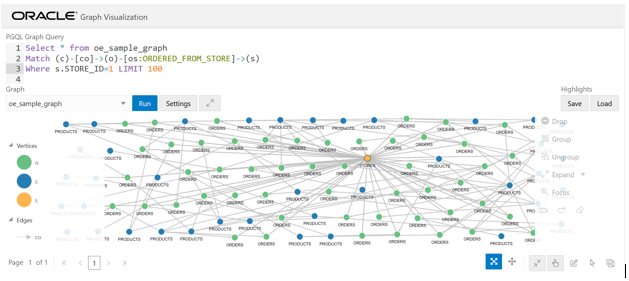

5. Let’s add some highlights to indicate Cancelled or Refunded orders. Click on Settings-> Highlights-> New Highlight

    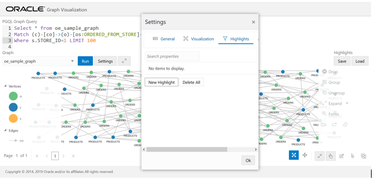

6. We will add two conditions that match cancelled or refunded orders. Select Filter By Vertices and apply to Vertex (i.e. the conditions apply to Vertices)

7. Click on the +  sign to add a condition

8. In the drop down choose label and then on the right side of the = type in ORDERS. It should look like label = ORDERS

9. Again, Click + sign  to add another condition

10. Repeat the above for ORDER_STATUS = CANCELLED

11. Click the checkbox for Color (vertex color) and choose a red color from the color-picker

    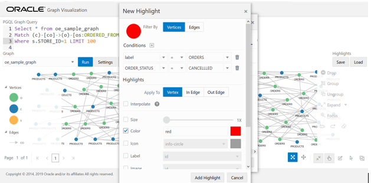

12. Scroll down and Check the box for Legend Title and enter Cancelled as the Legend Title and then Click Add Highlight.

    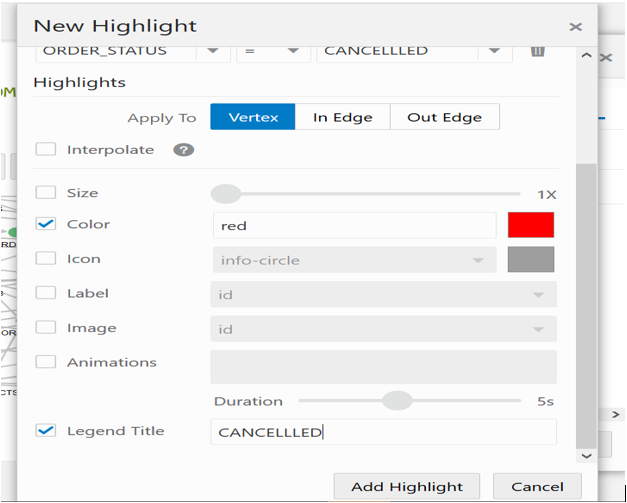

13. Repeat the above process to add one more highlight for Refunded Orders.

14. Click on New Highlight

15. Select Filter By Vertices and Apply to Vertex (i.e. the conditions apply to Vertices)

16. Click on the +  sign to add a condition

17. Choose label = ORDERS

18. Click + to add another condition

19. Choose ORDER_STATUS = REFUNDED

20. Click the checkbox for Color (vertex color) and choose a yellow color from the color-picker

21. Set the Legend Title to Refunded

22. Then Click Add Highlight.

    

23. There should now be two highlights. Click OK

    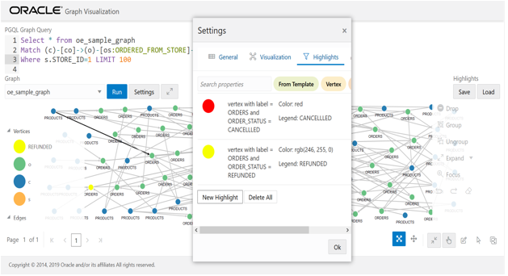

24. The resulting viz should look like

    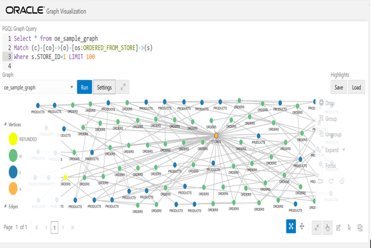


25. The following statement will look at what products did customer buy?

    ```
    <copy>
    select customer, coEdge, orders, opEdge, product from oe_sample_graph match
    (customer:CUSTOMERS)-[coEdge:CUSTOMER_ORDERED]->(orders:ORDERS)-[opEdge:ORDER_HAS_PRODUCT]->(product:PRODUCTS)
    where customer.FULL_NAME='Dale Hughes'
    </copy>
    ```

    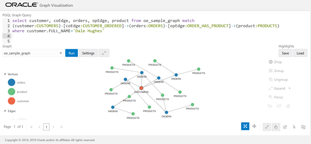

26. Add highlights on edges for Order items that had Quantity > 1 and unit_Price > 25

27. Click on settings-> Highlights-> New Highlights. Select Filter By Edges and Apply to Edge (i.e. the conditions apply to edges).

28. Add two conditions

29. Click on the +  sign to add conditions

    - One for QUANTITY > 1
    - Another for UNIT_PRICE > 25
    - Choose a red color for the Edge ,Click on Add Highlight and then OK.

    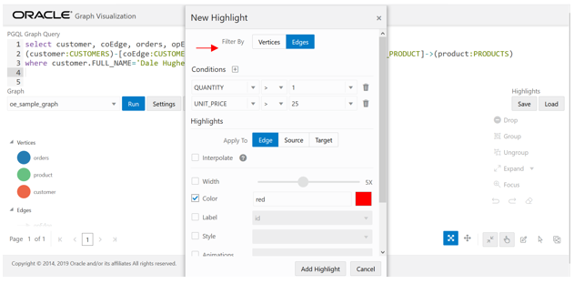

    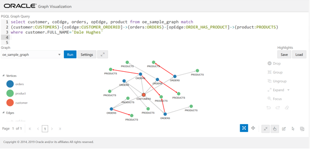


30. This statement will show Which customers bought product with id 44 and will display 100 results per page.

    ```
    <copy>
    select customer, coEdge, orders, opEdge, product from oe_sample_graph match
    (orders)-[os:ORDERED_FROM_STORE]->(store:STORES),
    (customer:CUSTOMERS)-[coEdge:CUSTOMER_ORDERED]->(orders:ORDERS)-[opEdge:ORDER_HAS_PRODUCT]->(product:PRODUCTS)
    where store.STORE_ID=1
    </copy>
    ```

    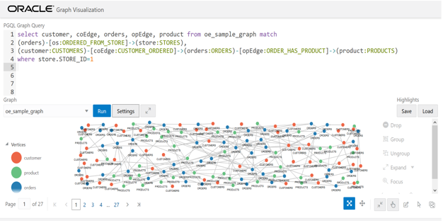


31. Now let's look at which customers bought product with id 44 displaying 100 results per page

    ```
    <copy>
    select customer,opEdge, product, coEdge, orders from oe_sample_graph match
    (customer:CUSTOMERS)-[coEdge:CUSTOMER_ORDERED]->(orders:ORDERS)-[opEdge:ORDER_HAS_PRODUCT]->(product:PRODUCTS)
    where product.PRODUCT_ID=44
    </copy>
    ```

    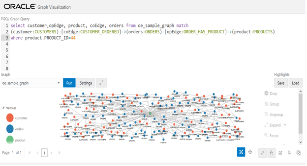

32. Once you are done using PGViz at localhost:7007/ui and trying some other PGQL queries then execute the below statement at JSHELL prompt to delete the in-memory graph.

    ```
    <copy>
    graph.destroy();
    </copy>
    ```
33. From terminal window, execute the below command to exit from JSHELL.

    ```
    <copy>
    /exit
    </copy>
    ```

You may now [proceed to the next lab](#next).

## **Appendix 1**: Create Graph

1. We have created the views for the use of orders and order_items as multiple edge tables using below commands.

    ```
    Create or replace view co_edge as select * from orders;
    Create or replace view oc_edge as select * from orders;
    Create or replace view os_edge as select * from orders;
    Create or replace view so_edge as select * from orders;
    Create or replace view op_edge as select * from order_items;
    Create or replace view po_edge as select * from order_items;
    ```

    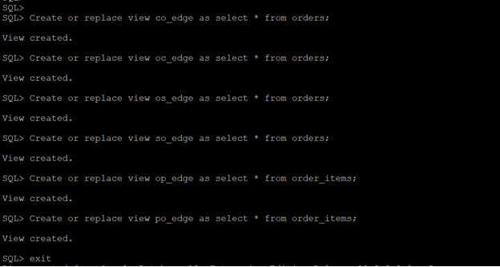

2. We used a property graph query language [PGQL](http://pgql-lang.org) DDL to define and populate the graph.  The statement is as follows:

    ```
    CREATE PROPERTY GRAPH OE_SAMPLE_GRAPH
    VERTEX TABLES (
    customers KEY (CUSTOMER_ID) LABEL CUSTOMERS
    PROPERTIES(CUSTOMER_ID, EMAIL_ADDRESS, FULL_NAME),
    products KEY (PRODUCT_ID) LABEL PRODUCTS
    PROPERTIES (PRODUCT_ID, PRODUCT_NAME, UNIT_PRICE),
    orders KEY (ORDER_ID) LABEL ORDERS
    PROPERTIES (ORDER_ID, ORDER_DATETIME, ORDER_STATUS),
    stores KEY (STORE_ID) LABEL STORES
    PROPERTIES (STORE_ID, STORE_NAME, WEB_ADDRESS, PHYSICAL_ADDRESS,
      LATITUDE, LONGITUDE)
      )
      EDGE TABLES (
    co_edge
      SOURCE KEY (CUSTOMER_ID) REFERENCES customers
      DESTINATION KEY (ORDER_ID) REFERENCES orders
      LABEL CUSTOMER_ORDERED
      NO PROPERTIES,
    oc_edge
      SOURCE KEY (ORDER_ID) REFERENCES orders
      DESTINATION KEY (CUSTOMER_ID) REFERENCES customers
      LABEL ORDERED_BY
      NO PROPERTIES,
    os_edge
      SOURCE KEY (ORDER_ID) REFERENCES orders
      DESTINATION KEY (STORE_ID) REFERENCES stores
      LABEL ORDERED_FROM_STORE
      NO PROPERTIES,
    so_edge
      SOURCE KEY (STORE_ID) REFERENCES stores
      DESTINATION KEY (ORDER_ID) REFERENCES orders
      LABEL STORE_GOT_ORDER
      NO PROPERTIES,
    op_edge
      SOURCE KEY (ORDER_ID) REFERENCES orders
      DESTINATION KEY (PRODUCT_ID) REFERENCES products
      LABEL ORDER_HAS_PRODUCT
      PROPERTIES (LINE_ITEM_ID, UNIT_PRICE, QUANTITY),
    po_edge
      SOURCE KEY (PRODUCT_ID) REFERENCES products
      DESTINATION KEY (ORDER_ID) REFERENCES orders
      LABEL PRODUCT_IN_ORDER
      PROPERTIES (LINE_ITEM_ID)
      )
    ```

3. The above PQGL query is saved as sql file (CreatePropertyGraph.sql) and stored in path `/u01/graph` and is run at jshell prompt.

    ```
    <copy>
    pgql.prepareStatement(Files.readString(Paths.get("/u01/graph/CreatePropertyGraph.sql"))).execute();
    </copy>
    ```

4. The Graph Server kit includes the necessary components (a server application and JShell client) that will execute the above CREATE PROPERTY GRAPH statement and create the graph representation.

The graph itself is stored in a set of tables named

  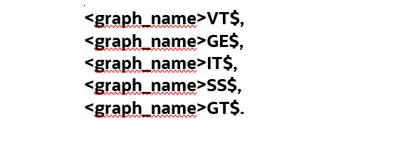

  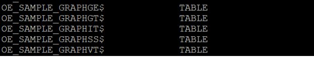
The important ones are the ones that store the vertices (`OE SAMPLE GRAPHVT$`) and edges (`OE SAMPLE GRAPHGE$`).

5. Create a convenience function which prepares, executes, and prints the result of a PGQL statement

    ```
    Consumer&lt;String&gt; query = q -> { try(var s = pgql.prepareStatement(q)) { s.execute(); s.getResultSet().print(); } catch(Exception e) { throw new RuntimeException(e); } }
    ```
## **Appendix 2**: More about Oracle Graph
**Oracle Graph Server and Client**

It is a software package for use with the Property Graph feature of Oracle Database. Oracle Graph Server and Client includes the high speed in-memory analytics server (PGX) and client libraries required for graph applications.

[](youtube:zfefKdNfAY4)

Oracle Graph Client: A zip file containing Oracle Graph Client.

Oracle Graph Server: An rpm file containing an easy to deploy Oracle Graph Server.

For installing the Graph server, the prerequisites are:
-	Oracle Linux 6 or 7 x64 or a similar Linux distribution such as RedHat
-	Oracle JDK 8

For installing the Graph client, the prerequisites are:
-	A Unix-based operation system (such as Linux) or macOS or Microsoft Windows
-	Oracle JDK 11

**Interactive Graph Shell**

Both the Oracle Graph server and client packages contain an interactive command-line application for interacting with all the Java APIs of the product, locally or on remote computers.

This interactive graph shell dynamically interprets command-line inputs from the user, executes them by invoking the underlying functionality, and can print results or process them further.

This graph shell is implemented on top of the Java Shell tool (JShell).

The graph shell automatically connects to a PGX instance (either remote or embedded depending on the --`base_url` command-line option) and creates a PGX session.

Oracle’s converged, multi-model database natively supports graphs and delivers high performance, scalable graph data management, query, and analytics for enterprise applications. State-of-the-art graph features are available along with functionality required for enterprise grade applications: fine-grained security, high availability, easy manageability, and integration with other data in an application.

Oracle’s mission is to help people see data in new ways, discover insights, and unlock endless possibilities.  Graph analysis is about understanding relationships and connections in data, and detecting patterns that identify new insights. With Oracle’s Graph offerings developers can use a comprehensive suite of graph query and analytics tools to integrate graphs into applications on enterprise grade data management infrastructure.

**For example,** graph algorithms can identify what individual or item is most connected to others in social networks or business processes.  They can identify communities, anomalies, common patterns, and paths that connect individuals or related transactions.
Every Oracle Database now includes both property graph and RDF graph data models as well as algorithms, query languages, and visualization tools.

**Property Graph database includes:**

- PGX in-memory graph engine
- PGQL graph query language
- 50+ Graph algorithms
- Support for graph visualization

Customers use Property Graphs in fraud analytics, vulnerability analysis, recommendation systems, and more.

**RDF Graph database includes:**

- SPARQL graph query language
- Java APIs via open source Apache Jena
- W3C standards support for semantic data, ontologies and inferencing
- RDF Graph views of relational tables

Customers use RDF Graphs in linked data and data sharing applications in pharma, publishing, public sector and more.
This workbook provides an overview of Oracle Graph support for property graph features.

**What Are Property Graphs?**

A property graph consists of a set of objects or vertices, and a set of arrows or edges connecting the objects. Vertices and edges can have multiple properties, which are represented as key-value pairs.

**Each vertex has a unique identifier and can have:**

- A set of outgoing edges
- A set of incoming edges
- A collection of properties

**Each edge has a unique identifier and can have:**

- An outgoing vertex
- An incoming vertex
- A text label that describes the relationship between the two vertices
- A collection of properties

The following figure illustrates a very simple property graph with two vertices and one edge. The two vertices have identifiers 1 and 2. Both vertices have properties name and age. The edge is from the outgoing vertex 1 to the incoming vertex 2. The edge has a text label knows and a property type identifying the type of relationship between vertices 1 and 2.


Figure: Simple Property Graph Example

**A very brief note on PGQL**

The [pgql-lang.org](pgql-lang.org) site and specification [pgql-land.org/spec/1.2](pgql-land.org/spec/1.2) are the best reference for details and examples. For the purposes of this lab, however, here are minimal basics.

The general structure of a PGQL query is

```
SELECT (select list) FROM (graph name) MATCH (graph pattern) WHERE (condition)
```

PGQL provides a specific construct known as the MATCH clause for matching graph patterns. A graph pattern matches vertices and edges that satisfy the given conditions and constraints.

```
()  indicates a vertex variable
-   an undirected edge, as in (source)-(dest)
->  an outgoing edge from source to destination
<-  an incoming edge from destination to source
[]  indicates an edge variable
```
## Learn More

- [Oracle Graph](https://docs.oracle.com/en/database/oracle/oracle-database/19/spatl/index.html)
- [GeoRaster Developer's Guide](https://docs.oracle.com/en/database/oracle/oracle-database/19/geors/index.html)


<!-- You may now [proceed to the next lab](#next). -->

## Rate this Workshop
When you are finished don't forget to rate this workshop!  We rely on this feedback to help us improve and refine our LiveLabs catalog.  Follow the steps to submit your rating.

1.  Go back to your **workshop homepage** in LiveLabs by searching for your workshop and clicking the Launch button.
2.  Click on the **Brown Button** to re-access the workshop  

    

3.  Click **Rate this workshop**

    

If you selected the **Green Button** for this workshop and still have an active reservation, you can also rate by going to My Reservations -> Launch Workshop.

## Acknowledgements
* **Authors** - Balasubramanian Ramamoorthy, Arvind Bhope
* **Contributors** - Laxmi Amarappanavar, Kanika Sharma, Venkata Bandaru, Ashish Kumar, Priya Dhuriya, Maniselvan K, Robert Ruppel, David Start, Rene Fontcha
* **Last Updated By/Date** - Rene Fontcha, LiveLabs Platform Lead, NA Technology, December 2020
