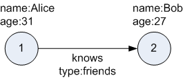

# Workshop Introduction and Overview #

## Introduction to Oracle Graph ##

Oracle’s converged, multi-model database natively supports graphs and delivers high performance, scalable graph data management, query, and analytics for enterprise applications. State-of-the-art graph features are available along with functionality required for enterprise grade applications: fine-grained security, high availability, easy manageability, and integration with other data in an application.

Oracle’s mission is to help people see data in new ways, discover insights, and unlock endless possibilities.  Graph analysis is about understanding relationships and connections in data, and detecting patterns that identify new insights. With Oracle’s Graph offerings developers can use a comprehensive suite of graph query and analytics tools to integrate graphs into applications on enterprise grade data management infrastructure.

**For example,** graph algorithms can identify what individual or item is most connected to others in social networks or business processes.  They can identify communities, anomalies, common patterns, and paths that connect individuals or related transactions.
Every Oracle Database now includes both property graph and RDF graph data models as well as algorithms, query languages, and visualization tools.

**Property Graph database includes:**

- PGX in-memory graph engine
- PGQL graph query language
- 50+ Graph algorithms
- Support for graph visualization 

Customers use Property Graphs in fraud analytics, vulnerability analysis, recommendation systems, and more.

**RDF Graph database includes:**

- SPARQL graph query language
- Java APIs via open source Apache Jena 
- W3C standards support for semantic data, ontologies and inferencing
- RDF Graph views of relational tables

Customers use RDF Graphs in linked data and data sharing applications in pharma, publishing, public sector and more.
This workbook provides an overview of Oracle Graph support for property graph features.

## Introduction to Property Graph

**What Are Property Graphs?** 

A property graph consists of a set of objects or vertices, and a set of arrows or edges connecting the objects. Vertices and edges can have multiple properties, which are represented as key-value pairs.

**Each vertex has a unique identifier and can have:**

- A set of outgoing edges
- A set of incoming edges
- A collection of properties

**Each edge has a unique identifier and can have:**

- An outgoing vertex
- An incoming vertex
- A text label that describes the relationship between the two vertices
- A collection of properties

The following figure illustrates a very simple property graph with two vertices and one edge. The two vertices have identifiers 1 and 2. Both vertices have properties name and age. The edge is from the outgoing vertex 1 to the incoming vertex 2. The edge has a text label knows and a property type identifying the type of relationship between vertices 1 and 2.

 

Figure: Simple Property Graph Example

**A very brief note on PGQL**

The [pgql-lang.org](pgql-lang.org) site and specification [pgql-land.org/spec/1.2](pgql-land.org/spec/1.2) are the best reference for details and examples. For the purposes of this lab, however, here are minimal basics. 

The general structure of a PGQL query is

SELECT (select list) FROM (graph name) MATCH (graph pattern) WHERE (condition)

PGQL provides a specific construct known as the MATCH clause for matching graph patterns. A graph pattern matches vertices and edges that satisfy the given conditions and constraints. 
() indicates a vertex variable

  -an undirected edge, as in (source)-(dest)

-> an outgoing edge from source to destination

<- an incoming edge from destination to source

[]  indicates an edge variable

## Oracle Graph Video

## Learn More
- [Oracle Graph](https://docs.oracle.com/en/database/oracle/oracle-database/19/spatl/index.html)
- [GeoRaster Developer's Guide](https://docs.oracle.com/en/database/oracle/oracle-database/19/geors/index.html)

## Acknowledgements

- **Authors** - Balasubramanian Ramamoorthy, Arvind Bhope
- **Contributors** - Laxmi Amarappanavar, Kanika Sharma, Venkata Bandaru, Ashish Kumar, Priya Dhuriya, Maniselvan K.
- **Team** - North America Database Specialists.
- **Last Updated By** - Kay Malcolm, Database Product Management, June 2020
- **Expiration Date** - June 2021   

  

